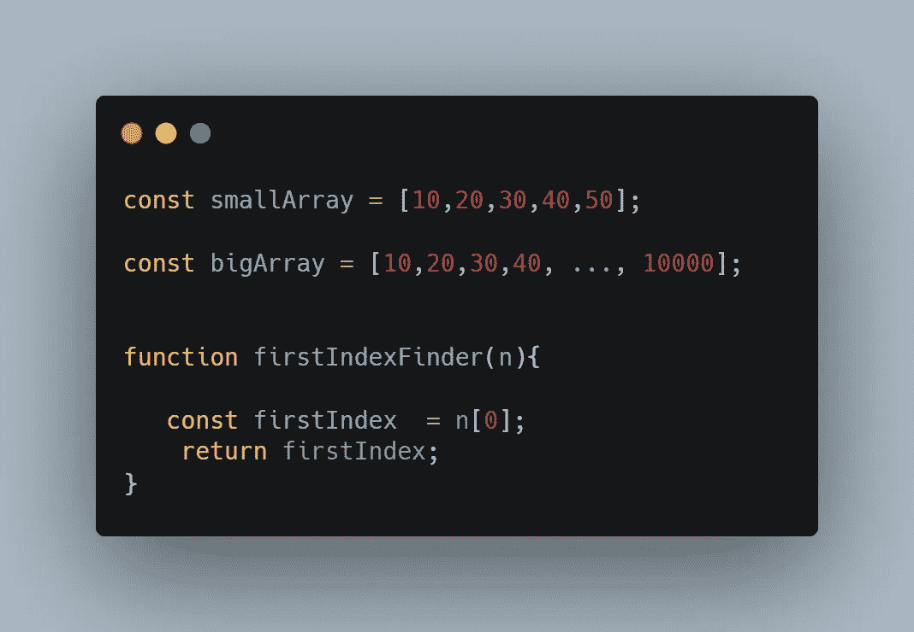
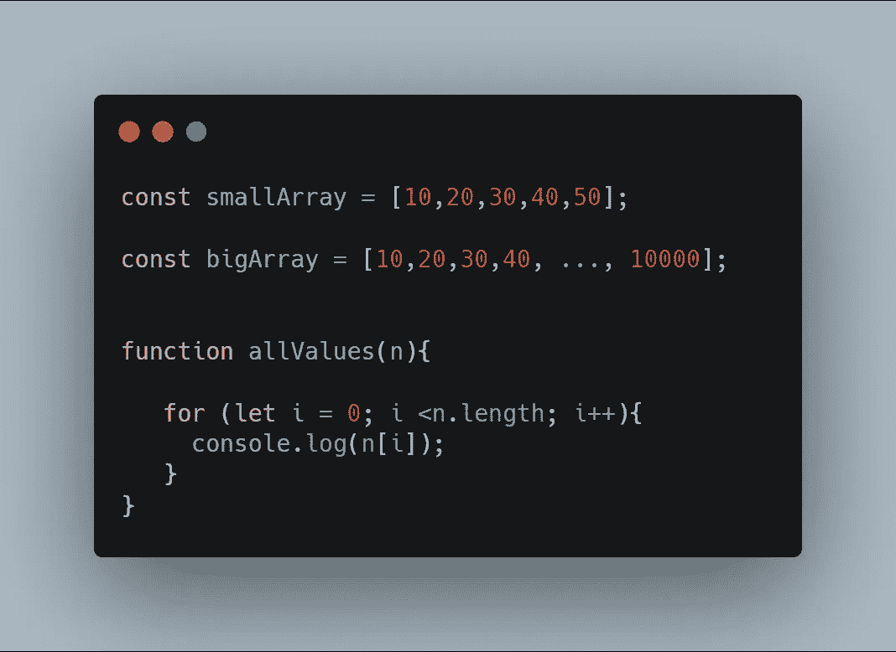
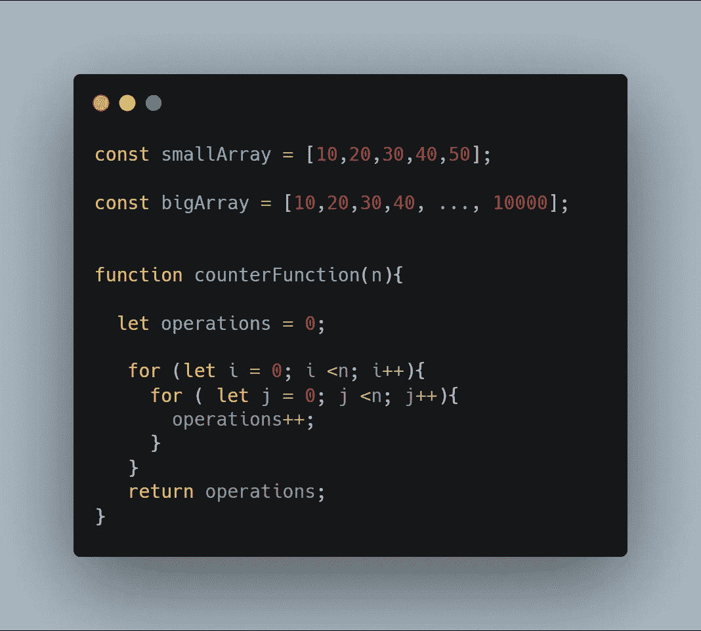
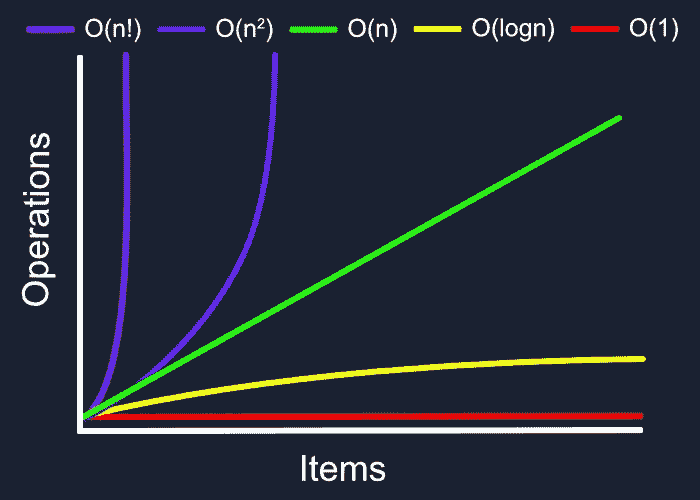
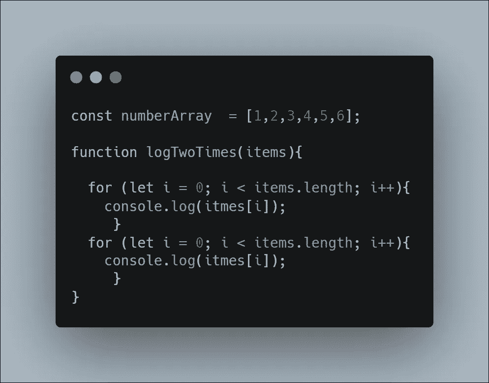

# 4 分钟解释大 O 符号

> 原文：<https://javascript.plainenglish.io/big-o-notation-explained-in-8-minutes-ded09f8f0f0a?source=collection_archive---------9----------------------->

用更好的代码构建可伸缩的应用程序

作为一名开发人员，编写代码是我们最擅长的事情，但有时事情会超出我们的预期&当您创建将在应用程序中运行巨大进程的算法时，大 O 符号是您应该关心的事情。

## 大 O

Big-O notation 是一种用来谈论算法运行需要多长时间的语言，也称为 ***时间复杂度*** ，或者算法使用了多少内存，也称为 ***空间复杂度。*** Big-O 符号可以表达一个算法可能要面对的最好和最坏的情况。

> 注意:当谈到 Big-O 符号时，运行时间与我们所知道的秒、毫秒等没有直接关系。运行时间可以认为是完成一个*大小的问题所需要的操作或步骤的数量*

****简单来说，Big-O 符号是一种衡量运行时随着输入大小增长速度的方法。****

## *O(1)，O(n)，O(log n)和 O(n2)*

*   ***O(1):** 在这种情况下，运行一个算法需要一个*，不管输入的大小。比方说，书签的方式可以让你快速找到你正在阅读的最后一页，无论你的书是有 **30** 页还是 **1000** 页，你都可以一步找到最后一页。同样，在编程中，有几个操作属于 ***O(1)*** 的范畴，比如**数学运算**、**通过索引访问数组**、**将**和**压入栈中**、**插入**或从**队列中移除**等。**

*****例如:*****

**在下面给出的 *JavaScript* 函数中( **firstIndexFinder** )，访问两个数组中的**0 index**(**small array**&**big array**)将花费相同的时间。**

****

****JavaScript Example of O(1)****

*   ****O(n):** 在这种情况下， ***运行时间与输入同步增加*** 。假设你花 1 分钟读完一页，如果你的书有 50 页，你就要花 50 分钟读完整本书。在 *JavaScript* 中，像 **forEach、map** & **reduce** 这样的方法从头到尾贯穿整个数据集合。**

*****例如:*****

**下面给出的 **allValues** 函数将与许多操作一起工作，这些操作将通过 **n** 进行循环，这与 **n** 的大小直接相关。**

****

*   ****O(n2):** 在这种情况下，运行时间是二次的，也就是输入数据大小的平方。在编程中，嵌套循环是运行时为 **O(n2)** *或* **O(n3)** 的一个很好的例子。**

*****例如:*****

**看看**计数器函数**有两个嵌套循环。**

****

*   ****O(log n):** 在这种情况下，我们处理的是与输入大小的对数成比例增长的时间，这意味着当您以指数方式增加输入时，时间增加较少。在编程逻辑中，你可以想到二分搜索法，它是对数运行时间的一个很好的例子。**

****

> *****注:*** *排序算法如* ***归并排序、Tim 排序****&****堆排序*** *属于****O(n log n)****与* ***O(log n)不同 O(n log n)是线性复杂度和对数复杂度的组合。*****

## **计算大 O**

**如果你知道如何分解事物，用一个有几个部分的算法计算 Big-O 是相当容易的。**

*****例如:*****

*   **我们有函数 **nestedLoop** ，它遍历数组的长度。由于我们必须忽略以恒定时间运行的操作，所以我们只考虑两个循环并将它们相加。这给了我们 **O(2n)** ，因为数字 2 也是一个常数，我们把它去掉，只称它为 **O(n)** 。**

****** [## 码头工人 12 分钟入门指南

### 12 分钟学会 Docker。

javascript.plainenglish.io](/a-12-minute-beginners-guide-to-docker-480b5adc44a1)  [## 24 种 JavaScript 数组方法的 6 分钟指南

### 24 个 JavaScript 数组方法及示例。

javascript.plainenglish.io](/a-6-minute-guide-to-24-javascript-array-methods-52bf5f0e209c)  [## 你不知道 CSS 能做的 4 件事

### 鲜为人知的 CSS 特性及示例

javascript.plainenglish.io](/4-things-you-didnt-know-css-can-do-13b364296570) 

*更多内容看*[***plain English . io***](http://plainenglish.io/)**