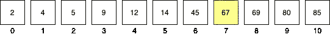
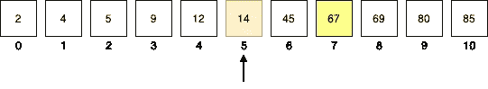
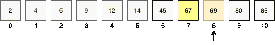
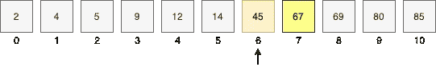
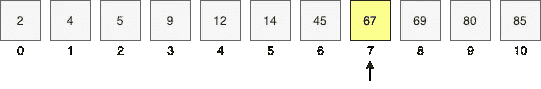
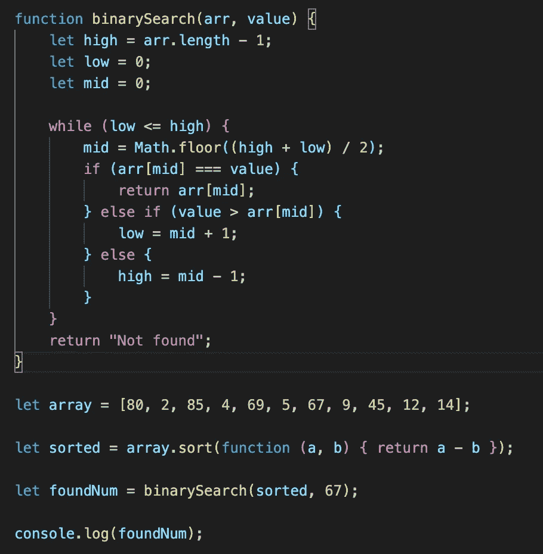

# JavaScript 中的二分搜索法

> 原文：<https://javascript.plainenglish.io/binary-search-in-js-c5e2fd1d5cb6?source=collection_archive---------3----------------------->


Photo by [AltumCode](https://unsplash.com/@altumcode?utm_source=medium&utm_medium=referral) on [Unsplash](https://unsplash.com?utm_source=medium&utm_medium=referral)

**二分搜索法**是一种在数组中搜索元素的技术。为了使用二分搜索法算法，应该首先对该数组进行排序。

这是一种时间复杂度为 **O(log N)** 的快速搜索算法。该算法的工作原理是重复地将数组一分为二，直到找到要搜索的项目。

## 那么，它是如何工作的呢？

让我们以一个数组为例，这个数组已经用元素排序:[2，4，5，9，12，14，45，67，69，80，85]，我们正在搜索元素 67。首先，我们将数组一分为二，并将中间值与搜索值进行比较。



```
middle index = Math.floor((higher index + lower index) / 2)
=>Math.floor((10 + 0) / 2) = 5
```



所以，索引为 5 的元素是 14。因为 67 更大，我们知道该值应该在上半部分，因为我们已经对该数组进行了排序。现在我们将较低的索引设置为中间索引+ 1。然后，我们再次重复除法和比较的步骤，直到我们找到搜索的数字。

```
lower index = middle index + 1 = 5 + 1 = 6
middle index = Math.floor((10 + 6) / 2) = 8
```



同样，存储值不匹配。这一次，目标值小于 69，因此较高的索引将等于中间的索引-1，而较低的索引保持不变。

```
higher index = middle index - 1 =  8 - 1 = 7
middle index = Math.floor((7 + 6) / 2) = 6.5 = 6
```



但是，中间索引的值与我们的目标值不匹配，并且小于搜索的值。因此，较低的值再加上 1 就成为中间指数。

```
lower index = middle index + 1 = 6 + 1 = 7
middle index = Math.floor(( 7 + 7) / 2) = 7
```

现在，比较目标值和存储在中间索引的值，我们发现它们是相等的。因此，我们找到了我们一直在寻找的价值。



最后，我们找到了存储在索引 7 中的值 67。因此，简而言之，我们搜索中间的索引，直到找到值。

二分搜索法算法的 JavaScript 代码:



这里，我使用了*排序*函数对数组进行排序。

产量:67

*更多内容请看*[*plain English . io*](http://plainenglish.io/)