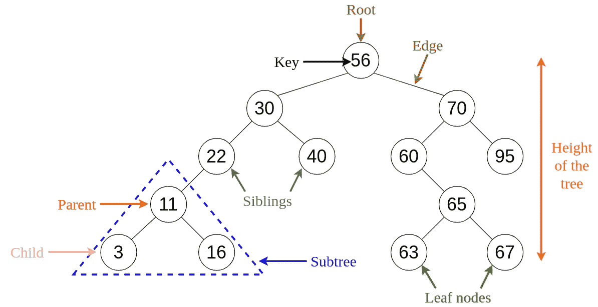
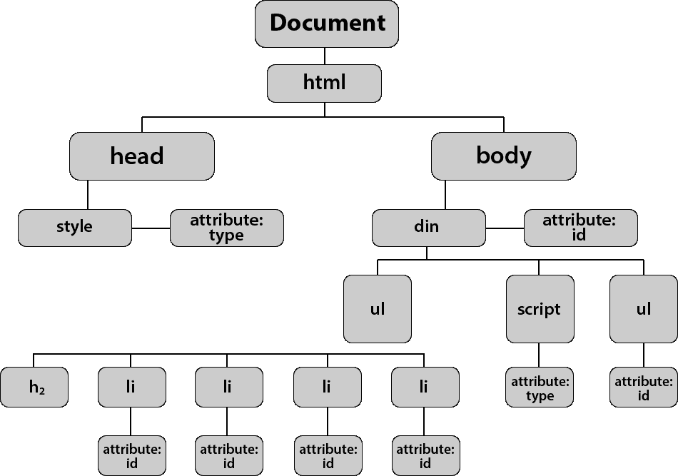
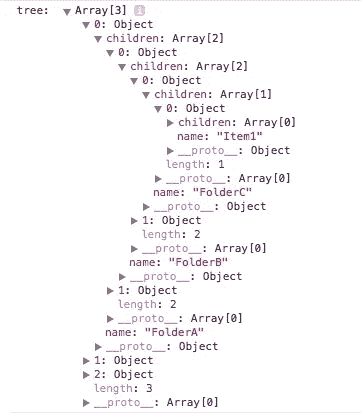
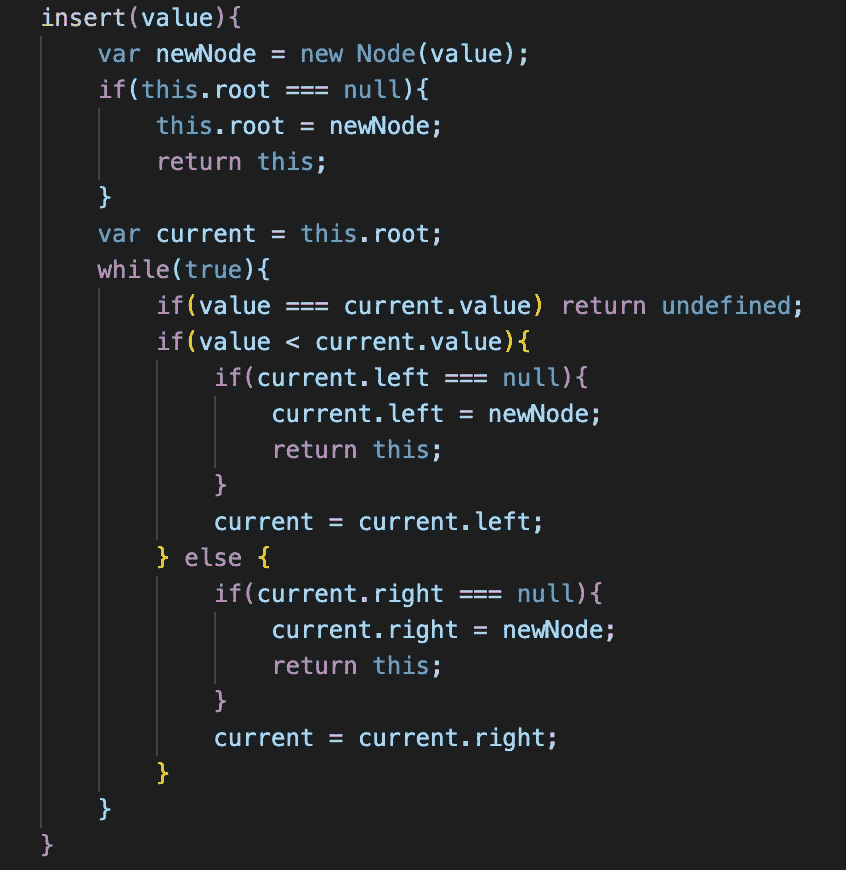
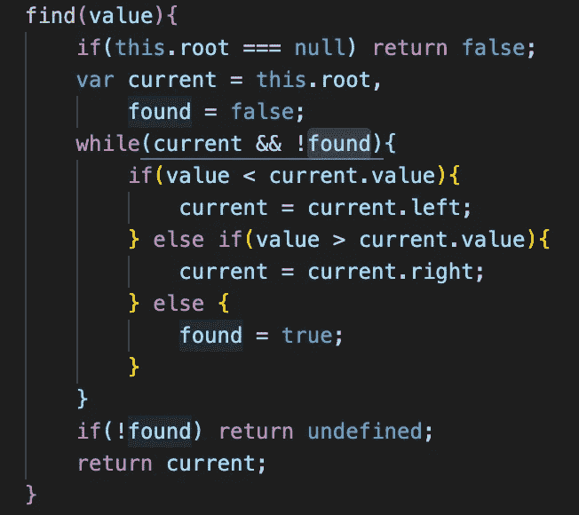
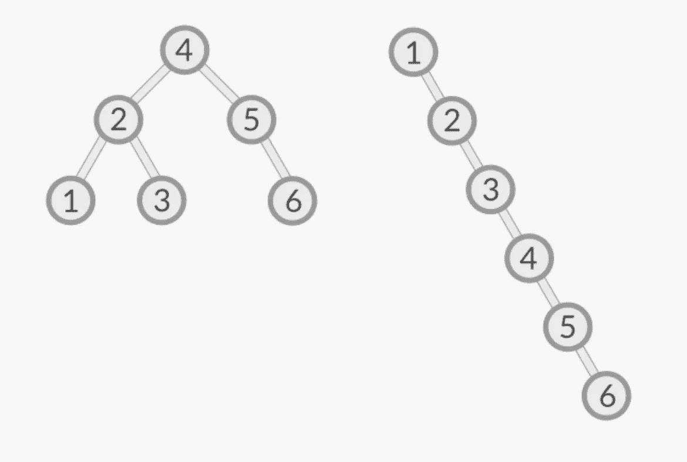

# 如何在 JavaScript 中实现二分搜索法树和树遍历

> 原文：<https://javascript.plainenglish.io/binary-search-trees-and-tree-traversal-in-javascript-ab7f9cf6b3d2?source=collection_archive---------12----------------------->

Labeled Binary Search Tree

作为用 JavaScript 实现数据结构系列的继续，我们将创建一个二叉查找树类，并尝试遍历树中的每个节点。

我再一次强调，柯尔特·斯蒂尔的 Udemy 课程在整个学习过程中是多么的有帮助。有很多资源，但我对他的教学风格有共鸣，觉得他把这些复杂的科目分解成容易理解的部分。

什么是树？树是父/子关系中节点的集合。如果你一直关注这个系列，你会知道链表是节点的集合，其中一个节点由一个值和一个指向下一个节点的指针组成。看看上面的图片，一棵树由一个根(也是一个父节点)、父节点和子节点组成。具有相同父节点的节点称为兄弟节点，没有子节点的节点(实际上是树的端点)称为叶节点。只有一个节点可以被认为是树的“根”,兄弟节点不能相互指向对方。展开后，我们可以看到该图如何显示为自上而下的树形结构，随着更多节点的添加，该结构会向外扩展。

The DOM can be represented in a tree structure. Take a moment to open up your browser's dev tools.

JSON and Filing systems also take the form of tree structures

树数据结构的一些实际例子包括 DOM、JSON 对象、计算机的文件系统、网络路由等等。我们将处理计算机科学中常见的一种特殊类型的树，二叉查找树。如果你看这篇文章最上面的第一张图片，你会看到一个 BST 的例子。BST 的一个特性是它可以有 0 个、1 个或 2 个节点，但不能更多。树的父节点可以有多个子节点 3、4、5 等等，但此时不同的数据结构可能更合适。

BST 以一种特别的顺序保存，这种顺序有利于搜索。如果你还没有注意到，从根开始，它左边的所有值都小于它本身，而根右边的值都大于它。一般模式是父节点的子节点将小于它的值放在左边，将大于它的值放在右边。这种格式使得在树中搜索变得更加容易，并且将搜索的节点数量减少了大约一半。

要实现一个 BST 类，我们需要节点、一个作为初始值的根，以及两个方法:insert 和 find。请参见下图，了解插入和查找的实现。你可以在这里找到 BST 类[的完整实现](https://github.com/maquino96/Colt-Steele-DSA-Udemy/blob/main/Course/Data%20Structures/binarySearchTree.js)。

Inserting a node into a BST

A find method, effectively searching through the tree for an input value

如果你能理解上面图片中的逻辑，我会为你鼓掌，这相当简单，但对于更多的视觉学习者，我建议查看这个网站: [Visualgo](https://visualgo.net/en/bst) 。我发现看到树的实际遍历对我理解上面的逻辑很有帮助。

# 二分搜索法树的比戈

我们将用 BST 的时间复杂性分析来结束这篇文章。当涉及到插入和搜索时，BST 的 BigO 是 O(log n)。BigO 是一个通用的度量，所以对于一般和最坏的情况，在 BST 中插入和搜索是非常有效的。当我们将输入数(n)增加一倍时，步进数仅增加 BST 的深度)。如果您需要以有序的方式存储数据，并不断地向集合中添加数据以及从中读取数据，那么 BST 可能是您的最佳选择。当处理 BST 时，要小心单边/不平衡的结构，效率会下降到 O(n ),因为你基本上创建的是一个链表。

Balanced and unbalanced BST

请在这里查看我的其他帖子。在以后的博客文章中，我们很可能会涉及堆和优先级队列！

*更多内容尽在*[***plain English . io***](http://plainenglish.io/)