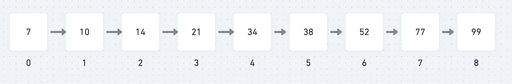
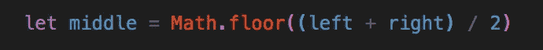
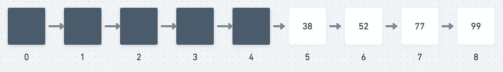
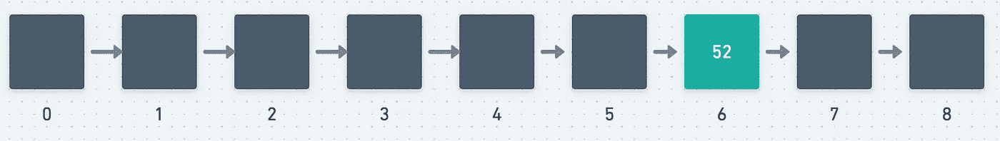
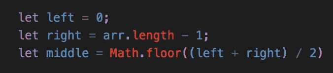
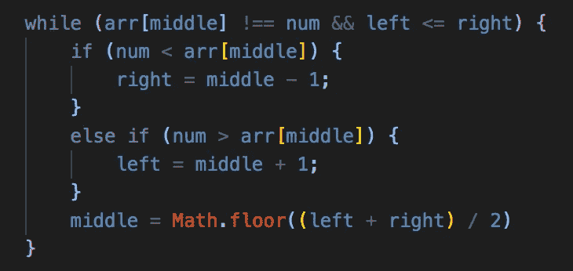
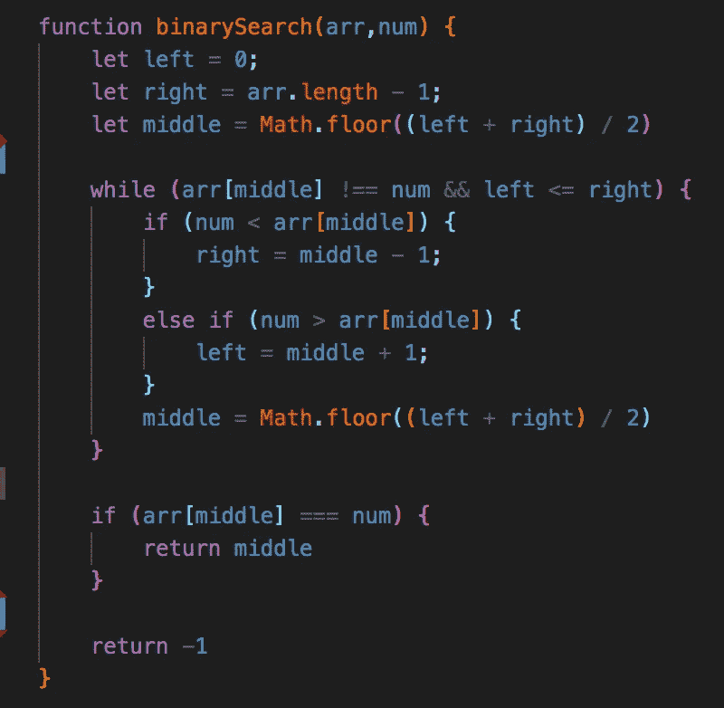

# 二分搜索法:使用多个指针

> 原文：<https://javascript.plainenglish.io/binary-search-using-multiple-pointers-9cd2e14c54d8?source=collection_archive---------11----------------------->

## 关于如何用 JavaScript 编写这个普通但强大的搜索算法的演练

如果你像我一样沉迷于 Leetcode(或任何其他提供算法和数据结构练习题的网站)，你可能会遇到这个吸引人的术语:*二分搜索法。*

听起来朗朗上口，对吗？如此吸引人，以至于有一个 Leetcode 类型的网站以它命名。

*厌倦了 Leetcode 还是需要换换风景？退房:***。除了提供练习题，我喜欢他们的私人房间功能，你可以为你和你的朋友创建一个房间，在一个定时的设置中解决问题(你设置时间限制，问题数量和难度)。技术面试的绝佳练习！**

*但是什么是二分搜索法呢？该算法有几个附加名称，如半区间搜索和对数搜索，并根据分而治之的原则工作。还需要注意的是，为了让二分搜索法正常工作，必须对数据集合进行排序。*

*简单来说，二分搜索法通过识别收藏中最中间的物品来搜索特定的物品，并对其进行比较。如果所识别的中间项与特定项匹配，则返回该项的索引。如果中间项大于项，则在中间项左侧的子数组中搜索该项。否则，将在中间项目右侧的子数组中搜索该项目。这个过程也在子阵列上继续，直到子阵列的大小减小到零。这种基于条件将数组分成更小的子数组的过程围绕着分治原则。*

**

*Anyone want to help me divide & conquer this piece of chocolate?*

# *解释*

*让我们来说明这个过程&用一个简单的例子来说明这个概念。*

**

*看上面的例子，我们有 9 个数字，范围从 7(我们最小的数字)到 99(我们最大的数字)。*请注意，这些数字是经过排序的&必须经过排序，二分搜索法才能工作**

*假设我们的目标是索引 6 中的第 52 号。*

*我们的第一步是找到排序数组的最中间的数字。为了做到这一点，我们必须将最后一个元素(8)加到第一个元素(0)上，然后除以 2。在这种情况下，它将是元素 4 的值(34)。在代码中，它可能看起来像这样(其中左等于 0 &右等于 8)。*

**

*The floor method will round down to its nearest integer. It doesn’t matter if we round down or up. To round up, we can use the ceiling method*

*现在我们已经确定了中间值，然后我们将它与我们的目标值进行比较。34 等于 52 吗？不，它不是，所以我们继续我们的搜索，问我们自己它是大于还是小于目标。因为 52 大于 34，所以我们可以断定我们的目标在元素 4 之上，并从我们的搜索中删除元素 1-4:*

**

*我们现在点击重置按钮&运行一切。我们必须用上面的中间公式重新确定新的中间点，并再次运行我们的搜索来确定中间点是等于、大于还是小于我们的目标。在第二次运行中，我们的中间值是 52(元素 6)，它等于我们的目标值。我们找到了！*

**

# *方法*

*在深入研究代码之前，让我们试着将它分解成几个步骤，这样我们就可以清楚地在代码中实现它。我会这样写我们的伪代码:*

1.  *创建三个指针:左(表示最低的元素)、右(表示最高的元素)和中(表示中间的元素)*
2.  *实现一个循环，当我们的左元素小于右元素，并且中间元素不等于我们的目标时运行。(记住，如果我们的中间元素等于我们的目标，我们就完成了&没有必要继续我们的搜索)*
3.  *为中间元素是大于还是小于我们的目标设置条件。如果目标大于我们的中间，那么把我们的左边移到我们的中间+ 1(因为我们已经知道中间不是我们的目标)。反之亦然，如果目标小于我们的中间值，那么将我们的右边移到我们的中间值— 1。*
4.  *在每次循环之后，我们必须重新找到新子数组的中点*
5.  *如果我们的中间值匹配我们的目标值，返回中间值的索引*
6.  *如果我们的目标不在我们的集合中，返回-1*

# *解决方案*

*既然我们已经回顾了二分搜索法背后的逻辑&我们代码的伪代码，我相信我们已经准备好处理这个算法了！*

*我们的第一步是设置我们的指针。记住，我们的指针是为了找到数组(以及后续子数组)中最小、最大和中间的元素。*

*我们的指针可能看起来像这样:*

**

*接下来，我们必须设置 while 循环。记住，如果它们满足我们的两个标准，我们需要设置我们的循环来运行；左*

*之后，我们必须设置我们的条件语句(If/else 语句)来检查我们的中间值是大于还是小于我们的目标值，并相应地移动我们的左右指针。在每次循环结束时，将我们的中点重置为子数组的新中点。我们的代码可能如下所示:*

**

*Remember, we can conclude that our middles already do not match our target. Therefore, we can plus or subtract one accordingly*

*最后，如果我们找到了目标，我们需要返回元素的索引。如果我们没有找到它，我们只需在函数结束时返回-1。我们的整个解决方案应该是这样的:*

**

# *结论*

*咻！我希望这个二分搜索法之旅是清晰的，并且你能够跟随这个过程的每一步。在深入步骤和代码之前，试着理解每个算法背后的逻辑——当我试图解决一个困难的问题时，它总是帮助我！*

*请记住，虽然这是一个非常有效的搜索算法(最坏情况 O(log N))，但它只适用于排序的数据集合。请随意分享您的想法，或者提供您可以用来解决该算法的其他方法。*

# *来源*

*TutorialsPoint:数据结构与算法二分搜索法
[https://www . TutorialsPoint . com/Data _ structures _ Algorithms/binary _ search _ algorithm . htm](https://www.tutorialspoint.com/data_structures_algorithms/binary_search_algorithm.htm)*