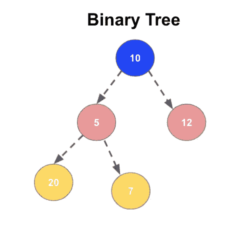
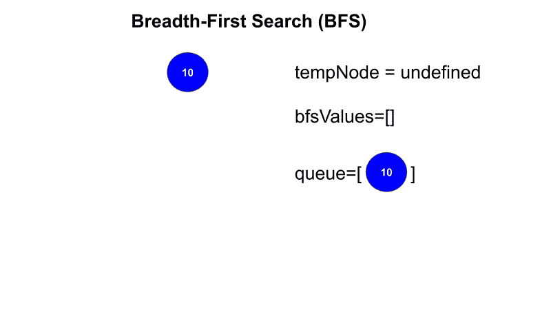
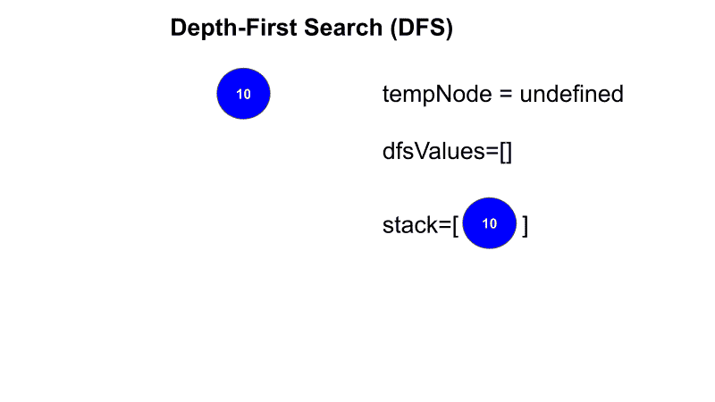

# 二叉树— BFS，DFS — JavaScript

> 原文：<https://javascript.plainenglish.io/binary-tree-bfs-dfs-javascript-73a170ecaea3?source=collection_archive---------7----------------------->

这篇文章将学习如何使用 JavaScript 在二叉树中进行广度优先搜索(BFS)和深度优先搜索(DFS)。如果你想学习使用 JavaScript 的基本数据结构，[点击这里](https://medium.com/analytics-vidhya/data-structures-in-javascript-28ce180b7673)。

## 二叉树

**二叉树**是一种树形数据结构，其中每个节点有两个子节点，分别称为左子节点和右子节点。

二叉树中有两种搜索技术，

*   广度优先搜索(BFS)
*   深度优先搜索

## 广度优先搜索(BFS)

在 BFS 中，在进入下一级之前，应该访问每一级(水平)中的所有节点。

## 算法

1.  初始化

*   *队列*与*根节点*
*   *bfsValues* — [] —保存结果值
*   *温度节点*

2.做下面的*而做*队列长度**的> 0**

*   弹出*队列*并加载到*临时节点*
*   将*温度节点*值加入*bfs 值*
*   检查*临时节点*左侧节点；如果该节点存在，将其添加到*队列*
*   检查 *tempNode* 右节点；如果该节点存在，将其添加到*队列*

Javascript code for BFS

Graphical representation of BFS

## 深度优先搜索

在 DFS 中，在进入下一级之前，应该访问每一级(垂直)中的所有节点。

## 算法

1.  初始化

*   *将*与*根*节点堆叠
*   *dfsValues* — [] —保存结果值
*   *温度节点*

2.做下面的*而*T42 的>堆栈长度为 0

*   移动*堆栈*并载入*温度节点*
*   将 *tempNode* 值添加到 d *fsValues* 中
*   检查 *tempNode* 右节点；如果该节点存在，将其添加到*堆栈*
*   检查*临时节点*左侧节点；如果该节点存在，将其添加到*堆栈*

Javascript code for DFS

Graphical representation of DFS

*更多内容请看*[***plain English . io***](https://plainenglish.io/)*。*

*报名参加我们的* [***免费周报***](http://newsletter.plainenglish.io/) *。关注我们关于*[***Twitter***](https://twitter.com/inPlainEngHQ)，[***LinkedIn***](https://www.linkedin.com/company/inplainenglish/)*，*[***YouTube***](https://www.youtube.com/channel/UCtipWUghju290NWcn8jhyAw)*，以及* [***不和***](https://discord.gg/GtDtUAvyhW) ***。***

***有兴趣缩放你的软件启动*** *？检查* [***电路***](https://circuit.ooo?utm=publication-post-cta) *。*