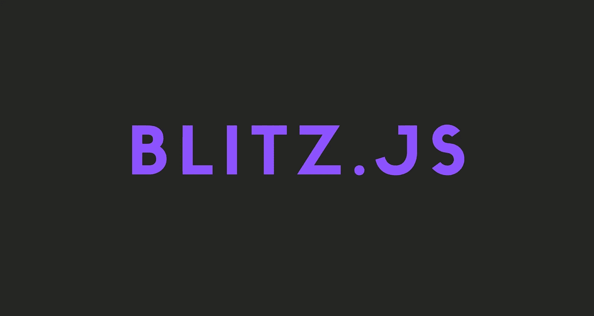

# Blitz.js 是更好的下一个

> 原文：<https://javascript.plainenglish.io/blitz-js-the-better-next-js-def5bb69d80d?source=collection_archive---------4----------------------->

## Blitz.js 简介。

在这个故事中，我将谈谈 Blitz.js 是什么，为什么要使用它，以及如何入门。

## 注意:

在这个故事中，我不会真的展示代码。所以，如果你是来学习 Blitz.js 入门的，你必须再等几天，直到我写一篇关于它的教程。

开始吧！

# Blitz.js 是什么？

*“Blitz 是一个包含电池的框架，其灵感来自 Ruby on Rails，构建于 Next.js 之上，具有“零 API”数据层抽象，消除了对 REST/GraphQL 的需求。”——blitzjs.com*

但是，这意味着什么呢？

好吧，Zero-API 意味着你可以编写可以直接注入 React 组件的服务器代码。也就是说，你不需要手动做任何请求之类的事情。

这可能是好的，也可能是坏的，取决于使用案例。

Blitz.js 还建立了 ESlint 和 Prettier 之类的网站。这意味着您可以立即开始编码，而无需进行任何配置。我个人很喜欢它，因为在 Next.js 中进行配置可能会非常烦人和无聊。

总的来说，Blitz.js 是一项很酷的技术，你至少应该了解一下。

你可以在他们的官网了解更多关于 Blitz.js 的信息。

 [## blitz . js-full stack React 框架

### “零 API”数据层允许您将服务器代码直接导入组件，而不必手动添加 API…

blitzjs.com](https://blitzjs.com/) 

# Blitz.js 主要功能

*   **Zero-API"** 数据层让您 **i** 将服务器代码直接导入到您的组件中，而不必手动添加 API 端点并进行客户端获取和缓存。
*   新的 Blitz 应用程序已经为你准备好了所有无聊的东西！像 ESLint，beauty，Jest，用户注册，登录，密码重置。
*   提供**有用的缺省值和约定**，比如路由、文件结构和认证，同时也非常灵活。

# 该不该学 Blitz.js？

嗯，这很复杂。

看，如果你正在构建一个大的应用程序，你可能会把你的后端和前端分开，并为后端使用不同的语言(例如，Elixir)。

所以，如果你只是想尝试一下，让自己做得更好，我绝对推荐你学习 Blitz.js。

但是如果你计划使用它来构建大型应用程序，我仍然建议学习它，但是也认为在它变得更加稳定之前，你不应该将它用于大型应用程序。

但是当然，不实际尝试你是不会知道的，所以继续尝试 Blitz.js 吧！

## 结论

这是对 Blitz.js 的一个快速介绍。我希望你能从这个故事中学到一些新东西。

如果你想了解更多，一定要访问 Blitz.js 的官网。

仅此而已。感谢您阅读这个故事！如果你喜欢这个故事，一定要让我们在评论中知道，并随时问我你想问的任何问题。

在 Twitter 上关注我:

 [## re _ ally 边缘

twitter.com](https://twitter.com/Re_allyedge) 

在 Patreon 上支持我:

 [## 阿里木阿尔斯兰卡亚是创造编程故事和教程。帕特里翁

### 今天就成为阿里木阿尔斯兰卡亚的赞助人:在世界上最大的…

www.patreon.com](https://www.patreon.com/allyedge) 

*更多内容看*[***plain English . io***](http://plainenglish.io)