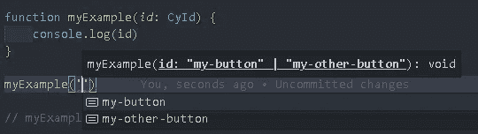
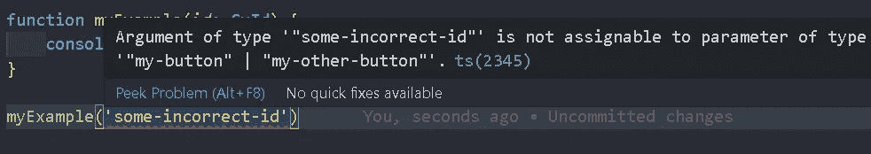
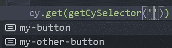

# 使用 TypeScript IntelliSense 增强您的自动化测试工作流

> 原文：<https://javascript.plainenglish.io/boost-your-automated-test-workflow-using-typescript-intellisense-ec85f2a0391e?source=collection_archive---------14----------------------->

在我之前的文章中，我演示了如何维护一组唯一的 id。虽然这非常有帮助，但我们可以更进一步，加入 TypeScript IntelliSense 来提高我们的测试编写效率，并减轻一些容易出错的复制和粘贴的压力。

# 在 TypeScript 中使用“常量断言”

在 TypeScript 3.4 中，[“常量断言”](https://www.typescriptlang.org/docs/handbook/release-notes/typescript-3-4.html#const-assertions)作为一个动态的新特性被添加，它允许我们从一个数组中定义只读的字符串文字。

使用这种新的 TypeScript 语法(不要忘记“as const”)，我们可以**导出一个从我们的数组派生的** [**字符串文字类型**](https://www.typescriptlang.org/docs/handbook/literal-types.html#string-literal-types) **。**这是什么意思？更简单地说，如果我们将类型“CyId”添加到字符串参数中，**输入参数值仅限于我们定义的 Id 数组中的值。**当我们使用 CyId 类型时，我们只能使用值“我的按钮”和“我的其他按钮”(或我们添加到数组中的任何其他值)。在下一节中，我将解释这是多么有用。

# 书写速度更快，错误更少—智能感知

在上面的代码中，我创建了一个名为“myExample”的简单函数，它将一个 CyId 作为参数。当我去调用函数时，VSCode IntelliSense 会知道 CyId 代表一个字符串文字，**会建议你可以使用的值。**现在，如果您不记得您使用的确切字符串，您可以使用智能感知来帮助您搜索 id。

如果我试图用一个不在 id 数组中的 **值**调用函数， **TypeScript 会标记它，并告诉我我有一个无效值**。这样，我们可以确信我们输入了一个有效的 id。当输入你的测试 id 时，不再有打字错误👍。****

# 绑柏树

现在我们已经建立了 CyId 类型，让我们看看如何将它用于 Cypress。

这里我创建了一个包装器函数，它允许我们通过使用 CyId 类型将字符串输入限制在 id 数组中。这也将通过重构所有测试中的样板文件'[data-cy=${}]'来使我们的代码更加整洁。

现在，如果我们在一个测试文件中，当我们用 Cypress 选择我们的元素时，当我们需要调用我们的测试 id 时，我们将有很好的智能感知来指导我们。不用再在文件和搜索之间来回切换，TypeScript 和 VSCode 就在那里告诉你！

# 结论

有更多的事情可以做，以使编写测试更加干净和快速，但我不想在这篇文章中让读者负担过重。随着我继续构建自己的 Cypress 测试套件，我将继续分享我的发现。

尽管 TypeScript 会给项目增加很多开销，但按计划使用它并让它为我们工作感觉很棒！编码快乐！

*查看更多内容请点击*[***plain English . io***](https://plainenglish.io/)