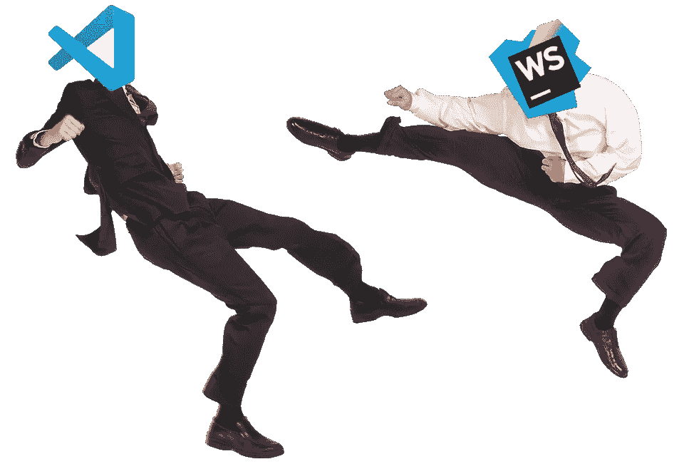
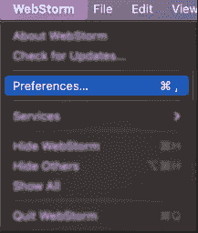
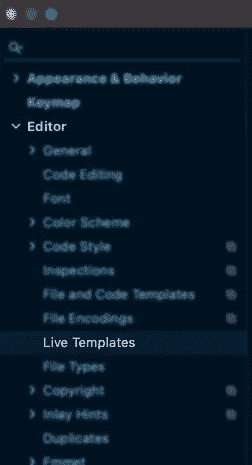
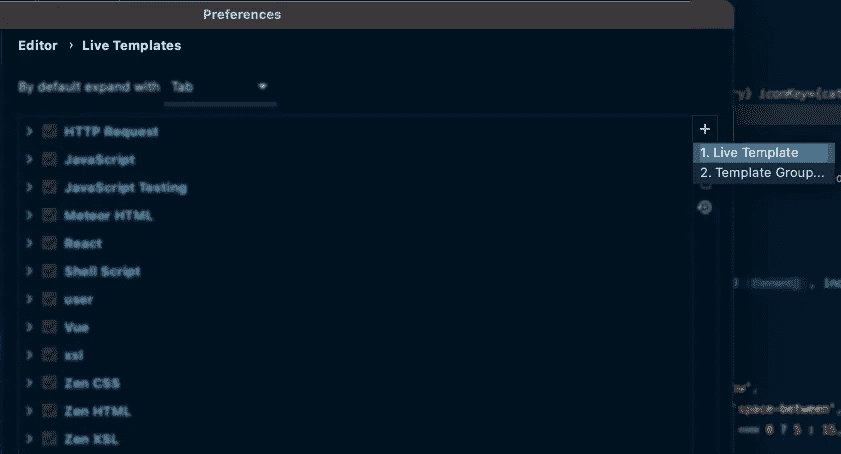
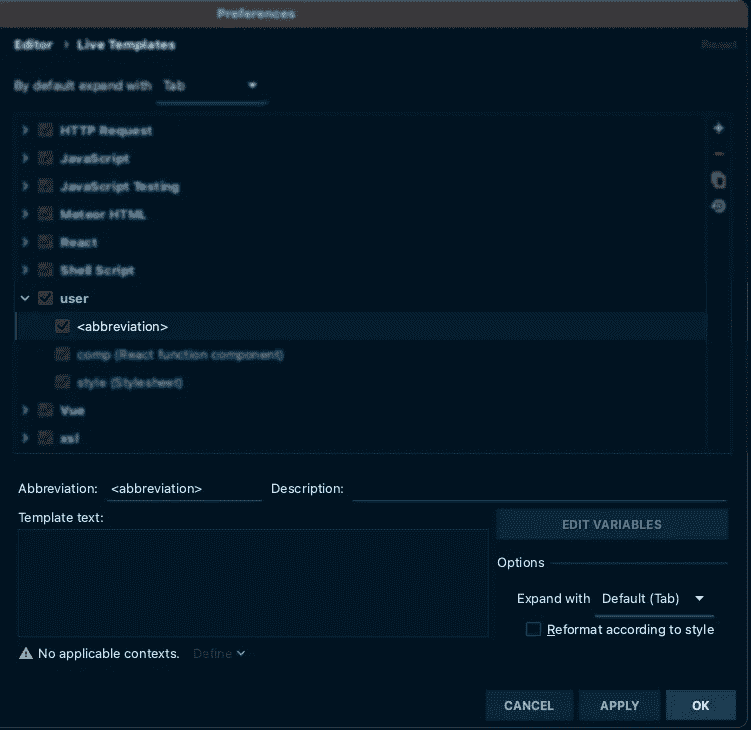
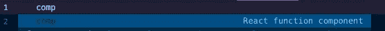
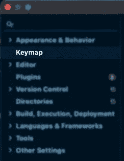
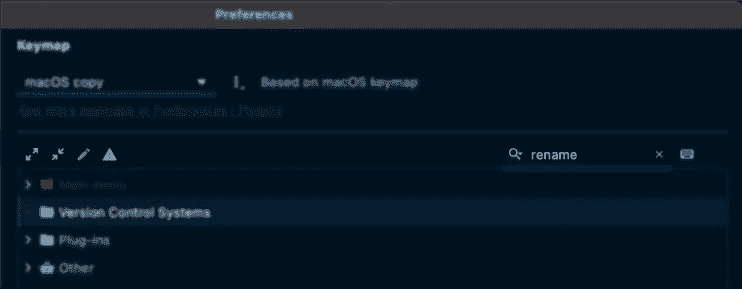
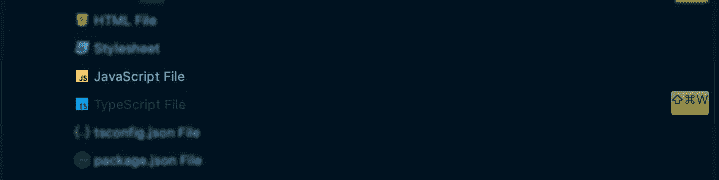

# 借助 Webstorm 提高您的工作效率

> 原文：<https://javascript.plainenglish.io/boost-your-productivity-with-webstorm-d8876975cbb8?source=collection_archive---------13----------------------->

Credit: [Eamonn Boyle](https://dzone.com/articles/10-reasons-why-webstorm-is-better-than-vs-code)

我们选择的观念是我们中的一些人最接近宗教的观念。我合作过的大多数人选择使用 VS 代码来处理 JS/TS，但是我不断发现我使用 Webstorm 更有效率。

# 为什么是网络风暴？

## 解决这个问题

VS 代码是一个空白页，你添加的扩展是你的选择。如果你想集成一个新的框架，使用一个调试器或者有语法高亮，你必须为 VS 代码设置扩展。然而，网络风暴解决了这个问题。它支持大多数主要的 JS 框架以及内置的语法高亮和本地测试！

## 测试

Google 的 JSTestDriver 内置在 Webstorm 中，提供了出色的测试工具。运行测试、调试、检查，以及你期望从 IDE 中得到的一切。

## 代码分析

Webstorm 非常擅长在你输入时分析你的代码，并标记潜在的问题。这减少了您的错误，因为您会立即得到通知，而不是传输/运行时间。这也有助于你写更干净的代码！

## 重构

有大量的重构工具非常适合 TypeScript 和(大部分)JavaScript！

# 使用 Webstorm 加快编码速度

## 实时代码模板

你有没有发现自己在一天中多次编写相同的代码？Web API 路由、React 组件、CSS 样式等。实时模板可以将简短的缩写转化为代码，让您的生活变得更加轻松。

1.  打开偏好设置(⌘，)

2.从导航菜单中选择**实时模板**。

3.点击右上角的 **+** 图标，选择**实时模板**

4.这将在**用户**集合下创建一个新的**实时模板**。在*模板文本下方，*设置您希望模板应用的语言。您现在可以创建您的模板了！

**缩写:**将检索模板的速记文本

**描述:**输入速记时显示

**模板文本:**将为速记检索的代码

## **反应元件**

**缩写:** comp

**描述:**反应功能组件

**模板文本:**

现在，当键入 **comp** 时，自动完成下拉菜单将显示模板，并可以检索我的组件。

## **TypeScript / Middy / AWS Lambda 模板**

## **React 原生样式模板**

## 键盘映射

我经常使用一套重构工具:

*   **重命名**
*   **创建文件**
*   **移动**

如果你使用默认的 Webstorm 键绑定，你会很快发现你的手在玩一个扭扭乐游戏。试了几次，我找到了一组打字时感觉最自然的键。

**导航到键盘映射**

1.  打开偏好设置(⌘，)

2.从导航菜单中选择**键图**

导航**键图**最简单的方法是使用位于右上角的搜索工具。

## 重新命名

完全披露，我从[骑手](https://www.jetbrains.com/rider/)那里偷了这个。

**搜索关键字:**重命名

**默认按键绑定:** ⇧ F6

新的按键绑定: ⌘

## 创建文件

默认情况下，⌘ N 用于创建新文件，要设置扩展名，您可以键入名称或浏览几个菜单来创建具有所需扩展名的文件。

要完全跳过这个过程，您可以设置一个 keybinding 来创建一个具有特定扩展名的新文件。

**搜索关键字:**文件

新的按键绑定: ⌘ ⇧ W

对于前端开发人员:选择 JavaScript 或 TypeScript 将为您提供(js/jsx)或(ts/tsx)扩展。

## 移动

我选择覆盖最小化命令，因为我很少使用它。

**搜索关键字:**移动

默认按键绑定: F6

新的按键组合:⌘·m

## 结论

试试上面的任何建议？创建一个有用的模板？全程诅咒因为 VSCode > Webstorm？请在评论中告诉我！

*更多内容请看*[***plain English . io***](http://plainenglish.io)