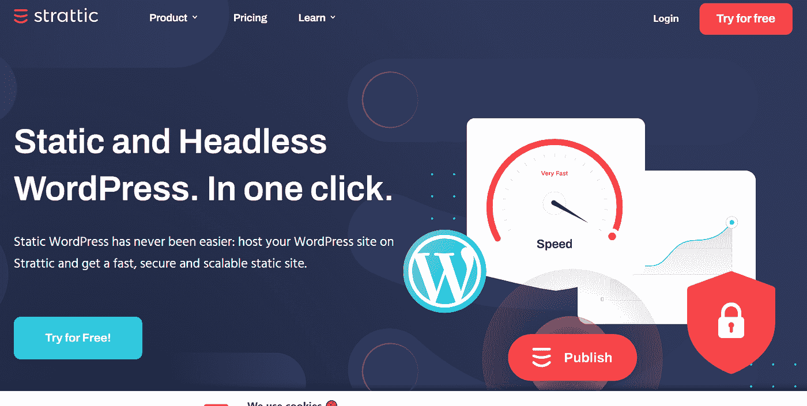
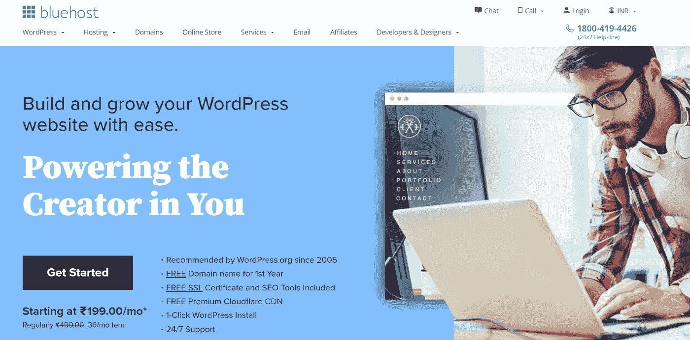
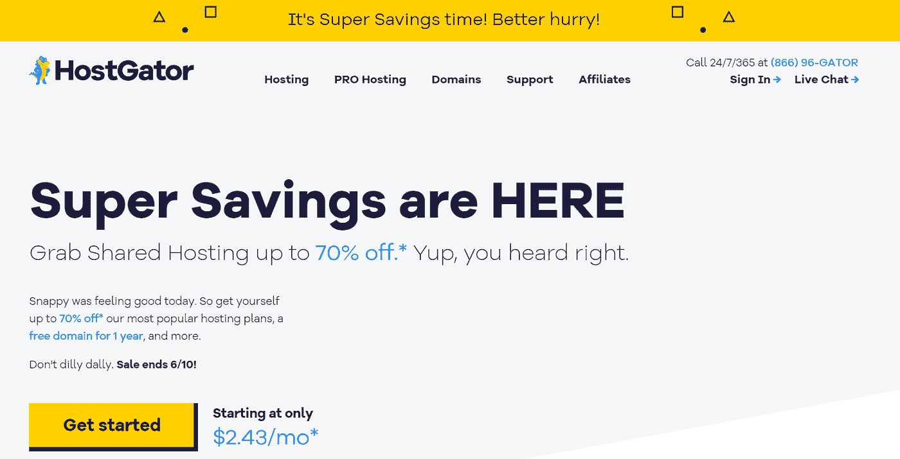
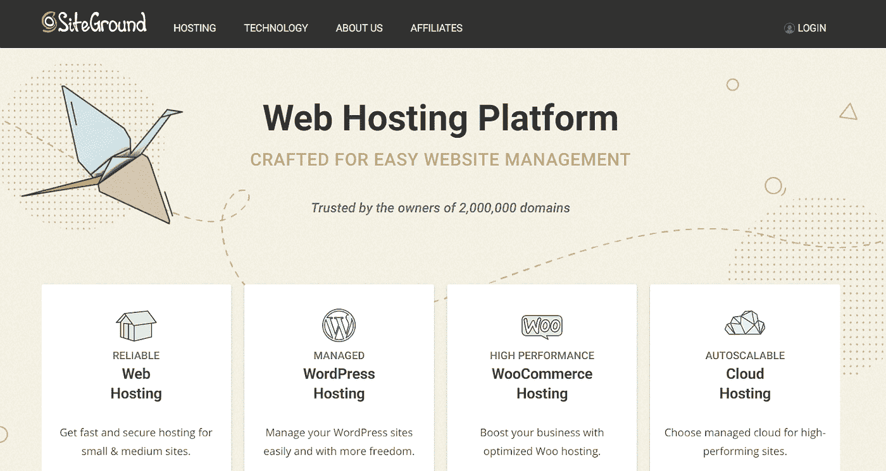

# 用这 5 个解决方案提升你的 WordPress 性能

> 原文：<https://javascript.plainenglish.io/boost-your-wordpress-performance-with-these-5-solutions-aff49c0ca7f4?source=collection_archive---------25----------------------->

## 保证结果的最佳解决方案

Photo by [Lagos Techie](https://unsplash.com/@heylagostechie?utm_source=medium&utm_medium=referral) on [Unsplash](https://unsplash.com?utm_source=medium&utm_medium=referral)

多年来，WordPress 已经转变为最相关的内容管理系统。它是大多数严肃企业建立一个功能网站或博客页面的首选平台。在过去的互联网时代，创建一个网站需要强大的编码和 HTML 知识库。随着 CMS 的出现，这种情况已经改变了。CMS 软件让你不用写代码就可以建立网站。

但是 WordPress 的特别之处在于用户可以获得过多的整合和定制。WordPress 允许数字创作者全力以赴实现他们的愿景。但是随着一些困扰 WordPress 主机的问题的反复出现，需要一个专门的 WordPress 主机解决方案。

# 主要的 WordPress 托管问题

## **性能(加载速度极其缓慢):**

在当前快节奏的世界中，如果你的网站不能在几秒钟内加载，你可能会失去访问者和收入。他们只会搬到别处，你的内容，不管质量如何，都不会被注意到。

## **安全漏洞:**

黑客和数据泄露会给你的在线内容带来麻烦。模仿者可以获得对内容存储库的访问权，这可能会产生许多其他问题。你可以通过使用一个有能力的网站托管解决方案来避免这些漏洞，这个解决方案保证了很强的安全性。

一个好的托管解决方案有助于提高你的网站的性能，改善搜索引擎优化，并使你的网站更加安全。在选择托管解决方案时，要考虑的一些主要因素是可负担性、速度、安全性和可伸缩性。除此之外，托管软件还需要兼容:

*   PHP 7.4 或更高版本
*   MySQL 版本 5.6 或更高版本
*   HTTPS 支持(SSL)

但是有这么多的主机选择，你如何确定一个解决方案呢？不同的网站有不同的需求，这些解决方案是为满足不同终端用户的兴趣而定制的。我们提供了最佳 WordPress 托管解决方案的明确列表，让您更容易做出选择:

# 1.Strattic

Strattic 是这个街区的新成员，它对 WordPress 主机采取了不同的方式。有了 Strattic，速度和安全性都有保证。它是如何实现这一点的？通过提供静态 WordPress 托管。为了确保快速的速度和加载时间，Strattic 依赖于预渲染的网站。静态站点方法意味着没有黑客或数据泄露的空间。这是因为 Strattic 将你的 live 网站从 WordPress 上断开，从而消除了任何威胁的可能性。静态生成的网站的可伸缩性也更加容易。

## **优点**:

*   99.99%的正常运行时间保证
*   坚如磐石的安全性
*   针对速度和可扩展性进行了优化
*   对访问和存储没有限制
*   免费 SSL

# 2.蓝色主机

[Bluehost](https://www.bluehost.in/) 自 1996 年问世，是最古老、最值得信赖的解决方案之一。WordPress 自己推荐。Bluehost 为全球超过 200 万用户提供服务，尤其适合那些从零开始创建网站的人。凭借实惠的定价模式和强大的客户支持，Bluehost 是顶级的托管解决方案之一。

## **优点**:

*   方便用户的
*   良好的支持
*   良好的安全性

# 3.宿主

HostGator 是市场上另一种流行的托管服务。HostGator 在全球托管超过 800 万个域名，是一个可靠的 WordPress 托管解决方案。凭借快速的加载速度和 24/7 的支持，HostGator 在 WordPress 托管方面做得很好。而且，你还获得一年的免费域名！

## **优点**:

*   大量存储限制
*   安全托管
*   免费域名(一年)

# 4.场地

使 [Siteground](https://www.siteground.com/) 成为一个好选择的主要因素之一是它的可负担性。虽然不便宜，但是物有所值。可靠的安全性和速度解决方案增加了 Siteground 的可信度。加上为 WordPress 量身定制的计划，难怪 Siteground 是 WordPress 社区中评价最高的解决方案之一。这是 WordPress 官方推荐的主机提供商。

## **优点**:

*   正常运行时间保证
*   免费 SSL
*   良好的速度和安全性

# 5.梦幻主机

Dreamhost 是另一个 WordPress 推荐的托管解决方案。Dreamhost 承诺 100%正常运行时间，并提供免费域名。如果您追求速度和安全性，这也是一个不错的选择。基本计划相当便宜，而且有退款保证。

## **优点**:

*   保证 100%正常运行时间
*   负担得起的计划
*   良好的速度和安全性
*   免费 SSL

# 结论

归根结底，这一切都取决于最终用户的需求。这些都是很好的选择，但也有一些妥协；这些 WordPress 托管解决方案你都不会错。

*更多内容请看*[*plain English . io*](http://plainenglish.io/)