# 使用 React Profiler 提升 React 应用程序的性能

> 原文：<https://javascript.plainenglish.io/boosting-your-react-app-performance-with-react-profiler-be049146bdd3?source=collection_archive---------5----------------------->

## 使用 React Profiler 分析和提高 React 应用程序性能的指南。伴随着一个网络应用程序，使它很容易关注。

编写 React 应用程序很容易。编写一个好的 React 应用程序更加复杂。编写一个好的 React 应用程序，并且快速运行，这需要的不仅仅是编程技巧。

即使你是一个伟大的程序员，像大头针一样锋利，像鞭子一样聪明，像丹·阿布拉莫夫一样反应敏捷——你也会错过一些东西；它发生了。有时候，发现自己错过了什么并不是一件小事。

今天我们将讨论解决 React 性能问题的终极工具——React Profiler。

# 背景

首先[在 2018 年推出【React Profiler 已经成为](https://reactjs.org/blog/2018/09/10/introducing-the-react-profiler.html) [React Dev Tools Chrome 扩展](https://chrome.google.com/webstore/detail/react-developer-tools/fmkadmapgofadopljbjfkapdkoienihi?hl=en)的一部分有一段时间了。你可能会认为这样一个强大的工具会在这些年里越来越受欢迎，但是我一直看到专业社区的人们使用 **console.log** 来计算渲染次数和测量渲染时间。

不管是因为人们不熟悉分析器，还是因为它对他们来说太复杂——我们都要解决；你将学习它是什么以及如何使用它，你会发现它一点也不复杂。

所以让我们直接开始吧。

# 实验室老鼠

为了展示 React Profiler，我们将有一个非常简单的应用程序，它有一个自动生成的数字列表，可以通过我们在文本框中输入的搜索词进行过滤。

我们开始吧:

他们说这里没什么复杂的，他们说的是不言自明的代码。

为了更容易理解，我把这个应用放到了网上[这里](https://react-profiler-lab-rat.netlify.app/)。您可以进入该站点，打开调试工具，按照本文进行操作。

该应用的完整代码可以在 [Github](https://github.com/just-jeb/react-profiler-lab-rat-app/tree/not-optimized) 上找到。

# 反应分析器

现在我们已经启动并运行了我们的应用程序，我们可以认识一下 React Profiler 了。我假设现在你已经安装了 React Dev 工具扩展，但如果没有，请去 Chrome 商店帮自己一个忙。

安装后，React 开发工具将在任何使用 React 构建的网站上启用。

转到我们的 web 应用程序，打开 Chrome 开发工具。您会注意到其中一个选项卡是 **Profiler** :

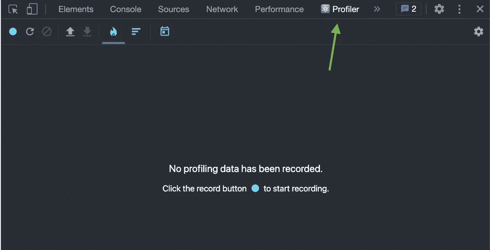

概要分析并不是即时进行的——首先，您必须记录一个概要分析会话，然后才能对其进行分析。

在我们开始记录之前，我们需要在 React Dev 工具设置中启用一个重要设置:

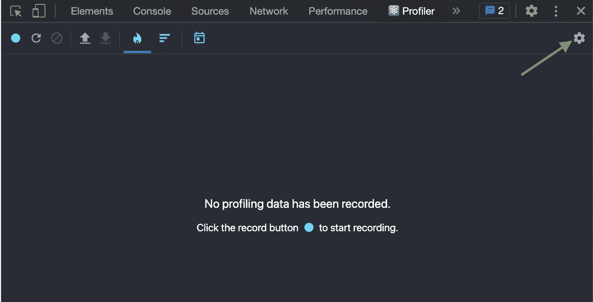

点击齿轮图标并检查**记录为什么每个组件在分析时渲染**复选框:

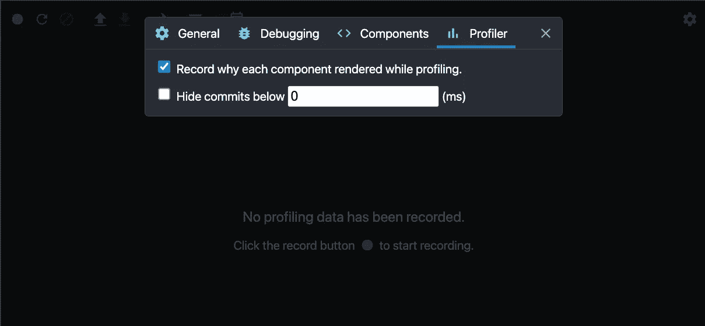

第二个选项(**隐藏**以下的提交)也很有用，特别是当您有很多[提交](#6bef)并且想要过滤那些无关紧要的提交(那些低于特定阈值的提交)时。

# 记录个人资料

要开始记录个人资料，请点击蓝色的**记录**按钮:

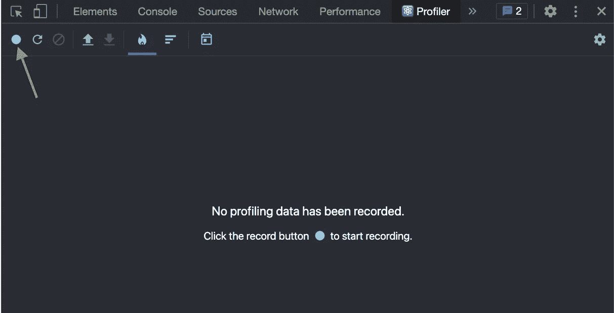

或者，您可以重新加载页面并立即开始录制:

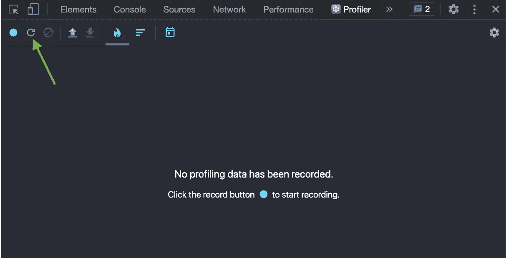

录制开始后，播放一会儿您的应用程序，或者重现一个特别有问题的场景，然后停止录制:

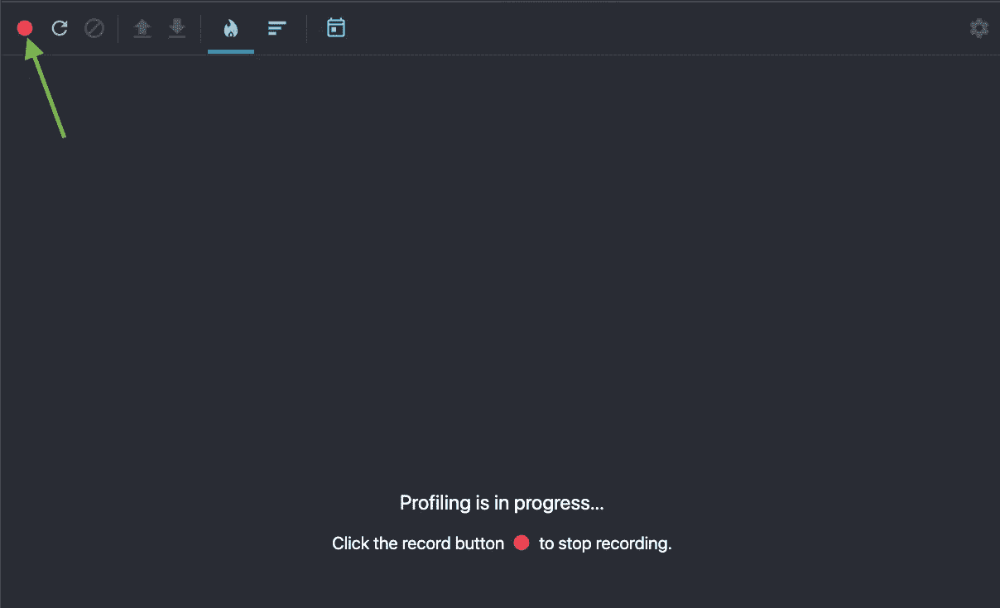

对于我们的测试应用程序，我只需在文本字段中输入 **111** ，然后逐个删除数字(**111->11->1->' '**)。

停止记录后，我们得到的是:

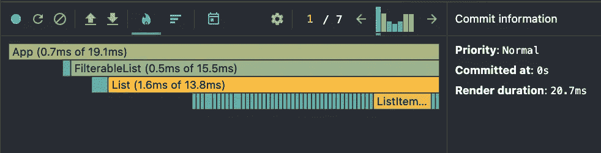

现在让我们看看这是什么意思。

# 探查器用户界面

Profiler UI 在逻辑上可以分为 4 个主要部分:

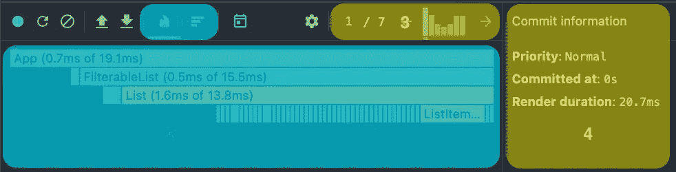

1.  **图表选择** —允许在您的应用档案的两种不同表示形式之间进行选择— *火焰图表*和*排名图表*。我们将详细讨论这两个问题。
2.  **图表区** —您的应用程序概要文件中的*单次提交*的图形表示。
3.  **提交** —每个条形代表应用程序生命周期中[提交阶段](https://wavez.github.io/react-hooks-lifecycle/)的一次出现。无论何时通过单击选择提交，图表区和提交信息都会相应地更新。
4.  **信息面板** —关于单个选定提交阶段或单个选定组件的详细信息。

现在来详细说说。

# 承诺

React 协调算法分为两个阶段:**渲染**和**提交**。

*   **渲染**阶段确定需要对例如 DOM 做出什么改变。在此阶段，React 调用 render，然后将结果与之前的渲染进行比较([差异算法](https://reactjs.org/docs/reconciliation.html#the-diffing-algorithm))。
*   **提交**阶段是 React 应用任何更改的时候。(对于 React DOM，这是 React 插入、更新和删除 DOM 节点的时候。)

[这里的](https://pbs.twimg.com/media/DZ-97vzW4AAbcZj?format=jpg&name=large)是经典 React 组件的相图(作者丹·阿布拉莫夫)，这里的是 hooks 的类似图(作者盖伊·马格利特)。

如前所述，提交部分中的每个条形代表一次提交—条形越高，提交花费的时间越长。提交还可以通过从绿色到黄色的颜色渐变来区分——黄色的性能较低，绿色的性能较高。

因此，*较高的黄色条代表比较短的绿色条*花费更长时间的提交。

当前选择的提交是蓝色的。

# 图表:火焰图图表

flamegraph 图表视图表示针对特定提交的应用程序的呈现树。图表中的每个条形代表一个 React 组件。组件从渲染根到叶子进行组织(根是最上面的组件，叶子是最下面的)。

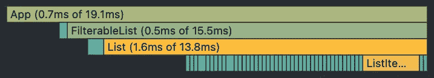

如您所见， **Header** 和 **FilterableList** 是 **App** 的子组件，因此它们紧挨着出现在 **App** 组件的下方。

条形的宽度代表组件*及其子组件*渲染*所花费的时间。*条形的颜色代表组件本身渲染花了多长时间(绿色表示快，黄色表示慢)。

因此，在上面的例子中，**可过滤列表**的宽度表示**可过滤列表**渲染*所花费的时间，包括*渲染**列表**所花费的时间。

另一方面，您可以看到**可过滤列表**是绿色的，而**列表**是黄色的，并且它与数字相关——渲染**可过滤列表**只花了**0.5 毫秒**，渲染**列表**花了**1.6 毫秒。**

但是，如果一个组件在特定的提交过程中根本没有被呈现，会发生什么呢？

让我们看看第四次提交:

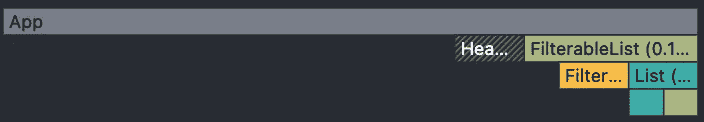

**App** 和 **Header** 组件在过滤时不会改变，所以它们只被渲染一次——在第一次提交期间。在接下来的提交中，这两个组件都是灰色的，但是，它们看起来还是有点不同。那么有什么区别呢？

**灰色填充**——一个在提交过程中没有渲染的组件，但它是渲染路径的一部分(例如 **App** 没有渲染，但它是 **FilterableList** 的父级，后者进行了渲染)。

**灰色渐变条纹**——一个在提交过程中没有渲染的组件，也不是渲染路径的一部分(例如，**头**没有渲染，但是它也没有任何渲染过的子组件)

另外，你可能已经注意到**应用**组件栏仍然有宽度，尽管它没有渲染。

因此，让我们稍微细化一下定义。

**条形的宽度代表组件最后一次渲染花费了多少时间*，颜色代表作为当前提交*的一部分花费了多少时间*。***

最后但同样重要的是，您可以通过单击组件来放大或缩小图表。

缩小:

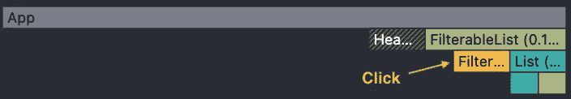

放大:

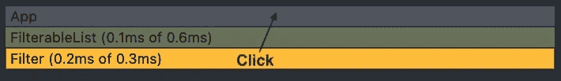

缩小:

# 图表:排名图表

与 flamegraph 图表类似，分级图表表示单个提交。但是，与 flamegraph 图表不同，组件是按渲染时间而不是渲染顺序排序的。

这意味着花费最长时间渲染的*组件位于顶部。*

另一个区别是组件的条宽代表组件渲染*所花费的时间，不包括其子组件。*这意味着颜色和宽度之间存在直接关联。

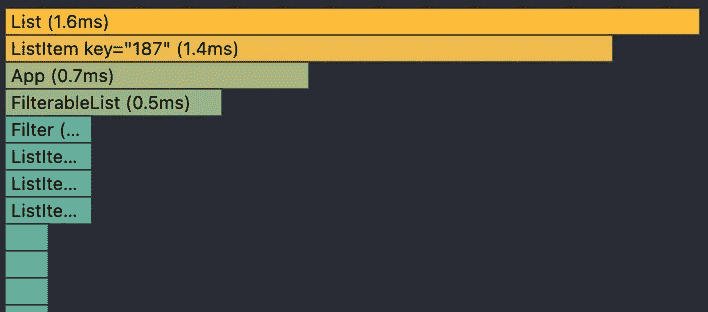

正如你所看到的， **List** 花费了最长的时间来渲染，所以它位于顶部，它是条形中最宽的，也是条形中最黄的。

在提交*期间没有呈现的组件不会出现在分级图表*中。

与 flamegraph 图表类似，通过单击组件可以进行放大和缩小。

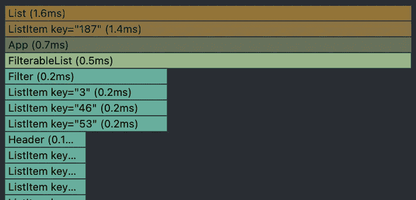

# 信息面板

信息面板有两种不同的应用。

**1。选定提交**

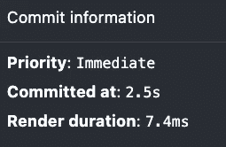

当未选择(放大)任何组件时，它会显示当前在提交部分选择的提交的概述。数据包括提交时间(自应用程序启动以来)、渲染时间和优先级。

**2。所选组件**

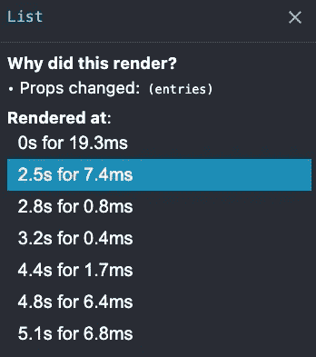

当您在其中一个图表视图中单击某个组件(放大它)时，信息面板将显示有关该组件的详细信息。这包括组件在此特定提交期间呈现的原因(如果您在设置中启用了此选项)以及带有时间戳的提交列表。该列表是交互式的，允许您轻松地在涉及该特定组件的不同提交之间导航。

# 让实验室老鼠更上一层楼

现在我们已经熟悉了 React Profiler，让我们看看如何将这些知识应用到实际场景中。

再来看看我们的 [app](https://github.com/just-jeb/react-profiler-lab-rat-app/tree/not-optimized) 。

组件内部的逻辑非常简单，因此很难改进。

相反，我们将重点关注渲染性能，以尝试减少渲染的数量。因为我们在提交之间所做的只是过滤，所以我们假设这些项目被渲染一次，然后在应用过滤器时从 DOM 中删除。这意味着当我们过滤时，列表项不应该被渲染两次。然而，这种情况并没有发生。如果您查看 [lab rat](https://react-profiler-lab-rat.netlify.app/) 配置文件，并在提交面板中的提交之间切换，您会注意到每次提交时都会呈现列表项。为什么会这样？

让我们放大第二次提交中的一个项目，并尝试找出它。

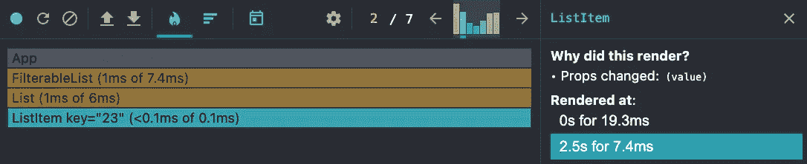

放大为我们提供了有用的信息——自从其**值**属性改变后，该项目已被重新渲染(参见**信息面板**)。

为什么价值会改变？每次我们过滤列表时，都会创建一个新的数组。由于我们使用 item index 作为 **ListItem** 组件的**键**，因此每次我们更改过滤器值时，组件间列表值的分布都会不同。

例如，在第一次渲染时，数组中的第一个条目是使用一个 **key=1** 的组件渲染的。然而，在第二次渲染时，当我们从数组中过滤出一些值时，第一个条目可能会有所不同。React 将重用第一次渲染中 **key=1** 的组件，但由于第一个条目已更改，值已更改，因此重新渲染。

为了解决这个问题，我们将在第一次创建数组时给数组中的每个条目分配一个 **ID** ,并使用它作为条目的键，而不是使用条目索引。

让我们应用修复程序，看看发生了什么变化(更新的应用程序在此处[可用](https://react-profiler-lab-rat-semi-optimized.netlify.app/)):

令人惊讶的是，它什么也没有改变——数字是相同的，并且每次提交时项目组件仍然被重新呈现。让我们仔细看看:

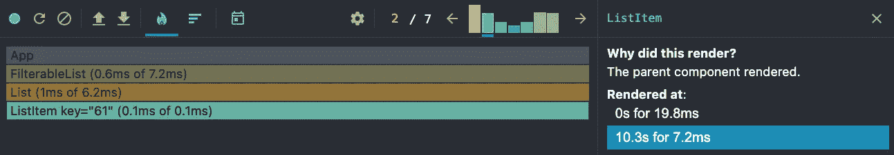

正如你所看到的，有一件事发生了变化——重新渲染的原因。现在**列表项**被重新呈现，因为它们的父组件(**列表**)被重新呈现，即使这些组件没有任何变化——无论是 ID 还是值。

幸运的是，我们知道如何解决这类问题。让我们把备忘录放在清单项目上，看看它有多少改进:

[到了](https://react-profiler-lab-rat-optimized.netlify.app/)我们走吧！

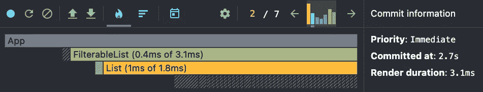

在以下提交中，以前呈现的项目都不会重新呈现。看看渲染持续时间——我们把它缩短了 2 倍！

# 完成单词

这个性能问题的最终解决方案是使用一个带有虚拟滚动的列表，它可以为不同的数据重用相同的项目，从而节省重新安装组件的时间。然而，本文的目标是学习如何使用 profiler，而不是为 Lab Rat 应用程序提供最佳解决方案。所以我希望这个目标能够实现，并且你能够理解它是如何工作的，以及它能够做什么。

随意使用 Lab Rat live 应用程序或 Github repo 并在本地使用它:

*   **非优化** : [Github](https://github.com/just-jeb/react-profiler-lab-rat-app/tree/not-optimized) ， [Live](https://react-profiler-lab-rat.netlify.app/)
*   **半优化** : [Github](https://github.com/just-jeb/react-profiler-lab-rat-app/tree/semi-optimized) ， [Live](https://react-profiler-lab-rat-semi-optimized.netlify.app/)
*   **优化** : [Github](https://github.com/just-jeb/react-profiler-lab-rat-app) ， [Live](https://react-profiler-lab-rat-optimized.netlify.app/)

**重要提示:** React DOM 在 v16.5 >的开发模式下自动支持概要分析，但是由于概要分析会增加一些额外的开销，因此它在生产模式下是可选的。[这个要点解释了如何选择加入。](https://gist.github.com/bvaughn/25e6233aeb1b4f0cdb8d8366e54a3977)

今天就到这里，如果你喜欢这篇文章，请关注我，在这里发表评论，或者如果你有任何问题，请在 Twitter 上给我发消息。

干杯！

*这篇和其他文章都可以在我的* [*个人博客*](https://www.justjeb.com/blog) *上免费获得。请务必注册以获得最新最棒的！*

*更多内容看* [*说白了。报名参加我们的*](http://plainenglish.io/) [*免费每周简讯*](http://newsletter.plainenglish.io/) *。在我们的* [*社区*](https://discord.gg/GtDtUAvyhW) *获得独家写作机会和建议。*