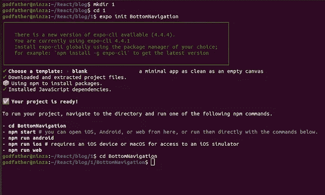
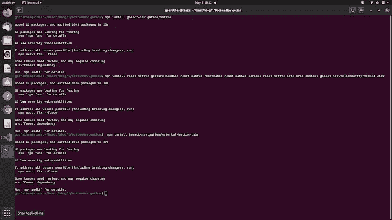
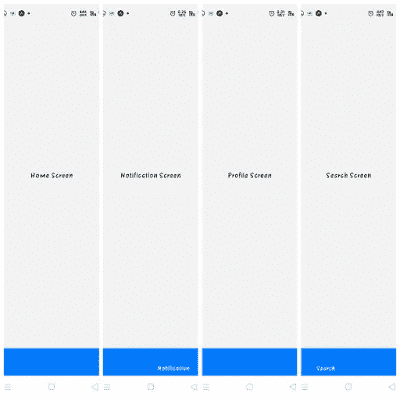
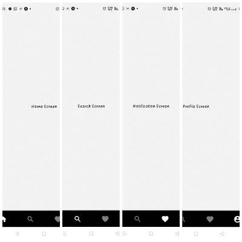

# React Native Expo 中的底部选项卡导航

> 原文：<https://javascript.plainenglish.io/bottom-tab-navigation-like-instagram-using-react-native-expo-96dec9279eaa?source=collection_archive---------1----------------------->

## 如何使用 React Native 实现底部选项卡导航

导航是手机 app 开发的重要组成部分。不同类型的导航可以方便用户的网上冲浪。底部标签导航是最突出的导航之一，Instagram 有底部标签导航，真的很酷。喝杯咖啡，开始编码，因为我们要建立一个像 Instagram 一样的底部标签导航。因为它是跨平台的，所以它在 IOS 和 Android 设备上都可以很好地工作。


如果您正在寻找视频教程，那么它就在这里:

Bottom tab navigation in react native expo

# React 本地博览会的设置

1.制作一个文件夹

2.打开终端/命令提示符

3.编写命令:expo init BottomNavigation

4.选择空白模板

5.确保你有一个良好的互联网连接。让 expo 安装所有的 JavaScript 依赖项。下载完成后。导航到文件夹“底部导航”。

你会看到这样的东西。



## 安装底部选项卡导航的依赖项

React Native 有一个很棒的导航包。它是免费和开源的。让我们将软件包安装在同一个目录中。写下下面的命令。

1.`npm install [@react](http://twitter.com/react)-navigation/native`

2.`npm install react-native-gesture-handler react-native-reanimated react-native-screens react-native-safe-area-context [@react](http://twitter.com/react)-native-community/masked-view`

3.`npm install [@react](http://twitter.com/react)-navigation/material-bottom-tabs`

您将看到类似这样的内容:



现在在你喜欢的代码编辑器中打开“BottomNavigation”文件夹。我个人最喜欢的是 VS 代码。现在验证所有依赖项的安装。检查 **package.json** 文件并验证。

打开 **App.js** 写下面的代码。

```
import React, { Component } from 'react'import HomeScreen from './Screens/Home';import NotificationScreen from './Screens/Notification';import ProfileScreen from './Screens/Profile';import SearchScreen from './Screens/Search';import { createMaterialBottomTabNavigator } from '@react-navigation/material-bottom-tabs';import { NavigationContainer } from '@react-navigation/native';import  MaterialCommunityIcons  from 'react-native-vector-icons/MaterialCommunityIcons';const Tab = createMaterialBottomTabNavigator();
```

我们希望我们的导航标签看起来像 Instagram。所以，我们需要四个屏幕。现在，在同一个目录中创建一个文件夹，并将其命名为“Screens”。在 Screens 文件夹中创建四个 JavaScript 文件: **Home.js** 、 **Profile.js** 、 **Notification.js** 、 **Search.js** 。如上图所示在 **App.js** 中导入这四个文件。

打开 ***Home.js*** 文件，写出下面的代码。

```
import React from 'react'import { View, Text } from 'react-native'function Home() {return (<View style={{alignItems:'center', justifyContent:'center', flex:1}}><Text>Home Screen</Text></View>)}export default Home
```

将相同的代码复制并粘贴到 Notification.js、Profile.js、Search.js 文件中，并将函数名分别更改为 Notification、Profile、Search。此外，更改导出默认零件。之后，在所有其他 JavaScript 文件中的`<Text>`标签之间更改文本“Home Screen”。做完所有这些后，让我们回到 App.js 并编写以下代码。

```
export default function App() {return (<NavigationContainer><Tab.Navigator><Tab.Screen name="Home" component={HomeScreen} /><Tab.Screen name="Search" component={SearchScreen} /><Tab.Screen name="Notification" component={NotificationScreen} /><Tab.Screen name="Profile" component={ProfileScreen} /></Tab.Navigator></NavigationContainer>);}
```

我们结束了。

回到终端，运行脚本`**npm start**` **。**

打开你的**世博 App** 扫描二维码。你的手机屏幕上会出现类似这样的东西。



Bottom Tab Navigation in React Native

让我们使它更有活力。更新 App.js 中的代码。我们将使用图标更新文本。为此再安装一个依赖项:`npm install react-native-vector-icons`

将它导入 App.js 并更新代码。

```
import  MaterialCommunityIcons  from 
'react-native-vector-icons/MaterialCommunityIcons';export default function App() {
  return (
    <NavigationContainer>
    <Tab.Navigator labeled={false} barStyle={{ backgroundColor: 'black' }} 
activeColor="white" >
      <Tab.Screen name="Home" component={HomeScreen}            //Home Screen
      options={{
        tabBarIcon: ({ color, size }) => (
            <MaterialCommunityIcons name="home" color={color} size={26}/>
        ),
    }}/>
      <Tab.Screen name="Search" component={SearchScreen}      // Search Screen
      options={{
        tabBarIcon: ({ color, size }) => (
            <MaterialCommunityIcons name="magnify" color={color} size={26}/>
        ),
    }}/>
      <Tab.Screen name="Notification" component={NotificationScreen} 
 // Notification Screen
      options={{
        tabBarIcon: ({ color, size }) => (
            <MaterialCommunityIcons name="heart" color={color} size={26}/>
        ),
    }}/>
      <Tab.Screen name="Profile" component={ProfileScreen}   // Profile Screen
      options={{
        tabBarIcon: ({ color, size }) => (
            <MaterialCommunityIcons name="account-circle" color={color} 
size={26}/>
        ),
    }}/>
    </Tab.Navigator>
    </NavigationContainer>
  );
}
```

我们开始吧。
我们几乎达到了类似 Instagram 的底部标签外观。



Instagram bottom tab navigator

我们在这里完成了这个项目，因为它是简单的 JavaScript 代码，我们使用了一些 JavaScript 框架在这里查看完整的 [Github 代码](https://github.com/imrohit007/Bottom-Tab-Navigation-In-React-Native-Expo)。

谢谢你。

你好，我叫 Rohit Kumar Thakur。我对自由职业者持开放态度。我构建了 **react 原生项目**，目前正在开发 **Python Django** 。随时联系我(**freelance.rohit7@gmail.com**)