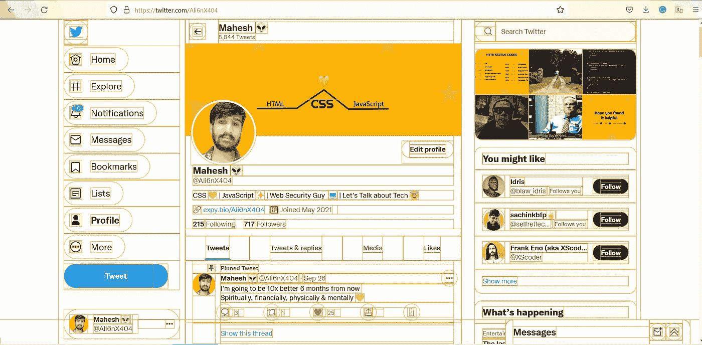
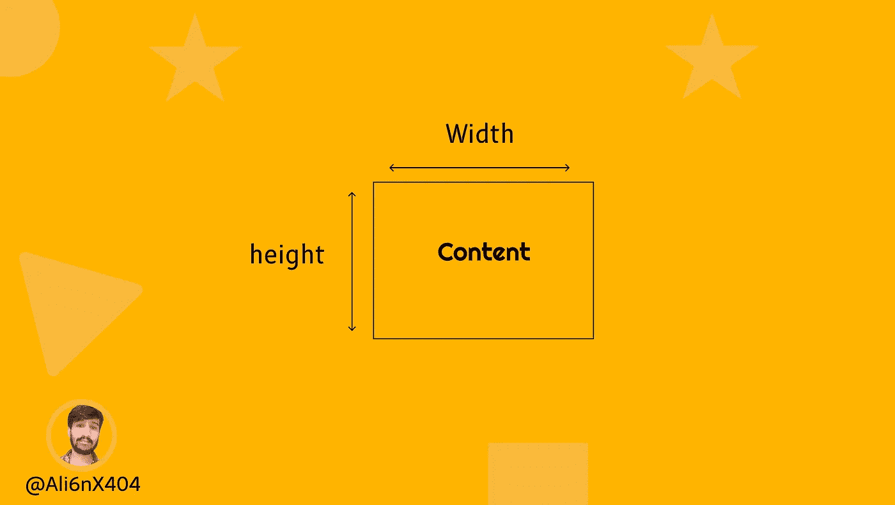
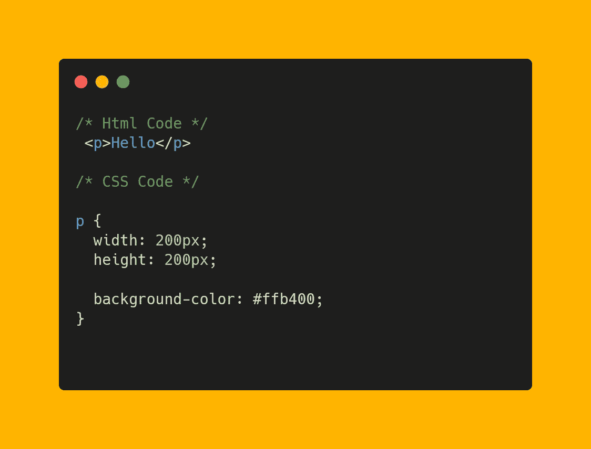
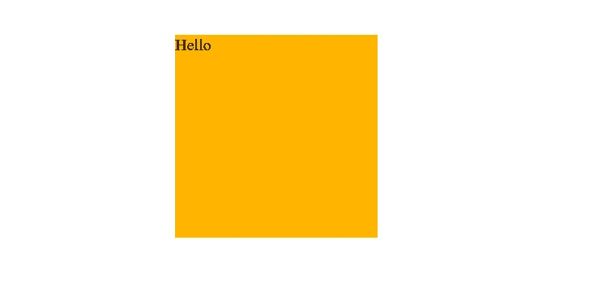
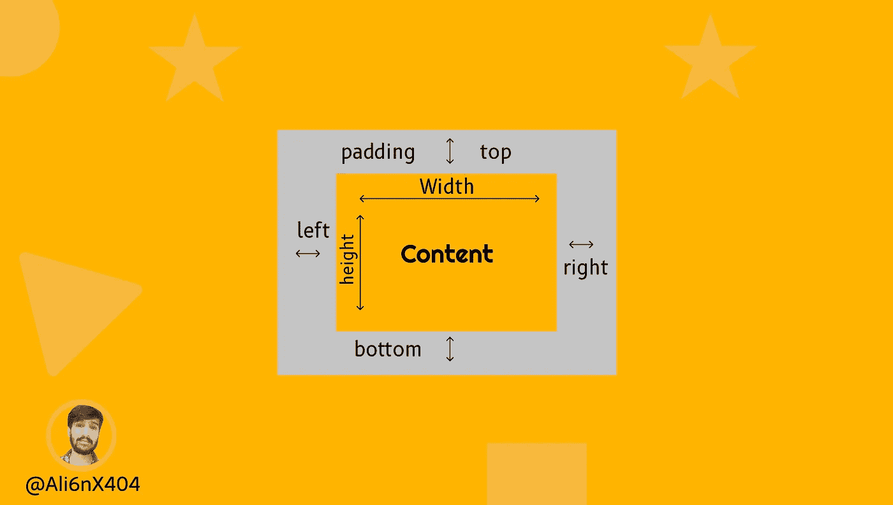
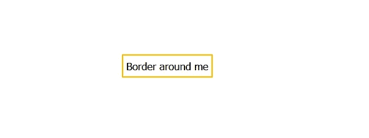
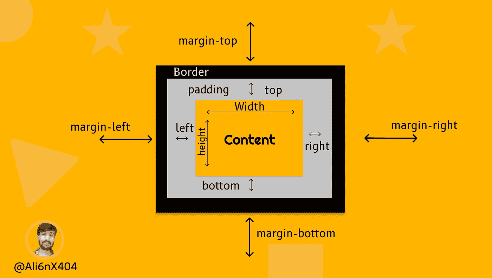
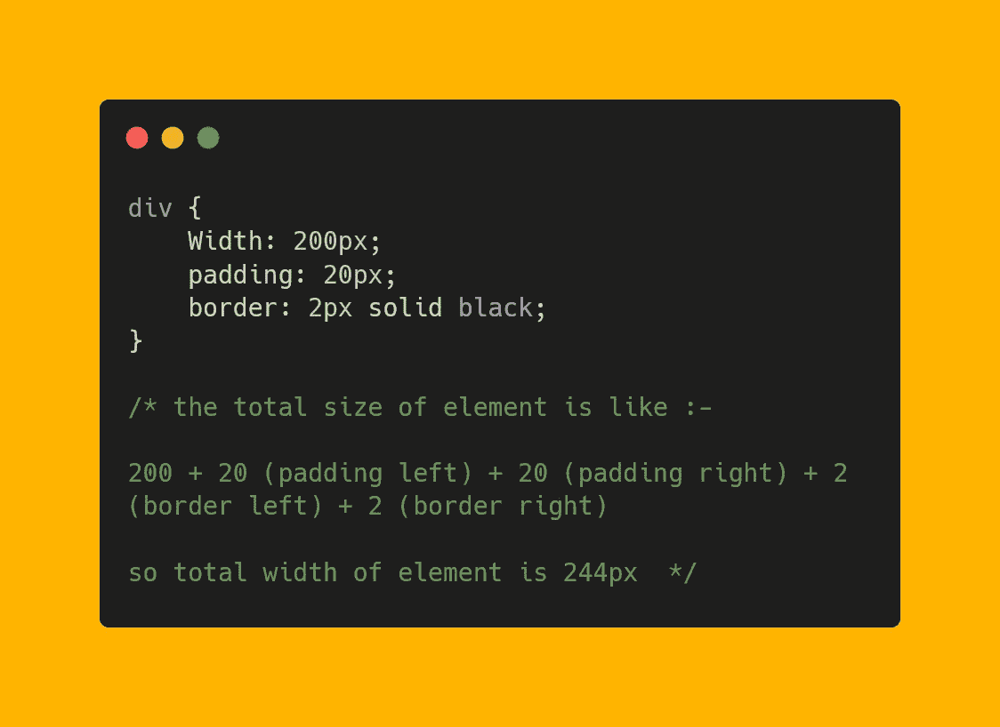
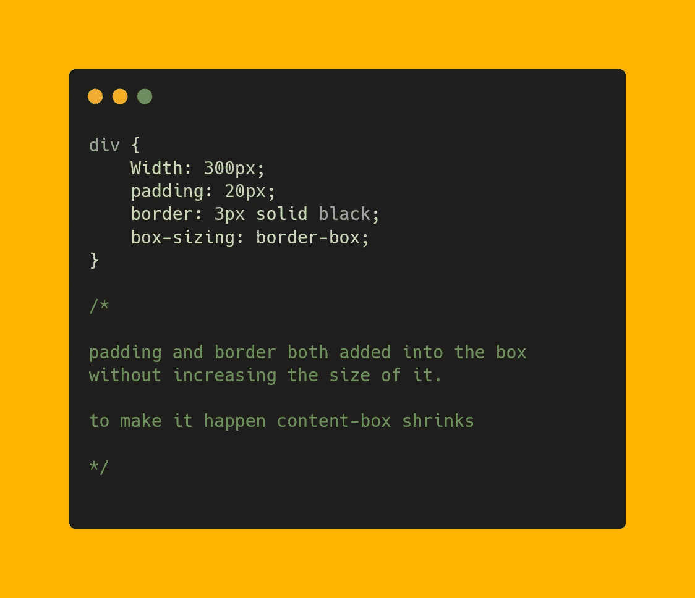

# CSS 中的盒子模型:“盒子——到处都是矩形盒子😅"

> 原文：<https://javascript.plainenglish.io/box-model-in-css-boxes-boxes-rectangular-boxes-everywhere-6774966ad37c?source=collection_archive---------7----------------------->

你需要明白的第一件事是，你在网页上看到的一切都是由长方形盒子组成的。

在一个网站上，你会看到所有的内容只是一个盒子的组合，排列在顶部，旁边，底部，或者相互嵌套。

页眉、导航、页脚——一切都是由盒子组成的。通常，我们称之为 HTML 元素，而不是矩形盒。

𝘉𝘰𝘹𝘦𝘴 — 𝘉𝘰𝘹𝘦𝘴 𝘳𝘦𝘤𝘵𝘢𝘯𝘨𝘶𝘭𝘢𝘳 𝘉𝘰𝘹𝘦𝘴 𝘌𝘷𝘦𝘳𝘺𝘸𝘩𝘦𝘳𝘦 😅

看看下面。👇



代码由我添加，以查看所有的盒子👇

```
* {
 outline: 2px solid #ffb400 !important;
}
```

# CSS 中的盒子模型是什么？

每当你创建一个 HTML 元素时，它都被包装在一个盒子里，我们可以使用 CSS 来修改它。

这个框由几个不同的层组成，如边距、填充、边框和内容。

在 CSS 的帮助下，我们可以操纵这些盒子的大小、位置和属性。

它用于开发网页的设计和结构。

## 盒子模型的层数:

*   内容区域
*   填料
*   边境
*   边缘

我们来谈谈盒子模型的每一层。

**✔内容区**

内容区域包含放在 HTML 元素中的真实内容，如文本、图像等。

width 和 height 属性定义内容框的宽度和高度。



content Area

此外，您可以使用其他属性来定义内容的宽度和高度，例如最大宽度、最小宽度、最大高度和最小高度设置约束，而不是固定的大小。

如果我们没有定义高度和宽度，那么它将基于内容进行计算，但我们也可以选择用给定的属性设置固定的高度和宽度。

看看下面。👇



Code Example

**输出**



**✔填充**

CSS 中的填充指的是边框和元素内容之间的空间。

设置顶部、右侧、底部和左侧的填充。我们有如下属性:

*   衬垫顶部
*   填充-右侧
*   底部填充
*   填充-左侧



Padding area

填充简写在一个声明中定义了元素的所有四个边。

```
p {
 padding:20px;
}
```

**✔边境**

CSS 中的边框位于盒子模型的边距和填充组件之间。

通常，我们看到按钮周围的边框是这样的。👇



Border

边框速记属性接受三个输入:

*   边框大小
*   边框样式:实线/虚线
*   边框颜色

```
button {
 border: 2px solid #ffb400;
}
```

我们可以使用的边框样式列表。👇

**✔保证金**

边距只不过是盒子和周围盒子之间的空间。

设置顶部、右侧、底部和左侧的边距。我们有如下属性:

*   上边距
*   右边距
*   页边距-底部
*   左边距



margin

margin 速记在一个声明中定义了一个元素的所有四个边。

```
div {
 margin: 30px;
}
```

**盒子的大小是这样计算的:**

𝐓𝐨𝐭𝐚𝐥 𝐖𝐢𝐝𝐭𝐡 =宽度+左填充+右填充+左边框+右边框。

𝐓𝐨𝐭𝐚𝐥 𝐇𝐞𝐢𝐠𝐡𝐭 =高度+填充顶部+填充底部+边框顶部+边框底部。

默认的盒子模型计算元素的宽度和高度的方式增加了很多问题，因为总的来说，宽度和高度填充和边框也增加了。

🤜为了解决这个问题，引入了另一个称为盒子大小的属性。

**什么是装箱？**

CSS 框大小设置 HTML 元素的总宽度和高度的计算方式。

您可以指定的值:-

*   内容盒
*   边框

**✔内容框**

通过添加内容框，什么都不会改变，因为这是框大小属性的默认行为。

如果像这样设置宽度、填充和边框👇



**✔边框**

边框框是最好的选择，它说内容框缩小添加填充和边框。

如果您将 300 像素的宽度添加到框中，并将 20 像素的填充和 3 像素的边框添加到框中，所有这些加在一起就变成了 300 像素，因为内容框会缩小以添加填充和边框。



𝐓𝐢𝐩:边框是设计布局和管理 HTML 元素大小的最佳选择。

不需要为每个元素单独设置该属性。

盒子尺寸重置方法

```
html {
 box-sizing: border-box;
}*, *::before, *::after {
 box-sizing: inherit;
}
```

如果你不熟悉继承和全局重置，那么参考这篇博客来理解上面的代码。

[https://CSS-tricks . com/inheriting-box-sizing-possible-mingotially-better-best-practice/](https://css-tricks.com/inheriting-box-sizing-probably-slightly-better-best-practice/)

😍我们学了足够多的理论，让我们来看一个行动。

请注意代码中和检查元素后两个元素的大小差异。

密码笔。👇

**要点**

*   总是喜欢边框。
*   使用浏览器工具查看图元的精确计算尺寸。
*   使用全局重置以简化工作。

**结论**

好了，就这样，我们涵盖了盒子模型所有最重要的部分。😍

感谢您停下来查看这些资源，我相信在某个时间点它会对您有所帮助。

如果你喜欢阅读，那么不要忘记与其他开发者分享😇。

通过以下方式与我联系:

- [推特](https://twitter.com/Ali6nX404)
- [LinkedIn](https://www.linkedin.com/in/mahesh-patidar-34a982192/)

*更多内容请看*[***plain English . io***](http://plainenglish.io/)