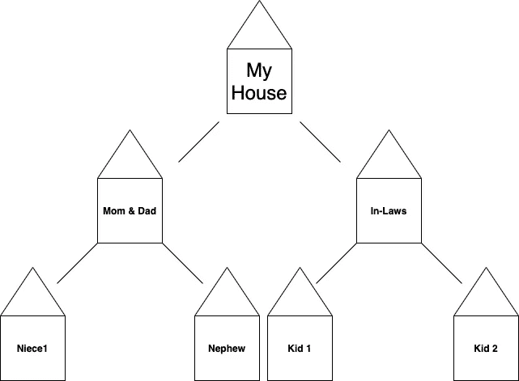

# JavaScript 中广度优先搜索的简单指南

> 原文：<https://javascript.plainenglish.io/breadth-first-breath-first-search-482eb6ec7c3c?source=collection_archive---------4----------------------->

## 广度优先(呼吸第一..)搜索

## 你知道他们怎么说:“如果你能教它，那么你真的知道你在说什么？”

这么说吧，这就是我今天要做的。所以——非常欢迎编辑和评论！

## **广度优先搜索**

如果您还没有遇到过，广度优先搜索是一种以特定顺序访问节点的算法，首先是根节点，然后是相邻节点。换句话说，如果我每边有两个邻居，我会从我的房子开始，然后同时访问我左右两边的邻居——然后在我邻居的邻居中继续这个趋势。我需要一个视觉效果，所以我做了一个:



我知道——疯狂的邻居，对吗？！让我们投入其中，继续我们的生活。

## **两个有用的定义**

顶点:两条边相交的点。在这种情况下，房子。

**边/边:**连接——两个相连的顶点。这两栋房子在彼此之间形成了一条通道。

在代码中:

```
edges = [
['myhouse', 'momanddad'],
['momanddad', 'niece1'],
['momanddad', 'nephew'],
['myhouse', 'inlaws'],
['inlaws', 'kid2'],
['inlaws', 'kid1']
]vertices = [
{name: 'myhouse', distance: null, predecessor: null},
{name: 'momanddad', distance: null, predecessor: null},
{name: 'inlaws', distance: null, predecessor: null},
{name: 'niece1', distance: null, predecessor: null},
{name: 'nephew', distance: null, predecessor: null},
{name: 'kid1', distance: null, predecessor: null},
{name: 'kid2', distance: null, predecessor: null}
]
```

## **找到一个节点**

在许多这样的算法中，能够找到一个节点是很有帮助的——所以让我们为此编写代码。

```
function findNode(nodeName, vertices){
     return vertices.find(vertex=> vertex.name == nodeName)
}In Action:
findNode('myhouse', vertices)RETURNS the vertex OBJECT if found.
{name: 'myhouse', distance: null, predecessor: null}
```

**距离:**正如你在顶点列表中看到的——为了让我们有一个结构，我们需要跟踪两个节点之间的距离。对于我们的根节点，距离是 0。对于两个相邻节点，距离为 1，因为它们距离根节点 1。

**前任:**跟踪该算法内部的另一种方法是记录前任。当探索邻居的房子时，我的房子就成了他们的前身。

## **BFS 一个节点上的两个动作**

在 BFS 的一个节点上有两种操作。一个是*访问*一个节点。另一个是*探索*一个节点，这意味着弄清楚它的相邻节点是什么。坚持我的房子类比，我可以参观我的房子，但是如果我探索它——我发现我有两个邻居！——我爸妈和我亲家。听起来是个有趣的社区，是吧？

我们知道如何访问/找到一个节点，让我们通过返回它的相邻节点来探索一个节点。让我们用代码实现它，然后让我们把它分解并提炼出来。

```
function findAdjacent(nodeName, vertices, edges) {
     return edges.filter(function(edge){
          return edge.includes(nodeName)
     }).map(function(edge) {
          return edge.filter(function(node){
               return (node !=nodeName)
          })[0]
     }).map(function(name){
           return findNode(name, vertices)
     }).filter(function(node){
          return node.distance == null
     })
}
```

我不知道你怎么想，但是这个解决方案让我很困惑，因为我是一个视觉学习者。先重写一遍，然后再分解。这是使用箭头函数的另一种方法。

```
function findAdjacent(nodeName, vertices, edges){
     return edges.filter(edge => {
          return edge.includes(nodeName)
     }).map(edge => {
          return edge.filter(node => {
               return node != nodeName
          })[0]
     }).map(name => {
          return findNode(name, vertices)
     }).filter(node => {
          return node.distance == null
     })
}
```

再用 ES6 的箭头函数和隐式返回(如果对你有帮助的话)来概括

```
function findAdjacent(nodeName, vertices, edges){
     return edges.filter(edge => edge.includes(nodeName)).map(edge => edge.filter(node =>
     node != nodeName)[0]).map(name =>
          findNode(name, vertices)).filter(node =>
              node.distance == null)
}
```

## **分解**

让我们一步一步地分解它。我喜欢用“如果(y)/这些/那些”来代替所有的箭头。

```
return edges.filter(edge => edge.includes(nodeName))
```

^返回所有的边(这是数组中的两组锚点)*，如果这两个点包含节点名，我们当前已经将节点名设置为字符串“myhouse”。记住过滤器迭代器会自动返回一个数组，所以这就是我们目前正在做的事情。*

```
edges = [
['myhouse', 'momanddad'],
['momanddad', 'niece1'],
['momanddad', 'nephew'],
['myhouse', 'inlaws'],
['inlaws', 'kid2'],
['inlaws', 'kid1']
]//after above line of code
RETURNS
[['myhouse', 'inlaws'],['myhouse', 'momanddad']]
```

然后，获取返回值，并映射它

```
.map(edge => edge.filter(node => node != nodeName)[0])
```

遍历每组边，取每个节点，如果节点不等于给定的节点名，则过滤它们*。*

```
//examine each set
['myhouse', 'momanddad']
['myhouse', 'inlaws']
//filter that array for nodes if it DOES NOT MATCH, therefore we are left with an array of:RETURNS
['inlaws', 'momanddad']
```

现在来映射这个数组，这次返回数组中每一项的对象节点。

```
.map(name => findNode(name, vertices))Goes thru 
'inlaws'performs findNode on it ('inlaws', vertices)
RETURNS from the vertices list
{name: 'inlaws', distance: null, predecessor: null}Moves to
'momanddad'
RETURNS
{name: 'momanddad', distance: null, predecessor: null}
```

请记住，MAP 返回一个数组，因此我们的实际返回结果如下所示:

```
[{name: 'momanddad', distance: null, predecessor: null}, {name: 'inlaws', distance: null, predecessor: null}]
```

最后，如果 node.distance 为空，则过滤数组*。这意味着该节点尚未被浏览。一旦节点被探索，我们将增加它的距离。稍后会详细介绍。*

```
.filter(node => node.distance == null})So we filter this array to ensure that all the distances are null. They are indeed NULL -- 
RETURNS
[{name: 'momanddad', distance: null, predecessor: null}, {name: 'inlaws', distance: null, predecessor: null}]
```

**探索—标记距离和前任**

现在我们需要一种方法来知道一个(或多个)节点已经被浏览。所以我们需要一个方法，标记与前一个节点的距离，使前一个节点成为前任。

```
function explored(node, adjacentNodes){
     const current = node
     adjacentNodes.forEach(node => {
          node.distance = current.distance + 1
          node.predecessor = current
     })
     return adjacentNodes
}
```

重要的是要注意我们在这里传递给这个函数的参数是什么。在这种情况下—“节点”是一个完整的对象，看起来像这样:

```
{name: 'myhouse', distance: null, predecessor: null}
```

adjacentNodes 看起来像 findAdjacent 函数的返回值。

```
[{name: 'momanddad', distance: null, predecessor: null}, {name: 'inlaws', distance: null, predecessor: null}]
```

在我们执行了所研究的函数之后，下面是返回值:

```
[{  name: 'momanddad',
    distance: 1,
    predecessor: { name: 'myhouse', distance: null, predecessor: null }
 },
 {  name: 'inlaws',
    distance: 1,
    predecessor: { name: 'myhouse', distance: null, predecessor: null }
}]
```

**广度优先搜索算法**

```
function bfs(startingNode, vertices, edges){
     startingNode.distance = 0
     let queue = [startingNode]
     let discovered = [startingNode]

     while(queue.length != 0){
          let currentNode = queue.shift()
          let adjacentNodes = findAdjacent(currentNode.name, vertices, edges)
          discovered = discovered.concat(adjacentNodes);
          explored(currentNode, adjacentNodes)
          queue = queue.concat(adjacentNodes)
     } return discovered
}
```

好的。我们来解构一下这个。

首先，让我们将 startingNode.distance 设置为 0，因此在我们探索的方法中，我们不会尝试将 1 加到 null。非常简单，但这是新的根节点对象:

```
{name: 'myhouse', distance: 0, predecessor: null}
```

然后，我们创建一个队列，这样我们就知道下一步要探索哪个节点。我们用 startingNode 创建队列。

```
let queue = [startingNode]//or more visually...queue = [{name: 'myhouse', distance: 0, predecessor: null}]
```

然后创建一个发现的数组或用于按发现顺序输出节点的数组，它看起来与队列相同。

```
let discovered = [startingNode]
```

根据队列长度开始循环:

```
while(queue.length != 0){
```

将当前节点设置为队列中的第一个节点。

```
let currentNode = queue.shift()
```

浏览当前节点的相邻节点(也称为添加距离和前任节点)

```
let adjacentNodes = explored(currentNode.name, vertices, edges)
```

请注意，这将返回一个对象数组。

```
RETURNS
adjacentNodes = [
  { name: 'momanddad', distance: null, predecessor: null },
  { name: 'inlaws', distance: null, predecessor: null }
]
```

然后，我们将它们添加到将打印的已发现节点列表中。

```
discovered = discovered.concat(adjacentNodes);
```

并标记已被探索过。

```
explored(currentNode, adjacentNodes)RETURNS
[
  {
    name: 'momanddad',
    distance: 1,
    predecessor: { name: 'myhouse', distance: 0, predecessor: null }
  },
  {
    name: 'inlaws',
    distance: 1,
    predecessor: { name: 'myhouse', distance: 0, predecessor: null }
  }
]
```

将相邻节点添加到队列中，以便可以浏览它们的相邻节点(nephew1、nephew1、kid1、kid2)

```
queue = queue.concat(adjacentNodes)
```

最后，按顺序返回列表。

```
return discovered
RETURNS
[
  { name: 'myhouse', distance: 0, predecessor: null },
  {
    name: 'momanddad',
    distance: 1,
    predecessor: { name: 'myhouse', distance: 0, predecessor: null }
  },
  {
    name: 'inlaws',
    distance: 1,
    predecessor: { name: 'myhouse', distance: 0, predecessor: null }
  },
  {
    name: 'niece1',
    distance: 2,
    predecessor: { name: 'momanddad', distance: 1, predecessor: [Object] }
  },
  {
    name: 'nephew',
    distance: 2,
    predecessor: { name: 'momanddad', distance: 1, predecessor: [Object] }
  },
  {
    name: 'kid2',
    distance: 2,
    predecessor: { name: 'inlaws', distance: 1, predecessor: [Object] }
  },
  {
    name: 'kid1',
    distance: 2,
    predecessor: { name: 'inlaws', distance: 1, predecessor: [Object] }
  }
]
```

对于更简单的打印输出，您总是可以这样做:

```
bfs(startingNode, vertices, edges).map(node => node.name)
```

它将返回:

```
[
  'myhouse',
  'momanddad',
  'inlaws',
  'niece1',
  'nephew',
  'kid2',
  'kid1'
]
```

就是这样！现在深呼吸。我是说呼吸。我不建议你住得离家人那么近，除非你“明白”自己在做什么。是的，我去过那里。

代码打开！~凯尔西

*代码信用&许可信息:https://github.com/learn-co-students/bfs-lab-g-416*