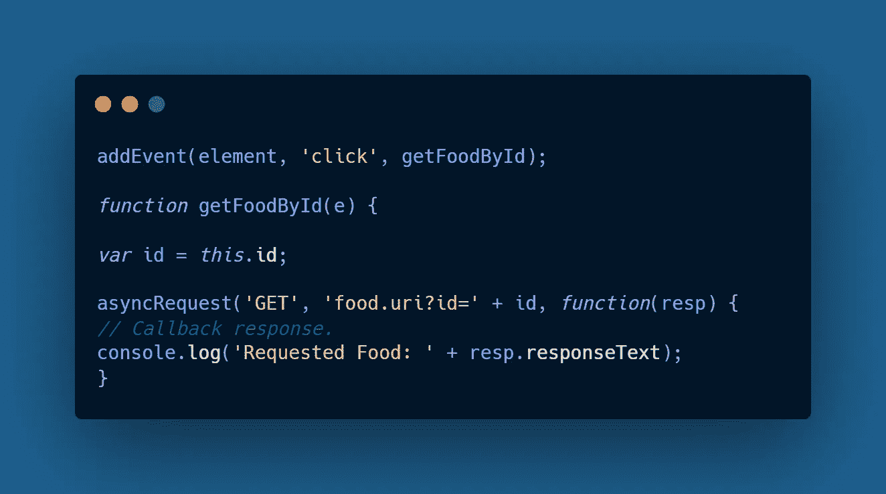
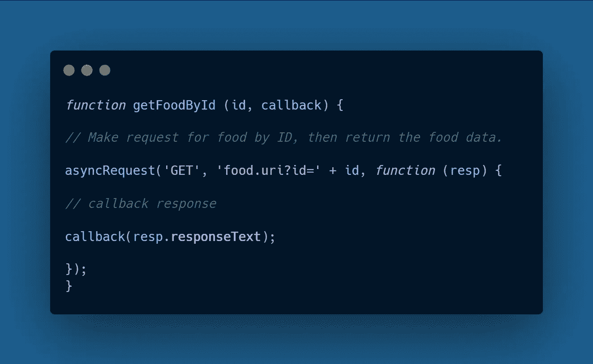
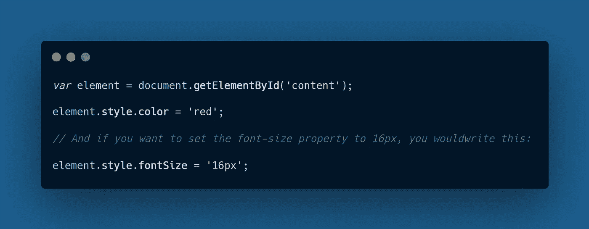
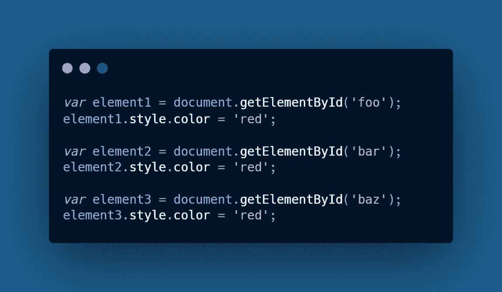
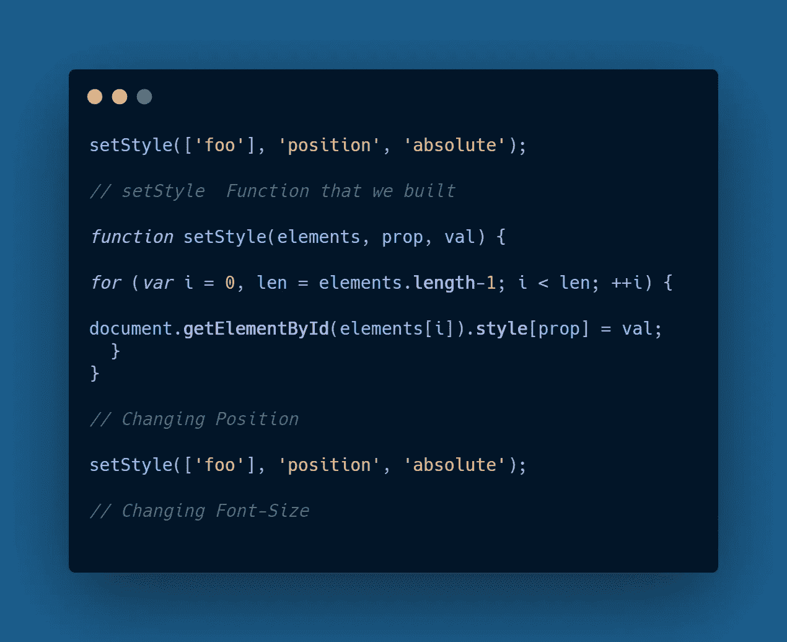

# JavaScript 中的桥和门面设计模式

> 原文：<https://javascript.plainenglish.io/bridge-facade-design-pattern-in-javascript-a4cac70b9581?source=collection_archive---------4----------------------->

## 像专家一样使用 JavaScript 应用程序

# 桥模式

这种模式允许两个组件，一个 ***客户端*** 和 ***服务*** 协同工作，每个组件都有自己的接口。主要目标是用两个抽象层次编写更好的代码。*桥接模式*的一个很好的例子是一个应用程序**(客户端)**和一个数据库驱动程序**(服务)**，应用程序写入一个定义良好的数据库 API，但是你会发现每个驱动程序的实现对于每个数据库供应商 **(SQL、MySQL、Oracle 等)都是不同的。**

## ***例如***

桥最实际的情况是事件监听器回调，假设您有一个名为 **getFoodById，**的 API 函数，它基于标识符返回关于食品订单的数据。在任何 web 应用程序中，您都希望在用户操作 ***(单击)&*** 时获取这些数据。您单击的元素包含存储在自定义属性中的食品标识符。

上面的例子是一个在浏览器环境中运行良好的 API，但是在这种情况下，只有回调的范围可以从对象中获取 ID。使用这种方法，您很可能在运行测试时遇到麻烦。

更好的方法是先从一个好的 API 开始，不要把它和任何紧密的实现结合起来。

*   对于一个名为 **getFoodById** 的函数来说，使用桥模式很有意义，它在你传入一个 Id 的地方接受一个参数。

## 优势

*   窃听器很容易找到
*   易于为其他团队成员维护代码
*   解耦抽象允许独立管理各个部分
*   应用程序不太可能崩溃

# 立面图案

## ***什么是立面功能？***

记住桌面上的快捷图标，它们就像一个界面，把你导航到难以到达的地方。基于图形用户界面的操作系统在你的计算机上为这些外观提供数据和功能，在那里你点击、拖动和移动某些东西，你与一个在幕后运行命令的外观进行交互。

该模式负责两件事，简化类接口&将该类从使用它的客户机代码中分离出来。

他们还可以在后台执行错误检查，清理不再使用的大型对象。

坦白地说，这种模式第一次尝试有点困难，所以尝试获得更多的例子，并与真正的实际案例一起工作，这使学习变得更有趣&以防你很难找到这种模式的简单例子，看看我的例子。

## ***例如***

假设您需要在 HTML 元素上应用一些样式&如果您的目标是给样式对象分配一个给定的属性(**将带有内容 ID 的 div 的文本颜色应用到*红色*)，**，那么您应该编写以下代码:

请注意，实现没有任何问题，因为它完成了工作。但是在大型应用程序中，如果您想同时为几个元素设置特定的样式，那么使用相同的方法将是最困难的工作。

为了更好的理解，让我们假设现在你有三个不同 id 的元素 **(foo，bar & baz)** ，你想在每个元素上设置文本颜色为**红色**，那么你应该写下面的代码。

正如您所看到的，随着应用程序有更多的更改要应用，这变成了一个非常重复的任务，您必须不断地写出 **getElementById** ，然后为每个元素设置相同的属性。这就是 Facade 模式可以将其转换成非常简单的实现的地方。

我创建了一个名为 **setStyle** 的函数，其中第一个参数传入了一个包含所有**id**的数组，第二个参数就是您想要应用于样式对象&的**属性**，第三个参数是该属性的**值**。

## 优势

*   允许您编写一次组合代码，并在任何地方使用它
*   减少对外部代码的依赖，这在开发应用程序时提供了额外的灵活性
*   允许您在不破坏客户端代码的情况下修改该系统

 [## Node.js 应用程序的 10 个最佳实践

### 你需要知道的 Node.js 实践

javascript.plainenglish.io](/10-best-practices-for-node-js-applications-2093b3c50799)  [## 作为开发人员，你应该知道的 9 种数据结构和算法

### 让你成为更好的开发者的数据结构和算法

javascript.plainenglish.io](/9-data-structures-algorithms-you-should-know-as-a-developer-5e10946c95a0)  [## 掌握 Git 命令行

### 像专家一样使用 Git 版本控制系统

javascript.plainenglish.io](/mastering-the-git-command-line-b2c6efe4f4ad)