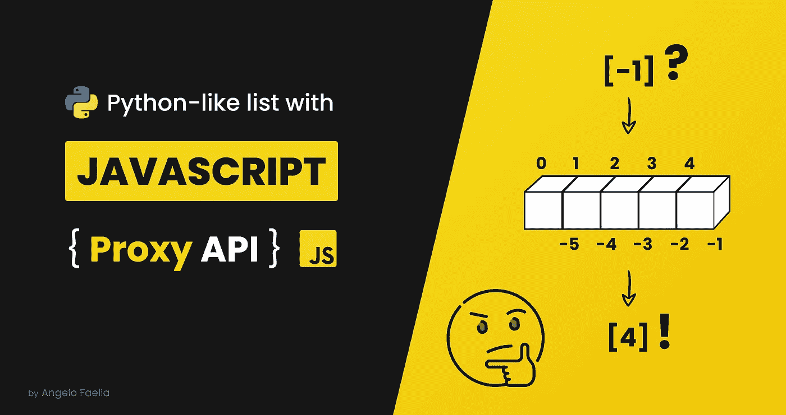

# 使用代理 API 将 Python 列表引入 JavaScript

> 原文：<https://javascript.plainenglish.io/bringing-python-lists-to-javascript-with-proxy-api-1db8c3e559b4?source=collection_archive---------20----------------------->

## 如何使用 JavaScript 代理 API 创建一个带切片和负索引的类 Python 列表对象？



JavaScript 代理 API 经常被描绘成“一个高级概念”，这阻碍了许多初学者(甚至是中间用户)钻研这个主题。

实际上，理解它的基本原理并不困难。一旦你得到它，你将拥有一个新的强大武器。您可以将它用于数据验证、操作符重载、自动修复输入、日志记录等等。像 [Vue.js](https://v3.vuejs.org/guide/reactivity.html#how-vue-knows-what-code-is-running) 和 [MobX](https://mobx.js.org/configuration.html) 这样的流行库利用代理 API 来创建*反应对象*。

在本文中，我想用一个简单有趣的例子向您介绍代理及其基本机制。

# 什么是 JavaScript 代理

代理 API 是在 2015 年 ES6 中引入的。一个`Proxy`使你能够为另一个对象创建一个包装器，它可以截取和重新定义那个对象的基本操作。

需要理解的 3 个关键术语是:

*   **陷阱**:我们可以覆盖的方法；
*   **Handler** :包装我们所有陷阱的对象；
*   **目标**:我们要代理的对象。

`Proxy`对象构造函数有两个参数:目标和处理程序。

# 我们将做什么

我们将使用代理 API 在 JavaScript 中创建一个类似 Python 的列表。具体来说，我们将关注 Python 列表的两大特性:*负索引*和*切片*。

如果您不熟悉 Python，在下一节中，我将向您快速介绍这两个特性。

当心:你将会看到几行 Python 代码。不要慌；)

## 负索引

Python 允许从列表末尾读取负索引。这意味着-1 表示最后一项，-2 表示倒数第二项，依此类推。

```
# create a list of numbers
numbers = [1, 2, 3, 4, 5]# last item
numbers[-1] # -> 5# second last item
numbers[-2] # -> 4
```

## 限幅

如果我们想访问列表的特定部分呢？Python 切片符号很方便。

```
# create a list of numbers
numbers = [1, 2, 3, 4, 5]# elements 3rd to 5th
numbers[2:5] # -> [3, 4, 5# first 3 elements
numbers[:2] # -> [1, 2, 3]# elements 4th to the end
numbers[3:] # -> [4, 5]
```

# 编码时间到了

好了，回到 JavaScript。

让我们开始创建一个包装器函数，用一个定制的处理程序返回一个新的`Proxy`对象。

我们的目标是超越`get()`和`set()`陷阱，以使负索引和切片工作。

## 负索引

我们如何从负指数开始得到正确的正指数？

想法很简单，我们把负的索引加到数组的长度上。例如，给定一个包含 5 个元素的列表，如果请求的索引是-1，我们必须返回列表的第 4 个元素，即`-1 + 5 = 4`。

每次使用负索引来访问数组时，我们都调用`parseNegativeIndex`来获取被请求元素的实际索引。

现在我们可以写:

```
const numbers = PythonList([1, 2, 3, 4, 5]);numbers[-1] // -> 5
numbers[-2] // -> 4
```

不错！

那`set()`呢？除了赋值之外，它还具有与`get()`方法相同的逻辑。

现在我们可以用负指数赋值:

```
const numbers = PythonList([1, 2, 3, 4, 5]);numbers[-1] = 10 
numbers // -> [1, 2, 3, 4, 10] 
```

## 限幅

JavaScript `Array`对象已经有了一个`slice()`方法，我们可以用它来获取数组的一部分。我们所要做的就是解析所请求的索引，以获得开始和结束索引。

至于负索引，我们将编写一个助手函数`getIndices()`在`get()`和`set()`方法中使用。

我们知道 Python 切片符号是基于列操作符的，所以我们可以在`:`字符上拆分字符串来获得两个索引。

然后，对于每个索引，我们必须进行以下检查:

*   是空字符串吗？在这种情况下，它表示左步进的`0`或右步进的`list.length`
*   是负指数吗？在这种情况下，我们必须使用`parseNegativeIndex`函数来转换索引

一旦我们有了这两个指数，我们就可以称之为`slice(start, end)`。

```
const numbers = PythonList([1, 2, 3, 4, 5]);numbers["2:5"] // -> [3, 4, 5] 
numbers["3:"] // -> [4, 5]
numbers[":2"] // -> [1, 2]
```

**注意**JavaScript 不让我们写`numbers[2:5]`。我们必须将索引写成字符串，以避免语法错误。

在`set()`函数中，我们再次使用`getIndices`函数来获取左右索引。为了进行分配，我们将利用`Array.splice()`方法。

`splice()`方法允许我们通过移除或替换现有元素和/或添加新元素来改变数组的内容。

我们终于可以用负索引和切片来获取和设置值了！

```
const numbers = PythonList([1, 2, 3, 4, 5]);numbers[-1] // -> 5
numbers["2:5"] // -> [3, 4, 5] numbers[-1] = 15 
numbers[":4"] = [11,12,13,14]numbers // -> [11, 12, 13, 14, 15]
```

# 结论

我希望这个基本示例能帮助您理解代理 API 的关键概念，以及如何使用它们来增强您的 JavaScript 对象。

# 资源

*   Github 要诀
*   [MDN 上的代理对象引用](https://developer.mozilla.org/en-US/docs/Web/JavaScript/Reference/Global_Objects/Proxy?retiredLocale=it)
*   [MDN 上的数组对象引用](https://developer.mozilla.org/en-US/docs/Web/JavaScript/Reference/Global_Objects/Array?retiredLocale=it)
*   [MDN 上的元编程](https://developer.mozilla.org/en-US/docs/Web/JavaScript/Guide/Meta_programming)
*   [使用代理的 Vue 反应对象](https://v3.vuejs.org/guide/reactivity.html#how-vue-tracks-these-changes)
*   [MobX 代理支持](https://mobx.js.org/configuration.html)

*更多内容请看*[*plain English . io*](http://plainenglish.io/)