# 用 Node.js、TypeScript、Hyperledger Iroha 搭建一个区块链 REST 服务器

> 原文：<https://javascript.plainenglish.io/build-a-blockchain-rest-server-with-hyperledger-iroha-using-nodejs-and-typescript-bef3f483c191?source=collection_archive---------4----------------------->

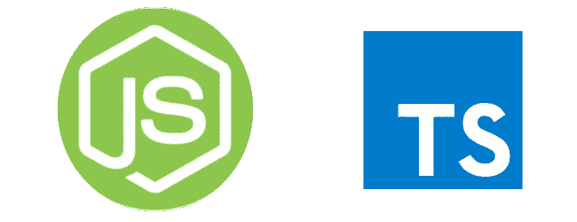

在当前的空间里，区块链正变得风靡一时。我觉得区块链真正的魅力来自于将区块链应用到不同的行业和领域所带来的众多可能性。

Hyperledger Foundation 一直在创建一个平台，其中包括一系列开源工具、库和服务，以帮助构建可扩展的有形区块链解决方案，尤其是在企业领域。

在本教程中，我们将了解区块链框架 Hyperledger Iroha，它自称为:

> …一个简单的区块链平台，您可以使用它来创建可信、安全和快速的应用程序，方法是将基于权限的区块链的力量与崩溃容错共识结合起来——Hyperledger Iroha 文档(【https://iroha.readthedocs.io/en/main/】T4)

我们将使用 Node.js、TypeScript 和一个名为 **iroha-helpers** 的特殊 npm 库构建一个 REST 服务器，以便与 iroha 区块链平台进行交互。

如果您想在阅读本教程之前先看看代码，可以在下面找到这个库:

 [## dominic-pa/iroha-rest-server

### 与 Hyperledger Iroha 区块链平台交互的 REST 服务器。该 REST 服务器使用 TypeScript 构建，用于…

github.com](https://github.com/dominic-pa/iroha-rest-server) 

# **先决条件**

首先，您应该能够在本地机器上安装 Iroha 区块链平台。我用的是 Mac OS X，运行的是 Mojave。

要设置 Iroha，您可以遵循其文档中的快速入门指南:[https://Iroha . readthedocs . io/en/main/getting _ started/index . html](https://iroha.readthedocs.io/en/main/getting_started/index.html)

你应该在你的机器上安装 Docker。您还应该安装 Node.js，以便我们开始编写代码。

如果在阅读入门指南时没有发现任何问题，那么现在应该有两个 docker 容器在运行:一个用于运行 PostgreSQL 数据库，另一个用于运行 Iroha 守护进程服务。

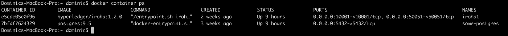

List the running docker containers

# **1。**设置我们的项目

我们将初始化一个新的 TypeScript 项目来编写我们的 Node.js REST 服务器，以便与我们正在运行的 Iroha 区块链网络进行交互。

以下是设置新项目的命令:

`npm init` : 创建新项目

`npm install typescript`:安装打字稿

`npx tsc - -init`:通过创建 tsconfig.json 创建 TypeScript 项目

`npm install express @types/express`:安装 Express framework 的类型脚本定义

# 2.安装依赖项

Hyperledger Iroha 服务正在运行一个守护程序，可以通过 gRPC 协议发送消息与之交互。我们可以构建一个 gRPC 客户端来直接与 Iroha 进行交互，但是 Hyperledger Iroha 背后的团队已经提供了一个客户端库来与它进行交互，该库名为 **iroha-helpers** ，使用多种语言。我们将使用 JavaScript 客户端库来帮助我们与 Iroha 区块链服务进行交互。

在这个例子中，你会看到，我实际上使用的是 importing**iroha-helpers-ts**，它本质上是一个克隆的 **iroha-helpers** 库，但是我添加了一些日志，还稍微编辑了响应(如果事务成功提交，就返回散列)。使用原始库就可以了，或者您可以使用这个编辑过的版本。

`npm install iroha-helpers-ts`

除了这个库之外，我们还将导入一些其他的库，这是使用 iroha-helpers 库所必需的，因为它使用 gRPC 协议来发送/接收请求:

`grpc`

`@improbable-eng/grpc-web-node-http-transport`

# 3.构建我们的知识库

现在，我们将花一些时间来设置我们的存储库的结构。这将有助于我们在开发代码时保持组织性。

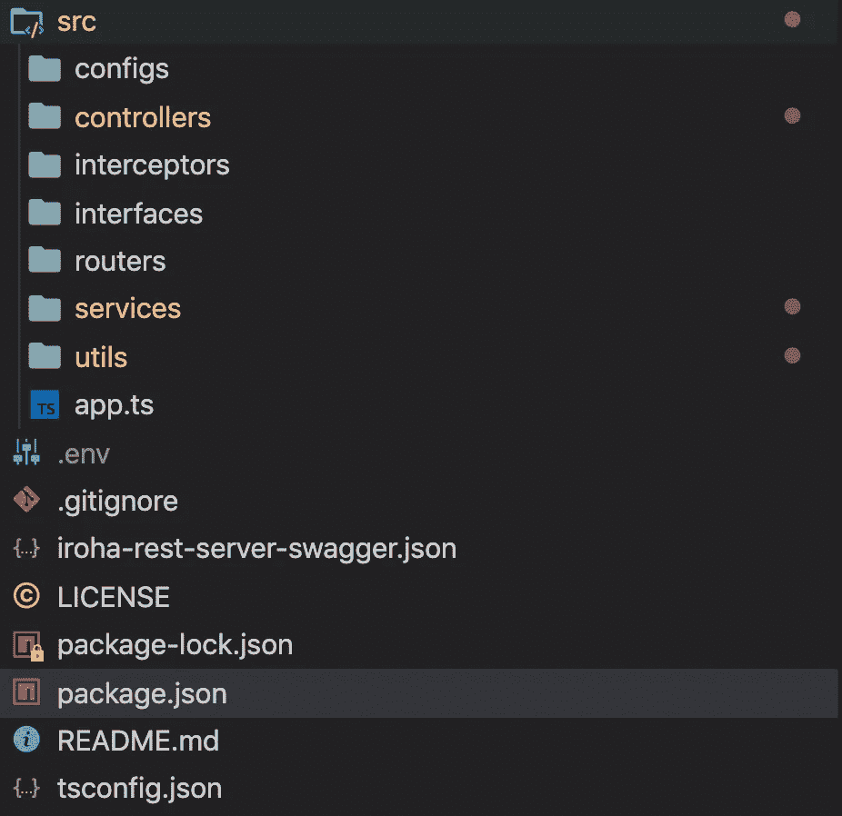

Repository folder structure

**配置—** 与配置 REST 服务器相关的设置，以便连接到 Iroha 区块链服务

**控制器—** 接受特定路线的请求，并调用适当的服务

**拦截器—** 在每个请求之前运行的代码(我们在这里没有开发任何东西，但是拥有它通常是很好的实践)

**接口—** 保存服务中使用的各种数据模型

**路由器—** 定义每个控制器使用的基本路由

**服务—** 保存我们所有的业务逻辑，在本例中，是完成向 Iroha 后端发送请求的逻辑

**实用程序—** 实用程序功能有助于整个服务中的数据处理

既然我们已经有了如何构建我们的存储库的想法，让我们开始定义我们的控制器来接收客户端发送的请求。

# **4。编写我们的控制器**

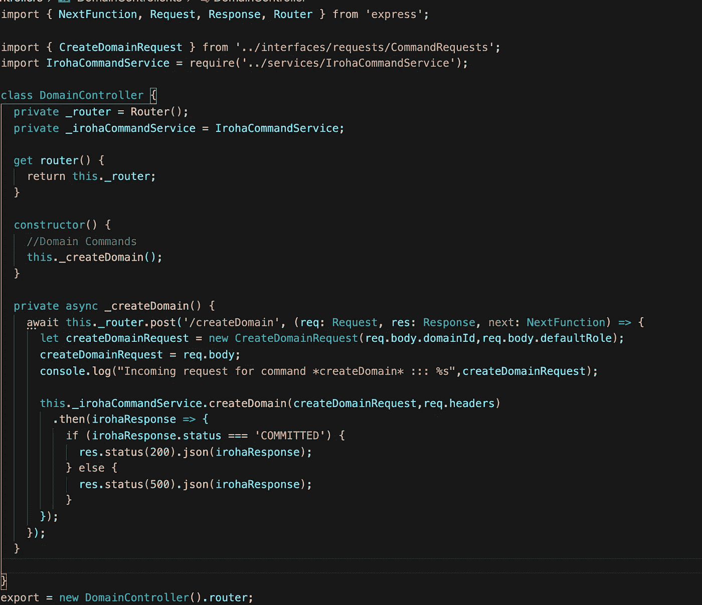

这里，我们正在创建一个新的控制器，名为 **DomainController。**这将负责获取对 **/createDomain** API 调用的请求，并将其路由到 Iroha 命令服务方法 **createDomain** 。

编写控制器文件时，主要关注的是确保我们定义了正确的路由来处理请求，调用适当的服务来进一步服务请求，然后根据服务的响应向客户端返回适当的 HTTP 状态代码。

这里的大部分魔法发生在服务文件中，但是在查看服务之前，让我们先看看我们需要使用的配置。

# **5。编写我们的配置**

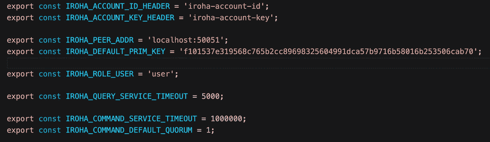

在这个文件中，我们定义了一堆常量。这些常量充当连接到 Iroha 服务的配置:

**IROHA_PEER_ADDR —** 运行 IROHA 服务的地址。

**IROHA_DEFAULT_PRIM_KEY —** 这是 IROHA 在快速入门中设置的默认主键。如果更改，此密钥可以替换任何适当的密钥。

**IROHA_ACCOUNT_ID_HEADER，IROHA_ACCOUNT_KEY_HEADER —** 这些是请求头名称，其值用于签署请求中创建并发送给 IROHA 的事务。

**IROHA_QUERY_SERVICE_TIMEOUT，IROHA _ COMMAND _ SERVICE _ time out—**发送到 IROHA 的查询和命令的超时值。

**IROHA _ COMMAND _ DEFAULT _ QUORUM—**提交给区块链的交易所需的签名数量。

现在，在编写服务逻辑时，我们可以看到这些是如何使用的。

# **6。编写我们的服务**

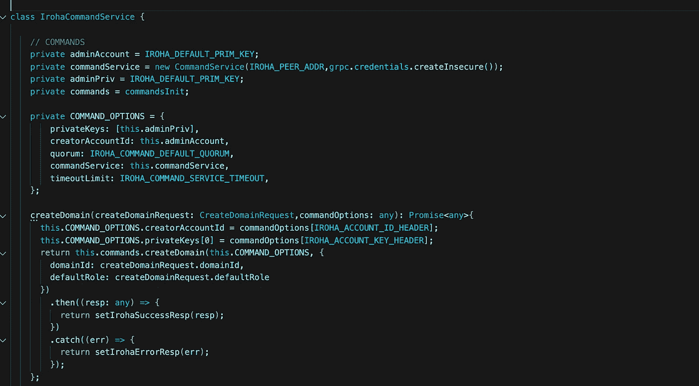

这里，我们使用 iroha-helpers 库来帮助我们与它进行交互。

这很大程度上直接来自库的文档([https://www.npmjs.com/package/iroha-helpers](https://www.npmjs.com/package/iroha-helpers))，但本质上，我们在这里所做的是为将要发送的命令消息(COMMAND_OPTIONS)定义参数，并创建和初始化一个新的命令服务。

接下来，我们可以为这个 IrohaCommandService 创建一个方法，该方法使用适当的命令选项向 Iroha 服务发送创建域请求。

# **7。编写我们的路由器**

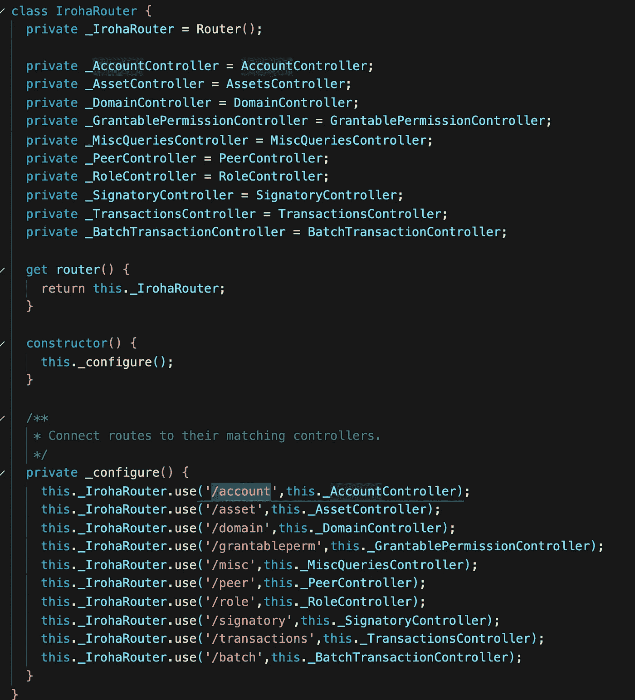

我们使用路由器为所有控制器定义基本路由。然后，我们将路由连接并配置到相应的控制器。

采用我们在 **DomainController、**中定义的路由部分，并采用我们的路由器文件中定义的基本路由，我们的 API 调用创建域的路由当前应该是: **/domain/createDomain** 。要查看完整的路线，并了解服务器最终是如何启动的，我们将查看 **app.ts** 文件。

# 8.启动我们的服务器

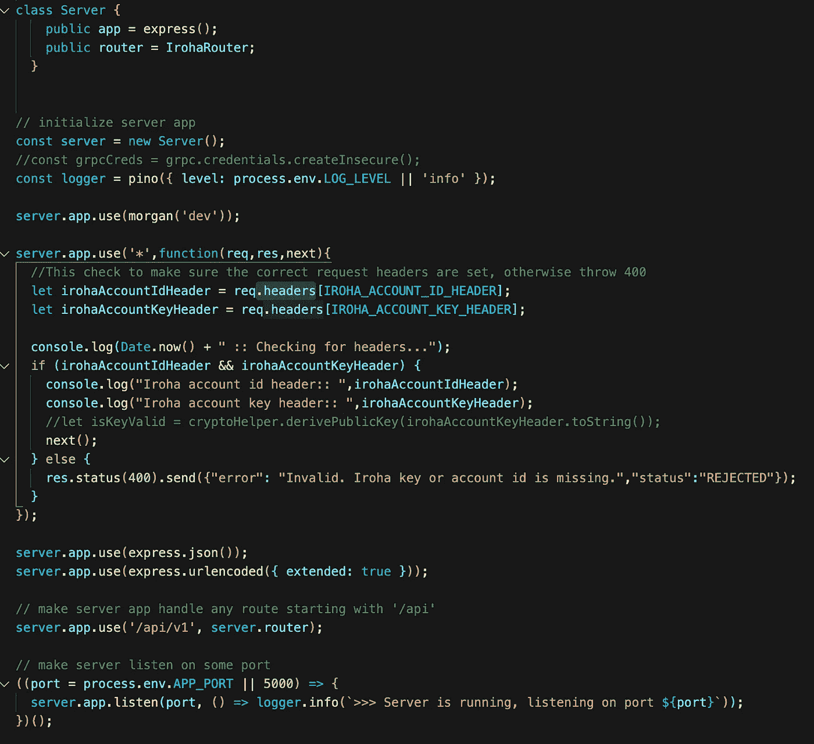

为了让服务器运行，我们将配置我们的基本 express 服务器。

在这个文件中，你会发现我们配置我们的服务器使用**摩根，**，这只是一个 npm 库，有助于彩色编码日志。

我们配置我们的服务器来接收和返回 JSON 内容类型。

我们为这个服务器配置基本路由，从 **/api/v1 开始。**我们还将服务器配置为在端口 5000 上运行(如果未设置环境变量 port ),那么现在，按照 API 调用创建域的路由示例，我们将得到:

[http://localhost:5000/API/v1/domain/create domain](http://localhost:5000/api/v1/domain/createDomain)

要现在运行服务器，我们可以运行命令:

`*npm run dev*`

它是在我们的 package.json 文件中配置的，运行以下命令:

`LOG_LEVEL=debug nodemon src/app.ts | ./node_modules/.bin/pino-pretty”`

我们使用 **pino** 来帮助记录我们的请求，使用 **nodemon** 来让我们的服务器在我们修改代码时自动重启。

如果运行成功，您应该会看到终端打印出以下内容:

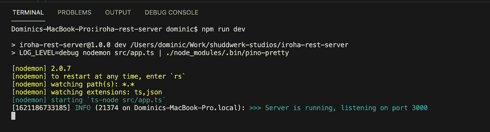

**至此，我们已经完成了 REST 服务器与 Hyperledger Iroha 交互的代码！**

# 9.测试我们的 REST 服务器

现在，我们可以测试我们的 REST 服务器，看看它是否如我们预期的那样工作。

当然，您可以从命令行使用一个基本的 curl 命令，但是使用 **Postman** 测试 API 要容易得多。我创建了一个 swagger 文件，它定义了我们在这里创建的路线。因此，您可以将这个文件导入到 Postman 中，您将获得一个定义服务中可用的所有路由的文件。

为了测试请求，我们设置了适当的头，以便事务可以由正确的事务创建者签名。并在请求中发送适当的主体。请确保这是一个 POST 请求。如果它能够成功连接到 Iroha，您应该得到一个响应，要么说事务被提交到 Iroha 区块链网络，要么说一个错误，为什么事务没有被提交(拒绝，状态验证失败，等等。)

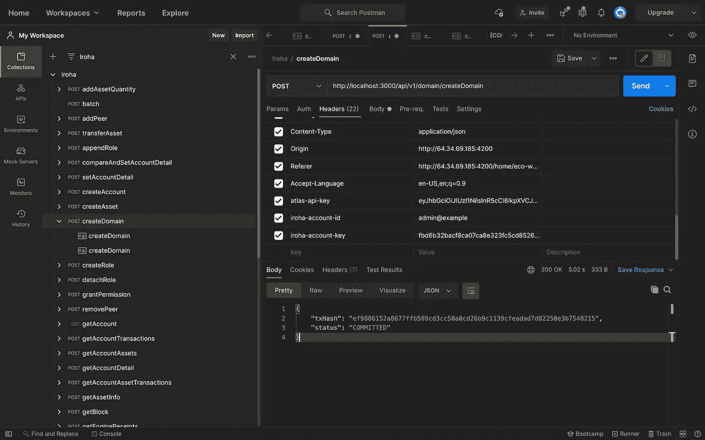

您还可以将相同的 swagger 文档粘贴到 editor.swagger.io 上，以查看所有可用的 API、示例请求和响应等。

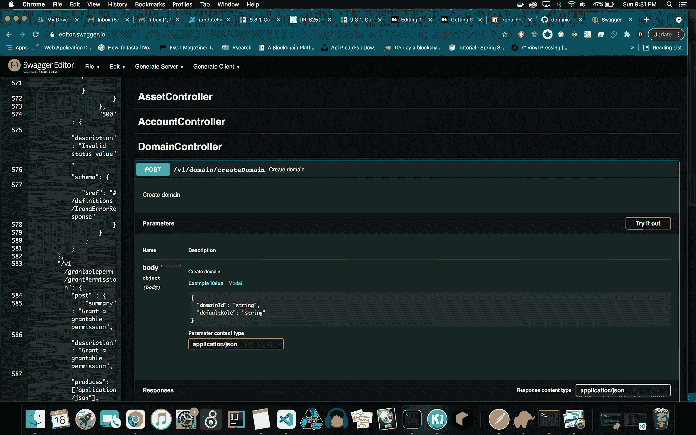

The swagger file on editor.swagger.io

# 结论

我们的教程到此结束。我们能够创建一个整洁的小型 REST 服务器，它接受我们的 HTTP、JSON 请求，并使用 gRPC 消息通过 **iroha-helpers** 库向 Iroha 发送适当的请求。

您可以访问此处的代码以进一步了解、派生项目并对其进行更改，或者如果您已经在使用 Hyperledger Iroha，则按原样使用并试用它。

 [## dominic-pa/iroha-rest-server

### 与 Hyperledger Iroha 区块链平台交互的 REST 服务器。该 REST 服务器使用 TypeScript 构建，用于…

github.com](https://github.com/dominic-pa/iroha-rest-server) 

希望你喜欢这个指南！

*更多内容看*[***plain English . io***](http://plainenglish.io)