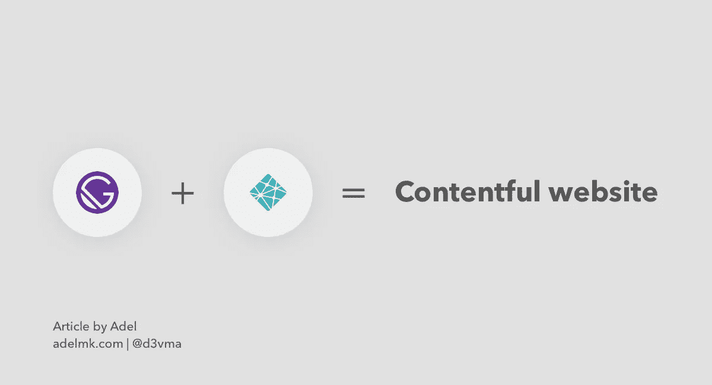
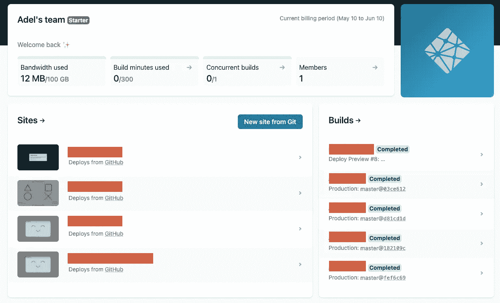
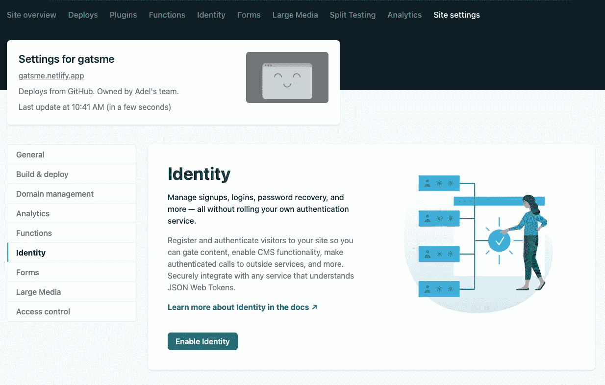
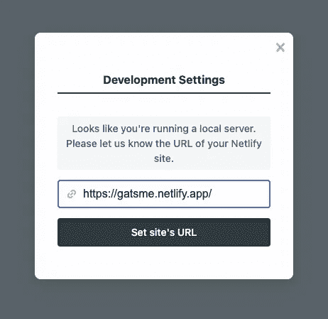
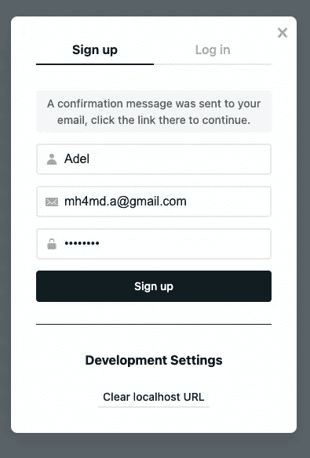
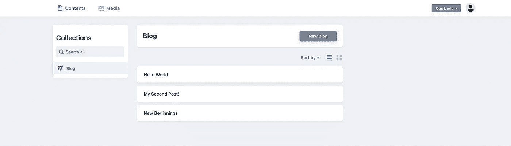
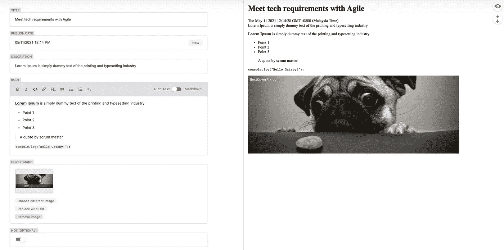
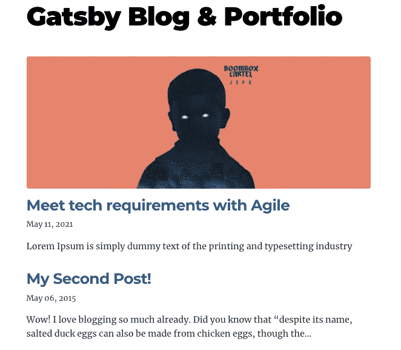

# 用 React 的 Gatsby 和 Netlify CMS 建立一个博客和作品集

> 原文：<https://javascript.plainenglish.io/build-a-blog-portfolio-with-reacts-gatsby-and-netlify-cms-fc1bee6451a5?source=collection_archive---------10----------------------->



有多少次你想创建自己的网站，有一个关于你的博客，最后下载了一个免费的 WordPress 主题，这将使你陷入 PHP？

今天，我将解释如何在 Gatsby 框架下用心爱的 React 创建动态网站，并与一个名为 Netlify CMS 的免费仪表板集成，该仪表板仅使用`.yml`文件进行完全定制。

Gatsby 是一个框架，它使开发人员能够使用基于 React 的框架和创新的数据层来构建快速、安全和强大的网站，这使得将不同的内容、API 和服务集成到一个 web 体验中变得极其简单。

您可以在 GitHub 的 [d3vma/gatsme](https://github.com/d3vma/gatsme) 存储库中找到这个例子的源代码。

# 将 Netlify CMS 与 Github 存储库集成

确保你已经安装了`gatsby-cli`或者使用`npx`(我将在这里做)从 Gatsby 官方克隆启动库。

```
~ npx gatsby new gatsme [https://github.com/gatsbyjs/gatsby-starter-blog](https://github.com/gatsbyjs/gatsby-starter-blog)
~ cd gatsme
```

现在，假设您已经克隆了 starter 项目，并位于正确的路径中，让我们安装一些 Netlify 依赖项:

```
npm install --save netlify-cms-app gatsby-plugin-netlify-cms
```

*PS:如果你正在使用 npm v7，你可能会得到一个错误，现在尝试使用标志* `*--legacy-peer-deps*` *来解决这个问题。*

现在用你最喜欢的编辑器打开这个项目，在你下面看到的目录结构中创建一个`config.yml`文件:

```
├── static
│   ├── admin
│   │   ├── config.yml
```

并将下面这段代码配置暂时粘贴在里面(稍后会更改)。

```
backend:
  name: git-gateway
  branch: master

media_folder: static/img
public_folder: /img

collections:
  - name: 'blog'
    label: 'Blog'
    folder: 'content/blog'
    create: **true**
    slug: 'index'
    media_folder: ''
    public_folder: ''
    path: '{{title}}/index'
    editor:
      preview: **false**
    fields:
      - { label: 'Title', name: 'title', widget: 'string' }
      - { label: 'Publish Date', name: 'date', widget: 'datetime' }
      - { label: 'Description', name: 'description', widget: 'string' }
      - { label: 'Body', name: 'body', widget: 'markdown' }
```

现在转到`gatsby-config.js`，添加我们刚刚安装的 Netlify 依赖项，与文件中的结构相同:

```
.......`gatsby-plugin-netlify-cms`,
```

下一步是将项目链接到 Github 库，我们稍后将把它连接到 Netlify CMS！

将更改推送到新创建的存储库中。

现在，在有了包含上述更改的存储库之后，让我们转到 Netlify 并将其链接在一起，假设您已经有了一个帐户。

1.  登录 Netlify，点击`New site from Git` 并选择您的存储库



2.点击`deploy`按钮，不改变任何构建配置

3.现在转到`Site settings`并启用身份来管理认证过程。
*PS:启用身份后，注册将对任何人开放，请在创建您的第一个管理员帐户后将其更改为* `*invite only*` *。*



Identity section in site settings — Netlify

4.当你还在`Site settings`的时候，一直向下滚动到`Services`并点击`Enable Git Gateway`连接到 Github API，这样你就可以提交来自 CMS 的更改。

现在返回终端，通过运行以下命令启动您的本地项目:

```
~ npm run start
```

留给编译，头去`localhost:8000`看！

现在转到`localhost:8000/admin`并**从我们在 Netlify **中创建的网址设置网站的网址**并注册**你的管理员账户。



Set site’s URL — Netlify CMS



Sign up — Netlify CMS

收到确认邮件后，您现在可以使用本地或 Netlify 实例登录了，tada！



Netlify CMS home page

在设置了我们的 CMS 并成功初始化了我们的项目之后，让我们通过做以下事情来让我们的手有点脏:

1.  **包括**和`**react-bootstrap**`
2.  **添加带有封面/特色图片的帖子**
3.  **设置组合面板并保存到 JSON**

# 包括反应引导

在终端中运行以下命令来添加依赖项:

```
~ npm i --save bootstrap react-bootstrap
```

现在打开`gatsby-browser.js`文件，添加下面一行:

```
// react bootstrap
import "bootstrap/dist/css/bootstrap.min.css";
```

让我们尝试一下，并探索项目的结构！

```
├── src
│   ├── components
│   ├── images
│   ├── pages
│   │   ├── 404.js
│   │   ├── index.js
│   ├── templates
```

其结构类似于任何 React 应用程序，所以让我们跳过这一部分，直接进入`index.js`文件来验证我们的引导程序:

看看上面的代码示例

1.  第 3 行，我已经在当前页面中包含了我需要的组件，不需要包含所有的引导组件，简单一点就好。
2.  第 32 行，在返回函数中，就像正常的 JSX 写你的布局一样，简单明了！
3.  如果你注意到，有两个不同的返回函数，第一个返回一个回退消息，如果没有博客文章(如果你愿意，可以删除)，第二个返回默认布局。

# 添加带有封面/特色图片的博客文章

现在，既然我们已经准备好了项目并包含了 CSS 框架，而且因为官方的默认配置并没有显示如何在你的列表页面中显示特色图片，让我们来看看如何做到这一点！

转到`config.yml`文件，在集合下添加以下代码:

```
collections:
  - name: 'blog'
    label: 'Blog'
    folder: 'content/blog'
    create: **true**
    slug: 'index'
    media_folder: ''
    public_folder: ''
    path: '{{title}}/index'
    editor:
      preview: **false**
    fields:
      - { label: 'Title', name: 'title', widget: 'string' }
      - { label: 'Publish Date', name: 'date', widget: 'datetime' }
      - { label: 'Description', name: 'description', widget: 'string' }
      - { label: 'Body', name: 'body', widget: 'markdown' }
      **- { label: 'Cover Image', name: 'cover_image', widget: 'image', required: false }**
```

如果你注意到，我们已经添加了一个输入**封面图像**属性来显示你可以有不同类型的小部件可以在[这里找到](https://www.netlifycms.org/docs/widgets/)。

转到您的终端，运行以下命令行:

```
~ npm i --save gatsby-image
```



现在让我们从 GraphQL 中获取图像，并将其显示在页面文件中。

打开`index.js`文件，在文件开头导入以下内容:

```
import Img from 'gatsby-image'
```

现在向下滚动到文件的末尾，用以下内容替换`pageQuery`:

```
export const pageQuery = graphql` query {
    site {
      siteMetadata {
        title
      }
    } allMarkdownRemark(sort: { fields: [frontmatter___date], order: DESC }) {
      nodes {
        excerpt
        fields {
          slug
        }
        frontmatter {
          date(formatString: "MMMM DD, YYYY")
          title
          description
          cover_image {
            childImageSharp {
              fluid(maxWidth: 900) {
                ...GatsbyImageSharpFluid
              }
            }
          }
        }
      }
    }
  }
`
```

假设我们有了查询并导入了所需的插件，我们可以简单地将封面/特色图片包含在布局中，如下所示:

```

```

Tada！现在就是这个样子！



# 设置组合面板并保存到 JSON

现在，有了一个方便的博客后，是时候展示一下这个组合的一些技能，添加经验和你在职业生涯中迄今为止所取得的成就了！这些数据将保存在一个 JSON 文件中，让您放心。

现在打开`config.yml`文件，让我们添加一个新的收藏如下:

```
- name: content
  label: Content
  files:
    - label: Resume
      name: resume
      file: "content/resume.json"
      fields:
        - { label: "Full Name", name: fullname, widget: string, required: false }
        - { label: Role, name: role, widget: string, required: false }
        - { label: Summary, name: summary, widget: text, required: false }
        - label: Experience
          name: experience
          widget: list
          required: false
          fields:
            - { label: Role, name: role, widget: string }
            - { label: Company, name: company, widget: string }
            - { label: Description, name: description, widget: markdown }
            - { label: "Start date", name: start, widget: date, format: 'MM/YYYY' }
            - { label: "End date", name: end, widget: date, required: false, format: 'MM/YYYY' }
        - label: Skills
          name: skills
          widget: list
          required: false
          fields:
            - { label: Name, name: name, widget: string }
```

那么我们在这里做了什么？基本上，我们只是创建了一个新的集合，与我们刚刚为博客创建的集合相同，但是这个集合有一个文件列表。目前只有一个文件是恢复的，保存为`/content`里面的`resume.json`

经验技能都是`list widget`类型，各有各的领域。

现在让我们在`src/pages`目录下创建一个名为`portfolio.js`的新页面，并添加以下代码:

在`pages`目录下新建文件时，可以通过`localhost:8000/portfolio`动态访问该 URL。

您现在有了一个 100%在您控制之下的轻量级投资组合，再也不需要担心动态数据了！

**感谢**

> 感谢 [Gatsby](https://www.gatsbyjs.com/) 和 [Netlify CMS](https://www.netlify.com/) 团队打造了如此酷炫创新的产品！
> 
> 感谢您阅读本文——如果您认为有用，请转发。
> 
> 看看我的[网站](https://adelmk.com/)，完全按照这个教程解释的那样建的！

*更多内容请看*[*plain English . io*](http://plainenglish.io/)