# 如何用 Next.js 和 Ghost 搭建博客网站 App

> 原文：<https://javascript.plainenglish.io/build-a-blog-with-nextjs-and-ghost-63011eebfdaa?source=collection_archive---------2----------------------->


Code

继续我们的 Next.js 之旅，我们要构建的下一个应用程序是博客。我们将在博客中使用 Ghost CMS，在前端使用 Next.js。

因此，打开您的终端，使用下面的命令创建一个新的 Next.js 应用程序。

```
npx create-next-app ghost-nextjs
```

现在，按照说明，切换到新创建的文件夹。我也用 VS 代码打开了这个项目。之后，运行`**npm run dev**`启动项目。

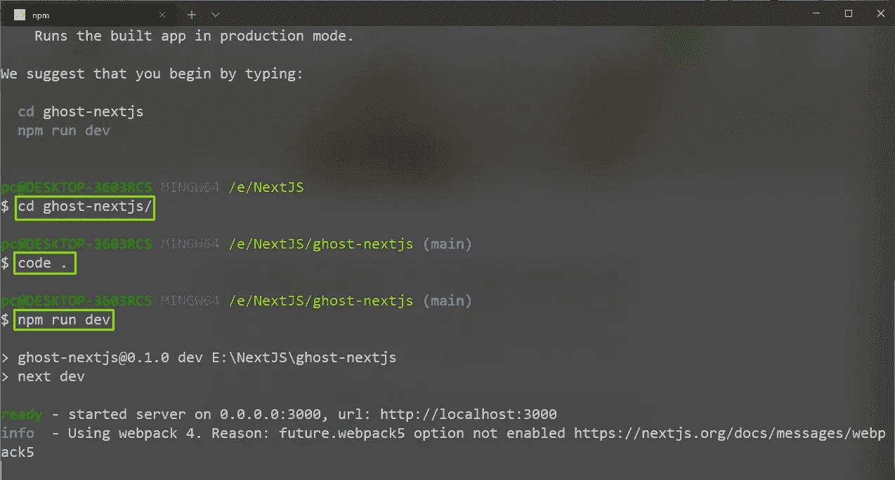

initial

我们将通过安装依赖项将此项目转换为 TypeScript 项目。我们还将 sass 安装到项目中。

```
npm install typescript @types/react @types/node sass
```

接下来，我们将重命名文件，使其具有 TypeScript 和 sass 扩展名。

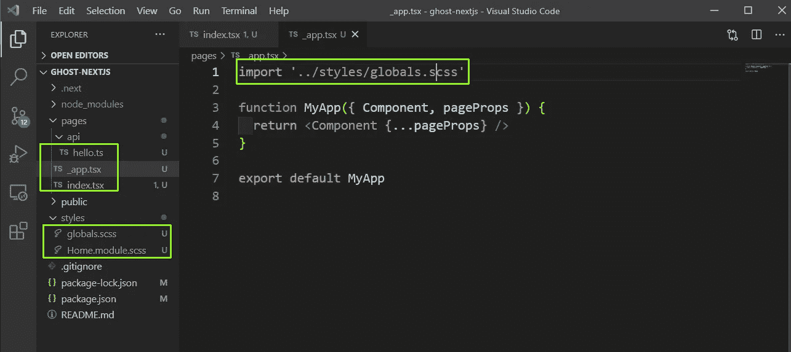

Convert

然后，再次从终端运行`**npm run dev**`。你现在应该没有错误了。

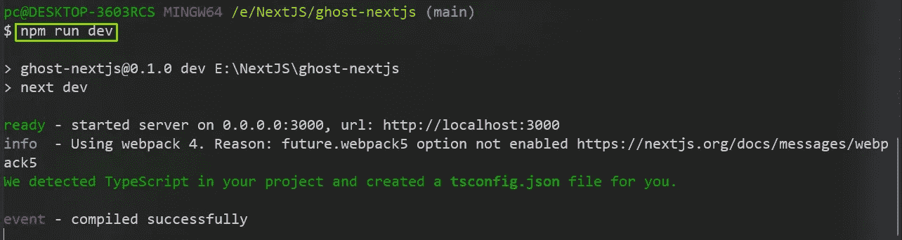

npm run dev

我们将在 Heroku 上安装 Ghost CMS 来使用它。所以，打开[这里的](https://elements.heroku.com/buttons/snathjr/ghost-on-heroku)链接，用你的 Heroku 账号登陆。

点击**部署到 Heroku** 按钮。

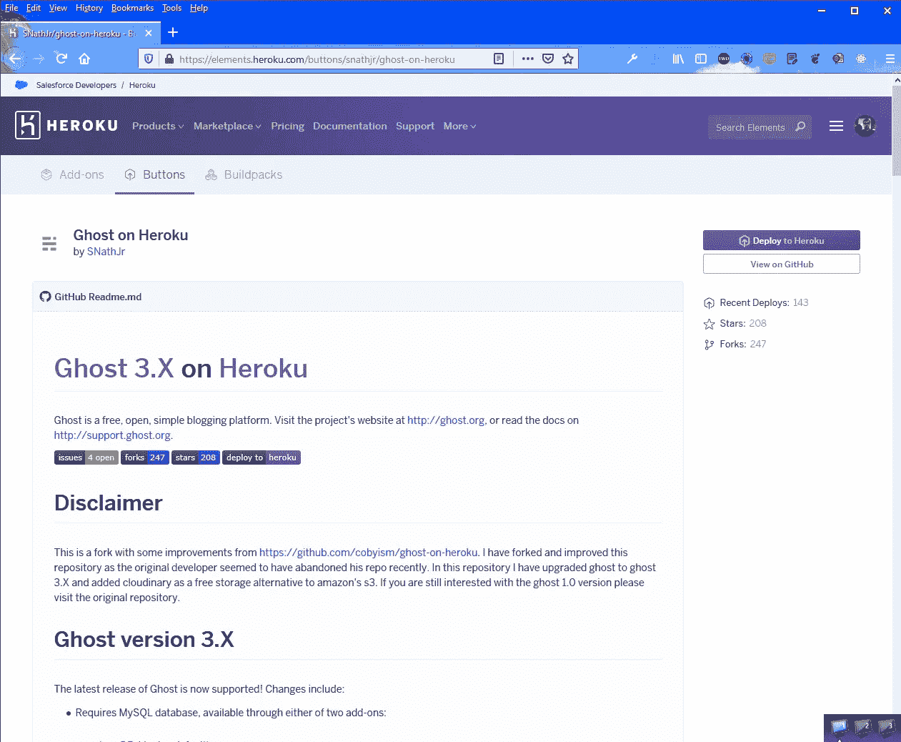

Deploy on heroku

在下一个屏幕中，给应用程序起一个名字，并与 URL 同名。向下滚动并点击**部署应用**按钮。

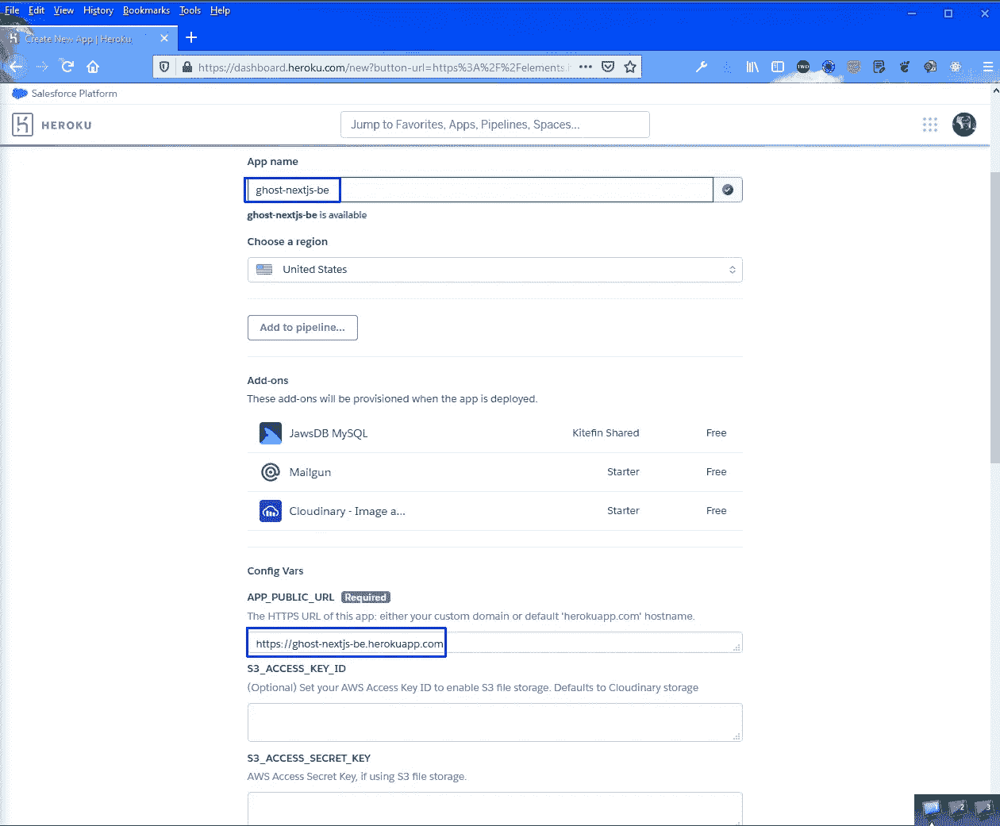

Deployment

一段时间后，应用程序将被部署。因此，点击**查看**按钮。

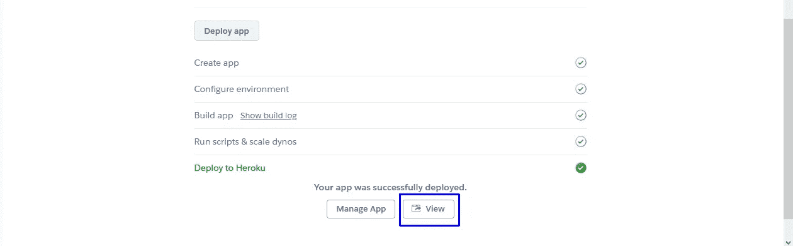

View

由于我没有幽灵账号，所以被带到了这个屏幕。在这里，点击**创建您的账户**按钮。

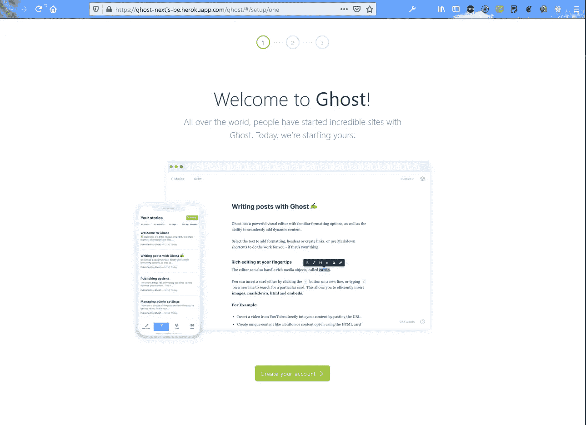

Create Account

接下来，给出您的凭证并点击**最后一步**按钮。

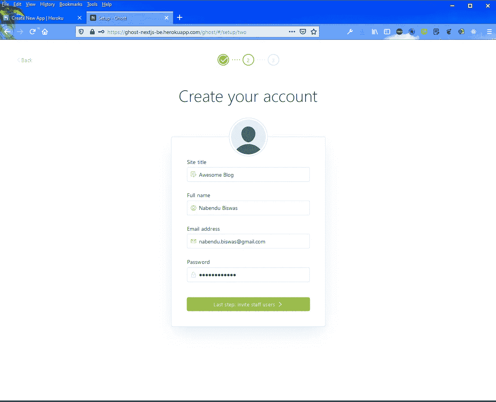

Create Account

现在，我们可以跳过这一步，只需单击小的**我稍后再做，带我去我的网站！**正文。

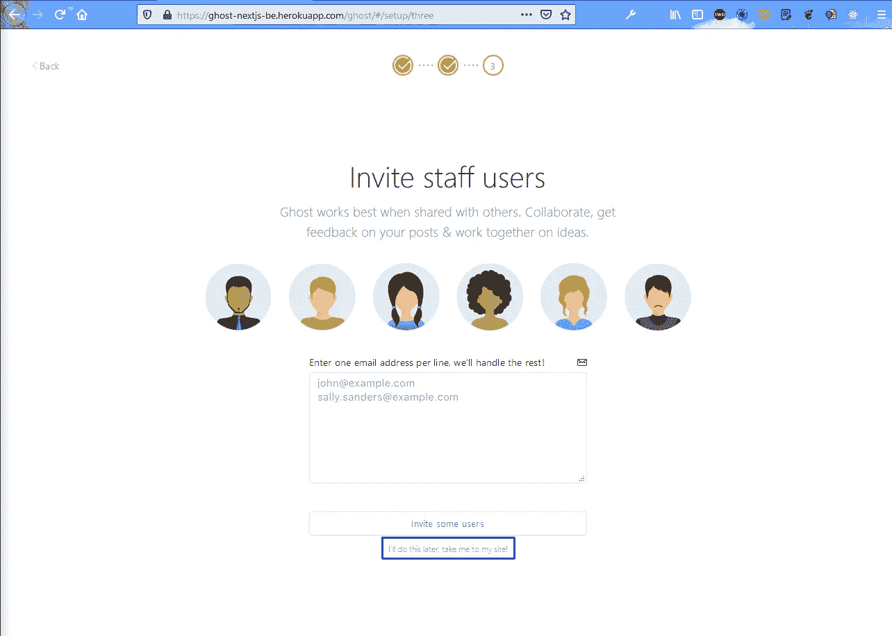

Later

现在，我们将被带到我们自己的 Heroku 托管的幽灵 CMS。

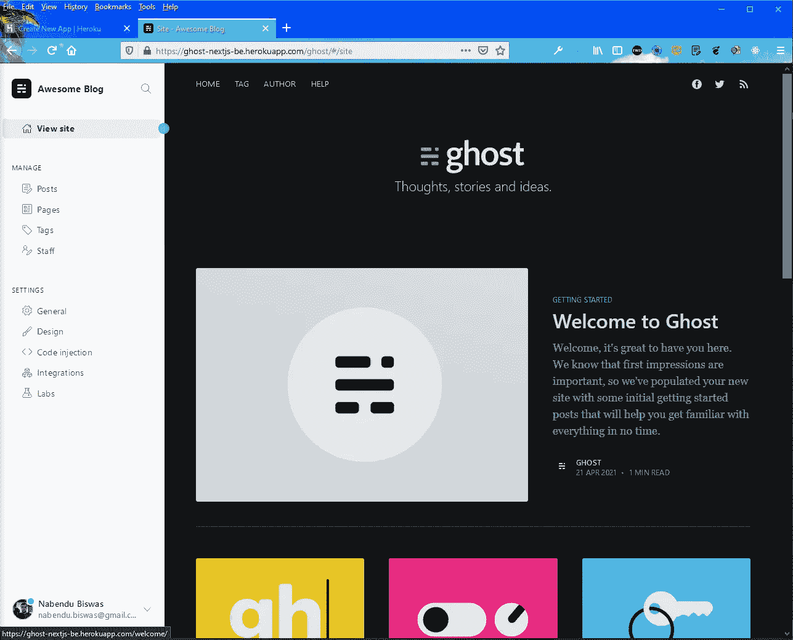

Ghost Site

在这里，点击**集成**选项卡，然后点击**+添加定制集成**文本。这将打开一个弹出窗口，在其中您可以给任何**起名叫**，并点击**创建**按钮。

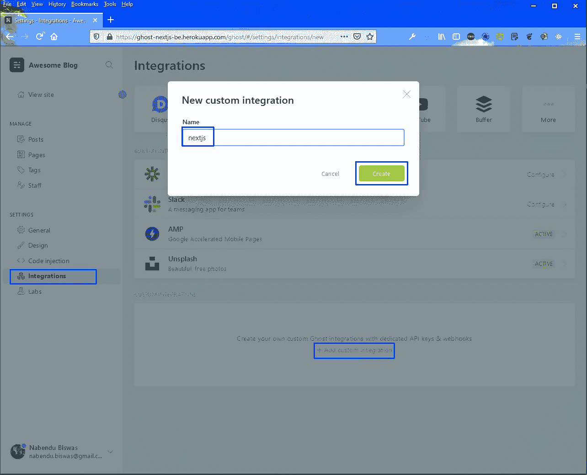

Integration

在下一个屏幕中，我们将获得我们的秘密 API 密钥和 API URL。

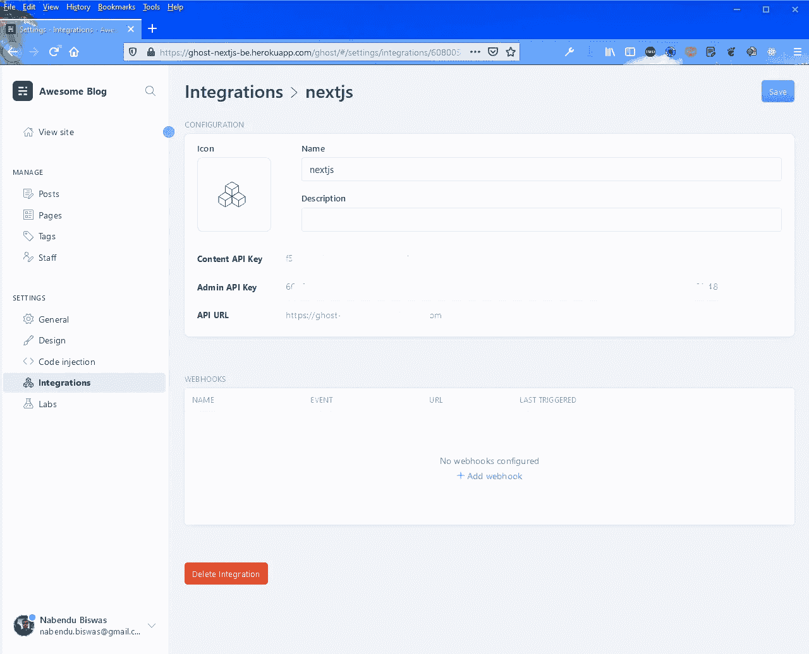

API

最后，单击 General 选项卡并启用单选按钮，使站点成为私有站点。

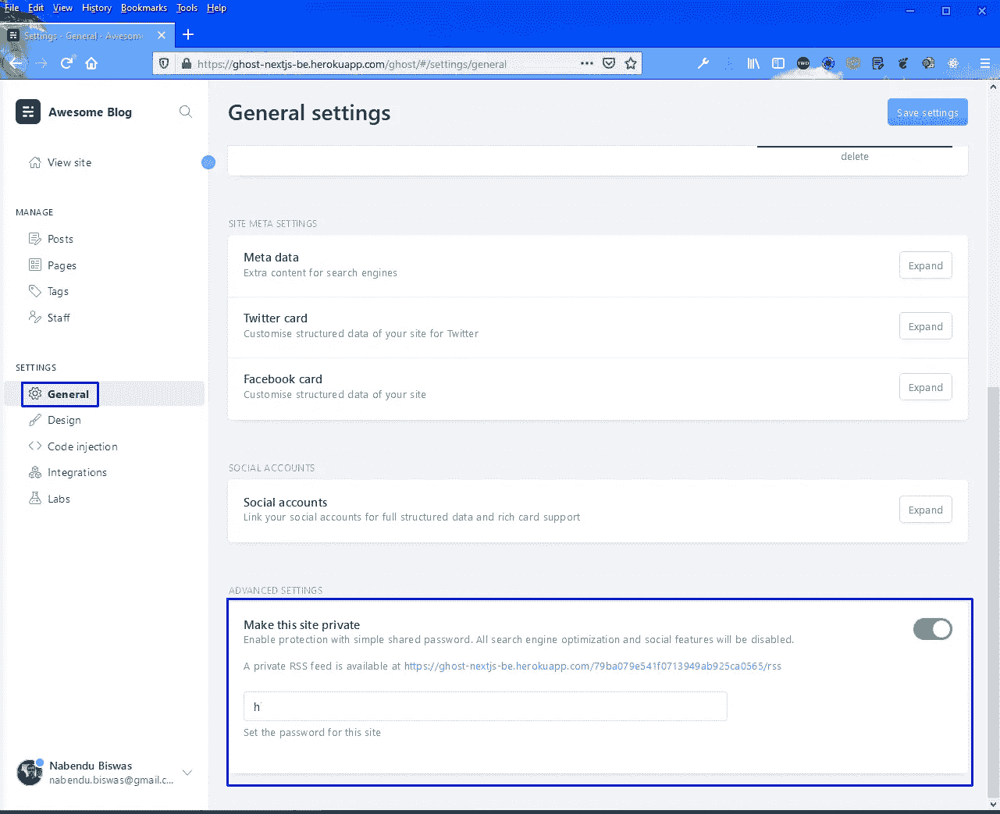

Site Private

此外，点击右上角的**保存设置**。现在，我们将开始我们的 Next.js 设置。

在 **index.tsx** 文件中，放入下面提供的内容。这里，我们使用 getStaticProps()来获取我们所有的帖子。我们必须向端点添加我们的私有 URL 和 API 密钥。

```
import styles from '../styles/Home.module.scss'
import Link from 'next/link'const { BLOG_URL, CONTENT_API_KEY } = process.envtype Post = {
 title: string
 slug: string
  custom_excerpt: string
  feature_image: string
}async function getPosts() {
 const res = await fetch(
  `${BLOG_URL}/ghost/api/v3/content/posts/?key=${CONTENT_API_KEY}&fields=title,slug,custom_excerpt,feature_image`
 ).then((res) => res.json())const posts = res.posts
 return posts
}export const getStaticProps = async () => {
 const posts = await getPosts()
 return {
  revalidate: 10,
  props: { posts }
 }
}const Home: React.FC<{ posts: Post[] }> = (props) => {
  const { posts } = props
  console.log(posts)return (
  <div className={styles.container}>
   <h1>My blog</h1>
  </div>
  )
}export default Home
```

接下来，创建一个**。env** 文件并添加 API 键和您的端点。

```
BLOG_URL=https://yourendpoint.herokuapp.com
CONTENT_API_KEY=fxxxxxxxxxxxxxxxxxxxxxx1
```

另外，添加。env 文件到**。gitignore** 文件，这样我们就不会推送到 Github 了。

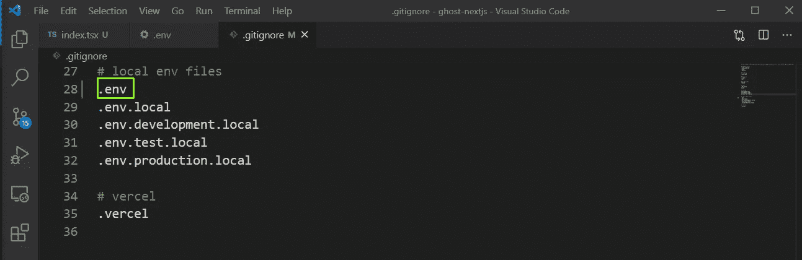

.gitignore

现在，重新启动服务器并在本地主机中打开控制台，我们将看到来自 Ghost 的帖子。

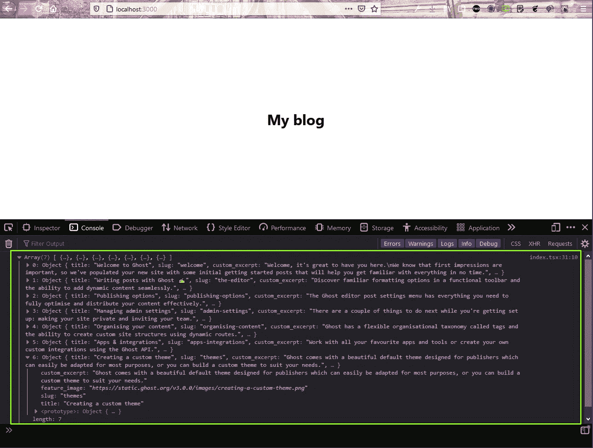

现在，我们正在接收数据，所以是时候显示它了。因此，我们添加了同样的 HTML，带有样式类。我们还在帖子周围添加了一个链接标签。

现在，它带着鼻涕虫去链接。

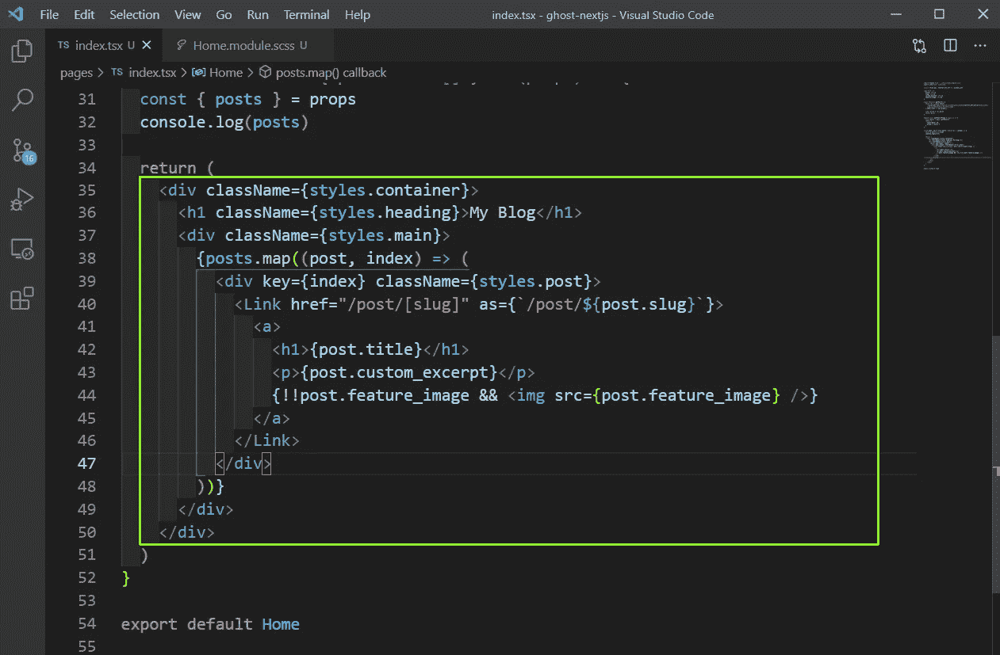

index.tsx

现在，我们将在**样式**文件夹的 **Home.modules.scss** 中为我们的主页创建样式。

```
.container {
  display: flex;
  height: 100vh;
  flex-direction: column;
}.heading{
  align-self: center;
  font-family: "Arial Black", sans-serif;
  font-size: 4.5em;
  letter-spacing: -1px;
  background-color: black;
  color: white;
  padding: 10px 10px;
}.main {
  display: flex;
  margin-top: 50px;
  align-items: center;
  flex-direction: column;
}.post {
  width: 800px;
  margin-bottom: 25px;
  padding-bottom: 25px;
  border-bottom: 1px solid black;
}.post img {
  width: 100%;
}.post h1 {
  font-size: 32px;
  cursor: pointer;
  text-align: center;
}
```

现在，我们的主页如下图所示。

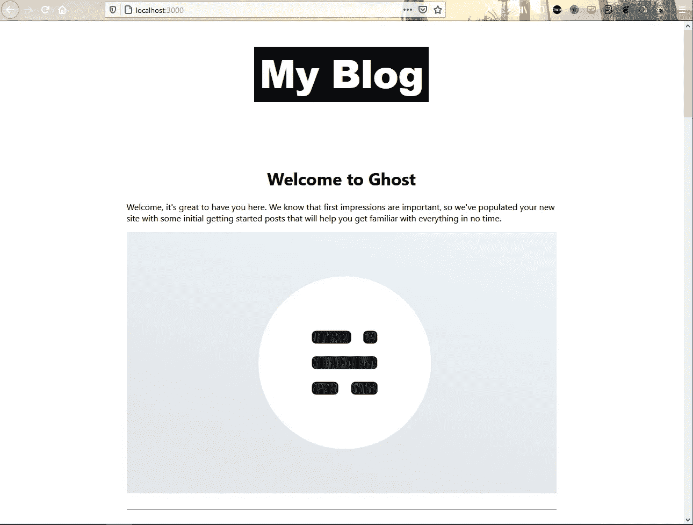

Home Page

接下来，在**页面**内创建一个文件夹 **post** 和一个文件**【slug】。里面的 tsx** 。把下面提供的内容放进去。

在这里，我们使用与在 **index.tsx** 中相同类型的端点，但是得到了 title、slug 和 HTML。我们也返回一个帖子。

我们正在使用 **getStaticProps** 和 **getStaticPaths** ，它们用于我们的博客站点作为静态工作。因此，只有一个 API 调用，所有数据都将在客户机上接收。

我们还需要使用 useRouter，因为在第一次获取 post 时，我们将显示 Loading。没有这一点，我们的应用程序将崩溃。

```
import Link from 'next/link'
import { useRouter } from 'next/router'
import styles from '../../styles/Post.module.scss'const { BLOG_URL, CONTENT_API_KEY } = process.envasync function getPost(slug: string) {
 const res = await fetch(
  `${BLOG_URL}/ghost/api/v3/content/posts/slug/${slug}?key=${CONTENT_API_KEY}&fields=title,slug,html`
 ).then((res) => res.json())const posts = res.postsreturn posts[0]
}export const getStaticProps = async ({ params }) => {
 const post = await getPost(params.slug)
 return {
  props: { post },
  revalidate: 10
 }
}export const getStaticPaths = () => {
 return {
  paths: [],
  fallback: true
 }
}type Post = {
 title: string
 html: string
 slug: string
}const Post: React.FC<{ post: Post }> = (props) => {
 console.log(props)
 const { post } = props
 const router = useRouter()if (router.isFallback) {
  return <h1>Loading...</h1>
 }return (
  <div className={styles.container}>
   <p className={styles.goback}>
    <Link href="/">
     <a>Go back</a>
    </Link>
   </p>
   <h1>{post.title}</h1>
   <div dangerouslySetInnerHTML={{ __html: post.html }}></div>
  </div>
 )
}export default Post
```

现在，我们将在**样式**文件夹中的 **Post.module.scss** 中创建相同的样式。

```
.container{
    margin: 0 20px;
    .goback a{
        width: 60px;
        height: 20px;
        background-color: aqua;
        padding: 10px 8px;
        border-radius: 5px;
        font-weight: bold;
    }
    img {
        height: auto;
        width: 100%;
    }
}
```

现在，我们的帖子看起来也很完美，还有一个**返回**按钮。

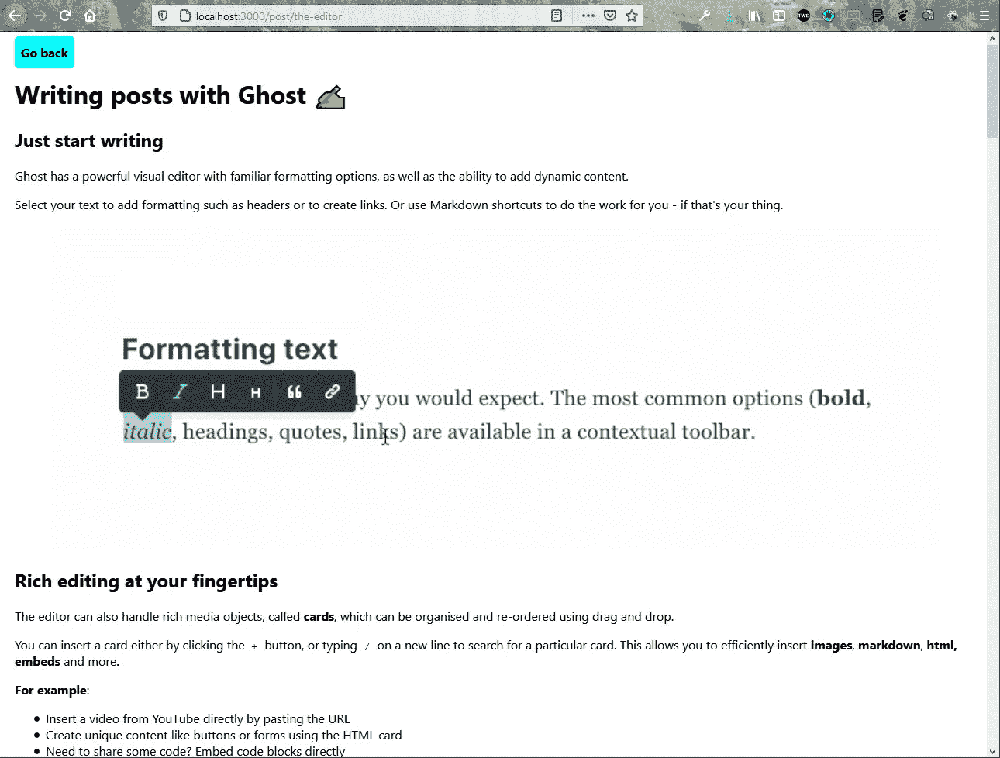

Post

值得一提的是，我们从 Ghost 后端获取所有这些帖子，我们可以用它来编辑、删除、更新以及添加新帖子。

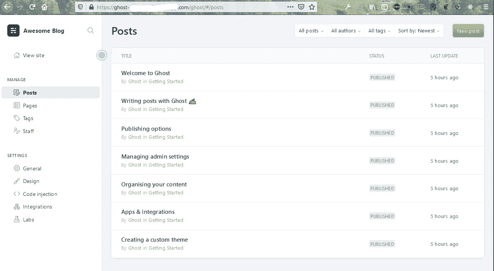

Posts

我已经将代码上传到 Github，可以在这里找到。

我们也将在 Vercel 中部署相同的组件，为此，请遵循我之前的博文[中的说明。](https://nabendu82.medium.com/build-a-news-app-with-next-js-182e6287aee5)

另外，不要忘记在部署前的最后一步添加 BLOG_URL 和 CONTENT_API_KEY。

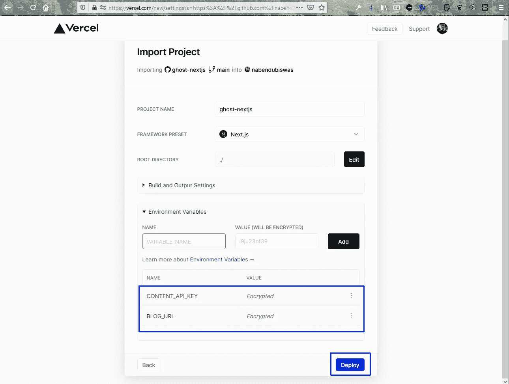

Last step

我们的站点得到了适当的部署，并且运行良好。

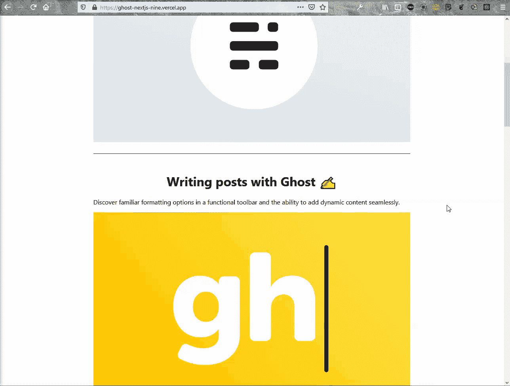

Working great

你也可以在 YouTube 我的频道上看这篇文章。

*更多内容请看*[*plain English . io*](http://plainenglish.io/)