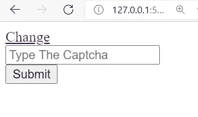

# 使用 JavaScript 构建一个验证码生成器

> 原文：<https://javascript.plainenglish.io/build-a-captcha-generator-using-javascript-b2508063ebe?source=collection_archive---------1----------------------->

你还记得，几年前，在一些网站使用验证码的验证方法。验证码是一种挑战回答测试，用于检查用户是人还是机器人。在本文中，我想使用 JavaScript 构建一个简单的验证码验证方法。

正如我们所知，验证码是在网站上工作的，所以对 DOM 的一点理解对阅读这篇文章真的很有帮助。让我们开始吧。

# 样板文件

在这里，我们需要初始化由 index.html、style.css 和 app.js 组成的程序。是的，你可以根据需要重命名它。

## index.html

上面的代码，是 index.html 的主程序，程序的输出是这样的

现在让我们跳过 style.css 和 app.js，进入下一步。

# 主算法

这里我想构建主程序。验证码是由一些字符串和价值是随机的。所以，我们需要建立一个函数，可以产生一些随机的字符串。

## app.js

从上面的代码中，我们可以知道我初始化了名为`captcha`的新数组。之后，我构建了一个名为`createCaptcha`的函数。该函数将产生一些随机值，并将保存到验证码作为一个数组。最后，我将验证码组合成`theCaptcha`。所以`theCaptcha`会变成随机字符串。

同样，通过使用 DOM，我使用了来自 index.html 的元素`captcha` 。然后用在最后一行。为了让函数工作，我在 index.html 的第 12 行添加了脚本。该脚本用于从 app.js 调用`createCaptcha`函数。我还在第 14 行添加了`onclick` 来调用`createCaptcha`函数。像这样。

所以现在的输出会是这样的。

是的，我们可以生成随机字符串，对吗？我们也可以通过点击`Change` 文本来更改该值。但这还没有完成，我们需要验证输出，所以当我们在输入区输入错误的值并按提交时，我们会知道，我们是否输入了正确的验证码。所以我们需要制造新的功能，我把它命名为`ValidateCaptcha()`。下面是函数。

在上面的代码中，我使用了两个来自 index.html 的元素，它们的 id 分别是`errCaptcha`和`reCaptcha`。`reCaptcha` 为输入区，`errCaptcha` 用于用户按下提交按钮后显示消息。检查输入是否与验证码相同。所以为了让程序工作，我们必须在第 24 行的`Submit`按钮中添加函数。像这样

直到现在，程序都会这样。如果我们输入了错误的验证码，它会提示验证码是错误的，如果输入是正确的，验证码就完成了。

# 设计程序

我们可以说，我们的程序已经完成了。但我们需要给一些造型，对不对？这样，程序会更漂亮。所以，我把 style.css 写成这样。

## style.css

程序会是这样的，你可以随意编辑。

我希望你喜欢这篇文章。

快乐编码😎