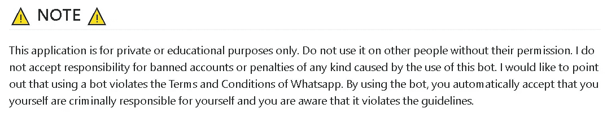
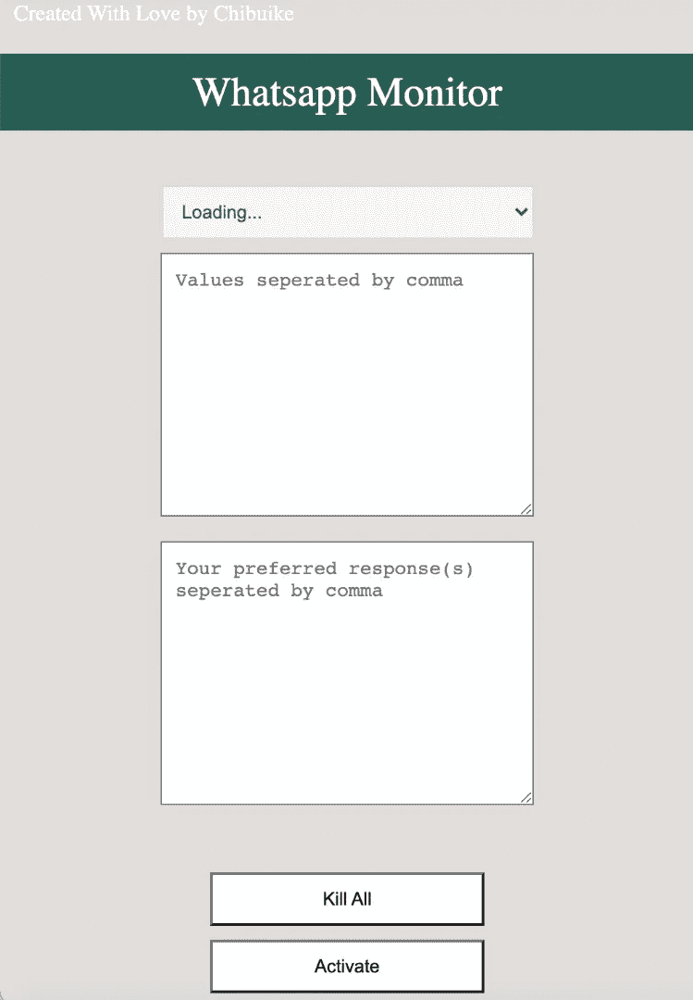

# 使用 JavaScript 在 WhatsApp 上构建一个 Chrome 扩展来监控消息和回复

> 原文：<https://javascript.plainenglish.io/build-a-chrome-extension-to-monitor-messages-and-reply-on-whatsapp-using-javascript-98675f44dea4?source=collection_archive---------1----------------------->

我将展示如何使用 JavaScript 构建一个 Chrome 扩展来跟踪 WhatsApp 聊天上的消息，并使用我提供的响应回复它们。听起来不真实？嗯，你不是一个人，我自己也是这么想的，直到我建造了它。我们开始吧！


Photo by [Jefferson Santos](https://unsplash.com/@jefflssantos?utm_source=medium&utm_medium=referral) on [Unsplash](https://unsplash.com?utm_source=medium&utm_medium=referral)

如果您只对最终产品感兴趣，而没有时间通读本文，您可以简单地向下滚动到 ***总结*** 部分，在那里我共享对源代码的访问。它有让你手动安装的步骤。



# 先决条件

为了有效地阅读本文，您需要 HTML、CSS 和 JavaScript 的基础知识。

# **文件结构**

```
whatsapp-group-bot/
├── src
│   ├── css
│   │   └── index.css
│   ├── js
│   │   ├── background.js
│   │   ├── inject.js
│   │   └── index.js
│   └── img
|       └── icon.png
├── index.html
└── manifest.json
```

# 构建界面

作为一个关心设计的人(lol)，我不想只是推出一个低标准的设计。从上面的文件结构中可以看出，我们将创建两个文件:`index.html`、`index.css`。为了节省时间，我将不解释这些文件的内容，因为这超出了本文的范围。

> index.html

```
<!doctype html><html><head><title>Whatsapp Monitor</title><link rel="stylesheet" href="src/css/index.css"></head><body><span id="author">Created With Love by  <a href="https://chibuikenwa.com">Chibuike </a></span><div class="container"><h1>Whatsapp Monitor</h1><section><select placeholder="Group name" id="group_name" required disabled><option value="">Loading...</option></select><textarea placeholder="Values seperated by comma" id="values" required></textarea><br/><textarea placeholder="Your preferred response(s) seperated by comma" id="response" required></textarea></section><section> <div id="validation"></div> </section><section><button id="kill">Kill All</button>  <button id="status">Activate</button></section></div><script type="text/javascript" src="src/js/index.js"></script></body></html>
```

> index.css

由于其庞大的规模，我只会提供一个链接。

```
Link For CSS code: [https://github.com/chyke007/whatsapp-spam-chrome-extension/blob/master/assets/css/popup.css](https://github.com/chyke007/whatsapp-group-bot/blob/master/src/css/index.css)
```

现在我们的扩展应该是这样的:



# 构建功能

有趣的部分开始了！

## *添加我们的 manifest.json 文件*

要将我们项目的内容注册为 chrome 扩展，我们需要一个`manifest.json`文件。

为了更好地理解清单文件的工作原理和它的全部用途，请访问他们的官方文档。

```
{"name": "WhatsApp Monitor","version": "1.0","manifest_version": 2,"author": "Nwachukwu Chibuike","description": "Monitors chat messages for specific keywords and returns desired response.","icons":{"128":"/src/img/icon.png"},"background": {"scripts": ["src/js/background.js"],"persistent": false},"browser_action": {"default_title": "WhatsApp  Monitor","default_popup": "index.html"},"permissions": ["activeTab","storage"]}
```

为了使本文尽可能简洁，我将不解释清单文件中使用的一些概念。

查看这些有助于理解的指南

> 背景剧本:[https://developer.chrome.com/extensions/background_pages](https://developer.chrome.com/extensions/background_pages)
> 
> 权限:[https://developer.chrome.com/extensions/declare_permissions](https://developer.chrome.com/extensions/declare_permissions)
> 
> 浏览器动作:[https://developer.chrome.com/extensions/browserAction](https://developer.chrome.com/extensions/browserAction)

## *定制您的背景脚本*

接下来，我们打开`background.js`并添加一个事件`[onMessage](https://developer.chrome.com/extensions/runtime#event-onMessage)`。这使得扩展能够接收稍后调用`sendMessage`方法时创建的消息。

还要注意我们使用了内容脚本([https://developer.chrome.com/extensions/content_scripts](https://developer.chrome.com/extensions/content_scripts))。这将允许我们注入额外的脚本，将在给定的网页环境中运行。在我们的例子中， ***WhatsApp Web*** ，进行修改并将信息传递回我们的父扩展。

此外，我们还做了一个额外的检查，只允许在调用 ***isActivated*** 时执行 inject.js 脚本。

```
chrome.runtime.onMessage.addListener((message, sender)=> {if(!message.isActivated) return;else{chrome.tabs.executeScript({file: 'src/js/inject.js'}); }
});
```

## 自定义 index.js 脚本

这是将与我们的扩展视图页面接口的代码。这里编写的任何代码都可以在我们的 index.html 页面的上下文中运行。

我们必须将我们的逻辑写在这个文件中，并将其包含在 index.html 中。这是因为内容安全策略不允许执行内联 js 脚本。

我知道这个文件看起来很大，但是通过一些解释你会发现它并不复杂。为了使解释更容易，我将一节一节地解释。

**第一段**跨越 1-6 线。我们首先清理我们的存储，以便在开始扩展时有一个干净的石板。在第 2–5 行，我们存储了一个对 index.html 中 HTML 元素的引用，以便在本文件的后面使用。第 6 行，介绍了我们的实用函数，它帮助我们模拟异步请求。

**第二段**跨越 8-27 线。因为我们不能从这个文件访问 WhatsApp web 上下文，而只能使用 inject.js 文件，所以我们需要一种方法来使用 inject.js 获取 WhatsApp web 上的所有内容，并以某种方式将其传递到这个文件。我们首先(第 8–10 行)发送一条消息并充当触发器，我们在 inject.js 文件中有一个监听器监听这条消息，获取聊天列表，并使用 [chrome 存储器](https://developer.chrome.com/apps/storage)存储它。第 12–27 行，然后从存储中获取该值，并填充 index.html 中的选择选项。

**第三段**跨越 30-49 线。这些是帮助器函数，我们在后面的代码中使用它们来更新 ***按钮*** 的值和 ***文本区域*** 的值。

**第四段**跨越 85 线至 89 线。这部分代码在我们单击激活按钮时运行。它执行一些验证，然后使用 chrome 存储 API 存储值并调用`runtime.sendMessage`方法，这样 inject.js 文件就可以运行了。

**最后一段**跨越 51-83 线。这部分代码用来杀死当前运行的所有追踪器。它通过终止扩展中当前运行的时间间隔来实现这一点。

这个文件到此为止。接下来，我们研究 inject.js 文件。

## 定制 inject.js 脚本

这里写的任何代码都可以与 WhatsApp web 接口。

这个文件由函数组成。首先我们运行`startTimer`和`chat`函数，它们分别运行注入函数和聊天函数。

chat 函数处理从 WhatsApp web 获取的所有聊天内容，并将其传递回我们前面看到的 index.js 文件。

当我们从扩展视图(index.js 文件)中点击 ***激活*** 按钮和 ***杀死所有*** 按钮时，调用注入函数。

如果 ***Kill All*** 按钮触发了此功能，它将简单地终止所有间歇运行并终止于第 48 行，从而停止所有当前运行的跟踪器。

如果 ***激活*** 按钮触发了这个功能，它进入所选的聊天(第 56 行)，从 chrome 存储器中获取所需的值和响应，然后每隔 200 毫秒运行一次`monitorChats`功能。此功能会观察当前消息在所选聊天中的拖放情况，以查看是否有新消息。一旦它发现添加了一个新的值，它就根据我们的表单中提供的值(我们在表单中输入了要注意的值)来查找消息的值(第 86 行)。

一旦找到匹配，它就遍历所有我们想要的响应(第 92 行),这些响应已经通过拆分从字符串转换为数组。第 93–97 行模拟在聊天框中输入每个响应，模拟单击发送按钮(使用鼠标事件，通过调用 eventFire 函数)，然后发送实际的响应。

就是这样，我们成功地建立了一个 WhatsApp 跟踪器，它不仅可以监控聊天，还可以与我们提供的关键词进行比较，并根据我们想要的响应进行无缝响应。太好了！

# **收尾**

我进一步给这个项目添加了更多的功能，这个完整的项目有更多的功能，比如多重追踪，单个追踪者毁灭者，以及查看所有追踪者，可以在这里找到。它还提供了手动安装的步骤。

特别感谢[阿卡什·帕瓦拉](https://akashpawara.medium.com)给了他这篇[文章](https://medium.com/swlh/how-to-build-a-chrome-extension-to-spam-on-whatsapp-using-vanilla-javascript-1c00faa6a2f7)的灵感。

玩得开心点！

*更多内容看*[***plain English . io***](http://plainenglish.io/)