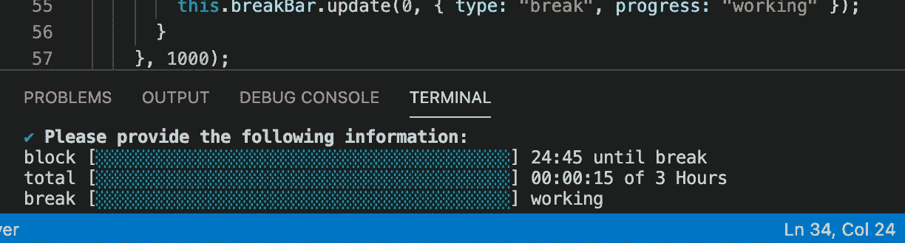
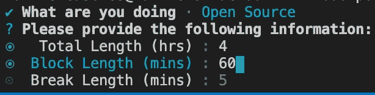
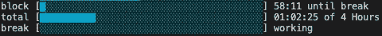
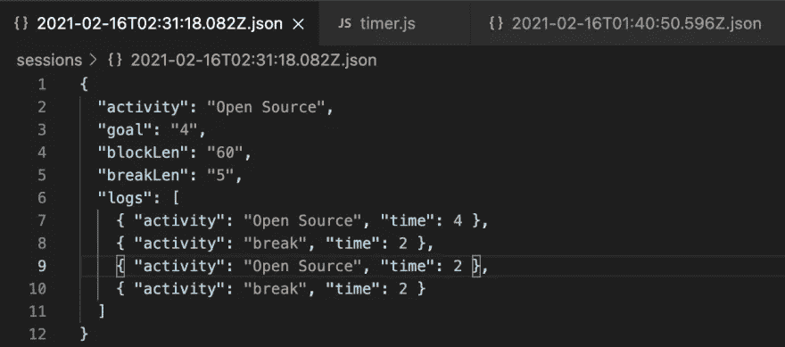
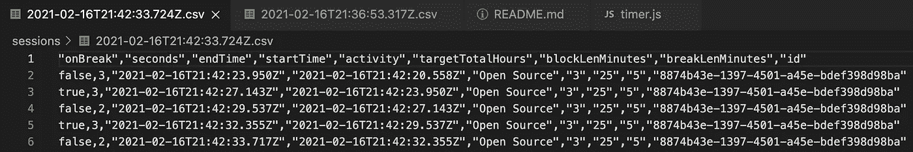
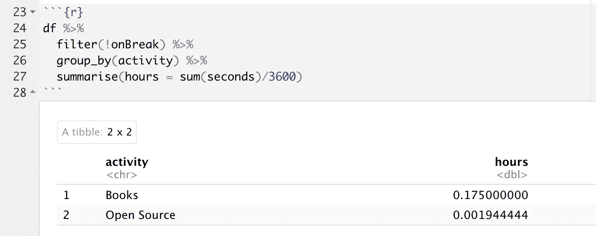

# 在 Node.js 中构建一个命令行 Pomodoro 计时器

> 原文：<https://javascript.plainenglish.io/build-a-command-line-pomodoro-timer-in-node-js-65ed2f6d3308?source=collection_archive---------5----------------------->

## 如何走出低迷

The start of some work

当我开始学习像 Pomodoro 这样的任务执行系统时，我认为自己组装一个 CLI 将是在工作中创造一种主人翁感和自豪感的好方法。此外，它还能让我发布我需要的功能。

# 要求

*   跟踪完成给定工作小时数的进度
*   设定连续工作区块和休息时间的目标
*   看起来不错，所以生产力横幅可以使用它
*   发出日志以供将来分析

# 设计

## 类别与功能

最初我只是做了一个倒计时器，并以此为基础。我通常不写类，但是拥有一个可变的内部状态是思考这个问题的一种非常简单的方式。

## 从小处着手，逐步积累

我对 node.js 不是很有经验，所以我首先展示了一个简单的倒计时来让自己熟悉一下。总体思路是使用`setInterval`在时钟上设置每秒 1000 毫秒的延迟。最初我使用的是`process.stdout.write`,但是当我发现一个显示进度条的库时，我意识到进度条是显示你学习目标信息的一个很好的方式。

# 使用 npm 库

我使用[询问器](https://www.npmjs.com/package/enquirer)来获取用户输入。
这是它的样子-

显示的只是来自 [CLI-progress](https://www.npmjs.com/package/cli-progress) 库的多进度条。这比自己编写控制台要好得多。这是我现在所在的街区-

# 写入文件

代码写入项目的`sessions`文件夹中的一个文件。文件名是会话的结束时间。里面的东西看起来像这样-

这样，我可以在以后进行分析，以跟踪我为开源做出贡献的时间。

## JSON 与 CSV

更新:它现在写入 CSV(整理数据)。

这样我可以更容易地用 R/Python/Julia 进行分析。

# 感谢阅读！

如果你尝试一下，请务必阅读自述文件。[https://github.com/Open-EdTech/node-pomodoro](https://github.com/Open-EdTech/node-pomodoro)