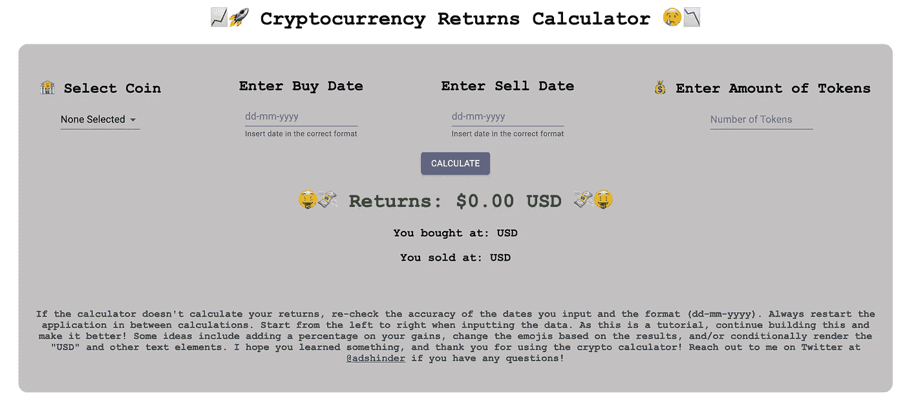
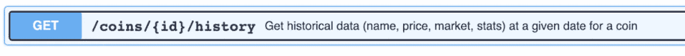
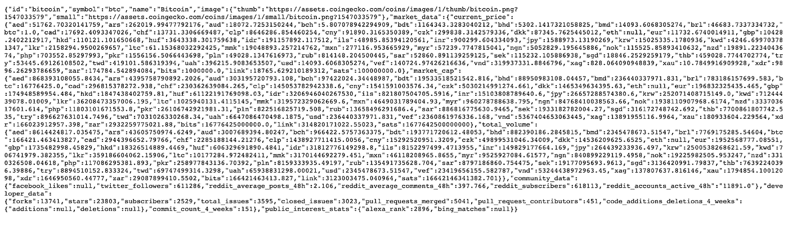
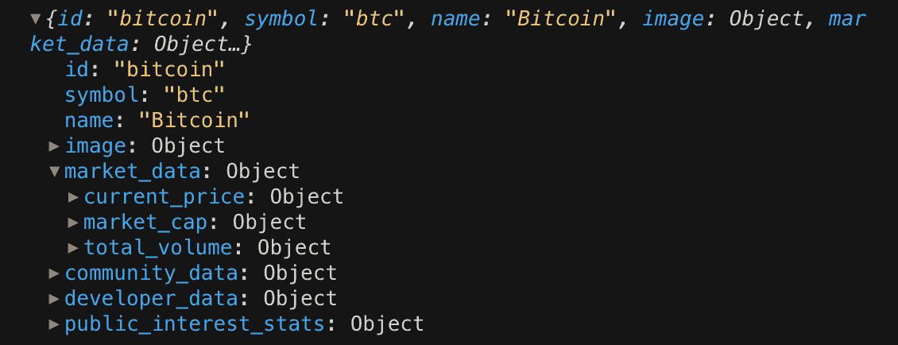
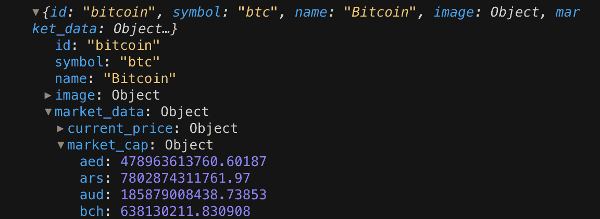
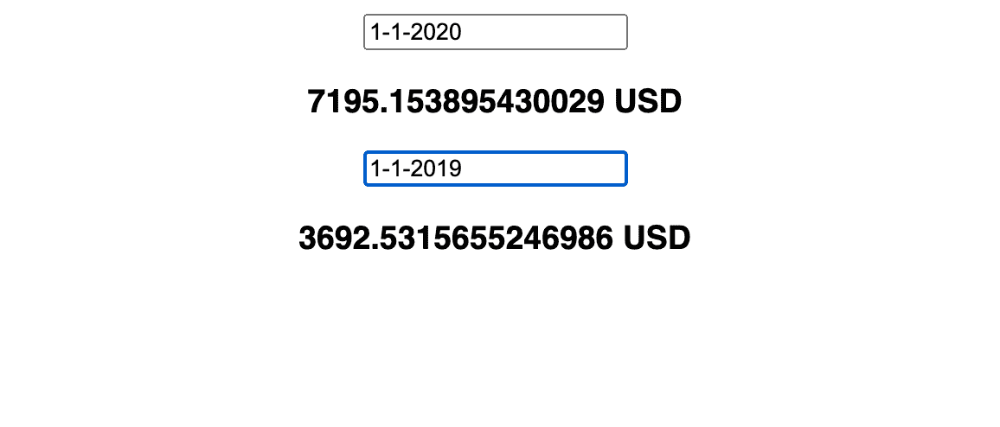

# 用 React + CoinGecko API 构建加密货币回报计算器

> 原文：<https://javascript.plainenglish.io/build-a-cryptocurrency-returns-calculator-with-reactjs-coingecko-api-part-1-a286ceada6ff?source=collection_archive---------2----------------------->

## 构建加密货币计算器的分步入门教程—第 1 部分


构建自己的加密货币回报计算器对任何开发人员的投资组合来说都是一个很棒的补充，尤其是如果你是一个加密货币爱好者。如果你是一名正在接受培训的开发人员，并且你的 Twitter 简历中有#Bitcoin，那么这篇文章就是为你而写的。本教程完全适合初级和中级反应学习者！我在 CodeSandbox 中添加了各个步骤的代码，这样你可以很容易地跟着做。在本教程中，我们将学习如何使用钩子来输入数据，如何从 API 中提取返回的数据，以及如何显示和使用这些数据。给定日期的硬币价格将从 [CoinGecko API 中获取。](https://www.coingecko.com/en/api)API 给出的硬币数据稍有延迟，因此计算器不会返回最近日期的任何数据。

# **工作原理**

用户将输入他们购买的硬币、购买日期、出售日期以及他们购买的代币数量。计算器将返回他们的总收益或损失。你可以在[https://cryptoreturnscalc.netlify.app/](https://cryptoreturnscalc.netlify.app/)查看我的最终项目版本，源代码可以在[https://gitlab.com/adamshinder/crypto-returns-calculator](https://gitlab.com/adamshinder/crypto-returns-calculator)找到。就这样，让我们开始吧！



Final Application

# **步骤 1:设置和使用状态**

首先，让我们启动并运行一个样板 React 项目。使用终端中的`npm create-react-app crypto-calc-tutorial`或`yarn create-react-app crypto-calc-tutorial`。这将创建一个名为`crypto-calc-tutorial`的 React 项目的基本模板文件夹。通过执行`cd crypto-calc-tutorial`进入该文件夹，进入该文件夹后，打开您选择的代码编辑器。如果你像我一样使用 VSCode，那么你可以做，`code .`。

进入文件夹后，打开 src/App.js，就可以清空文件了。只留下以下内容:

```
import React from “react”;
import “./styles.css”;export default function App() {
  return (
    <div className=”App”>
      Welcome to the Tutorial!
    </div>
  );
}
```

首先，让我们创建一个输入字段。我们将需要一个函数来接受输入，并改变用户输入的变量。为此，我们将使用 useState 钩子。用`import React, { useState } from “react”;`导入使用状态。

现在，让我们设置 useState 函数来接收输入。第一个输入字段将是购买变量。您可以声明用`setBuy`函数设置的`buy`，并将其值设置为一个空字符串，如下所示。

```
const [buy, setBuy] = useState(“”);
```

我们现在需要在屏幕上输入内容。你可以在渲染函数的`<div>`中用`<input> </input>`来做这件事。一个空的输入框将出现在你的屏幕上。现在，让我们添加以下功能:

```
<input defaultValue={buy} onChange={(e) => setBuy(e.target.value)} />
```

这将输入的内容设置为购买值，当它改变时，用`e`的道具获取一个函数，并将其值传递给 setBuy 函数。这会将 buy 变量更改为您在输入空间中键入的任何值。为了证明这一点，用`<h3> {buy} </h3>`将输入添加到 DOM 中。

**你可以用** [**这个 CodeSandbox**](https://codesandbox.io/s/coingecko-api-usestate-example-0u988?file=/src/App.js) **看到这个例子。**

# **步骤 2:从 CoinGecko API 中提取数据**

现在，让我们用这个输入元素来接收某个日期的比特币价格。假设这个输入是买入或卖出的日期输入。查看 [CoinGecko API 页面](https://www.coingecko.com/en/api#explore-api)，看起来`/coins/{id}/history`是我们想要的页面，因为它接受一个硬币和一个日期来接收价格。完美！



在我们将它添加到应用程序之前，让我们看看以下 URL 返回了什么。`[*https://api.coingecko.com/api/v3/coins/bitcoin/history?date=1-1-2018&localization=false*](https://api.coingecko.com/api/v3/coins/bitcoin/history?date=1-1-2018&localization=false)`

正如你所看到的，对于日期为*1–1–2018*的硬币*比特币*，API 返回我们可能想要的所有数据，如名称、股票代码、图像资产、市场数据(如当前价格)以及其他面向社区的指标(如社交媒体关注者)。



使用正确的 URL，让我们设置接收这些信息并显示返回数据的函数。首先，我们需要创建一个函数，将日期输入 API 的 url 并返回上面的文本。我们通过以下方式做到这一点:

```
const coingeckoUrl = (date) => {
  return `https://api.coingecko.com/api/v3/coins/bitcoin/history?             date=${date}&localization=false`;
};
```

如您所见，它将正确的日期传递到输入日期的 URL 中。因此，如果日期属性为“1–1–2018”，coingeckoUrl 函数将返回如上所示的文本。

在我们使用大量信息之前，我们需要将数据解析成 JSON 格式。这样做将会把那个斑点变成像这样容易寻址的信息。



解析该信息的函数如下:

```
const coingeckoFetch = async (date) => {
  fetch(coingeckoUrl(date)).then((response) =>
    response.json().then((jsonData) => {
      setBuy(jsonData);
      console.log(jsonData);
     })
  );
};
```

该函数接受日期属性，并获取由`coingeckoUrl`返回的任何内容。假设日期是“2018 年 1 月 1 日”，这个`coingeckoUrl(date)` 就是那团信息。然后，获取响应(blob)并用`respone.json()`将其解析成 JSON 格式。然后，获取 jsonData 并将其设置为 setBuy 函数，我们从 useState 部分了解到了这个函数，所以现在，`buy`返回解析后的数据。这不是存储信息的最有效方式，但我们会很快清理它。

现在，让我们回到我们的返回函数，而不是用`onChange={(e) => setBuy(e.target.value)`来改变 setBuy 函数，我们将把输入设置为输入到 coingeckoUrl 函数的日期。这显示在下面:

`onChange={(e) => coingeckoFetch(e.target.value)`

因此，输入现在是输入到 coingeckoFetch 函数中的日期！为了进一步说明，这个日期输入被传递给 coingeckoFetch 函数，然后被传递给 coingeckoUrl 函数。

**到目前为止的所有代码都可以在 CodeSandbox** [**这里**](https://codesandbox.io/s/coingecko-api-basic-krjhr?file=/src/App.js:280-490) 找到。*记住，在整个教程中，你需要的格式是 dd-mm-yyyy 格式。任何其他格式和 API 都不会呈现输出。*你现在有了一个可以返回给定日期的比特币数据的应用程序。为了证明这一点，检查控制台；)

到目前为止，应用程序做得很好！你应该对自己很满意。您刚刚学习了如何输入数据，从 API 中提取数据，然后解析响应！接下来，我们将展示这些信息。

# 第 3 部分:显示数据

返回的数据如预期的那样出现在控制台中，那么我们如何让它出现在 DOM 中呢？首先，记住数据存储在 buy 变量中的什么地方。因此，您可以使用以下代码调用数据:

```
<h3> {buy.market_data?.current_price.usd}{“ “}USD</h3>
```

此时，在应用程序上，当您输入一个日期时，您将看到比特币在该日期的美元价格。你可以从`console.log(buy)`的日志中看到我们为什么使用上面的代码。从`buy`变量开始，然后是`.market_data` 来访问 json 的那个部分，然后是`.current_price`，然后我们想要那个以美元表示的价格，所以是`.usd`。这是返回给定日期价格的路径。该路径如下所示。



你可能会奇怪为什么 market_data 旁边有个`?`。这个问号叫做[可选链接](https://developer.mozilla.org/en-US/docs/Web/JavaScript/Reference/Operators/Optional_chaining)，它允许你*读取一个位于连接对象链深处的属性值，而不必检查链中的每个引用是否有效。*

# **第四部分:接收多条数据**

在我们能够接收到一个日期输入(即买入)的值之后，我们还需要接收一个卖出日期的数据。为此，我们将创建两个函数。一个接收日期，然后输出并存储买入价格，另一个接收卖出日期和价格。在我们担心为购买和销售创建两个不同的函数之前，让我们首先创建一个函数，类似于我们在 onChange 元素中所做的，可以只为购买日期调用。

首先，让我们创建一个函数，名为`handleBuyChange`，我们将调用这个新函数，而不是直接调用 coingeckoFetch。创建一个函数，它接受来自现场的输入，并调用`coingeckoFetch`和`setBuy`。

下面是这个函数的样子。

```
const handleBuyChange = (e) => {
  let val = e.target.value;
  setBuy(val);
  coingeckoFetch(val);
};
```

然后在 input 元素的 onChange 中，删除`coingeckFetch`并用输入的值调用这个函数。不再需要做`e.target.value`，因为它已经在`val`中被考虑。

太好了！现在让我们做同样的事情来销售。还记得我们开始时为购买输入所做的步骤吗？我们首先需要为 sell 和 setSell 创建一个新的使用状态。在这一点上，我更改了变量的名称，以便更清楚地表明我们正在输入`sellDate`和`setSellDate`。我们将开始将来自 API 的响应存储在一个不同的变量中。一分钟后会有更多。

首先，我们将复制 buy for sell 的所有输入和功能。复制并粘贴 buy `<input>`元素和`handleBuyChange`函数，并将它们适当地重命名为“sell”。更改输入中的`defaultValue`，渲染值的名称，将`setSellDate`添加到`coingeckoFetch`函数中，并编写`handleSellChange`函数，就像对购买日期输入所做的那样。你可以在 CodeSandbox [**这里**](https://codesandbox.io/s/coingecko-api-step4-bdsi2?file=/src/App.js) **看到所有这些**的改动。****

我相信你看到了上面的 CodeSandbox 的问题，销售和购买组件是一样的，所以它获取最后输入的日期。以前，我们建立了不同的买卖日期输入，但是现在，我们需要区分买卖数据。为了解决这个问题，我们需要创建两个变量。一个可以存储为买入返回的数据，另一个返回卖出日期的数据(输入)。我用设置为空对象的变量`sellData`和`buyData`来标记这个、`trade`和`setTrade`。

```
*const* [trade, setTrade] = useState({
  sellData: {},
  buyData: {},
});
```

在前面的 fetch 函数中，我们只是将 jsonData 传递到了`setBuyDate`中，如下所示。

```
setBuyDate(jsonData);
setSellDate(jsonData);
```

现在我们已经有了存储数据的变量，我们将想要做以下事情。

```
setTrade({ …trade, buyData: jsonData });
```

现在，我们如何区分销售和购买，以便 fetch 知道返回哪些数据？为此，我们将使用一个名为 buy 的布尔值。如果是买入，它将被传递，这个买入等于真，如果是卖出，买入将被设置为假。当我们将日期输入传递给`coingeckoFetch`时，我们还将提供 true 或 false。

在`coingeckoFetch`函数中，添加一个名为 buy 的附加属性，并使用 if 语句根据`buy`的值将 jsonData 设置为`buyData`或`sellData`。下面是带有 buy 和 sell if 语句的函数，它根据传递给变量的布尔值来设置变量。不要将买入传递给`coingeckoUrl`，因为它不关心这是买入还是卖出。

```
*const* coingeckoFetch = *async* (buy, date) => {
  fetch(coingeckoUrl(date)).then((response) =>
    response.json().then((jsonData) => {
      *if* (buy) {
      setTrade({ …trade, buyData: jsonData });
      } *else* {
      setTrade({ …trade, sellData: jsonData });
      }
    })
  );
};
```

既然 coingeckoFetch 期望一个布尔值被传递给它，我们需要如下所示更改我们的`handleSellChange`和`handleBuyChange`函数，为 sell 传递变量 false。

```
*const* handleSellChange = (e) => {
  *let* val = e.target.value;
  setSellDate(val);
  coingeckoFetch(*false*, val);
};
```

最后，只需将我们放置`sellDate`和`buyDate`的地方改为`trade.sellData`和`trade.buyData`，因为这些数据现在有了自己的变量。

**所有这些变化都可以在** [**这个 CodeSandbox**](https://codesandbox.io/s/coingecko-api-step4-boolean-nh9s0?file=/src/App.js) 上找到，现在，你有了一个可以输入日期、接收数据、存储和显示价格的应用程序。恭喜你！从现在开始一切都很顺利。最困难的部分已经过去了。



# **第 5 部分:添加体积并计算回报**

我们现在在两个不同的日期有两种不同的比特币价格！现在，让我们添加一个体积区域(代币购买量)。这并不太难。简单地说，创建一个`volume`和`setVolume` useState 并将该值设置为 0，如下所示:

```
*const* [volume, setVol] = useState(*0*);
```

为了改变音量，我们需要创建一个输入字段来设置音量的值。这将类似于我们对买卖日期输入所做的。因此，在`return()`中，添加以下内容:

```
<input value={volume} onChange={(e) => setVolume(e.target.value)} />
```

**你可以在这里看到所有的** [**更新代码**](https://codesandbox.io/s/coingecko-api-volume-i9eiy?file=/src/App.js) 然后，嘭！现在你有了计算交易回报的三个必要变量。我们现在将计算回报，但首先，我们需要一个变量来存储回报，并将其设置为零。声明一个新的变量，我很乐观你会赚钱，所以我将在常量`trade`中调用这个变量`gains`。

```
const [trade, setTrade] = useState({
  sellData: {},
  buyData: {},
  gains:0
});
```

有了这些，试着自己制作这个函数。我非常有信心你能做到！记住什么值返回买卖数据。然后为它们的差异设置增益，乘以代币的数量。

有了这些，是时候创建一个函数来计算这些收益(或损失)了。我们知道基于输入日期的比特币价格存储在`trade.sellData`和`trade.buyData`中，因此要获得美元价格，我们将获得`trade.sellData.market_data?.current_price.usd` 和`trade.buyData.market_data?.current_price.usd`之间的差额。**该函数应设置 sellData 的增益减去 buyData 乘以成交量的值。**这显示在下面的 calcGains 函数中。增益被设置为这些操作的结果。

```
const calcGains = () => {
  setTrade({
     ...trade,
     gains:
       (trade.sellData.market_data?.current_price.usd -
         trade.buyData.market_data?.current_price.usd) *
       volume,
  });
};
```

现在，制作一个调用 calcGains 并打印输出的按钮！然后，你将完成一个比特币回报计算器！使用调用 calcGains 的 onClick 添加 button 元素。瞧啊。你有一个功能齐全的比特币回报计算器！**你可以在 CodeSandbox** [**这里**](https://codesandbox.io/s/coingecko-api-calcgains-bk67x?file=/src/App.js:1881-1963) **看看，玩玩。**

恭喜你构建了一个比特币回报计算器！这是您前端开发旅程中非常棒的第一步。我强烈推荐这个造型，让它看起来很漂亮。如果你有兴趣将这个比特币计算器转换成许多不同的加密货币以供选择，请前往本教程的[第 2 部分](https://adamshinder.medium.com/build-a-cryptocurrency-returns-calculator-with-reactjs-coingecko-api-part-2-e0cd5f9cf83c)。我在那边等你！

如果您有任何问题、意见或想要联系我，请在 Twitter 上联系我，电话: [@adshinder](https://twitter.com/adshinder) 。另外，非常感谢 Lior Ben-David 对这篇文章的帮助。在 Twitter @Lior_bendavid 上关注他吧！

*更多内容请看*[***plain English . io***](http://plainenglish.io/)