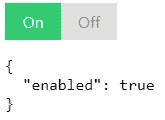

# 使用 ControlValueAccessor 生成自定义窗体控件

> 原文：<https://javascript.plainenglish.io/build-a-custom-form-control-using-controlvalueaccessor-dc7e99511fb8?source=collection_archive---------5----------------------->

Photo by [Christian Wiediger](https://unsplash.com/@christianw?utm_source=medium&utm_medium=referral) on [Unsplash](https://unsplash.com?utm_source=medium&utm_medium=referral)

使用 Angular 的“FormBuilder”类和本地输入元素，可以生成强大的表单。但是，这些元素有时不能提供足够的功能来按照我们想要的方式显示表单。在这种情况下，您将需要构建必须由“FormBuilder”支持的自定义表单组件。为此，您的定制组件必须实现“ControlValueAccessor”接口，这就是我们将在本文中讨论的内容。

# 我们将要建造的

为了将重点放在实现“ControlValueAccessor”接口的方法上，我们将构建一个非常简单的表单控件，它将显示一个“开/关”按钮。基本上，这将是一个花哨的复选框。

On/off switch

# 基础知识

让我们开始构建我们的组件**，而不需要**实现“ControlValueAccessor”接口。我将跳过创建一个新项目/组件所需的步骤，因为已经有很多关于这方面的文章了。假设您已经创建了项目和一个名为“OnOffComponent”的组件。

## 模板

该模板仅包含“开”和“关”按钮:

我们还将这些元素的“click”事件绑定到“switch”方法，以便更新“value”输入。

## SCSS

我们将使组件成为“inline-flex ”,以便显示相邻的两个按钮。我们将样式直接应用于“host”伪选择器，以避免在组件中有一个主“div”。请注意，当组件被禁用时，类“disabled”也应用于宿主组件(通过 TypeScript 代码)。

打字稿

我们为组件定义了两个输入:

*   **禁用**:定义组件是否被禁用。
*   **值**:定义元件的当前值。

我们还绑定了主机的一些属性和事件:

*   **角色**、 **aria-checked** 和 **aria-disabled** :提高组件的可访问性
*   **class.disabled** :根据“disabled”输入的值，将“disabled”类添加到主机。
*   **attr.tabIndex** :当组件未被禁用时，将“tabIndex”属性设置为“0”以使其可制表。
*   **keydown.arrowleft** 和 **keydown.arrowright** :当组件有焦点时，允许组件值随左/右箭头改变。

关于“switch”方法，如果组件没有被禁用，并且参数中传递的值与当前值不同，我们只需更新“value”输入。

我们还创建了一个输出，在每次组件的值改变时发出一个事件。

最后，我们在“OnPush”上设置组件的变更检测策略，以提高性能(并为没有 zone.js 的未来做好准备)。

# 实现“ControlValueAccessor”

因此，该组件不能以反应形式使用，因为它不实现“ControlValueAccessor”接口。为此，首先需要通过在组件的“component”装饰器中添加以下代码，经由“NG_VALUE_ACCESSOR”注入标记将组件注册为控制访问器:

接下来，您需要指定您的类实现“ControlValueAccessor”接口:

最后，您需要实现四个方法:

*   **writeValue** :被调用更新组件的值。例如，用“FormBuider”创建表单时，如果将该字段的默认值设置为“true”，Angular 将使用该值调用“writeValue”。
*   **registerOnChange** :你需要一种方法来告诉 Angular 你的组件的值何时改变。该方法为您提供了一个函数，每次组件的值发生变化时，您都必须保存并调用该函数。
*   **registerOnTouched** :这个方法的目标和“registerOnChange”一样，但是它用来告诉 Angular 什么时候用户已经和组件交互了。Angular 使用它来更新组件的原始状态，以便显示验证提示(例如)。
*   **setDisabledState** :顾名思义，这个方法被调用来更新组件的禁用状态。

让我们从最简单的开始实现这些功能:

这里唯一需要注意的是，我们将组件的值设置为“！！值”，以便将值转换为布尔值。

如前所述,“registerOnChange”方法是用参数中的函数调用的，我们必须保存该函数，以便在组件的值发生变化时调用它，因此我们需要声明一个变量并将函数存储在其中:

现在我们需要在“switch”方法中调用这个函数，以便传播更改:

请注意，您需要检查是否定义了“onChange”变量，因为您的组件可能用在与反应式表单不同的上下文中，在这种情况下，不会调用“registerOnChange”。

最后，我们需要用“registerOnTouched”方法做一些类似的事情:

调用该函数的一个好地方是在组件的“模糊”事件中，因此您需要将它添加到“组件”装饰器的“主机”属性中:

至于“onChange”函数,“onTouched”函数不一定要定义，所以最好在调用它之前确保它是。

尽管我们已经完成了“ControlValueAccessor”的实现，但是组件还没有完全完成。事实上，由于它公开了“value”输入，组件的值有可能通过这个输入得到更新，这意味着我们也需要传播这个变化。

要解决这个问题，首先创建一个私有变量来存储值:

然后，修改“值”输入以使用该变量和“切换”方法:

我们还需要在“切换”方法中进行两项更改:

我们做的第一个改变是第 5 行。以前，我们更改了“value”的值，但这会导致一个循环，因为“value”输入的设置程序调用了“switch”方法。

第二个变化位于第 13 行。当使用“OnPush”更改策略构建自定义窗体控件时，您不能总是确保其值以“OnPush”更改策略所涵盖的方式进行更改。例如，组件的值可以通过在组件外部的“setTimeout”中输入的“value”来更改，在这种情况下，视图不会更新，因此我们需要调用“ChangeDetectorRef”的“markForCheck”方法来告诉 Angular 在值更改后检查我们的组件。

这里我们有一个工作表单控件，我们现在要测试它(使用表单，而不是单元测试)。请注意，实现“ControlValueAccessor”接口还允许您对组件使用“ngModel”。

如果它对您不起作用，或者您在解释过程中迷失了方向，以下是该组件的完整代码:

# 测试组件

让我们像这样修改我们的应用程序组件代码:

并在模板中使用此表单:

结果是意料之中的:

您也可以更新表单定义以禁用组件:

起初，“ControlValueAccessor”接口看起来很奇怪，尤其是“registerOn…”方法，但是一旦理解了它们的用途，构建自定义窗体控件就变得非常容易了。

> 如果你喜欢这篇文章，想要支持我，请不要犹豫，鼓掌或者请我喝杯咖啡:-)好吗

