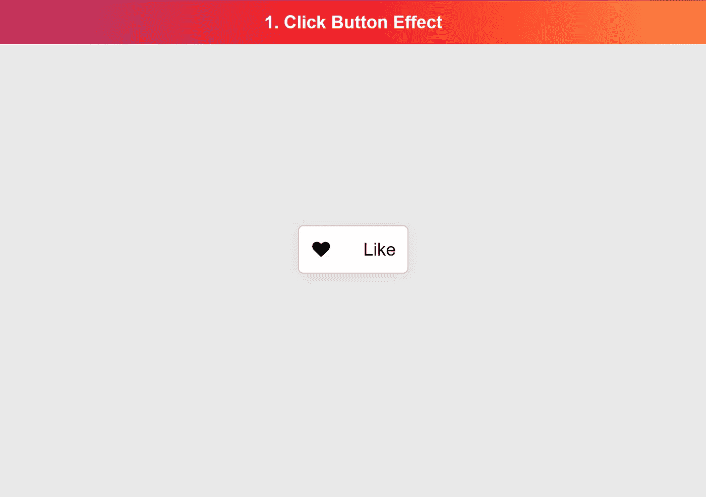

# 用 HTML、CSS 和普通 JavaScript 构建一个自定义的 Like 按钮

> 原文：<https://javascript.plainenglish.io/build-a-custom-like-button-with-html-css-and-vanilla-javascript-b81fa4b00aad?source=collection_archive---------3----------------------->

## 以最简单的方式学习 JavaScript



Screenshot author (*Inspired by* [*Heart Fold Button*](https://dribbble.com/shots/10555834-Heart-Fold-Button)*)*

想学 JavaScript，从哪里开始？我想到了一些易于构建的 UI 组件。在这篇文章中，我将向你展示如何编写一个自定义的 like 按钮。我将解释它是如何工作的，这样你就可以构建你自己的了。

尽情享受吧！

# HTML 和 CSS

所以让我们从 HTML & CSS 开始，让我们的组件成为静态的。我已经为你创建了 HTML 和 CSS。但是如果你想改变它，请继续做你喜欢的。

```
<button class="btn btn-like">
    <span class="btn-icon btn--icon-default">
        <span class="fa fa-heart"></span>
    </span>
    <span class="btn-icon btn--icon-liked">
        <span class="fa fa-heart"></span>
    </span>
    <span class="btn-content  btn-content--liked">
        Liked
    </span>
    <span class="btn-content btn-content--default">
        Like
    </span>
</button>
```

我们在标签中构建一切，就像我们应该对按钮做的那样。我为动画的内容和按钮图标添加了一些`<span>`标签。如果我们不这样做，动画就不会工作。

```
:root {
    --red: rgb(209, 3, 3);
    --white: #fff;
    --black: #000;
}.btn {
    width: 200px; height: 88px;
    outline: 0;
    border: 2px solid #ccc;
    color: #000;
    cursor: pointer;
    overflow: hidden;
    position: relative;
    display:flex;
    justify-content: space-between;
    box-shadow: 0px 3px 25px rgba(0, 0, 0, 0.05);
    transition: 1.5s cubic-bezier(.21,.04,.26,.99);
}.btn:hover {
    box-shadow: 0px 3px 25px rgba(0, 0, 0, 0.2);
    border-color: var(--red);
}.btn-like {
    padding: 1.5rem 1.5rem 1.5rem 6rem;
    font-size: 2rem;
    border-radius: 10px;
    background: #fff;
    transition: 1.5s cubic-bezier(.21,.04,.26,.99);
}
.btn-like.liked {
    background: var(--red);
    border-color: var(--red);
}/*-- Button Icon -- */
.btn-icon {
    display: inline-block;
    width: 32px;
    height: 36px;
    position: absolute;
    left: 1.5rem;
    transition: 1s cubic-bezier(.21,.04,.26,.99);
    transform: rotate(0deg)
}
.btn:hover .btn-icon {
    color: var(--red);
}
.btn.liked:hover .btn-icon {
    color: var(--black);
}
.liked .btn--icon-default {
    transform: rotate(-90deg)
}
.btn:not(.liked).btn--icon-liked {
    transform: rotate(-90deg)
}
.liked .btn--icon-default,
.btn--icon-liked {
    opacity: 0;
    color: #fff;
    position: absolute;
}
.btn--icon-default,
.liked .btn--icon-liked {
    opacity: 1;
    left: 1.5rem;
}/*-- Button Content -- */
.btn-content {
    transition: transform 0.1s ease;
    display: inline-block;
    /* position: absolute;
    right: 0; */
}
.liked .btn-content {
    color: var(--white);
}
.btn:hover.liked .btn-content {
    color: var(--black);
}
.btn:not(.liked) .btn-content--liked {
    transform: translate(110px)
}
.btn:not(.liked) .btn-content--default {
    transform: translate(-56px)
}
.liked .btn-content--default {
    transform: translate(24px)
}
```

如果你不喜欢我选的颜色，我已经用 CSS 变量很容易地改变了颜色。现在我们已经静态地创建了按钮组件，我们从 JavaScript 开始。😇

# 演示

# 变量

JavaScript 变量是一个内存，我们可以在其中存储信息，比如一些字符串、数字、对象等等。变量的便利之处在于，您可以稍后在 JavaScript 中重用它们。否则，你会重复很多代码。

我们将使用一个变量来存储按钮上的信息。我们用一个`const`变量来做这件事。这种类型的变量存储信息，但不允许改变数据类型。

```
const button = document.querySelector('.btn')
```

上面的代码存储了我们的`<button class="btn"></button>`元素的信息。通过`document`属性，我们可以访问 D.O.M ,,这意味着我们页面上的所有 HTML。

但是我们想知道用户什么时候点击按钮，对吗？因为当用户这样做的时候，我们想给按钮`liked`添加一个类。有了这个类，我们就可以用转换来触发 CSS。

# 功能

在 JavaScript 中，我们有函数。我们使用它们来重用功能。许多开发人员都在按照 D.R.Y .的原则工作。它代表“不要重复自己”。

下面你可以看到一个普通的函数是如何定义和执行的。函数可以是匿名的，也可以用函数名定义。

```
// Function is defined here
function coolFunction() {
    console.log('Cool function is called 🚀')
}// Function is called here
coolFunction();
```

# 事件

所以我们需要创建一个[事件监听器](https://developer.mozilla.org/en-US/docs/Web/API/EventTarget/addEventListener)。有了这个，我们可以听到咔哒声、滚动声等等。

```
const button = document.querySelector('.btn')button.addEventListener('parameter1', 'parameter2')
```

`addEventListener`是每个 HTML 元素的函数。这个函数有一些选项，我们称之为参数。

在我们看到`'parameter1'`的地方，我们需要定义我们要听什么样的事件。我们看到`'parameter2'`，我们需要定义一个每次事件被触发时调用的函数。在 JavaScript 中我们称之为回调。

```
const button = document.querySelector('.btn')button.addEventListener('click', function() {})
```

# 功能和参数

现在我们已经定义了我们想要用我们的事件监听器监听`'click'`事件。在第二个属性的回调函数中，我们希望将类“liked”添加到按钮中。但是当用户再次点击时，我们希望删除该类。

在 JavaScript ClassList API 中，我们有一个`toggle()`方法。(*函数和方法有什么区别？检查* [*FAQ: 1*](https://gist.github.com/FAQ.md#1-what-is-the-difference-between-a-function-and-a-method) )第一次调用的时候会添加你在里面定义的类名。第二次调用时，它将删除类名。

```
const button = document.querySelector('.btn')button.addEventListener('click', function() {
    button.classList.toggle('liked')
})
```

在文件[我们的例子](https://codepen.io/devbyrayray/pen/WNGyKqG)中，你会看到代码有点不同。

```
const button = document.querySelector('.btn')button.addEventListener('click', () => {
    button.classList.toggle('liked')
})
```

我没有使用普通的`function() {}`，而是使用了一个叫做[箭头功能](https://developer.mozilla.org/en-US/docs/Web/JavaScript/Reference/Functions/Arrow_functions)的`() => {}`。

自从引入了箭头功能，我就是它的忠实粉丝。写起来比正常的要短很多。但使用起来并不总是明智的。只要记住，当我们需要在一个箭头函数中使用`this`时，选择一个普通函数。你可以在 Mozilla 博客上阅读更多关于箭头功能的内容

# 结束

我认为我们创造了一个优秀的按钮组件，具有很酷的点击效果。现在，由你来添加一些更酷的效果。让你的创造力流动起来，做一些很酷的东西！

完成按钮后，请在推特上分享结果😁。如果你愿意，你可以使用这个示例推文！👇

```
I have created project 1 of the "Learn JavaScript The Easy Way" program. 😁[ADD LINK HERE] 🔥Do You Want To Learn #javascript like me? Check the link below and start for free. 🚀[TODO: LINK]#html #css #codenewbie #coding #frontend #developer #creativity #learnJavaScript #easyJavascript
```