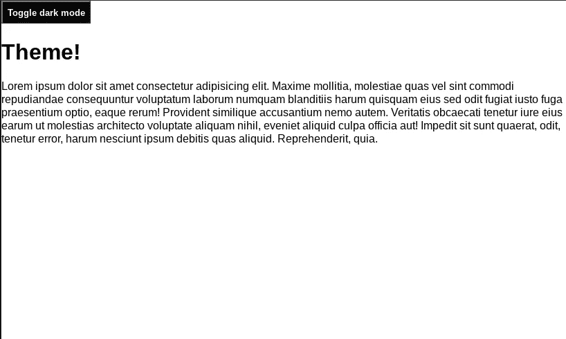
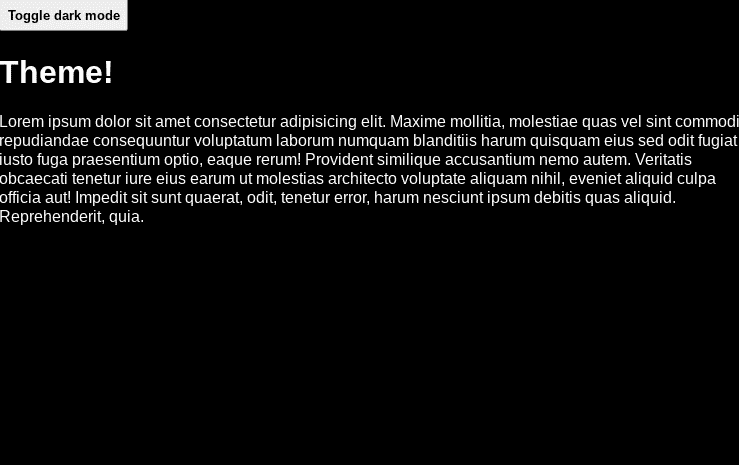

# 使用 JavaScript 和 localStorage 构建黑暗模式切换

> 原文：<https://javascript.plainenglish.io/build-a-dark-mode-toggle-with-javascript-and-localstorage-8022b492fb9e?source=collection_archive---------4----------------------->

一篇简短的文章解释了如何使用 JavaScript 和 localStorage 构建黑暗模式切换开关。

Photo by [Ryan Olson](https://unsplash.com/@ry4nolson?utm_source=medium&utm_medium=referral) on [Unsplash](https://unsplash.com?utm_source=medium&utm_medium=referral)

如果你浏览网页足够长的时间，你可能会遇到一个整洁的小功能，称为黑暗模式切换开关。你通常可以在应用程序或网站的右上角找到它，如 [Redux](https://redux.js.org/) 文档或 [W3Schools](https://www.w3schools.com/) 文档。在我可能会做大量阅读的网站上看到这个功能总是让我很高兴，因为我的眼睛对强光非常敏感，所以今天我们要建立自己的功能！

# 用 JavaScript 和 localStorage 构建黑暗模式切换

在本文中，我们将主要关注用于构建黑暗模式切换的 JavaScript 代码，但是为了向您展示我们将在 HTML 端处理的内容，请查看以下代码。

在 CSS 方面，我们将使用一些基本的样式和类来保持简单，我们将使用这些样式和类来帮助在默认和黑暗模式主题之间切换。

到目前为止，我们的项目看起来如下。

为了配置我们的切换，我们将添加 JavaScript 来监听用户切换到黑暗模式主题或回到默认模式时的`click`事件。为了保存用户切换到的主题设置，我们将使用 localStorage 来存储黑暗模式当前是启用还是禁用。

在上面的代码中，我们首先从 dom 中获取我们需要的元素，并从 localStorage 中获取黑暗模式的当前状态。然后我们有两个函数`enableDarkMode()`和`disableDarkMode()`。为了启用黑暗模式，我们添加了名为`dark-mode-theme`的类，并删除了`dark-mode-toggle`，然后在 localStorage 中将黑暗模式的值设置为 enabled。要禁用黑暗模式，我们做完全相反的事情，删除类别`dark-mode-theme`并添加类别`dark-mode-toggle`，然后将黑暗模式设置为禁用。

在第 17 行，我们检查了页面加载时黑暗模式的当前状态，并设置它是否启用，这使我们能够保存我们上次选择的主题。在事件监听器中，我们重置了我们的`darkMode`变量，以反映它的当前状态，在检查它并根据它的值采取行动启用或禁用黑暗模式之前，是启用还是禁用。

现在，当我们启用黑暗模式的主题，我们会得到以下。

# 摘要

这是在你的网站或应用程序上建立一个启用黑暗模式的切换开关的一种快速简单的方法。还有许多其他方法可以做到这一点，查看指南了解更多关于它们的信息[这里](https://css-tricks.com/a-complete-guide-to-dark-mode-on-the-web/#using-separate-stylesheets)！

如果你想与我们新的黑暗模式切换开关互动，请点击这里的[代码笔查看完成的产品。](https://codepen.io/coderjay06/pen/WNEPVBv)

*更多内容尽在*[***plain English . io***](http://plainenglish.io/)