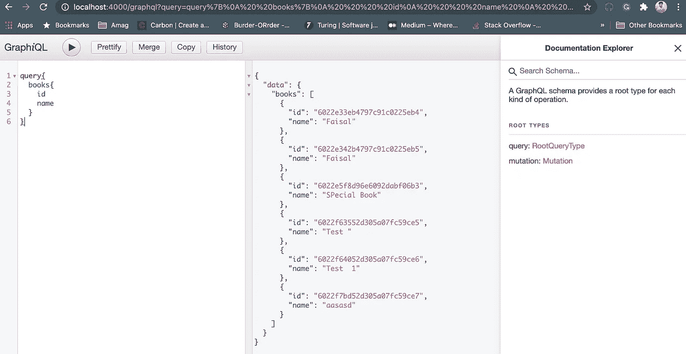

# 使用 React + Express 构建全栈 GraphQL 应用程序

> 原文：<https://javascript.plainenglish.io/build-a-full-stack-graphql-application-with-react-express-6a3d00b05629?source=collection_archive---------3----------------------->

## 用反应和表达


GraphQL 是 **REST 的替代产品。**很明显是新的。比传统的 REST API 有一些好处。今天我们将看到如何构建一个简单的全栈 GraphQL 应用程序。

## 先决条件

要继续学习，您必须对普通 HTTP 服务器的工作原理有一个基本的了解，并对 ReactJS 有一些了解。你不需要成为这两方面的专家。

# 构建后端

首先，我们创建一个非常基本的`express`应用程序。你可以在这里看到[如何创建一个样板 express 应用程序。](https://www.sitepoint.com/create-new-express-js-apps-with-express-generator/)

## 第一步。安装依赖项

然后在项目的根目录中，我们需要为 graphql 安装这些附加的依赖项。

```
yarn add express-graphql graphql
```

## 第二步。创建模式

在项目内部创建一个名为`schema.js`的文件，并为我们的书创建一个模式。GraphQL 需要了解底层的数据结构。

例如，您的应用程序中必须有某种后端(如 MongoDB 或 Postgres ),为此，您必须有某种数据结构来与数据库对话。但是这个模式是不同的。

## 第三步。创建查询

所以现在我们准备创建我们的查询。查询意味着访问数据。我们创建了两个查询，`book`和`books`。

`book`查询接受的参数是我们想要的书的`id`。

并且`books`从数据库中返回所有的书籍。

## 第四步。创造突变

突变意味着改变数据。每当我们需要创建或更新数据时，我们必须创建突变。

## 第五步。使用它们

现在我们只导出我们的`schema`、`query`和`mutation`:

在`app.js`中，我们可以让我们的 express 服务器知道 graphql 模式，如下所示。

## 测试我们的第一个 API

GraphQL 为我们提供了一个很棒的工具，叫做`GraphiQL`。这让我们可以非常容易地测试 graphQL API。它更像 Rest API 中的`Swagger`

进入[http://localhost:4000/graph QL](http://localhost:4000/graphql)可以看到`GraphiQL`界面。



GraphiQL interface

# 构建前端

我希望你知道如何使用`create-react-app`构建一个基本的 react 应用程序。创建样板应用程序后，我们现在开始将 GraphQL API 集成到我们的应用程序中。

我们需要使用一个名为 [Apollo](https://www.apollographql.com/docs/) 的特殊查询库，它有非常棒的文档。我强烈建议你去看看！

## 第一步。安装依赖项

首先，安装以下依赖项。

```
yarn add @apollo/client graphql
```

## 第二步。创建客户端

我们需要创建一个客户端来与我们的 GraphQL 服务器对话。那个客户端叫做`ApolloClient`。在我们的`index.js`文件中创建我们的第一个客户端。

## 第三步。用提供商包装

我们的整个应用程序都需要这个客户端，所以我们用`ApolloProvider`包装我们的`App`组件，并提供我们刚刚创建的客户端。

## 第四步。定义查询

GraphQL 有特定的查询语言。我们需要用它来访问我们的数据。我们创建一个`BookList`组件来访问图书列表

## 第五步。变化

现在我们创建另一个组件，向数据库添加一本新书。

原来如此。现在我们有了一个前端和后端都可以工作的应用程序

你可以从下面的报告中查看整个应用程序的源代码

[](https://github.com/Mohammad-Faisal/graphql-express-react) [## Mohammad-fais al/graph QL-express-react

### 在 GitHub 上创建一个帐户，为 Mohammad-fais al/graph QL-express-react 开发做出贡献。

github.com](https://github.com/Mohammad-Faisal/graphql-express-react) 

今天到此为止。编码快乐！:D

**通过**[**LinkedIn**](https://www.linkedin.com/in/56faisal/)**或我的** [**个人网站**](https://www.mohammadfaisal.dev/) **与我取得联系。**