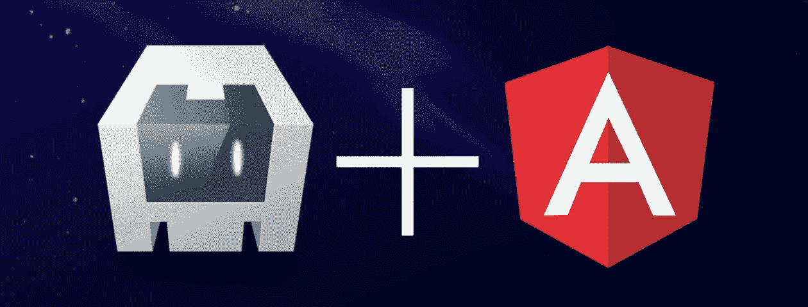
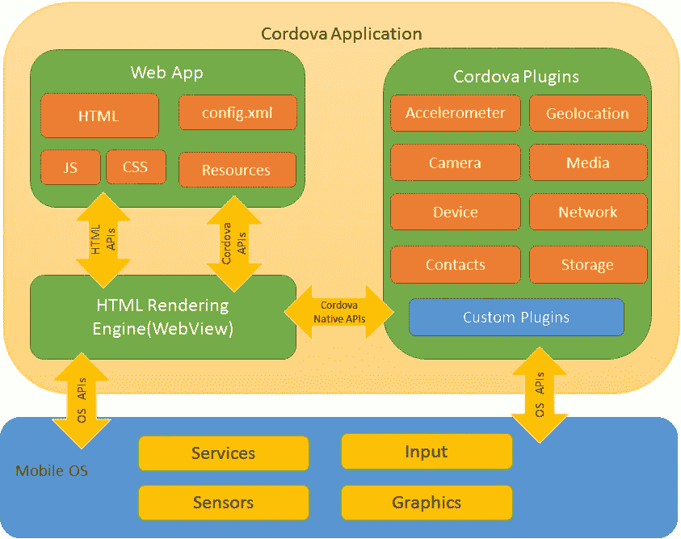

# 使用 Cordova + Angular 构建混合应用程序

> 原文：<https://javascript.plainenglish.io/build-a-hybrid-app-using-cordova-angular-2d63b5ed90ec?source=collection_archive---------1----------------------->

一个使用 Cordova 和 Angular 的跨平台应用程序的简单例子



# 什么是科尔多瓦，为什么要使用它？

Cordova 是一个用于开发混合应用程序的跨平台工具。使用 Cordova 的混合应用程序是使用 HTML、CSS 和任何 JavaScript 框架/库编写的网络应用程序。

Cordova 负责将 web 应用程序转换为本机应用程序，方法是正确构建和打包 web 资源，以便它们可以在目标设备平台上运行。

每个平台都有一个内置的浏览器组件，通常称为 WebView。混合应用程序运行在设备的网络视图浏览器上。WebView 组件是一个本机组件，可以与底层操作系统通信，并可以访问操作系统服务，如图形和传感器。当网络视图无法访问本地设备功能(如存储、位置、联系人等)时。通常，Cordova 会提供一个插件来访问这些功能。

Cordova 为您提供了跨不同平台使用公共代码库的优势。如果您已经熟悉了前端框架，那么您就不必学习新的语言来开发移动应用程序。



[Architectural Overview of Cordova Platform](https://cordova.apache.org/docs/en/10.x/guide/overview/)

在本文中，我将使用 Cordova 和 Angular 创建一个基本的混合应用程序。

# 1.创建科尔多瓦项目

1.  如果您还没有安装 Cordova，请使用 npm 安装。

```
npm i cordova -g
```

2.创建一个新的 Cordova 项目，在终端中运行下面的命令。

```
cordova create AngularCordova com.demo.angular AngularCordova
```

上述命令创建了一个新的文件夹`AngularDemo` 和一些初始文件:

*   www/-该文件夹包含网络资源(HTML、CSS、JavaScript)
*   config.xml —一个全局配置文件，指定核心 Cordova API 特性、插件和特定于平台的设置。
*   package.json——标准的 package . JSON 文件，包含 Cordova 插件的依赖项和版本。

# **2 .添加平台**

最受欢迎的平台是安卓、iOS 和浏览器。

在您开始之前，每个平台都有一些先决条件。

1.  **安卓**

*   JDK 8
*   grade le
*   Android SDK
*   环境变量— `JAVA_HOME` 和`ANDROID_SDK_ROOT`
*   安卓工作室

2. **iOS**

*   macOS
*   xccode

在此处[查看完整的安装指南和步骤](https://cordova.apache.org/docs/en/10.x/guide/platforms/android/index.html)

在这个例子中，我们将使用安卓和浏览器。

```
cordova platform add android
cordova platform add broswer
```

添加平台后，您可以在`platforms/` 文件夹中找到它们。

每个平台都有自己特定的文件夹结构和文件，可以完成在目标设备上运行的全部工作。

要验证您的设置是否正确和就绪，请运行

```
cordova run android //generates APK with default page and icon
cordova run browser //opens the default page in browser
```

注意:让 Android Studio 安装并运行，构建 APK 并在设备/仿真器上运行，这是很好的。

# 3.创建和构建角度项目

1.  在科尔多瓦项目文件夹之外创建角度项目。

```
ng new angular-cordova
```

2.转到`angular.json`，将`outputPath`更改为`../AngularCordova/www`

基本上，我们给出了 Cordova 项目的`www/` 的构建输出路径。

3.添加将 Angular 项目连接到 Cordova 的语句。在`index.html`，

```
<script type="text/javascript" src="cordova.js"></script>
```

4.在`main.ts`中增加 Cordova `deviceready`功能。当`deviceready`事件触发时，将角度项目引导到浏览器。

```
const bootstrap = () => {
  platformBrowserDynamic().bootstrapModule(AppModule);
};if (typeof window['cordova'] !== 'undefined') {
  document.addEventListener('deviceready', () => {
    bootstrap();
  }, false);
} else {
  bootstrap();
}
```

*中的* `***deviceready***`*事件引发一次****Cordova****已经满载。一旦事件触发，您可以安全地调用****Cordova****API。应用程序通常会在文档中附加一个事件侦听器。加载完 HTML 文档的 DOM 后，添加 EventListener。—* [*科尔多瓦文档*](https://cordova.apache.org/docs/en/4.0.0/cordova/events/events.deviceready.html#:~:text=The%20deviceready%20event%20fires%20once,HTML%20document's%20DOM%20has%20loaded.)

5.运行，`ng build --base-href=./`

当构建成功时，检查 Cordova 项目中的`www/`。应该有角度的文件。

6.运行 Cordova 项目，并检查 Angular 项目是否正在运行。

```
cordova run android
cordova run browser
```

最初，您应该看到 Angular 的默认占位符页面。

# 4.添加 Cordova 插件

在这个例子中，我们将添加 InAppBrowser 插件。

## 4.1 将插件添加到 Cordova 项目

```
cordova plugin add cordova-plugin-inappbrowser
```

这将插件添加到平台`android` 和`browser`。它还会更新`package.json`文件。

## 4.2 在 Angular 项目中使用插件

1.  使用添加`cordova` (.d.ts)的声明文件，

`npm i @types/cordova --save`

接下来，将`cordova`添加到`tsconfig.app.json`

```
{
  "extends": "./tsconfig.json",
  "compilerOptions": {
    "outDir": "./out-tsc/app",
    **"types": ["cordova"]**
  },
```

这是为了避免编译过程中的引用错误，因为我们使用了 Cordova 插件。声明文件有助于在 angular 项目中使用外部库引用。许多 npm 库都有`.d.ts`文件来支持。

2.现在使用 npm 在 angular 项目中添加`inappbrowser` 插件。

`npm i cordova-plugin-inappbrowser --save`

InAppBrowser 自带打字文件，所以我们不必再次通过@types 安装它。

3.在`src`文件夹中创建一个文件`custom-typings.d.ts` ，并引用`inappbrowser` 插件的`.d.ts` 文件。

```
/// <reference path="../node_modules/cordova-plugin-inappbrowser/types/index.d.ts"/>
```

4.在组件中使用浏览器

创建一个组件并使用`a`标签打开链接。我已经创建了一个仪表板组件。

```
<-- dashboard.component.html -->
<p><a (click)="openInApp()">Open Link in InAppBrowser</a></p>
<p><a (click)="openExternal()">Open Link in External Web Browser</a></p>
```

现在，在组件类中添加方法。

```
//dashboard.component.ts
openInApp(){
    if(window.cordova){
      cordova.InAppBrowser.open("[https://www.google.com](https://www.google.com)","_blank");
    }else{
      window.open("[https://www.google.com](https://www.google.com)","_system");
    }

   }
 openExternal(){
    if(window.cordova){
      cordova.InAppBrowser.open("[https://www.google.com](https://www.google.com)","_system");
    }else{
      window.open("[https://www.google.com](https://www.google.com)","_system");
    }

   }
```

在这里查看浏览器各种选项的文档。

5.构建项目并运行 Cordova 应用程序。

```
ng build --base-href=./
cordova run android
```

您应该能够看到在浏览器和外部浏览器中打开的两个链接。

同样，您可以将其他插件添加到您的项目中并使用它们。

# 5.结论

我们已经看到了一个使用 Cordova 和 Angular 的混合应用的例子。开发混合应用程序有它自己的优点和缺点。

## 优点:

*   如果您已经是一名网络开发人员，就不需要学习新的语言。
*   一个单一的代码库可以用来开发跨不同平台的应用程序。
*   很好的插件支持。几乎所有在本地应用程序中可以看到的功能都可以在混合应用程序中使用。

## 缺点:

*   当内容在 WebView 中呈现时，可能比本地应用程序慢。
*   不适合如果应用程序使用高图形像开发一个游戏应用程序。
*   不同操作系统版本/设备之间可能存在插件兼容性问题。

然而，Cordova + Angular 是开发应用程序的好方法。

希望本文有用！

您可以在[https://github.com/rucha412/Angular-Cordova](https://github.com/rucha412/Angular-Cordova)找到完整的例子

## 参考文献:

1.  [https://Cordova . Apache . org/docs/en/10 . x/guide/platforms/Android/index . html](https://cordova.apache.org/docs/en/10.x/guide/platforms/android/index.html)
2.  [https://Cordova . Apache . org/docs/en/10 . x/reference/Cordova-plugin-in app browser/index . html](https://cordova.apache.org/docs/en/10.x/reference/cordova-plugin-inappbrowser/index.html)

[*更多内容参见*](http://plainenglish.io/)