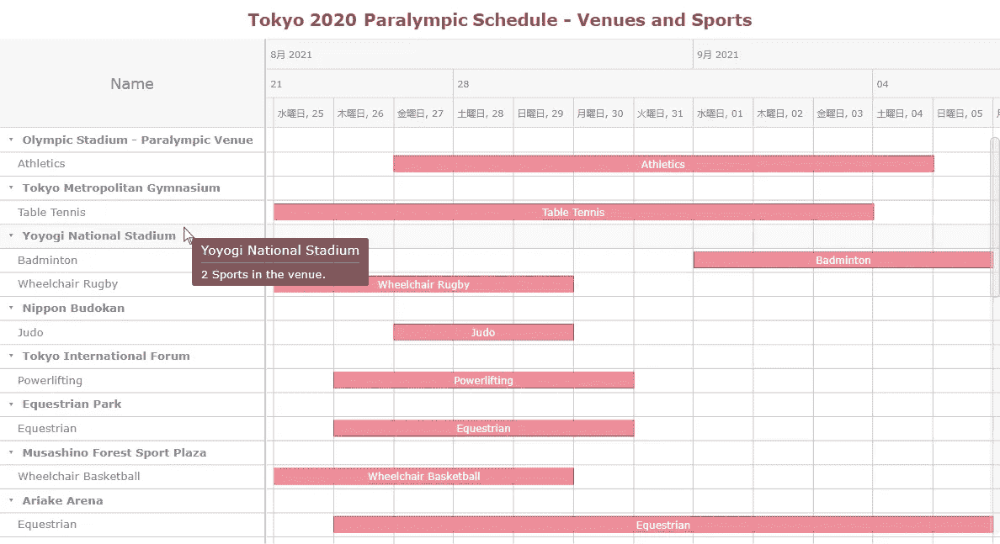
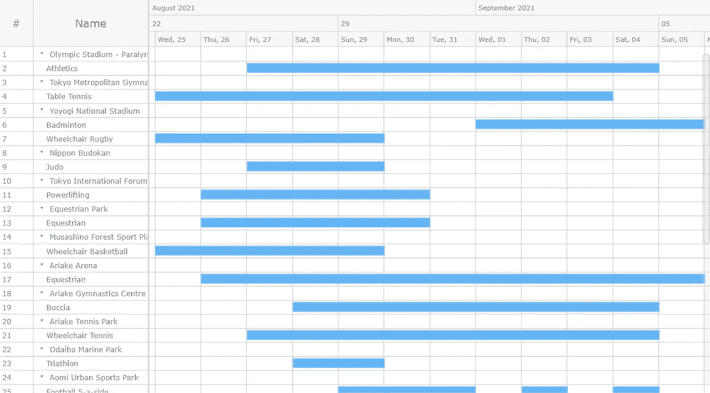
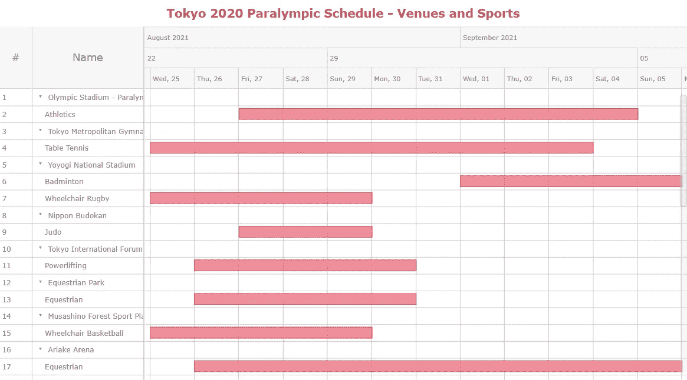
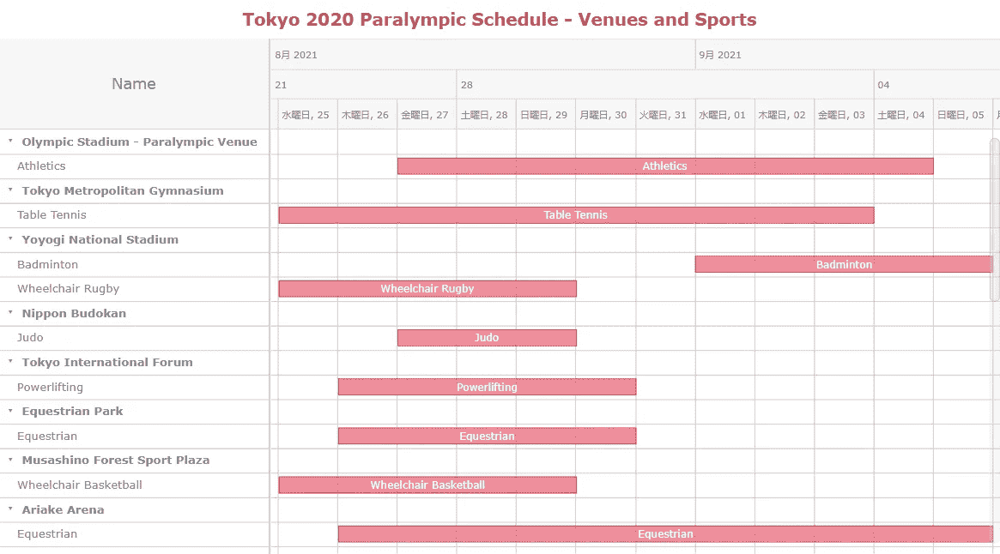

# 构建 JavaScript 资源甘特图以可视化东京 2020 年残奥会日程

> 原文：<https://javascript.plainenglish.io/build-a-javascript-resource-gantt-chart-to-visualize-tokyo-2020-paralympics-schedule-8cb52bf8d5c0?source=collection_archive---------22----------------------->


**智能资源分配是实现高水平运营效率的必要条件。为了确保这一点，项目管理专业人员通常依靠一种特殊形式的** [**数据可视化**](https://www.anychart.com/blog/2018/11/20/data-visualization-definition-history-examples/) **称为资源甘特图。乍一看，创建这样的图形似乎令人望而生畏。但是我在这里向您展示了一种使用 JS 构建资源甘特图的简单方法，使用了一个引人注目的主题示例。**

资源甘特图，也简称为[资源图表](https://www.anychart.com/chartopedia/chart-type/resource-chart/)，由沿水平轴排列的条形图组成。每个条形图显示一个活动使用的资源，其长度表示该资源被该活动占用的持续时间。条形的左右边缘显示开始和结束时间。资源或事件标签列在左侧。日期和时间显示在标题中。

[东京 2020 年残奥会](https://en.wikipedia.org/wiki/2020_Summer_Paralympics)在即。所以，我决定把他们的运动项目按场地形象化。跟随这个循序渐进的教程，你将学习如何创建一个很酷的 JavaScript 资源甘特图，可视化的**东京 2020 年残奥会日程**！

# JS 资源甘特图预览

下面是演示教程最终图表外观的预览。看一眼，然后看看它将如何在你眼前建立起来。



# 用 JavaScript 创建资源甘特图

构建 JavaScript 资源甘特图的基本过程，就像任何其他 JS 图表一样，可以分为四个非常简单的步骤:创建页面、包含脚本、添加数据和编写一些可视化代码。所以，让游戏开始吧！

## 1.创建 HTML 页面

第一步是创建一个空白的 HTML 页面，并添加一个`<div>`元素来保存资源图表。该块元素被赋予一个唯一的 id，该 id 将用于以后的引用。

`<div>`的宽度和高度设置为 100%,以在整个屏幕上显示图表，但这可以根据需要进行修改。

```
<html>
  <head>
    <title>JavaScript Resource Gantt Chart</title>
    <style type="text/css">      
      html, body, #container { 
        width: 100%; height: 100%; margin: 0; padding: 0; 
      } 
    </style>
  </head>
  <body>
    <div id="container"></div>
  </body>
</html>
```

## 2.包括必要的脚本

下一步是链接所需的 JS 脚本来创建我们需要的图表。

尽管有很多 JavaScript 图表库，但远不是所有的都有甘特图，更不用说资源甘特图了。在本教程中，我使用 [AnyChart JS 图表](https://www.anychart.com/)。这个 JavaScript (HTML5)图表库非常适合这里，因为它支持 [AnyGantt](https://www.anychart.com/products/anygantt/) 保护伞下的现成项目和资源甘特图。另外，它有大量的[文档](https://docs.anychart.com/Gantt_Chart/Resource_Chart)和有用的[示例](https://www.anychart.com/products/anygantt/gallery/)，可以在名为 [Playground](https://playground.anychart.com/) 的在线 JS 图表代码编辑器实用程序中进行实验。该库可免费用于非商业用途。

所以，我会引用它对应的文件。对于我的 JS 资源图表，我需要添加 AnyChart 的' [Core](https://docs.anychart.com/Quick_Start/Modules#core) '和' [Gantt](https://docs.anychart.com/Quick_Start/Modules#gantt) '模块，以及' [Data Adapter'](https://docs.anychart.com/Quick_Start/Modules#data_adapter) 模块，这将让我以一种简单的方式加载数据。记住，脚本文件包含在网页的`<head>`部分。

```
<html>
  <head>
    <title>JavaScript Resource Gantt Chart</title>
    <script src="https://cdn.anychart.com/releases/8.10.0/js/anychart-core.min.js"></script>
    <script src="https://cdn.anychart.com/releases/8.10.0/js/anychart-gantt.min.js"></script>
    <script src="https://cdn.anychart.com/releases/8.10.0/js/anychart-data-adapter.min.js"></script>
    <style type="text/css">      
      html, body, #container { 
        width: 100%; height: 100%; margin: 0; padding: 0; 
      } 
    </style>
  </head>
  <body>  
    <div id="container"></div>
    <script>
 ***// The code for the JS resource chart will be placed here.***    </script>
  </body>
</html>
```

## 3.添加数据

AnyChart 支持多种方式将数据加载到图表中，如 CSV、JSON、Google Sheets 等。在这里，我选择 JSON。

我已经从[官方网站](https://olympics.com/tokyo-2020/en/paralympics/venues/)获取了关于残奥会场馆的数据，并对其进行了预处理，以包括 JS 资源甘特图的相关字段。你可以在这里下载 JSON 文件[。](https://gist.githubusercontent.com/shacheeswadia/21da3da501982400b8ca35690b17ea5a/raw/d17e3774c6db1502b5d95677a5656ecc43f24526/resourceChartData.json)

从文件加载 JSON 数据:

```
anychart.data.loadJsonFile("https://gist.githubusercontent.com/shacheeswadia/21da3da501982400b8ca35690b17ea5a/raw/d17e3774c6db1502b5d95677a5656ecc43f24526/resourceChartData.json", function (data) {})
```

## 4.编写构建图表的代码

所以，排位赛的步骤都完成了，现在是主赛的时候了。使用健壮的 JS 图表库的最大好处之一是，只需几行代码就可以创建一个基本的功能图。

首先，我将所有代码放在`anychart.onDocumentReady()`函数中，以确保在代码执行之前页面被完全加载。接下来，使用`anychart.data.loadJsonFile()`函数加载数据。资源甘特图需要树格式的数据。这是通过创建数据树来完成的。之后，创建图表实例，并为图表设置数据。为了确保条形元素适合屏幕，指定了`fitAll`功能。

```
***// create a data tree*** var treeData = anychart.data.tree(data, "as-tree");***// create a resource gantt chart*** var chart = anychart.ganttResource();***// set the data*** chart.data(treeData);***// fit the elements to the width of the timeline***
chart.fitAll();
```

以下内容是绝对可选的，但在这种情况下，它将使可视化看起来更加整洁和可爱:

```
***// set the position of the splitter to match the first column*** chart.dataGrid().fixedColumns(true);
```

最后的步骤是将容器 id 设置为先前声明的`<div>`引用，并绘制最终的基于 JS 的资源甘特图。

```
***// set the container id*** chart.container("container");***// draw the chart*** chart.draw();
```

这难道不是绝对的不可思议吗？一个实用的、漂亮的、交互式的 JavaScript 资源甘特图就建立在这么少的几行代码中！



> ***看看这个初始版本，上面有 HTML、CSS 和 JS 代码*** [***AnyChart 游乐场***](https://playground.anychart.com/FFgQR2vE/) ***。***

下面是这个资源图表的完整源代码，以防万一:

```
<html>
  <head>
    <title>JavaScript Resource Ganntt Chart</title>
    <script src="https://cdn.anychart.com/releases/8.10.0/js/anychart-core.min.js"></script>
    <script src="https://cdn.anychart.com/releases/8.10.0/js/anychart-gantt.min.js"></script>
    <script src="https://cdn.anychart.com/releases/8.10.0/js/anychart-data-adapter.min.js"></script>
    <style type="text/css">      
      html, body, #container { 
        width: 100%; height: 100%; margin: 0; padding: 0; 
      } 
    </style>
  </head>
  <body>  
    <div id="container"></div>
    <script>anychart.onDocumentReady(function () {anychart.data.loadJsonFile("https://gist.githubusercontent.com/shacheeswadia/21da3da501982400b8ca35690b17ea5a/raw/d17e3774c6db1502b5d95677a5656ecc43f24526/resourceChartData.json", function (data) { ***// create a data tree***
  var treeData = anychart.data.tree(data, "as-tree"); ***// create a resource chart***
  var chart = anychart.ganttResource(); 

 ***// set the data***
  chart.data(treeData); ***// fit the elements to the width of the timeline***
  chart.fitAll();

 ***// set the position of the splitter to match the first column***
  chart.dataGrid().fixedColumns(true);

 ***// set the container id***
  chart.container("container"); ***// draw the chart***
  chart.draw();

});
}); </script>
  </body>
</html>
```

# 自定义 JS 资源甘特图

有多种定制选项可以帮助使刚刚构建的 JavaScript 资源甘特图更加令人兴奋和个性化。现在，我将调整一些代码来改进它，并带您了解每一个变化。因此，请在这里为一些更高级的资源数据可视化操作做好准备！

## A.添加标题

正确地为图表命名总是一个好主意，指明可视化所代表的数据类型。我给我们的资源图表添加了一个标题和一些格式。

```
***// enable and configure the chart title*** var title = chart.title();
title.enabled(true);
title
  .text("Tokyo Paralympic 2020 Schedule")
  .fontSize(18)
  .fontWeight(600)
  .fontColor("#b32e3c")
  .padding(10);
```

## B.更改条形的颜色

酒吧的默认颜色很好，但我决定使用残奥会网站的调色板。这为图表提供了一个很好的定制外观。

```
***// customize the color of the bars***
var elements = chart.getTimeline().elements();
elements.normal().fill("#e96a7b 0.75");
elements.normal().stroke("#db4e50");C. Adjust the height of the rows
```

## C.调整行高

作为一个简单的修改来增强我们已经有的基于 JavaScript 的资源甘特图，我增加了每个数据行的行高，也增加了标题的行高。

```
***// set the row height***
chart.defaultRowHeight(25);***// set the header height***
chart.headerHeight(95);
```

> ***看看下面这个交互式 JS 资源甘特图的新版本吧！***[***any chart 游乐场***](https://playground.anychart.com/OYGlxQne/) ***上有。***



## D.增强工具提示

资源甘特图的默认工具提示已经显示了必要的信息。但是我想应用更多的定制，以便它根据用户悬停的位置显示相关信息。由于可以使用函数和访问数据，工具提示中的一切都可以很好地定制。关于如何做的更多细节，请参见代码中的注释。

```
***// enable html for the data grid tooltip*** chart.dataGrid().tooltip().useHtml(true);***// configure the tooltips of the timeline***
chart.getTimeline().tooltip().useHtml(true);chart.getTimeline().tooltip().title(false);
chart.getTimeline().tooltip().separator(false);chart.getTimeline().tooltip().format(function(e){
  var depth = e.item.meta('depth');
  var tooltipText; ***// when hovering a venue row***
  ***// show the number of sports in the venue***
  if (depth==0){ 
    tooltipText = e.item.numChildren() + " Sports in the venue.";
  } else {    
    if (typeof e.period === 'undefined') {
 ***// when hovering an event row***
 ***// show the sport and the number of events***
      var events = e.item.get('periods').length;
      tooltipText = "<span style='font-weight:600;font-size:12px'>" + events + " " + e.name + " event(s).</span>";          
    } else {
 ***// when hovering an event bar***
 ***// show the start and end of the event***
 start = anychart.format.dateTime(e.start, "dd MMM");
 end = anychart.format.dateTime(e.end, "dd MMM");

 tooltipText = "<span style='font-weight:600;font-size:12px'>" +
 start + "-" + end + " </span>";          
    }               
  }
  return tooltipText;
});chart.dataGrid().tooltip().format(function(e){
 ***// different tooltips for venues and sports***
 ***// in the data grid***
  var depth = e.item.meta('depth');
  var tooltipText;***// the number of sports for venues***
  if (depth==0){ 
    tooltipText = e.item.numChildren() + " Sports in the venue.";
  } else {
 ***// the number of events for sports***
    tooltipText = "<span style='font-weight:600;font-size:12px'>" +
    e.name + ": " + e.item.get("periods").length + " event(s) in the  venue. </span>" 
  }     
  return tooltipText;
});
```

## E.修改列宽

接下来，我发现第一栏并不是基于资源图表的残奥会赛事时间表所真正需要的。因此，我删除了那个，并为 labels 列设置了一个固定的宽度。

```
***// disable the first data grid column*** chart.dataGrid().column(0).enabled(false);***// set the width of the labels column*** chart.dataGrid().column(1).width(285);
```

## F.添加一个区域设置文件以获取日语文本

一个非常酷的个性化是将日期/时间文本本地化为日语，因为 2020 年夏季残奥会将在日本举行。首先，我在`<head>`部分添加脚本文件，其次，将[输出区域设置](https://docs.anychart.com/Common_Settings/Localization)的格式设置为日语。简单的 JS 资源甘特图本地化操作:

```
<script src="https://cdn.anychart.com/releases/8.10.0/locales/ja-jp.js"></script>…***// set the japanese locale***
anychart.format.outputLocale('ja-jp');
```

## G.格式化标签

本教程的最后一件事。为了提高资源图表的美观性和可读性，我使用 HTML 将地点标签加粗。

```
***// set the text of the first data grid column*** var column_1 = chart.dataGrid().column(1);
column_1.labels()
  .useHtml(true);***// format labels depending on whether it is a venue or a sport*** column_1.labels().format(function(e) {
  ***// decision based on a depth in hierarchy***
  var depth = e.item.meta('depth');
  var style = (depth==0)?'bold':'400';
  return "<span style='font-size:12px;font-weight:" + style + "'>" +  e.name + " </span>";
});
```

> ***看看交互式 JS 资源甘特图的最终版本有多酷！查看完整代码，并在*** [***AnyChart 游乐场***](https://playground.anychart.com/nh8JDqEI/) ***上玩得更开心。***



# 结论

资源甘特图是一种有用且引人入胜的可视化工具，正如您所见，使用适当的 JavaScript 图表库创建它相当容易。

AnyChart 库中有许多不同的图表，因此可以在这里随意查看各种其他选项。如果你想继续研究项目管理的数据可视化开发，你可能也想在隔壁的一个不错的教程中找到如何创建项目甘特图。

如果您有任何问题或建议，请发表评论。正如体育界告诉我们的那样，参与才是最重要的。因此，继续前进，创造许多很酷的图表！

我们 AnyChart 感谢自由数据设计师 Shachee Swadia 为我们的博客创作了这篇精彩的 JS 资源甘特图教程。

[***让我们知道***](https://www.anychart.com/support/) ***如果你想做一个牛逼的客串帖子。***

***看看我们博客上的其他***[***JavaScript 制图教程***](https://www.anychart.com/blog/category/javascript-chart-tutorials/) ***。***

*原载于 2021 年 8 月 17 日*[*https://www.anychart.com*](https://www.anychart.com/blog/2021/08/17/js-resource-gantt-chart/)*。*

*更多内容请看*[***plain English . io***](http://plainenglish.io/)