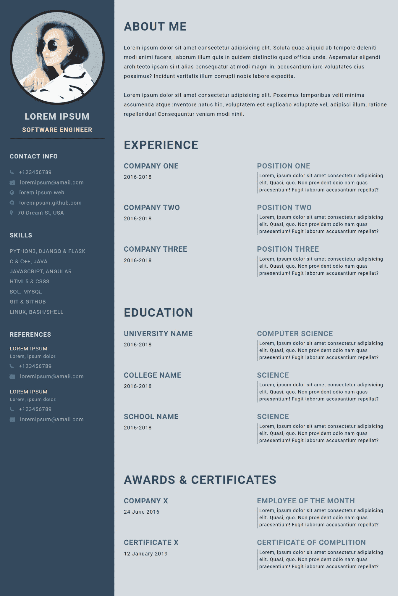
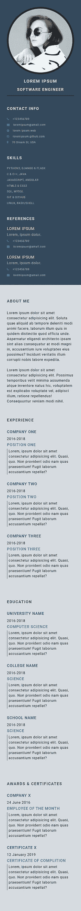
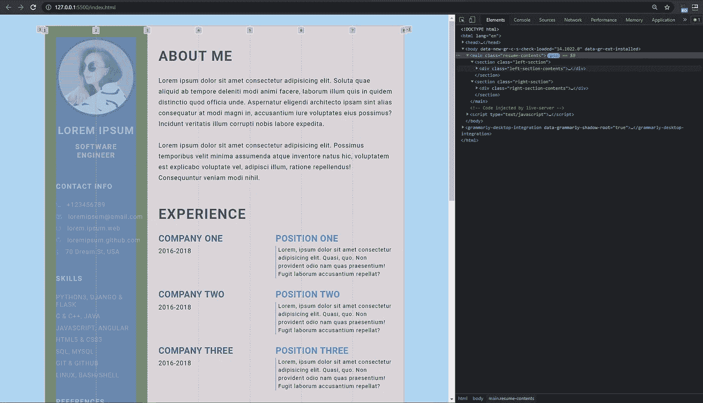
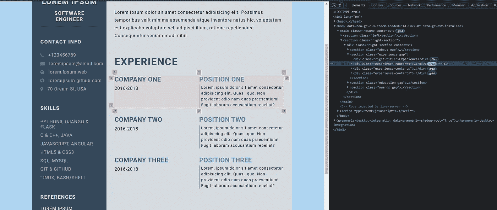
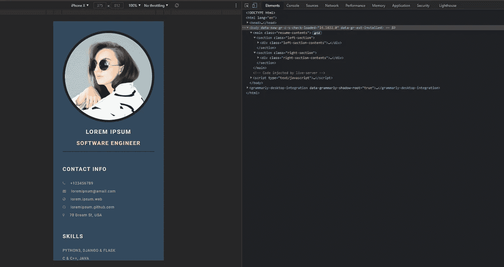

# 用 HTML 和 CSS 构建黑仔开发者简历

> 原文：<https://javascript.plainenglish.io/build-a-killer-developer-resume-with-html-and-css-3663a24151be?source=collection_archive---------2----------------------->

Photo by [Lukas](https://www.pexels.com/@goumbik?utm_content=attributionCopyText&utm_medium=referral&utm_source=pexels) from [Pexels](https://www.pexels.com/photo/two-white-printer-papers-near-macbook-on-brown-surface-590016/?utm_content=attributionCopyText&utm_medium=referral&utm_source=pexels)

## 网页设计

## 制作自己的简历，展示你的 HTML 和 CSS 技能

虽然一份简历本身并不能让你得到你想要的工作，但是一份好的简历会有很大的不同。你的简历是你的第一印象。所以，如果你花些时间完善你的简历，这份努力是值得的。

简单的黑白格式仍然是写好简历最专业的方式。但是拥有一个好看的在线版本可以给你的投资组合增添一抹亮色。你可以把它添加到你的个人网站上，分享给潜在的招聘者。

尤其是如果你应聘的是前端开发人员的角色，这种方式可以炫耀你的 HTML 和 CSS 知识。

所以最近我做了一个简历模板，打算自己用。在这篇文章中，我与你分享这个模板。你可以据此建立自己的简历。你可以通过做一些小的改变来个性化简历。

Desktop and mobile view of the resume | Screen captured by author | Profile photo by [Daria Shevtsova](https://www.pexels.com/@daria?utm_content=attributionCopyText&utm_medium=referral&utm_source=pexels) from [Pexels](https://www.pexels.com/photo/woman-wearing-white-and-black-shirt-1388888/?utm_content=attributionCopyText&utm_medium=referral&utm_source=pexels)

# 构建 HTML

如图所示，简历分为两部分。侧边栏的个人资料图像，联系信息，技能和参考。另一部分包含关于我，经验，教育和奖项。所以 HTML 有两个部分。我们将在一个`main`标签中创建两个部分。这是标记的结构—

# 使用 CSS 设置样式

这两个主要部分在 CSS 中被分成两个网格布局。对于桌面视图，简历占据了 80%的屏幕。简历分为七格。侧边栏占用两个网格，主部分占用五个网格。

在主要部分中，经验、教育和奖励被分成两个均匀的网格。例如，Experience 有两个部分，一部分用于公司名称和时间段，另一部分用于职位和描述。

Two grids of experience section | Screenshot by author

对于移动视图，所有内容都在一个网格中。

The mobile view | Screenshot by author

# 在那里你可以找到代码

这里没有分享代码，因为代码比较大。HTML 和 CSS 都包含 200 多行代码。因此，从这里直接阅读代码对您来说可能是一种令人畏惧的体验。所以我决定通过 GitHub 分享代码。

您可以从 GitHub 资源库中找到源代码。您可以克隆存储库并开始自己编辑。你甚至可以简单地复制代码，粘贴到你自己的文件中，然后开始定制。以下是 GitHub 库:

 [## FahadulShadhin/简历模板

### 用 HTML & CSS 构建的简历模板。通过创建一个帐户，为 FahadulShadhin/简历模板开发做出贡献…

github.com](https://github.com/FahadulShadhin/Resume-template) 

该模板在 GitHub 页面上是实时的。您可以从这里预览现场演示:

 [## 简历

### 人们认为肥胖是一个问题。解决办法是暂时删除所有的文件…

fahadulshahin . github . io](https://fahadulshadhin.github.io/Resume-template/) 

你可以把这份简历添加到你自己的网站上。拥有一个个人网站是现在开发者的必备条件。一个精心设计的简历部分可以帮助你的网站脱颖而出。你也可以使用适当的工具将简历做成 PDF 格式。

希望对你有帮助。谢谢你的时间。

*更多内容看*[***plain English . io***](http://plainenglish.io/)