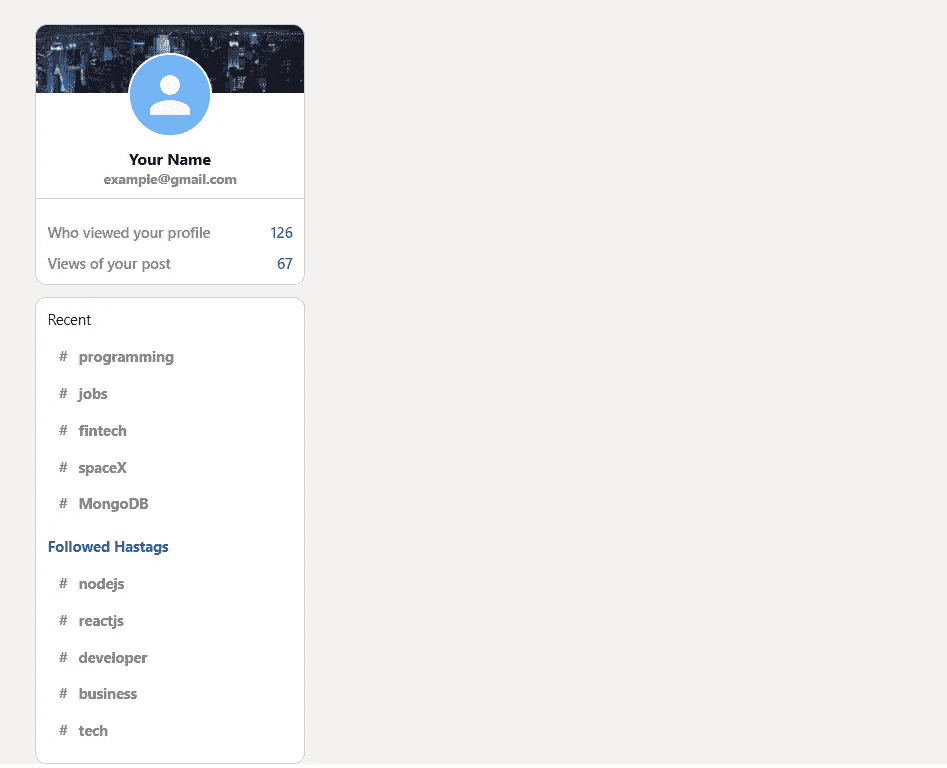
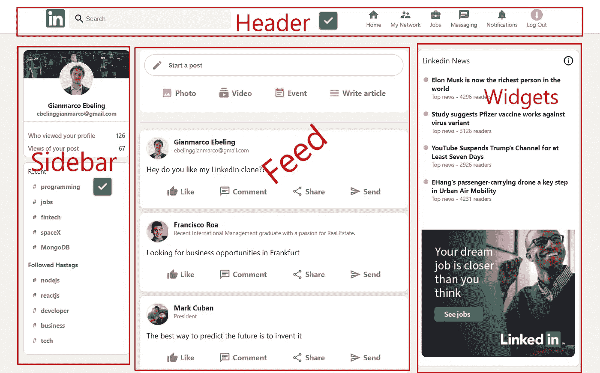

# 打造 LinkedIn 的复制品

> 原文：<https://javascript.plainenglish.io/build-a-linkedin-clone-9d22d863805b?source=collection_archive---------4----------------------->

## 第 2 部分:完成标题，构建侧栏，并使用 React 构建提要组件


Photo by [inlytics | LinkedIn Analytics Tool](https://unsplash.com/@inlytics?utm_source=unsplash&utm_medium=referral&utm_content=creditCopyText) on [Unsplash](https://unsplash.com/s/photos/linkedin?utm_source=unsplash&utm_medium=referral&utm_content=creditCopyText)

你是想让你的开发者技能更上一层楼，还是想给你未来的雇主留下深刻印象？打造这个 [**LinkedIn 克隆**](https://linkedin-clone-5ebs.web.app/) **！**

如果你卡住了，不要担心！我将在每一节的结尾为您提供完整的代码。此外，在本教程的最后一期中，我将让您访问我的 GitHub 上的完整源代码。

在本系列的第 1 部分中，我们用 Redux Toolkit 建立了 React 项目，构建了`<Header/>`组件的左边部分，并建立了用于认证、数据库和托管的 Firebase。

在这一部分中，我们将结束`<Header/>` 组件，构建`<Sidebar/>` 并开始构建`<Feed/>` 组件。

# 1.完成标题组件

为了完成我们的`<Header/>`组件，我们必须构建它的正确部分。
右边的标题将由`<HeaderOption/>`组件组成，多次重复使用，将不同的值传递给道具。


在`Header`文件夹中，创建一个名为`HeaderOption.js`的文件。

进入文件后，键入`rfce`使用 ES7 代码片段中的代码片段。这将创建一个可以导出的 React 组件。

仍然在`Header`文件夹中，创建一个`HeaderOption.css`文件，并将其导入到您的`HeaderOption.js`组件中。

`<Header/`组件将有三个道具作为参数:`Icon`，`Avatar`，和`Title.`

在`<HeaderOption/>`、**、**内添加一个带有*头选项 _ _ 图标*的`className`的**、**、`<Icon/>`组件和一个带有*头选项 _ _ 标题`className`的`<h3>`。*

为了只在`<Icon/>`组件存在时才渲染它，我们将使用条件渲染。

将`<Icon/>` 组件用花括号括起来，包括逻辑`&&`操作符。

添加一个带有*header option _ _ 图标的`className`组件。*我们将使用`Avatar`作为注销按钮。

为了只在`Avatar`组件存在时才呈现它，我们将使用条件呈现。

将`Avatar`组件用花括号括起来，包括逻辑`&&`操作符。

至此，您的`HeaderOption.js`文件应该如下所示:

现在，转到`HeaderOption.css`文件并添加以下样式:

回到`Header.js`文件，导入`<HeaderOption/>` 组件。

为每个`HeaderOption`和`avatar`传递不同的`Icon`和`Title`。

```
<HeaderOption Icon={HomeIcon} title =”Home”/>
<HeaderOption Icon={SupervisorAccountIcon} title =”My Network”/><HeaderOption Icon={BusinessCenterIcon} title =”Jobs”/>
<HeaderOption Icon={ChatIcon} title =”Messaging”/>
<HeaderOption Icon={NotificationsIcon} title =”Notifications”/>
<HeaderOption avatar= {true} title ="Log Out"/>
```

从物料界面导入`<Icon/>`组件:

```
import HomeIcon from ‘@material-ui/icons/Home’;
import SupervisorAccountIcon from  ‘@materialui/icons/SupervisorAccount’;
import BusinessCenterIcon from ‘@material-ui/icons/BusinessCenter’;
import ChatIcon from ‘@material-ui/icons/Chat’;
import NotificationsIcon from ‘@material-ui/icons/Notifications’;
```

至此，您的`Header.js`文件应该如下所示:

不要忘记在`Header.css`文件中包含以下代码:

干得好！您的标题现已完成！


# 2.构建侧栏组件


在`Header`文件夹中，创建一个名为`Sidebar.js`的文件。

进入文件后，键入`rfce`使用来自 *ES7 片段的片段。*

总是在`Header`文件夹中，做一个`Sidebar.css`文件，导入到你的`Sidebar.js`组件中。

在`Sidebar.js`文件中用*工具条的`className`创建一个`<div>` 容器。*这将包含三个`<div>` 子节点，分别为*侧边栏 __top、侧边栏 __stats* 和*侧边栏 __bottom 的`className`。*

在*侧栏 _ _ top*`<div>`*内添加以下代码:*

*在*工具条 __stats* `<div>`，内添加以下代码:*

*现在转到`App.css`文件并添加以下代码:*

*在`App.js` 文件中，导入并渲染 **<侧边栏>** 组件。*

*您的`App.js` 文件应该如下所示:*

*将以下样式添加到您的`Sidebar.ccs` 文件中:*

*干得好，侧边栏的顶部准备好了！*

**

*侧边栏的按钮部分将使用一个名为`recentItem`的函数，该函数将把一个`topic`作为参数，并将返回 JSX 代码。*

*在`Sidebar` 组件的顶部，添加如下箭头功能:*

*在*工具条 _ _ 按钮*`<div>`*内添加以下代码:**

**样式化*侧栏 _ _ 按钮* `<div>` 将此代码添加到您的`Sidebar.css`文件中:**

**干得好，侧边栏总结！**

****

# **3.设置馈送组件**

****

**在`Feed`文件夹中，创建一个名为`Feed.js`的文件。**

**进入文件后，键入`rfce`使用来自 *ES7 片段的片段。***

**总是在`Feed`文件夹中，制作一个`Feed.css`文件，并将其导入到您的`Feed.js`组件中。**

**在`Feed.js`文件中用*进给的`className`创建一个`<div>` 容器。***

**首先，我们将在**进给的顶部创建**后容器**。****

****

**The post container.**

**在带有 *feed 的`className`、*的`<div>`、**、 *feed__inputContainer* 中添加一个带有*feed _ _ input 的`className`、*、*、**、**的`className`子容器。*****

*在*进给 _ _ 输入*`<div>`*内添加以下代码:**

**这将呈现一个表单，为用户提供用个人帖子更新提要的可能性。**

**要设计提要组件的样式，请将以下代码添加到`Feed.css`文件中:**

*   **现在，在`<div>` 与 *feed 的`className`，*内添加第二个`<div>` 子元素与 *feed 的【_ _ inputOptions。***

**正如我们对 header 所做的那样，我们将制作一个`InputOption`组件，多次重复使用，向 props 传递不同的值。**

****

**在`Header`文件夹中，创建一个名为`InputOption.js`的文件。**

**进入文件后，键入`rfce`使用来自 *ES7 片段的片段。*这将创建一个可以导出的 React 组件。**

**仍然在`Pages` 文件夹中，制作一个`InputOption.css`文件，导入到你的`InputOption.js`组件中。**

**`InputOption`组件将有三个道具作为参数:`Icon` **、** `title` **、**和`color.`**

**在`InputOption`函数内部，我们将有一个来自 Material UI 的`Icon`组件和一个带有标题的`<h4>`。**

**您的`InputOption.js`文件现在应该是这样的:**

**给`InputOption.css`文件添加一些样式:**

**回到`Feed.js`文件，导入`InputOption`组件。**

**现在，在`<div>` 里面用*的`className`来渲染`InputOption`组件。***

**为每个`HeaderOption`传递不同的`Icon`组件、`titles` **、**和`color`**

**至此，您的`Feed.js`文件应该如下所示:**

**在`App.js`文件中，导入并渲染 **< Feed >** 组件。**

**做得好，进给顶部的**邮政容器**完成了！**

****

**Eyes on the prize: this will be the final result.**

# **结论**

**这部分到此为止。让我们总结一下到目前为止我们所做的工作:**

1.  **构建侧栏组件。**
2.  **完成了 Feed 组件的顶部。**
3.  **设置馈送组件**

**在下一篇文章中，我们将完成 Feed 组件，将其连接到 Firestore，并构建 Widgets 组件。敬请期待！**

***考虑* [***成为中等成员***](https://ebelinggianmarco.medium.com/membership)**如果你很欣赏阅读这样的故事，并且想帮助我这个作家。每月 5 美元，你可以无限制地访问媒体内容。如果你通过* [***我的链接报名，我会得到一点佣金。***](https://ebelinggianmarco.medium.com/membership)***