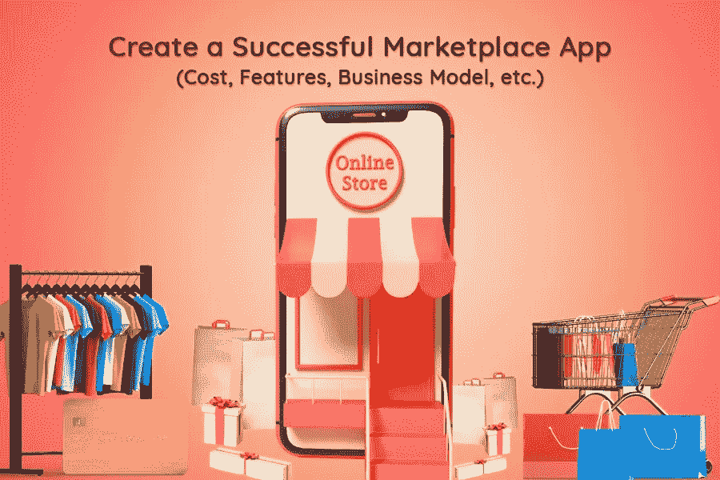
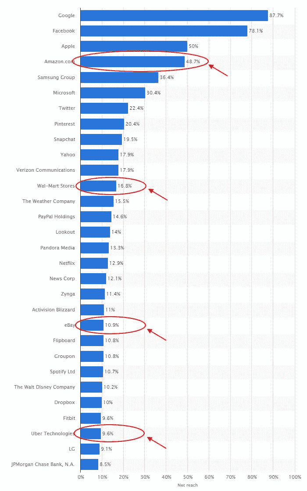
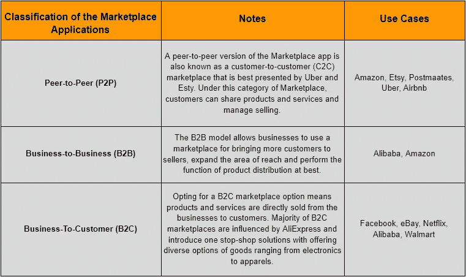
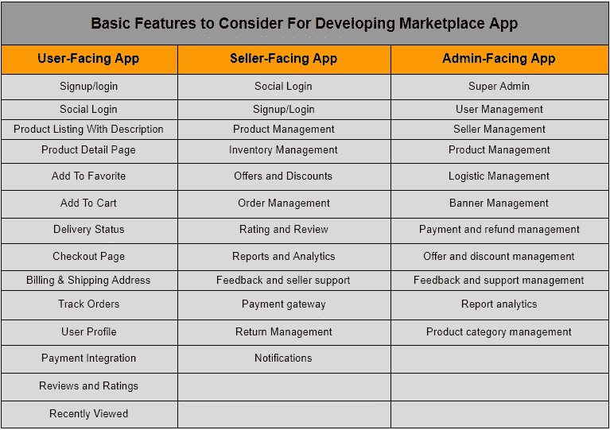

# 创建一个市场应用程序需要多少成本:成本、功能、商业模式。

> 原文：<https://javascript.plainenglish.io/build-a-marketplace-app-with-react-native-benefits-you-can-get-161238cd67b1?source=collection_archive---------11----------------------->

市场应用到底是什么？它们和电子商务按需应用一样吗？

> 简单的回答是不！

按需电子商务应用专门用于推广你的品牌的产品和服务，市场应用提供了一个平台，任何卖家或买家都可以购买和销售产品，市场所有者可以利用利润。

> 还是左右为难？

让我们用简单的话来说。你有没有想过你有太多的东西要在网上卖？一个你几乎不进去掸灰尘的额外楼层，一辆你几乎不开的第二辆车，一处出租或出售的房产？如果是，那么你已经知道市场的概念，创建在线市场应用程序的想法可以帮助你快速征服世界，并使你成为一名企业家。

在这里，你们中的许多人可能想知道，虽然在线交换商品和服务的想法并不新鲜，但它如何帮助你增加业务优势呢？

如果你也是这样的人，并且正在寻找完整的指南来了解与市场应用程序开发相关的一切，那么这个博客将会回答你所有迫切的问题。

## 以下是这个博客将回答你的问题:

*   *为什么您应该在 2022 年投资市场应用开发？*
*   *要投资的时尚和流行的市场应用类别*
*   *构建成功市场应用的挑战*
*   如何创建一个能够抓住炒作的市场应用程序？
*   *如何扩展您的市场应用？*
*   *市场应用中包含的主要功能*
*   *2022 年开发一个 Marketplace App 需要多少钱？*

让我们深入了解每一点，了解投资市场应用程序开发如何帮助您发展业务？

## **1。为什么您应该投资市场应用程序开发？**

毫无疑问，我们目前生活在这样一个充满挑战的时代，医疗保健提供者正在夜以继日地拯救生命，检疫措施正在将世界各地的企业推向灭亡，没有希望重返家园。事实上，新冠肺炎疫情的影响使雇员失业，企业主不断遭受封锁造成的经济损失。

迅速关闭商店使许多零售商陷入瘫痪，他们没有快速恢复的方法。这就是市场应用脱颖而出的地方，它为新兴企业和领先品牌提供了最大的机会来保护他们的业务，并将类似情况下的损失降至最低。

虽然这个概念并不新鲜，但包括 Airbnb、优步、亚马逊、ebay、Esty 在内的应用巨头在证明了他们的成功故事后，已经让 marketplace 成为了一个严肃的流行语。当企业在这个疫情艰难生存的时候，像亚马逊、优步、易趣这样的应用程序已经经历了巨大的销售增长。

> 你不必相信我们的话。在这里我们分享一些令人惊讶的统计数据:

*   [根据市场调查](https://www.bigcommerce.com/articles/ecommerce/ecommerce-trends/#14-ecommerce-trends-leading-the-way)报告，55%的电子商务销售是通过品牌商店完成的，而 45%的购物是通过市场完成的。
*   45%的[人选择](https://www.bigcommerce.com/articles/ecommerce/ecommerce-trends/#14-ecommerce-trends-leading-the-way)这些通过市场销售的首选目的地是
*   36%选择亚马逊
*   8%的人更喜欢易贝
*   1% Etsy 和其他
*   61%的用户更有可能在网上购物前研究品牌。
*   在移动商务公司出现后，市场应用程序产生的收入扶摇直上，去年筹集了 2000 亿美元。
*   像易贝、亚马逊这样的应用程序已经被下载了超过 5100 万次，被本地化为 10 种语言，在全球超过 195 个国家提供。

根据所有这些统计数据，可以得出这样的结论:在不久的将来，市场将继续增长，不会出现任何下滑的迹象。如果你仍然想知道为什么你应该投资市场应用程序开发和 [**雇佣一个移动应用程序开发者**](https://www.xicom.ae/services/mobile-app-developers/) ，那么你应该知道拥有市场应用程序对你的企业的真正好处。

> **为您的企业构建市场应用程序的主要优势**

*   与其他营销渠道相比，marketplace 需要更低的营销成本；
*   更多跨境拓展业务的机会；
*   因为虽然 marketplace 深受用户喜爱，但它更容易访问，也更方便；
*   企业将获得一个额外的渠道，在这个渠道上他们可以无限制地宣传和销售他们的产品和服务；
*   利用对你的产品或服务的独立评论和意见，使它们更有吸引力，并最终增加销售；
*   Marketplace 使与新的业务合作伙伴的合作变得更加容易，最终帮助您将平台做大；
*   一个完善的在线市场可以改善你的品牌形象，建立客户忠诚度。
*   您可以全天候工作，没有工作时间限制。

这些是任何企业家都可以通过在 marketplace 应用程序上的出现来利用的几个突出优势。如果你还没有一个市场，并希望扩展到移动市场，那么从了解你需要投资什么类型的市场开始是一个好主意。

## **2。要投资的时尚和流行的市场应用类别**

如果你关注了 2017 年美国领先的移动应用发行商，你会注意到脸书、亚马逊、沃尔玛、易贝和优步是少数几个最受欢迎的市场应用。

然而，许多企业往往忽略了一个事实，即这些市场应用程序属于不同的类别(C2C，B2C，B2B)。

*每个应用程序都可以根据客户类型、销售模式、市场领域等分为不同的类别。*

**简而言之:**每个版本的 marketplace 应用程序都需要不同的功能集和对架构的仔细理解。因此，在你直接进入雇佣一家 [**应用程序开发公司**](https://www.xicom.ae/services/mobile-app-development/) 的过程之前，有必要看一看在构建一个市场应用程序时可能出现的挑战。

## **3。构建成功市场应用的挑战**

无论你选择开发哪个版本的 marketplace 应用程序，这些都是给你带来巨大障碍的常见挑战。甚至专家们也同意这一事实，在做一些开创性的事情并对创业公司投入巨额预算之前，他们会进行市场调查并向其他领导者学习。

> 因此，让我们从构建市场平台的挑战开始:

## **挑战 1#先有鸡还是先有蛋的问题:对买卖双方来说**

你可能意识到这样一个事实:市场是由客户和卖家组成的，进入这个行业的真正痛苦在于，你需要同时吸引买家和卖家，以满足平台的供应或需求。

*“想象一下，如果你没有与当地餐馆合作，你如何说服用户注册新的 speedo-local delivery of the food？如果你当时只有为数不多的用户，你会如何加入当地餐馆并注册呢？”*

一定会有专家指导你投资营销。但如果你需要在营销上花费额外的 bug，那么这个应用有什么用呢？因此，我们在这里揭示了解决先有鸡还是先有蛋的问题的秘诀。我们将建议通过对应用程序进行一些更改来应对这一挑战。

> **亲温馨提示:**

*   应用程序应该具有吸引力，能够立即抓住用户的注意力。
*   应该遵循一个超级简单和简短的注册程序。
*   易于在其他平台上分享
*   为有效的推荐程序使用带有推荐代码的深层链接
*   使用 API 与其他应用程序集成，实现跨平台促销

## **挑战 2#产品质量小控制赢得用户信任**

我们的意思是，作为市场应用程序的所有者，您可以对提供商通过平台提供的服务或产品施加某些限制。为了完美地实现这一功能，您可以实施以下技巧:

> **亲温馨提示:**

*   实施垃圾邮件标记系统，将试图欺诈的卖家或买家列入黑名单。
*   仅添加经过验证的产品和服务评论和评级。
*   一段时间后使评论不可编辑，以避免在您的平台上出现操纵者。

## **挑战 3#限制你在平台外的对话**

作为市场应用程序的所有者，这是您必须处理的最聪明的事情。许多企业最终选择了在开发市场应用方面经验丰富的移动应用开发公司，他们无法控制市场应用之外的买家和卖家之间的对话。

例如，如果同一个专业人士之前已经打扫过你的房子几次，并且你已经和他建立了个人联系，你会从应用程序中雇佣一个房屋清洁专业人士吗？

> **亲小贴士:**

*   在这种情况下，如果你有太多的供应，那么你可以雇用一个应用程序开发人员，他可以利用这种方法，并通过编程使第一次互动后不可能匹配相同的买家和供应商。
*   另一种可能性是为买家提供下一笔订单的折扣，刺激他们再次购买新的商品。
*   如果不在应用程序中，您可以通过提供担保或优质服务等方式保持联系。

## **4。如何创建一个能够抓住炒作的市场应用程序？**

现在你知道了构建一个成功的市场应用的原因和挑战，但是开发一个帮助你抓住宣传的市场应用的主要步骤是什么？所以让我们来看看主要步骤:

*   ***市场调研，分析和评估 App 创意***
*   ***快速成型+用户测试***
*   ***开发一个 App +多平台测试***
*   ***部署 App +维护***

如果你浏览过其他博客来开发 marketplace 应用程序，那么你可能会发现所有这些关键步骤，但是，与许多其他移动应用程序相比，当你开发 marketplace 应用程序时，还是有一些不同的。

应用程序上的一切似乎都很有序，但在地下，开发所有这些并使其在应用程序商店上无缝运行需要时间、努力、预算和最重要的技术技能。

*   **步骤 A:开始编写应用程序的后端**

后端是 marketplace 应用程序的主干，你的应用程序逻辑将驻留在这里，并管理买家和卖家的所有算法。它是你的 marketplace app 的一个神奇的核心引擎，所以与其赶时间，不如雇一个软件开发公司，可以从头到尾管理整个过程；从下订单到最终交易，再到服务或产品审查。

*   **第二步:构建应用程序有趣的一面**

在这里，应用程序的花哨内容指的是面向消费者的市场应用程序，用户在那里期待商品。因此，你必须付出额外的努力，让你的应用程序页面看起来更精致、更吸引人，方法是使用:

*   商品或服务的描述
*   经过验证的用户评论和排名

> 除此之外，您还可以添加其他现代功能，让您的 marketplace 应用令人印象深刻，这些功能包括:

*   简单的注册和授权流程
*   卖家和买家的用户资料
*   带有搜索和过滤器的产品目录
*   应用内消息和推送通知
*   与提供商匹配的地理定位

总而言之，面向客户的市场应用是人们在开发市场应用时最关注的。但是游戏并没有就此结束，这个谜题还有更多的部分有待解决。

*   **步骤 C#使用 React Native 开发应用**

当 [**开发市场应用**](https://www.xicom.ae/services/mobile-app-development/) 时，确保你为 iOS 和 Android 平台上的驱动程序和提供商建立了专门的面板。例如，司机需要接收带有用户档案的乘车请求，卖家需要一个上传产品的地方，用户需要他们的档案来跟踪一切。

如果你在精益预算和时间表上工作，那么这是另一个令人头痛的问题。因此，为了最大限度地减少工作量，许多公司更喜欢使用 React Native，这是一种领先的跨平台应用程序开发框架，允许您通过使用单个代码库来构建在其他平台上无缝运行的应用程序。

当然，不言而喻，UX 应该是经过深思熟虑的，以抓住用户的注意力，让他们参与到你的应用中，并鼓励他们注册你的应用。

*   **步骤 D#获得合法的技术支持**

从领先品牌中获得灵感，并学习一些技术捷径，以减少大量的开发时间。在这里，我建议您使用现成的组件来实现各种功能。

*这里有一些使用 SDK 和 API 来构建你的 marketplace 应用不同部分的专家提示:*

*   **认证:**谷歌，脸书，苹果 ID，Auth0
*   **聊天:** Twilio，SendBird
*   **地图:**谷歌地图、苹果地图、地图盒子、Carto
*   **支付:** Stripe、PayPal、Skrill
*   **后端:** Firebase，解析

为了将更多的 API 整合到你的 marketplace 应用中，你可以 [**雇佣应用开发者**](https://www.xicom.ae/solutions/hire-developers/) ，他们可以真正放大项目需求，并在你有限的时间内完成项目。

*   **步骤 E#启动您的应用并维护它**

与市场应用程序不同的一点是，一旦你发布了你的应用程序，你将需要不断地管理内容，以避免违反规则，如垃圾邮件或不适当的图像等。因此，为了避免这样的麻烦，你可以寻找能够提供发布后支持的工程师。

所以你开发了一个可以让你进入市场行业的应用程序。但主要问题是如何根据市场扩大规模。

## **5。如何扩展你的市场应用？**

无论你开发了多么出色的应用程序，为了让自己在市场上保持领先，你通常需要相应地扩展应用程序。

*以下是帮助你发展市场应用的快速提示:*

*   如果你想扩展你的应用程序，找到并致力于某个特定的领域是很重要的，即使你的市场是垂直的，你也需要有一些独特的东西来区分你和你的竞争对手。
*   在你的市场应用程序下提供尽可能多的商品。
*   专注于对你的业务来说更难的方面，即供应或需求。如果能改善弱点，强的就更厉害了。
*   努力提高透明度，改进评论和评级系统，帮助你赢得用户的信任。
*   在引入新功能时，在一个时间点专注于一个功能。
*   不要太快改变你的策略，因为结果可能就在眼前。
*   首先定义并锁定最有价值的用户，因为他们可以影响其他人。
*   围绕你的市场建立一个社区——组织活动和聚会。
*   保护你的产品的独特性。

了解这些技巧是否足以扩展市场应用？当然不是！有一些关键的特性和功能在其中扮演着重要的角色。我们来讨论一下:

## **6。市场应用中包含的主要功能**

当你进入 2022 年时，确保你正在构建的市场应用能够满足现代市场不断增长的需求。您的客户期望某种程度的功能，因此您应该密切关注细节。这里有几个特性，您可以选择通过适当的集成来开发。

在我们深入挖掘现代功能之前，让我们了解一下您需要在专用应用版本中集成的基本功能——用户、卖家和管理员。

> 注意:如果你正在开发一个 MVP 和中等版本的应用程序，这些是需要考虑的基本功能。

## **市集 App 主要功能:**

*   **基于地理位置的搜索:**这无疑是主要功能之一，因为它将帮助你从 GPS 和服务器上检测用户的位置。但这一功能的功能性还取决于用户的选择，他们是否希望允许应用程序访问该位置。事实上，该应用程序还允许用户手动添加位置，以便在运行时在地图上看到附近的商店。
*   聊天机器人整合:聊天机器人如今在客户支持方面风靡一时，2020 年 80%的企业已经开始使用这些聊天机器人。聊天机器人与网上购物者的互动很像商店里的销售助理，会立即回答他们的所有问题，而不会感到沮丧。
*   **AI 个性化购物体验:**人工智能和机器学习可以让顾客拥有自动化和个性化的购物体验。人工智能不断收集客户在你的平台上的行为、他们购买的产品类型、他们停留的时间以及他们喜欢购买的产品的数据。
*   **语音搜索:**预计到 2025 年，75%的购买将通过语音搜索命令进行。语音搜索的兴起在关键词和内容方面为市场所有者创造了机会。
*   **吸引社交媒体:**除了评论和评级，社交媒体上的分享选项是销售成功的另一个关键驱动因素，也是 2022 年任何在线门户网站都有望实现的一项功能。
*   **个人通知:**让你的用户了解并参与你的应用的最好工具之一就是使用个人通知。当你的供应商将有任何特殊的交易，免费送货，或季节性优惠，客户必须立即得到通知。

# **2022 年开发一个 Marketplace App 需要多少钱？**

那么 2022 年做一个 marketplace app 需要多少钱呢？我们终于找到了这篇文章的要点，当涉及到开发应用程序时，它总是困扰着初创公司和企业。现在你已经知道了分类、方法、过程、特征，让我们来谈谈预算。

> **让我们分解预算:市场应用开发成本**

*   **5000 美元到 10，000 美元以上的基本应用预算**

雇佣一个应用程序开发团队从头构建一个平台可能是一个很好的选择，但由于预算紧张，所以可以选择构建集成所有基本功能的 MVP 模型。对于初创公司来说，这可能是一个很好的想法，首先是一个基本模型，在分析了用户需求和市场需求之后，他们可以相应地扩大应用程序的规模。

*   **预算在 10，000-15，000 美元以上的现代应用**

现代市场应用程序集成了附加功能和高级 UI/UX，使您的应用程序无缝运行，并确保出色的用户体验。雇用 react 原生应用程序开发人员是一个很好的选择，因为他们可以帮助您开发跨平台的应用程序，利用 RN 功能的广泛选择，包括单一代码库、跨平台兼容性、热重装等，从而节省您的预算和开发时间。

*   **预算在 15，000 到 50，000 美元以上的大型复杂应用**

大型复杂的应用程序是指利用人工智能、人工智能、深度数据学习等功能齐全的应用程序。有了所有这些高级功能，您可以更好地了解用户行为和市场趋势，从而能够实施业务战略。雇佣一家顶尖的应用程序开发公司来从头开始构建一个定制的市场应用程序 拥有所有必要的现代功能可能是一个完美的选择。你只需要有一个绝妙的想法，团队就会把它转化成一个健壮、可扩展和灵活的产品。

总之，公平地说，marketplace 的启动成本取决于您选择的功能和集成数量。平均而言，功能成本大约在 10，000 美元到 15，000 美元以上。但是，注入所有的特性将导致一个平台的开发成本从 20，000 美元到 25，000 美元以上。要获得 marketplace 应用程序开发成本的详细分类，我们始终建议您联系专家。

# **结论**

在这篇博客的结尾，可以说市场应用已经迅速成为了热门话题。如果你也打算成为这个蓬勃发展的行业的一部分，那么现在是时候雇佣一家 [**移动应用开发公司**](https://www.xicom.ae/services/mobile-app-development/) 了。他们会分析你的想法、预算和目标，并相应地为你提供最适合你需求的解决方案。

由于在定制和设计优秀应用程序方面经验丰富，开发团队可以更好地了解市场不断变化的需求。

希望这篇博客能消除你对市场应用开发的所有疑虑。不过，如果你有任何疑问，你可以在下面留言。

*更多内容尽在*[*plain English . io*](http://plainenglish.io/)