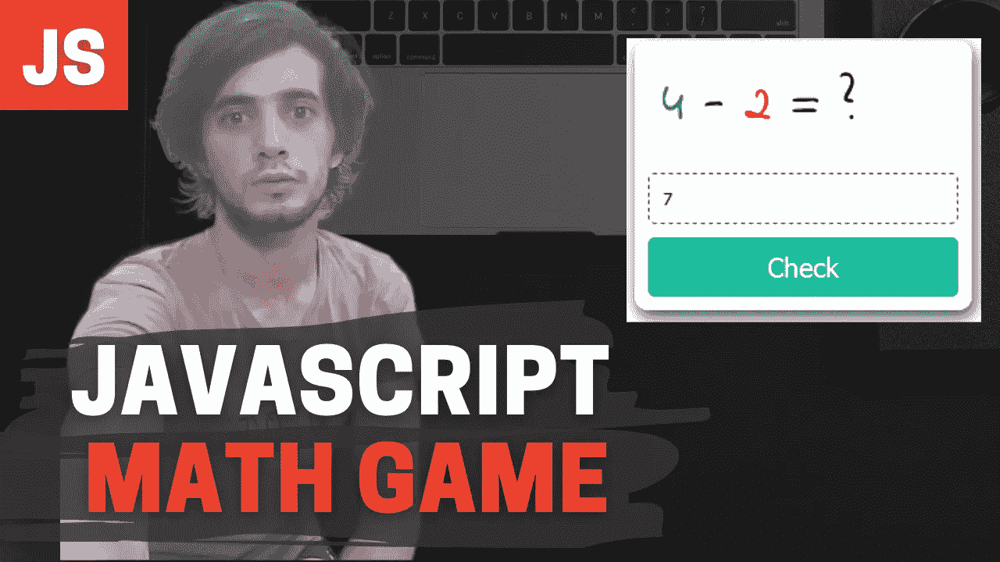

# 用 JavaScript 构建一个数学游戏

> 原文：<https://javascript.plainenglish.io/build-a-math-game-with-javascript-8271f162b887?source=collection_archive---------2----------------------->

## 让我们用 JavaScript、HTML 和 CSS 构建一个数学游戏



Image Credit: By Author “Lia Sue Kim” the guy in the picture

这个项目有 8 个子单元。推荐看视频了解解释。视频也有时间戳/时间码。

对于 Medium Platform 的读者，请按照本文中的数字一步一步阅读。

JavaScript Math Game Project

# 1.JavaScript 数学游戏文件夹结构

我有**一个文件夹**，里面有 **3 个文件**。我的文件夹名是“数学游戏 1.0 版”，你可以随意命名你的文件夹。

数学游戏 1.0 版>>

*   index.html(HTML 文件)
*   main.css (CSS 文件)
*   app.js(JavaScript 文件)

再说一次，你可以随意说出一些描述性的东西！

a)在我的 HTML 文件中，我有一个空的 HTML 样本

```
<!DOCTYPE html>
<html>
    <head>
        <meta charset="utf-8">
        <meta http-equiv="X-UA-Compatible" content="IE=edge">
        <title></title>
        <meta name="description" content="">
        <meta name="viewport" content="width=device-width, initial-scale=1">
        <link rel="stylesheet" href="main.css">
    </head>
    <body><script src="app.js" async defer></script>
    </body>
</html>
```

b)在我的 CSS 文件中，我有一些基本的样式来移除浏览器的默认样式，并为页面设置我自己的样式。也可以使盒子水平和垂直居中。和 2 种谷歌字体

```
/* Google Fonts */
[@import](http://twitter.com/import) url('[https://fonts.googleapis.com/css2?family=Indie+Flower&display=swap'](https://fonts.googleapis.com/css2?family=Indie+Flower&display=swap'));
[@import](http://twitter.com/import) url('[https://fonts.googleapis.com/css2?family=Montserrat:wght@100&display=swap'](https://fonts.googleapis.com/css2?family=Montserrat:wght@100&display=swap'));
/* remove basic style for the page and border-box */
* {
  margin: 0;
  padding: 0;
  box-sizing: border-box;
}
/* centering to demo */
body {
  width: 100vw;
  height: 100vh;
  display: flex;
  justify-content: center;
  align-items: center;
  font: 20px 'Montserrat', sans-serif;
}
```

# 2.数学游戏用户界面— HTML

对于 HTML，我们有两个部分。

*   第一个是“游戏”本身。中间的盒子。
*   正确与错误答案的模式。

**a)游戏— HTML**

这里我们有一个**div**，它的类是**。数学游戏。这将是游戏的容器。(柔性容器)**

在里面我们有:

*   一个 span 标签(类为**)。CSS 项目**
*   一个输入标签(类别为**)。CSS 项目**)&(JS 输入 el 的 **id)**
*   和一个按钮标签(类为**)。CSS 的项目**)&(**JS 的 check-BTN id**)

```
<!-- 1 The Game  -->
       <div class="math-games">
           <span class="items">
               <span class="blue">4</span> - <span class="red">2</span> = ?
           </span>
           <input id="input-el" type="text" class="items" placeholder="type your answer ">
           <button id="check-btn" class="items">Check</button>
       </div>
```

b) **对错答案的模式**

```
<div id="myModal" class="modal-container">
    <span class="close">&times;</span>
      <p class="theAnswer">The answer</p>
  </div>
```

# 3.数学游戏用户界面— CSS

让我们从**容器开始设计。数学游戏)**

a) **对容器进行造型(。数学游戏)**

```
 /* the container */
.math-games {
  background: #fcfcfc;
  padding: 10px;
  border-radius: 10px;
  box-shadow: 2px 5px 10px #34495e;
  width: 250px;
  height: 200px;
  display: flex;
  flex-direction: column;
  justify-content: center;
  align-items: center;
}
```

b) **样式化容器内的子元素(。数学游戏)**

你可以复制，如果你想或观看视频和打字。

解释一下，推荐看完整视频。

```
/* input element*/
input {
  border: 1px dashed #333;
  outline: none;
  border-radius: 5px;
  background: none;
}
.blue {
  color: blue;
}
.red {
  color: red;
}
/* span tag*/.math-games span {
  font: 40px "Indie Flower", cursive;
}
/* styling the button */
button {
  border: none;
  background: #1abc9c;
  color: #fff;
  border-radius: 5px;
  font-size: 20px;
}
button:hover {
  cursor: pointer;
}
.items {
  width: 100%;
  padding: 10px;
  margin: 5px 0;
}
```

c) **用样式化莫代尔。模态容器**

```
/* Styling the modal */
.modal-container {
  position: absolute;
  right: 50px; 
  bottom: 40px;
  width: 300px;
  height: 100px;
  border: 1px solid #555;
  padding: 20px;
  background: #e74c3c;
  color: #fff;
  font-weight: bold;
  display: flex;
  align-items: center;
  box-shadow: 2px 2px 2px #555;
  display: none;
}
.close {
  position: absolute;
  top: 0;
  right: 10px;
  font-size: 40px;
}
.close:hover {
  cursor: pointer;
}
```

# 4.JavaScript——游戏变量

既然游戏的用户界面已经准备好了，我们可以把重点放在 JavaScript 部分。

可以看到**4–2 =？**在那下面我们有 2 个箱子:

*   带有 **id="input-el"** 的输入字段(获取用户输入)
*   id = **"Check-btn"** 的 check 按钮(为了检查和比较答案，对于**正确的**和**错误的**答案)稍后我们将为“正确的”&“错误的”答案创建一个数组。

# 超文本标记语言

在 JavaScript 中，我们将选择这两个 HTML 标签:

```
<**input id="input-el"** type="text" class="items" placeholder="type your answer">
      <**button** **id="check-btn"** class="items">Check</button>
```

**JavaScript 选择上面的 HTML**

```
// The Game variablesconst inputEl = document.querySelector("**#input-el**");
const checkBtn = document.querySelector("**#check-btn**");console.log(inputEl);
console.log(checkBtn);
```

现在，请随意将它们记录到控制台，看看您是否选择了正确的元素。**好吗？**

# 5.JavaScript —单击 checkBtn 时获取用户输入

所以，现在我想做的是当一个**用户**输入一些东西，并点击**的 Check** 按钮时，我想用 JavaScript 得到**用户的输入**。

现在我们已经创建了上面的变量，就是为了这个。
你知道把你的**数据**贴在哪里，怎么贴。
但是操作**数据的**动作**呢？**

我们需要**功能！** 同样在函数内部，我们需要另一个变量为**用户输入**。

我将使用**事件监听器**和**点击**事件。

```
**// The Game variables**const inputEl = document.querySelector(**"**#input-el**"**);
const **checkBtn** = document.querySelector("#check-btn**"**);**// check btn function****checkBtn**.addEventListener("click", function() {let **userInput** = **inputEl.value**;})
```

但是这种方式会返回“ **String** ”数据类型。我要的是“**号”。**

我们可以使用 **parseInt()** 函数。在 JavaScript 中， **parseInt()** 函数用于将**字符串转换为数字**。

让**将**的**输入值**包装在 **parseInt()** 中

所以让我们用 JavaScript 代码来修改它:

```
// check btn functioncheckBtn.addEventListener("click", function() {let userInput = **parseInt(inputEl.value**);console.log(userInput)})
```

随意将**用户输入记录到控制台**。
然后进入你的 **HTML 页面**在**输入栏里输入一些东西**。
点击**检查按钮**，最后查看你的浏览器控制台，看看你是否得到了你键入的内容**用户输入**

**6。JavaScript —选择“模态”&子元素、“关闭 Btn”和“回答段落”**

在这一部分，我想选择模态本身和子元素。因为当用户输入内容并点击按钮时。
我想:

1.  显示模态(**弹出框**)
2.  在**答案段**(显示**正确或错误答案**)
3.  然后关闭 Btn(X 符号),这将关闭父元素**模态**

有道理？我们继续。

下面是我们想要选择的 **HTML** :

```
<!-- Modal for wrong or/and right answers-->
<div id="**myModal**" class="modal-container">
  <span class="close">&times;</span>
    <p class="theAnswer"></p>
</div> 
```

**JavaScript** 选择**模态**， **X 符号(关闭 btn)** ，&，**回答段落**。

```
// the modal variables
// modal, the answer, x sign to close modal// #1 select modal
const modal = document.querySelector("#myModal");// #2 select the answer
const theAnswer = document.querySelector(".theAnswer");// #3 select the s sign (close btn)
const closeBtn = document.querySelector(".close");
```

# 7.JavaScript —为“正确”和“错误”答案创建一个数组“theAnswerOptions”

在我们做任何事情之前，我们必须创建一个包含 2 个值的数组。

*   正确(右)
*   不正确的

但我的信息更具描述性，更友好或更温和。

1.  正确，干得好
2.  不正确，再试一次

让我们创建数组。

```
// Answers: "Correct, good work", "Incorrect, try again"let answerOptions = ["Correct, good work", "Incorrect, try again"];
```

# 8.数学游戏的 JavaScript if/else 语句

现在，让我们给游戏增加一些逻辑。如果有人玩你的数学游戏，你不必亲自/手动告诉人们答案是对还是错。

您可以使用 JavaScript 对此进行编程。您的代码可以“以编程方式”做到这一点。

**a) If/else 语句—让我们为“正确答案”编写代码**

在我们之前创建的 **checkBtn** 函数中。在**用户输入**变量后

```
checkBtn.addEventListener("click", function() {

let userInput = parseInt(inputEl.value);

 **if(userInput === 2) {
    modal.style.background = "#2ecc71";
    theAnswer.textContent = userInput + " is " + answerOptions[0]
  }** 
})
```

代码解释:

在 if 语句内部，我们要打印出**正确答案**。所以:

*   if(userInput === 2)假设 4–2 = 2，哪个为真
*   然后**modal . style . background = " # 2ecc 71 "**或将 modal 的背景更改为绿色十六进制颜色 **#2ecc71**
*   还有**the answer . text content = user input+" is "+answer options[0]** 这部分是把 modal 里面的答案段落的文本内容改成字符串“ **2 是正确的，干得好”**打印到 modal。
    **answerOptions[0]** 选择数组**中的第一项。**

**b) else/if 语句—让我们为“不正确答案”编写代码**

> 对于不正确的答案，我们有简单的判定。下面是伪代码:
> 如果 userInput 小于 2 或大于 2
> **(user input<2 | | user input>2)**

然后:

1.  取 modal 并设置其背景为红色
2.  从数组中选择第二个项目 **answerOptions[1]** 并打印到 modal " ***一个数字是*不正确的，根据他们键入的数字再试一次**

```
checkBtn.addEventListener("click", function() {
  let userInput = parseInt(inputEl.value);

  if(userInput === 2) {
    modal.style.background = "#2ecc71";
    theAnswer.textContent = userInput + " is " + answerOptions[0]
  } **else if(userInput < 2 || userInput > 2) {
        modal.style.background = "#e74c3c";
    theAnswer.textContent = userInput + " is " + answerOptions[1]
  }** })
```

最后一部分是:

**c) Else 语句——如果用户没有键入数字或让框为空**

```
else {
    modal.style.background = "#34495e";
    theAnswer.textContent = "Please type a number"
  }
```

如果他们没有键入一个**数字**或者让框**为空**，我们希望模态的背景保持**红色**，但是消息将是**“请键入一个数字”**

**d)开头显示情态。**

默认情况下，modal 在 CSS 中是不可见的，所以在 checkBtn 函数中，第一行代码应该是**modal . style . display = " block "**

```
checkBtn.addEventListener("click", function() {
  **modal.style.display = "block"
})**
```

游戏基本就这样了。

如果你喜欢我的东西，请关注并支持我。

如果没有，就把它分享给你的敌人，这样他们也能遭受数学& JavaScript 的折磨。

*更多内容请看*[***plain English . io***](http://plainenglish.io/)*。报名参加我们的* [***免费周报***](http://newsletter.plainenglish.io/) *。在我们的* [***社区***](https://discord.gg/GtDtUAvyhW) *获得独家获得写作机会和建议。*