# 使用 Solidity、Ethereum Smart Contract、React 和 TailwindCSS 构建一个迷你 Buymeacoffee dApp

> 原文：<https://javascript.plainenglish.io/build-a-mini-buymeacoffee-dapp-using-solidity-ethereum-smart-contract-reactjs-tailwindcss-33df74345a04?source=collection_archive---------1----------------------->


Photo by [Martin Shreder](https://unsplash.com/@martinshreder?utm_source=medium&utm_medium=referral) on [Unsplash](https://unsplash.com?utm_source=medium&utm_medium=referral)

区块链通常是收入最高的编程行业之一，作为受薪员工，开发人员的平均年薪在 15 万美元至 17.5 万美元之间。听起来很有趣，对吧？

要了解更多关于开发者路线图和如何开始的信息，[点击这里](https://blog.idrisolubisi.com/web-3-a-developer-roadmap-and-resources-to-get-started)。

在本文中，我们将使用 Solidity、以太坊智能合约、React 和 TailwindCSS 构建一个迷你 Buymeacoffee dApp。这将是一个平台，互联网上的任何人都可以了解我们的一些情况，并给我们寄钱购买咖啡和一张便条，这些信息通过以太坊智能合同保存在区块链上。(智能合约本质上是保存在区块链上的代码，可以被读取和写入；我们稍后会更详细地讨论这个问题。)

我们将创建智能合同并部署它。我们还将建立一个网站，让人们连接他们的钱包，并参与我们的智能合同。

这里有一个链接指向[现场演示](https://buymeacoffee.vercel.app/)和 GitHub 库👉[前端](https://github.com/Olanetsoft/buymeacoffee-fe)和[后端/智能合约](https://github.com/Olanetsoft/buymeacoffee-be)

## 先决条件

*   让我们确保我们的电脑上安装了节点/NPM。如果你没有，请点击[这里的](https://hardhat.org/tutorial/setting-up-the-environment.html)获取指南

## 项目设置和安装

接下来，让我们去终点站。我们需要进入我们希望使用的目录，然后运行以下命令:

```
mkdir mini-buymeacoffee-be
cd mini-buymeacoffee-be
npm init -y
npm install --save-dev hardhat
```

现在，我们应该有一个安全帽。让我们通过运行下面的命令来启动一个示例项目:

```
npx hardhat
```

我们将选择创建一个示例项目。接受所有请求。样本项目需要安装安全帽-华夫饼干和安全帽-乙醚。这些是我们稍后会用到的一些其他东西:)。

以防万一它没有自动完成，我们将安装这些其他要求。

```
npm install --save-dev @nomiclabs/hardhat-waffle ethereum-waffle chai @nomiclabs/hardhat-ethers ethers
```

要确保一切正常，请运行:

```
npx hardhat test
```

我们将在控制台中看到通过测试的结果。

现在我们可以从测试文件夹中删除`sample-test.js`了。从脚本目录中删除`sample-script.js`。之后，转到合同并删除`Greeter.sol`。

> 文件夹本身不应被删除！

接下来，在 contracts 目录下，我们会创建一个名为 CoffeePortal.sol 的文件，在使用 Hardhat 的时候，文件布局真的很关键，一定要注意！我们将从每份合同的基本结构开始。

```
// SPDX-License-Identifier: UNLICENSED

pragma solidity ^0.8.0;

import "hardhat/console.sol";

contract CoffeePortal {

    constructor() payable {
        console.log("Yo! Smart Contract");
    }
}
```

要构建和部署我们的智能合约，请导航到`scripts`文件夹，创建一个名为`run.js,`的新文件，并用以下代码片段更新它:

```
const main = async () => {

// This will actually compile our contract and generate the necessary files we need to work with our contract under the artifacts directory.
  const coffeeContractFactory = await hre.ethers.getContractFactory('CoffeePortal');
  const coffeeContract = await coffeeContractFactory.deploy();

  await coffeeContract.deployed(); // We'll wait until our contract is officially deployed to our local blockchain! Our constructor runs when we actually deploy.

 console.log("Coffee Contract deployed to:", coffeeContract.address);
};

const runMain = async () => {
  try {
    await main();
    process.exit(0);
  } catch (error) {
    console.log(error);
    process.exit(1);
  }
};

runMain();
```

让我们运行它！

```
npx hardhat run scripts/run.js
```

您应该会看到类似于下面的内容:

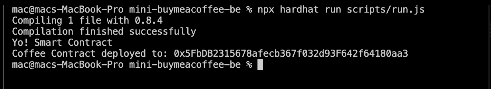

我们有一个有效的智能合同，🥳让我们将它部署到网络上，让世界各地的每个人都可以使用。

在`scripts`文件夹下，创建一个名为`deploy.js`的文件。这是它的代码。看起来和 run.js 超级像。

```
const main = async () => {
  const [deployer] = await hre.ethers.getSigners();
  const accountBalance = await deployer.getBalance();

  console.log("Deploying contracts with account: ", deployer.address);
  console.log("Account balance: ", accountBalance.toString());

  const Token = await hre.ethers.getContractFactory("CoffeePortal");
  const portal = await Token.deploy();
  await portal.deployed();

  console.log("CoffeePortal address: ", portal.address);
};

const runMain = async () => {
  try {
    await main();
    process.exit(0);
  } catch (error) {
    console.error(error);
    process.exit(1);
  }
};

runMain();
```

现在，我们将使用本地主机网络在本地部署下面的命令进行测试:

```
npx hardhat run scripts/deploy.js --network localhost
```

我们应该有类似于下面的东西:

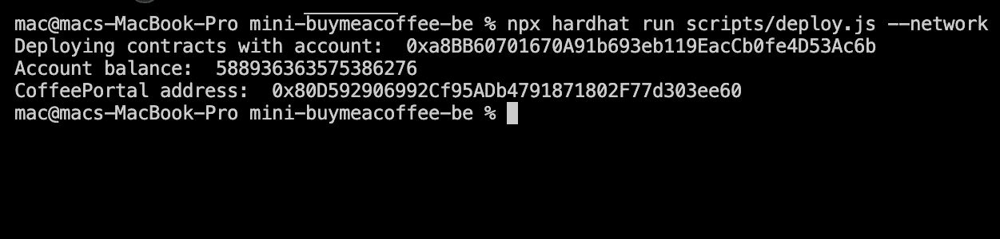

## 构建 CoffeeContract 并将其部署到区块链

现在一切就绪，包括测试脚本和‘deploy . js’文件。使用以下代码片段，我们将更新智能合同、run.js 和 deploy.js 文件:

`contracts/CoffeePortal.sol`

%[https://gist . github . com/Olanetsoft/a 9105 c 734228 f9e 15965 ef 8 a 36 ab 825 c]

更新`scripts/run.js`

%[https://gist . github . com/Olanetsoft/f8ea 2716 f 18 a 6 f 9 bb 7 E1 Fe 1 FB 62 b 13 Fe]

更新`scripts/deploy.js`

%[https://gist . github . com/Olanetsoft/5c 9d 3 e 8275 fcde 262 dfe 17 a 0508858 AE]

现在是时候进入正题了，部署到真正的区块链。

在我们部署到区块链之前，我们需要注册一个炼金术账户。

炼金术基本上允许我们广播我们的合同创建交易，以便矿工可以尽快拿起它。该交易一旦被开采，就作为合法交易被广播到区块链。在那之后，每个人的区块链的拷贝被更新。

注册后，我们将创建一个如下所示的应用程序。记得将网络选择更改为 Rinkeby，因为那是我们将要部署的地方。

我们把它从 mainnet 换成 Rinkeby 是有原因的。因为是真金白银，不值得挥霍！我们将从“测试网”开始，它是“主网”的克隆，但是使用虚拟货币，所以我们可以尽可能多地进行实验。然而，重要的是要注意，测试网是由真正的矿工操作的，旨在模拟真实世界的条件。

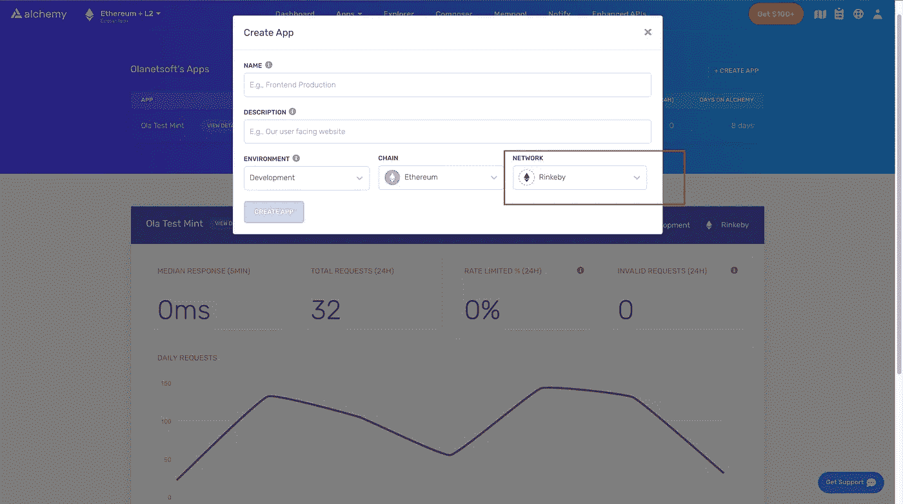

之后，我们将需要如下所示获取我们的密钥，并存储它们以备后用:

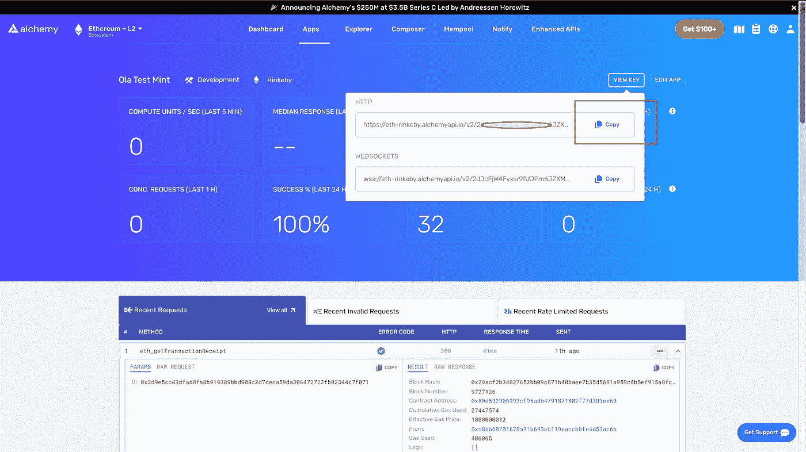

我们将需要一些假的 ETH 在我们的 testnet 帐户中，我们将不得不从网络中请求一些。这个假 ETH 只能在这个 testnet 上使用。林克比可以用水龙头得到一些假的 ETH。

| Name | Link | Amount | Time | ^-^-^-^-^-^-^-^-^-^-^-^-^ | | my crypto |[https://app.mycrypto.com/faucet](https://app.mycrypto.com/faucet)| 0.01 | None | | build space |[https://buildspace-faucet.vercel.app/](https://buildspace-faucet.vercel.app/)| 0.025 | 1d | | Ethily |[https://ethily.io/rinkeby-faucet/](https://ethily.io/rinkeby-faucet/)| 0.2 | 1w | |官方 rinke by |[https://faucet.rinkeby.io/](https://faucet.rinkeby.io/)| 3/7.5/18.75 | 8h/1d

表由 [Buildspace](https://buildspace.so)

我们的 hardhat.config.js 文件需要更新。这可以在智能合约项目的根目录中找到。

```
require("@nomiclabs/hardhat-waffle");
require("dotenv").config();

// This is a sample Hardhat task. To learn how to create your own go to
// https://hardhat.org/guides/create-task.html
task("accounts", "Prints the list of accounts", async (taskArgs, hre) => {
  const accounts = await hre.ethers.getSigners();

  for (const account of accounts) {
    console.log(account.address);
  }
});

// You need to export an object to set up your config
// Go to https://hardhat.org/config/ to learn more

/**
 * @type import('hardhat/config').HardhatUserConfig
 */
module.exports = {
  solidity: "0.8.4",
  networks: {
    rinkeby: {
      url: process.env.STAGING_ALCHEMY_KEY,
      accounts: [process.env.PRIVATE_KEY],
    },
  },
};
```

如果我们查看上面的代码片段，我们可以看到一些密钥是从`.env`文件中读取的，以及在`require("dotenv").config()`顶部的导入，这意味着我们需要安装 dotenv 包，并使用下面的命令创建一个`.env`文件:

```
npm install -D dotenv

touch .env
```

在里面。env 文件中，添加以下键:

```
STAGING_ALCHEMY_KEY= // Add the key we copied from the Alchemy dashboard here
PRIVATE_KEY= // Add your account private key here
```

要获得我们的帐户私钥很容易，请查看这个[帖子](https://metamask.zendesk.com/hc/en-us/articles/360015289632-How-to-Export-an-Account-Private-Key)。

现在，我们可以运行命令，将我们的合同部署到一个真实的区块链网络

```
npx hardhat run scripts/deploy.js --network rinkeby
```

我们的输出应该是这样的:

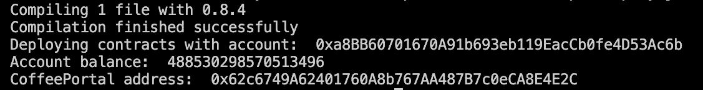

耶，🥳，我们刚刚完成了合同。

## 设置前端反应客户端

是时候建立并运行我们的网站了！我们的智能合约完成了，但是我们需要尽快弄清楚我们的前端如何与之交互！

为了创建一个新项目，我们使用`npx create-next-app -e with-tailwindcss`命令在我们选择的目录中搭建一个新项目。

该命令创建一个设置了 TailwindCSS 的 Next.js 项目。TailwindCSS 是一个实用优先的 CSS 框架，它包含了帮助我们设计网页风格的类。

要安装依赖项，我们使用以下命令:

```
cd <project name> 
npm install ethers react-toastify
```

一旦创建了应用程序并安装了依赖项，我们将看到一条消息，其中包含导航到我们的站点并在本地运行它的说明。我们用命令来做这件事。

```
npm run dev
```

Next.js 将在`[http://localhost:3000](http://localhost:3000)`启动一个默认可访问的热重装开发环境

我们需要将我们的钱包连接到区块链，以便我们的网站能够与之通信。在我们将钱包连接到我们的网站后，我们的网站将有权代表我们调用智能合同。记住，这和登录网站是一样的。

我们所有的工作都将在 index.js 中完成，它可以在`pages`下找到。

%[https://gist . github . com/Olanetsoft/6 c 8270 D4 e 174 E0 E3 a 43170 c51e 314 ef 3]

我们需要导入 abi 并更新上面代码示例中的 contractAddress。让我们首先创建一个名为`utils`的文件夹，然后使用下面的命令在`utils`文件夹中创建一个名为`CoffeePortal.json`的文件。

```
mkdir utils
touch CoffeePortal.json
```

接下来，我们需要我们的合同地址以及将在`CoffeePortal.json`文件中更新的内容。得到它的最好方法是什么？

让我们回到我们之前工作的智能合同项目，然后导航到`artifacts/contracts/coffeePortal.json`并复制其中的全部内容，以及我们的合同地址，当我们将合同部署到区块链时，该地址显示在我们的终端中。

我们将使用我们复制的内容更新`CoffeePortal.json`文件，并更新 index.js，如下所示:

```
// ...

import Head from "next/head";

// Import abi
import abi from "../utils/CoffeePortal.json";

export default function Home() {
  /**
   * Create a variable here that holds the contract address after you deploy!
   */
  const contractAddress = "";  // Add contract address here

   // ...
  return (
    <div className="flex flex-col items-center justify-center min-h-screen py-2">
      [...]
    </div>
  );
}
```

是时候测试我们的应用程序了，当我们访问`[http://localhost:3000](http://localhost:3000)`时，我们应该有类似下面的东西

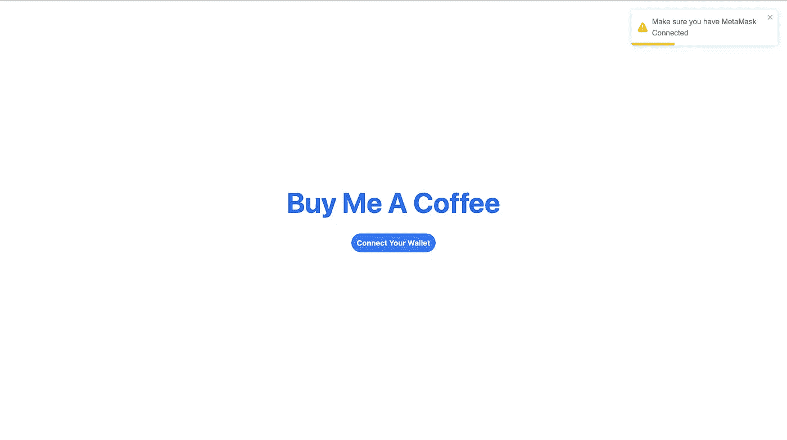

接下来，单击“连接钱包”按钮应该会将我们重定向到元掩码 UI，我们将在此授予站点访问权限，如下所示:

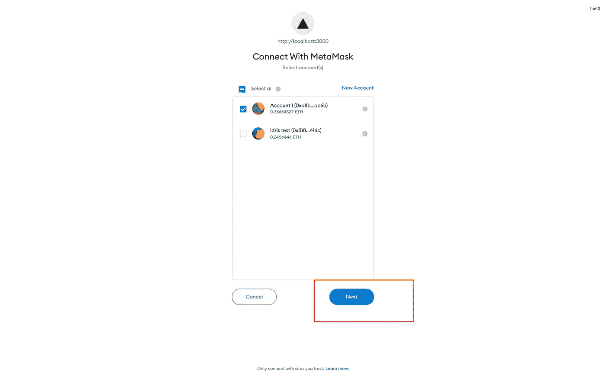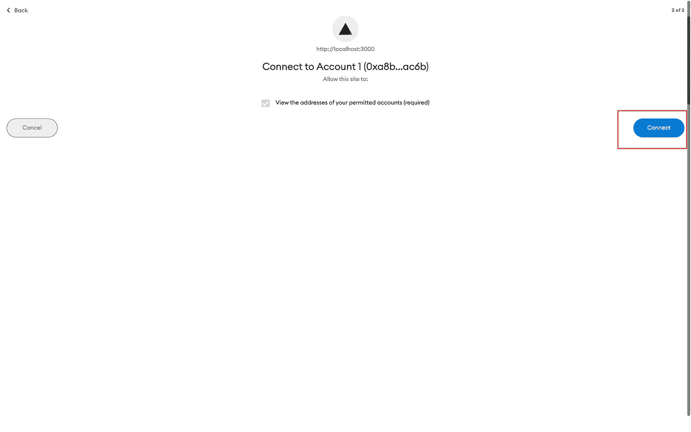

那么我们的用户界面应该类似于下图所示:

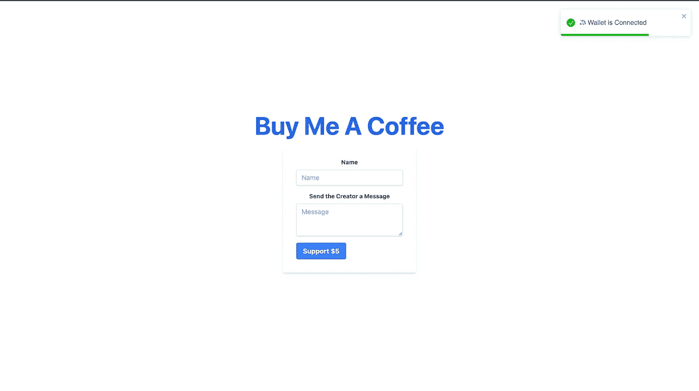

我们现在可以通过购买价值 5 美元的咖啡，并向店主提供我们的名字和任何首选信息来提供支持😊


接下来，

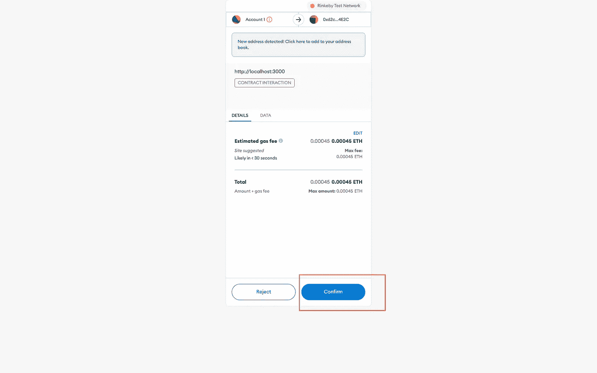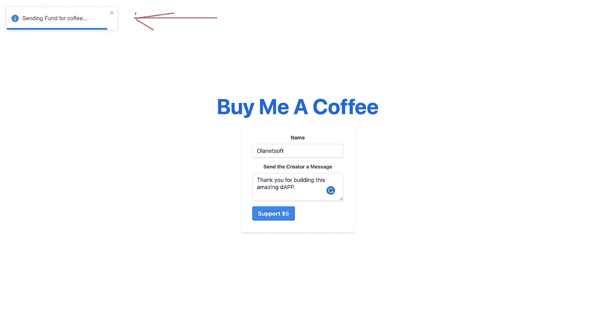

已完成…

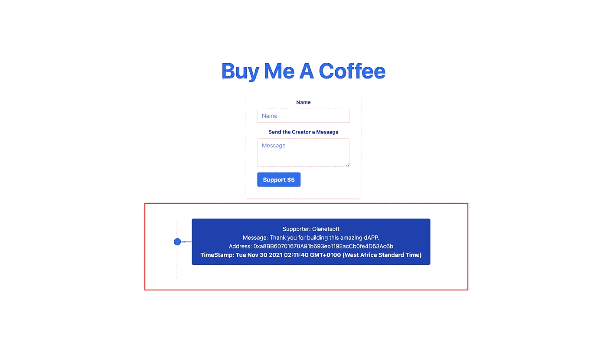

另一个咖啡支架:

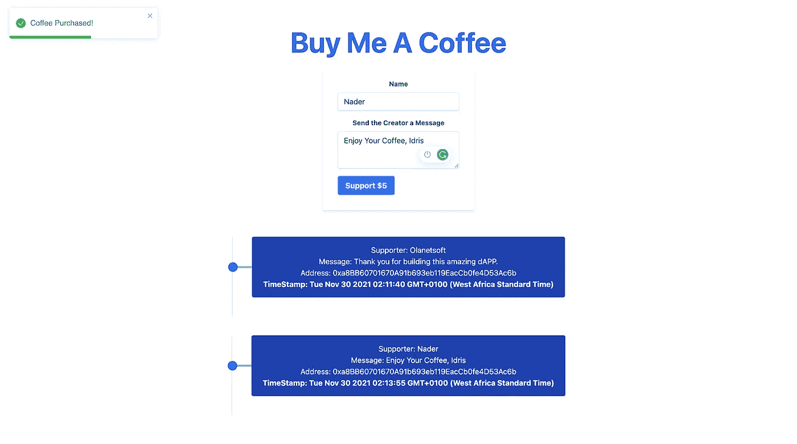

如果我们观察，一旦交易完成，页面实时更新；这是我们引入智能契约的事件的结果，当然，React 毫不费力地更新了 UI。

## 结论

在本文中，我们学习了如何使用 Solidity、Ethereum 智能契约、React 和 TailwindCSS 构建一个迷你 buymeacoffee dApp。

## 参考

*   [以太坊](https://ethereum.org/en/developers/docs/)
*   [全栈 Dapp](https://dev.to/dabit3/the-complete-guide-to-full-stack-ethereum-development-3j13)
*   [封面照片](https://unsplash.com/photos/jpsocjU9R7s)

我很乐意在[Twitter](https://twitter.com/olanetsoft)|[LinkedIn](https://www.linkedin.com/in/olubisi-idris-ayinde-05727b17a/)|[GitHub](https://github.com/Olanetsoft)|[Portfolio](https://idrisolubisi.com/)与你联系

在我的下一篇博客文章中再见。保重！

*更多内容请看**[***说白了. io***](http://plainenglish.io/) ***。*** *报名参加我们的* [***免费每周简讯这里***](http://newsletter.plainenglish.io/) ***。****