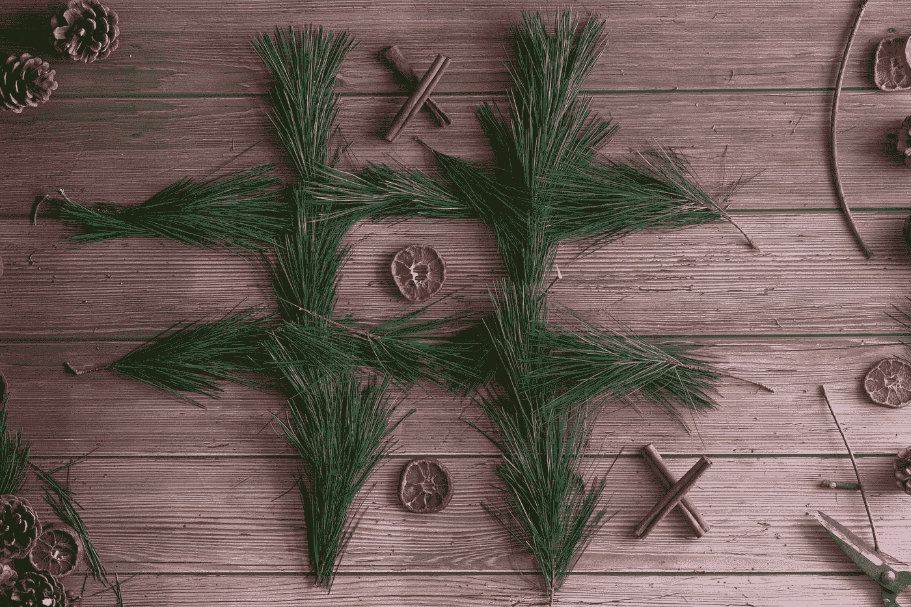
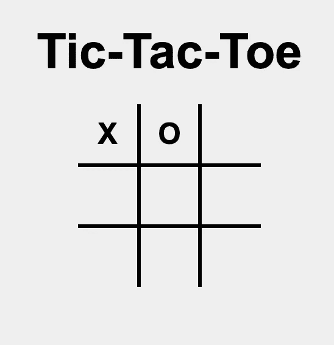
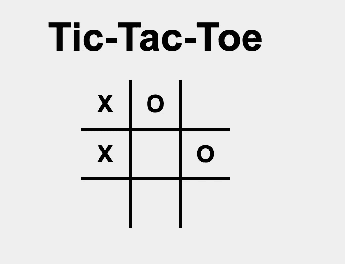
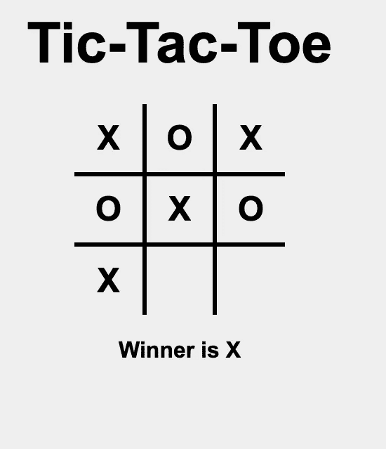
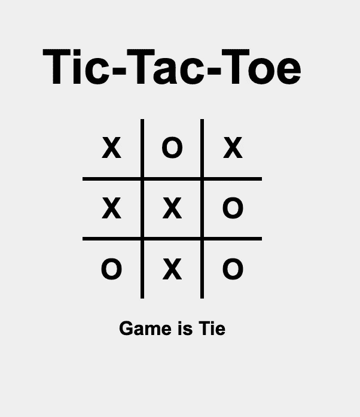
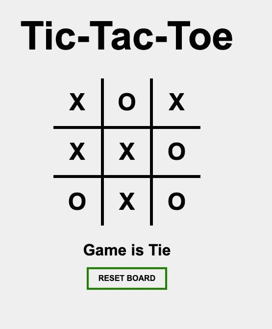
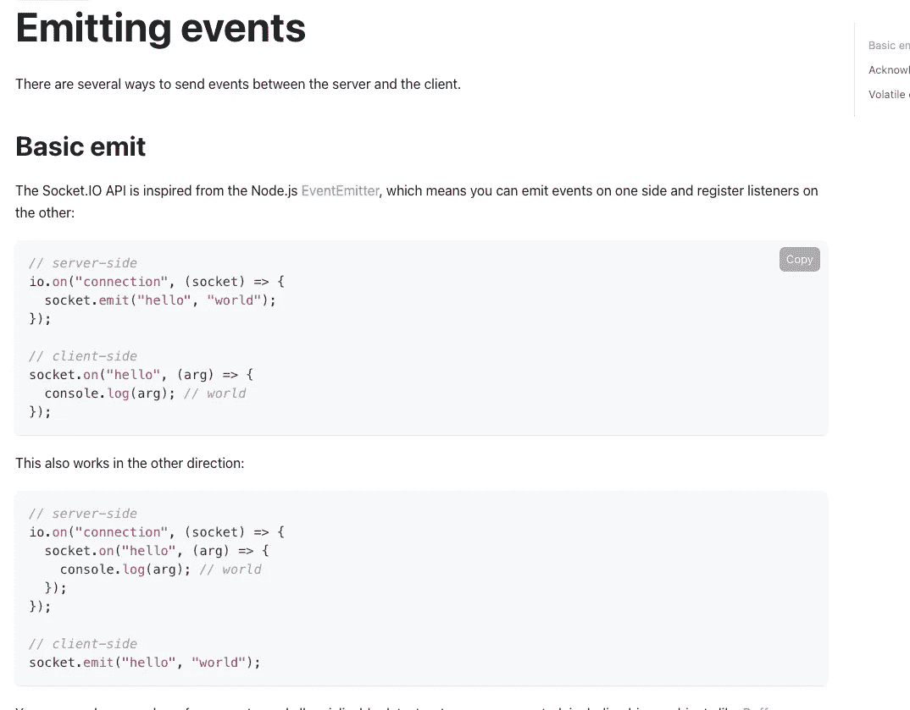
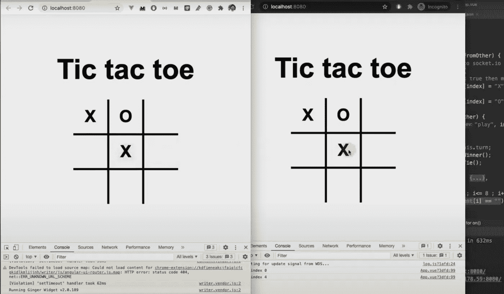

# 用 Socket.io 和 Vue.js 构建一个多人实时井字游戏

> 原文：<https://javascript.plainenglish.io/build-a-multiplayer-realtime-tic-tac-toe-game-with-socket-io-and-vue-js-85cc529439d0?source=collection_archive---------3----------------------->

## 逐步教程



Photo by [Visual Stories || Micheile](https://unsplash.com/@micheile?utm_source=medium&utm_medium=referral) on [Unsplash](https://unsplash.com?utm_source=medium&utm_medium=referral)

在本文中，我们将使用 Vue.js 从头开始开发一个井字游戏。我们将把实时特性与 socket.io 集成在一起，这样两个玩家就可以同时在不同的浏览器上玩游戏。

# 视频教程

# 项目创建

首先，创建一个空白的 Vue 项目，并在`app.vue,`中移除 hello world 组件，并为网格添加 HTML。我从这个[教程](https://dev.to/ayushmanbthakur/how-to-make-tic-tac-toe-in-browser-with-html-css-and-js-28ed)中复制了 CSS。

我们将为每个区块定义 9 个 id 为`block_0`到`block_8` 且类别为`block`的区块。

你会看到这样的结果。



Basic grid implementation

到目前为止，您可以在这个分支中找到 Github 代码。

[](https://github.com/nilmadhab/tic-tac-toe-youtube/tree/grid-setup) [## git hub-nilmadhab/TIC-tac-toe-YouTube at grid-setup

### 您现在不能执行该操作。您使用另一个选项卡或窗口登录。您在另一个选项卡上注销，或者…

github.com](https://github.com/nilmadhab/tic-tac-toe-youtube/tree/grid-setup) 

# 点击绘制 X 和 O

现在，我们将在数据部分定义两个变量:

1.  内容
2.  转动

内容将是一个长度为 9 的数组，每个 HTML 块对应一个元素，用空字符串初始化。当我们单击一个块时，我们将改变`content`索引处的值。让我们定义函数`@click`，并使用它。

我们将基于内容数组绘制 X 和 O，点击将触发每个块中的绘制功能。

现在，让我们在`method`部分定义`draw`功能。如果`turn`的值为真，我们画 X，否则我们画 O，改变回合的值。所以，首先，点击我们绘制的`X`，则`turn`变为假。所以，第二次点击，我们画 O，并且`turn`变成`true`等等...



# 计算获胜者

现在，每次调用 draw 函数后，我们必须计算游戏是否结束。如果完成，我们可以找到谁是赢家并展示出来。

我们将在数据部分再声明三个变量。

在模板部分，我们将添加两个 h2 标签来宣布获胜者或平局。

现在，我们准备定义`calculateWinner`功能。逻辑是如果相同的行、列或对角线被相同的玩家占据，他/她就赢了。

我们每次绘图时都调用这个函数。



# 计算领带

现在我们将定义平局函数。逻辑是，即使有一个空的方块，游戏也不会结束。

我们将在方法部分定义这个函数，并从 draw 方法中调用它。

到目前为止，整个脚本部分。



# 重置板

现在，当游戏打平或结束时，我们必须显示一个选项来重置棋盘。

接下来我们将定义`resetBoard`函数。我们重置内容数组和所有其他变量。



reset board

Github 代码到现在。

[](https://github.com/nilmadhab/tic-tac-toe-youtube/tree/game-logic-implemented) [## GitHub-nilmadhab/TIC-tac-toe-YouTube at game-logic-实现

### 此时您不能执行该操作。您已使用另一个标签页或窗口登录。您已在另一个选项卡中注销，或者…

github.com](https://github.com/nilmadhab/tic-tac-toe-youtube/tree/game-logic-implemented) 

# 使用 Socket.io 的多人模式

现在，我们将该项目与 Socket.io 集成，这样两个玩家就可以同时玩游戏了。当一个玩家点击 X 时，它应该出现在第二个玩家的屏幕上，当第二个玩家点击 O 时，它应该出现在第一个玩家的屏幕上。如何实施？

在这里，`[socket.IO](https://socket.io/docs/v3/)`就派上用场了。文件上说，



socket.js documentation

如果想看视频教程，可以下载上面的分支，将视频快进到 35:42 分钟。

# 为 socket.io 设置服务器

我们将首先在 Vue 项目之外创建一个文件夹。在文件夹内创建一个文件`server.js`。我们将在文件夹中创建一个 express 服务器。

运行`npm init`。它将设置一个`package.json`文件。

那就跑

`npm i socket.io`

它将在项目中安装 socket.io。

## server.js

现在，让我们创建一个服务器并集成 socket.io。

我们将设置 CORS 规则，以便我们在端口 8080 上运行的 Vue.js 项目可以访问服务器。

我们将从服务器发出一个事件，我们的 Vue 客户端应该监听并接收它。

使用运行服务器

`node server.js`

## App.vue

现在，我们将在客户端设置 socket.io。

从终端运行 Vue.js 项目内部的`npm i socket.io-client`。

我们将通过以下方式导入库:

```
import io from ‘socket.io-client’
const socket = io(“[http://localhost:3000](http://localhost:3000)")
```

在脚本部分。

在创建的钩子中，我们将监听事件。

你会看到`“youtube tutorial”`会出现在控制台上。

客户端也可以用同样的方式与服务器对话。

# 使用 Socket.io 的游戏逻辑

1.  在我们调用 draw 函数之后，player 1 客户机将把事件发送到服务器。
2.  当服务器接收到它时，它将向播放器 2 广播它。
3.  2 号玩家会更新网格。
4.  然后玩家 2 会点击 O 并调用 draw 函数，它会将事件发送到服务器。
5.  服务器会将它广播给玩家 1。

游戏会一直这样下去。

> 我们还需要在 draw 函数中传递一个参数，`drawFromOther,` 。根据这个标志，我们将再次发出事件。如果`drawFromOther`标志被设置为假，我们将发送 play 事件。

现在，我们将更新模板。我们将把`drawFromOther`作为`false`发送，这意味着事件将被发送到服务器。

`Server.js`将接收事件并广播它。

现在，客户端将在`created`钩子中接收事件。

它将接收事件并绘制索引，但是我们将`drawFromOther`参数作为 true 传递，这样事件就不会再次发送到服务器。

# `Complete code of App.vue`

就是这样。多人游戏已经准备好了。在两个不同的浏览器中打开`localhost:8080`并交替点击。游戏应该可以。



*更多内容请看*[***plain English . io***](http://plainenglish.io/)