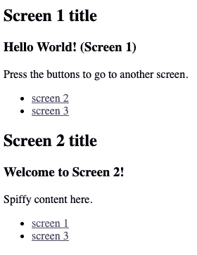

# 用 JavaScript 和 CSS 构建一个多屏 Web 应用

> 原文：<https://javascript.plainenglish.io/build-a-multiscreen-web-app-with-javascript-and-css-758d9f626de3?source=collection_archive---------4----------------------->


[Technology vector](https://www.freepik.com/vectors/technology) created by [pikisuperstar](https://www.freepik.com/pikisuperstar) — [www.freepik.com](http://www.freepik.com)

如果你想建立自己的 web 开发组合，可以考虑的一个项目是单页面 web 应用程序。与原生应用一样，网络应用通常是为单一目的而构建的，并且是为了在移动设备上良好运行而构建的，但它们都是幕后的网站。和其他网站一样，它们不是下载到你的手机上，而是托管在服务器上，由你的浏览器请求。

那么如果你想搭建一个 web app，从哪里入手呢？虽然你可以从 Vue、Angular、React、Medium 和 Ember 等[完整的框架](https://www.toobler.com/blog/frameworks-for-developing-single-page-applications/)中提取，但你也可以用普通的 JavaScript 构建你的 web 应用代码库。如果你是 web 开发的新手，我推荐你在进入框架之前使用这种普通的 JS 方法，因为你会在基础方面变得更强。

# 我们将建造什么

在本教程中，我们将构建一个简单的库，用于使用 CSS 和 JavaScript 创建 web 应用程序，并使用它创建一个具有三个屏幕的“Hello World”web 应用程序。虽然该应用程序只有一个`index.html`页面，但点击或轻触按钮会带你浏览多个屏幕。

该库将允许我们为每个屏幕编码 DOM 结构，而无需繁琐的标记，并创建屏幕之间的渐变过渡。最终产品，如下面的代码笔所示，旨在作为您自己工作的一个可扩展的起点。

The project we will finish.

这个演示应用有几个关键特性:

*   只有初始屏幕是在开始时构建的。
*   当您导航到一个新屏幕时，它的 DOM 结构是动态构建的。
*   用 CSS 将多个屏幕堆叠在一起。

JavaScript 代码库也有两个部分:

*   一个小型库，旨在跨应用程序重用，处理 DOM 填充和屏幕过渡。
*   应用程序内容的特定代码。

让我们首先来看看我们正在使用的特定于应用程序的代码，这样我们就可以看到这个库应该如何工作。

# 特定于应用的代码

我们将首先编写四个特定于应用程序内容的函数。

*   列出三个屏幕及其属性的菜单功能。
*   一组回调函数——每个屏幕一个。我们希望能够编写特定于应用程序的代码，填充我们应用程序的屏幕，然后在每个屏幕上显示内容。

## 菜单功能

为了列出我们所有的应用程序屏幕，上面显示的演示 web 应用程序使用了一个名为`app_menu`的函数。让我们把这个编码起来。

The app menu function

在该函数中，我们做了几件事:

*   我们实例化一个空的`items`对象。

```
var items = {};
```

*   启动`items`后，我们为应用程序中的每个屏幕添加一个键值对。
*   每个键指向一个有`title`和`page_callback`的物体。

```
items.screen_one_path = {                            
     active: true,                               
     title: 'Page 1 title',      
     screen_callback: 'screen_one',  
};
```

*   只有起始屏幕的对象具有设置为`true`的`active`属性。
*   每个按键，比如`screen_one_path`，都是一个应用程序按钮将用户带到那个屏幕的路径。
*   函数结束时，返回`items`。

```
return items;
```

## 屏幕回调

对于`app_menu`中的每个屏幕对象，都有一个`screen_callback`键指向该屏幕的回调函数的名称。

```
items.screen_two_path = {
      title: 'Screen 2 title',
 **     screen_callback: 'screen_two'**
};
```

下面列出了`screen_two`回调的所有代码，然后您可以尝试编写另外两个。

A sample screen callback.

在这个回调函数中，我们指定了屏幕上的内容。与菜单函数中的`items`一样，我们从实例化一个空的`content`对象开始。

```
let content = {};
```

然后，我们使用`body`和`header`键为屏幕添加内容。每个键指向一个对象，该对象确定屏幕标记的一部分。

```
content.header = {                           
    markup: '<h3>Welcome to Screen 2!</h3>'                   
};

content.body = {                   
    markup:'<p>Spiffy content here.</h2>'                    
}
```

然后我们使用一个`links`属性来确定对象的链接。

```
content.nav = {                           
     className:'nav',                        
     links:[{                           
        text:'screen 1',                          
        href:'#screen_one_path'  
     },                        
     {                             
        text:'screen 3',                            
        href:'#screen_three_path'      
    }]
};
```

注意，我们给两个链接都添加了类名`nav`。对于每个链接，我们使`text`对应于可见文本，并使`href`成为屏幕的路径。

```
text:'screen 3',                            
href:'#screen_three_path'
```

然后我们返回`content`对象。

```
return content;
```

这个应用程序中的所有三个页面具有相同的总体结构。这里的目标是实现一种轻量级的方式来构建内容，而不必为每个屏幕手工编写完整的 HTML 标记。

## 独立地

继续构建另外两个屏幕回调函数。如果你坚持上面例子的格式，你应该没问题。您可以检查 CodePen，以便更仔细地比较代码。

## 正在初始化应用程序

假设我们有一个包含`<head>`和`<body>`部分的`index.html`页面。在`<body>`部分，主元素容器有一个`app`的`id`。

```
<div id="app"></div>
```

如果菜单功能和每个屏幕的屏幕回调都已就绪，我们应该能够使用下面的代码启动应用程序:

```
utils.init('app',app_menu);
```

我们来分析一下。

*   主库对象是`utils`，`init`是指初始化方法。
*   第一个参数`app`是一个引用上面所示 DOM 元素的`id`的字符串。
*   第二个参数，`app_menu`，是我们写的函数。如果您是 JavaScript 新手，这听起来可能有点奇怪，但是在这里，我们希望将一个函数(`app_menu`)传递给另一个函数(`init`)。

如果你是用 CodePen 写的，你可能想把你的`init`行注释掉，直到你写完所有的 JavaScript。这将防止您的代码无意中过早运行并出现错误信息。

此时，您应该有了您的`app_menu`函数、三个回调函数和您的调用`init`的行。如果你已经建立了所有这些，干得好！现在让我们创建一个库来实现这些功能。

# 图书馆

我们将从一个名为`utils`的空对象和一个立即调用的函数表达式(IIFE)开始，我们将通过它。在这个生命包装器中，`utils`被称为`context`。

```
let utils = {};(function(**context**) { // code will go here})(**utils**);
```

## init 函数

在包装器中，让我们编写应该能够调用的`init`方法，并将其附加到`context`。

```
utils.init('app',app_menu);
```

让我们在包装器中构建方法外壳。

```
(function(context) { context.init = function(appId,myMenu) { }})(utils);
```

我们的第一个任务是将`appId`字符串和`myMenu`函数分配给我们的`context`对象。这样，我们可以在包装器之外引用它们。

```
context.init = function(appId,myMenu) {             context.id = appId;                       
     context.menu = myMenu();}
```

接下来，我们希望找到开始活动屏幕的 ID，并只为该屏幕构建 DOM。为此，我们将从`app_menu`函数中获得每个屏幕的路径 ID，该函数现在驻留在`context.menu`中。

```
let path_ids = Object.keys(context.menu);// expected result
// ['screen_one_path', 'screen_two_path', 'screen_three_path']
```

快速回到之前:还记得`app_menu`中的`items`关联数组吗，其中每个键值对代表路径和屏幕？在`app_menu`中只有一个对象的`active`属性被设置为`true`。

```
items.screen_one_path = {                            
 **active: true,**                            
     title: 'Page 1 title',      
     screen_callback: 'screen_one',  
};
```

这意味着在我们的`path_ids`数组中只有一个`active`对象，所以我们可以使用`Array.prototype.find()`方法提取带有`active`属性的 one screen 对象的`screenId`。

```
let screenId = path_ids.find(id => context.menu[id].active);
```

只要`screenId`存在，我们就可以用它来获取完整的对象。然后，我们将把它传递给一个新函数，`buildScreen`，接下来我们将编写这个函数。

```
if (screenId) {                        
   screen = **buildScreen(screenId);   **                                                  
}
```

即将到来的`buildScreen`函数将返回值一个 DOM 元素，`screen`，它将作为我们的应用程序主屏幕添加到我们的页面。虽然我们的 CSS 最终会默认隐藏每个屏幕，但是让我们给这个屏幕一个`active`类，它会保持它可见。

```
if (screenId) {                
      screen = buildScreen(screenId); 

 **screen.className += ' active';** 
}
```

就这样，我们完成了`init`方法！下面是完整的代码。

The full init method.

## 构建屏幕

现在让我们为`buildScreen`写代码。您可能已经从我们刚刚使用它的方式中猜到了，这个方法将接受一个参数`screenId`，并返回一个表示新屏幕的新 DOM 元素。

```
function buildScreen(screenId) {                                                      

}
```

作为第一步，我们使用`context.id`来获取应用容器 DOM 元素。

```
function buildScreen(screenId) {  

    let app = document.getElementById(context.id);                       
}
```

然后我们使用`screenId`从`context.menu`获取屏幕对象。

```
function buildScreen(screenId) {      

    let app = document.getElementById(context.id);                    
 **let obj = context.menu[screenId];** }
```

然后我们使用`screenId`为新屏幕创建一个新的`<div>`元素。

```
function buildScreen(screenId) {  

    let app = document.getElementById(context.id);                                                      
    let obj = context.menu[screenId]; **let screen = document.createElement('div');                                                     
    screen.className = 'screen';                             
    screen.id = screenId;**
}
```

有两个主要的东西需要创建:屏幕标题栏和内容。下面是屏幕标题栏的标记，我们使用 OR ( `||`)操作符来放置一个备份标题。

```
let h2 = document.createElement('h2');                           
let title = obj.title || 'Placeholder';                           h2.textContent = title;                                                      screen.appendChild(h2);
```

下面是构建内容的逻辑。注意，我们正在调用一个新的函数，`addContent`，我们接下来将编写这个函数。

```
let ui = document.createElement('div'); ui.className = 'ui-content'; ui = **addContent**(screenId, screen, ui);
```

最后，我们将内容追加到`screen`，将`screen`追加到`app`，并返回`screen`。

```
 screen.appendChild(ui);   
  app.appendChild(screen);  
  return screen;                 
}
```

`buildScreen`的完整代码如下。

## 添加内容

现在让我们编写在屏幕中添加内容的逻辑。这是我鼓励你扩展以适合你自己目的的方法。虽然我们只是构建文本内容和链接，但是您也可以为其他屏幕元素添加逻辑，比如表单小部件、图像和视频。

构建屏幕将基于菜单对象，如下所示:

```
items.screen_three_path = {                                                      
     title: 'Screen 3 title',      
     screen_callback: 'screen_three',  
};
```

记住上面的`items`现在等价于下面的`context.menu`，我们首先检查它以确保我们有一个给定屏幕 ID 的对象，比如`screen_three_path`。

```
function addContent(id,screen,el) {
   if (context.menu[id]) { }
}
```

还记得那些屏幕回调函数吗？这是我们利用它们的地方。我们首先使用下面的方法获得回调的名称。

```
function addContent(id,screen,el) {
   if (context.menu[id]) { **let cb = context.menu[id].screen_callback;**
  }
}
```

假设我们想要的回调的名字是`screen_two()`。这个函数被附加到我们的全局`window`对象，所以我们可以用括号语法和我们的`cb`变量来访问它——然后用括号`()`来调用它。

```
function addContent(id,screen,el) {
   if (context.menu[id]) { let cb = context.menu[id].screen_callback; **let content = window[cb]();**
   }
}
```

好了，现在我们有了回调函数返回的`content`对象。让我们遍历它的所有键，你可能记得包括`header`、`body`和`nav`。

```
 let content = window[cb]();  for (const key in content) { let o = content[key]; }
```

在这个`for...in`循环中，我们检查两个属性:`body`或`header`情况下的`markup`，以及`nav`情况下的`links`。对于`markup`，我们简单地创建一个新的`<div>`元素，从回调中添加标记，并将`<div>`追加到屏幕元素。

```
if (o.markup) {    

    let div = document.createElement('div');                             
    div.innerHTML = o.markup;                             
    el.appendChild(div); 
}
```

为了添加链接列表，我们首先创建一个新的`<ul>`元素，并在必要时添加类名。

```
if (o.links) {
   ul = document.createElement('ul'); 
   if (o.className) { 
       ul.className = o.className;
   }
}
```

然后我们使用一个`for...of`循环来遍历数组中的链接。

```
for (link of o.links) {} 
```

下面是完整的代码，对于每个链接，我们创建一个包含一个具有指定的`href`和`textContent`属性的`<a>`元素的`<li>`元素。在一些附加之后，我们将一个新函数附加到`<a>`元素— `enableLink` —并返回列表。

The logic for adding links/

下面是`addContent`的完整代码。

## 更换屏幕

每次点击一个链接，屏幕都应该改变。这就是为什么在我们刚刚编写的代码中调用了`enableLink`函数。我们现在来写`enableLink`。

```
function enableLink(link) {
  link.addEventListener('click',function(e) {
     let id = changeScreen(e);        
  }); 
}
```

注意，当点击一个链接时，会调用一个`changeScreen`函数。现在让我们开始写，从函数外壳开始。

```
function changeScreen(e) {}
```

## 淘汰旧的

首先，让我们准备从我们的输出屏幕中删除`active`类。我们将使用我们计划移除的类来获取对屏幕元素的引用。

```
function changeScreen(e) { let prev = document.querySelector('.screen.active');
}
```

然后我们将使用`setTimeout`和`delay`来淡出屏幕，这样我们就可以控制何时开始。

```
let prev = document.querySelector('.screen.active');const delay = 10;
window.setTimeout(function() {

},delay);
```

在`setTimeout`回调中，我们将移除`active`类，如果它存在的话。稍后您将会看到，这将触发 CSS 不透明度转换。

```
const delay = 10;
window.setTimeout(function() {
 **    if (prev && prev.className.includes('active')) {
          prev.classList.remove('active');
     } ** 
},delay);
```

## 跟上新潮流

现在我们隐藏了输出屏幕，让我们显示输入屏幕。我们将首先获得目标链接的`href`属性，它以一个标签开始(例如`#page_one_path`)。我们不想要标签，所以我们将使用`String.prototype.split()`方法把它取出来。

```
let id = e.target.href.**split**('#')[1];
```

现在让我们尝试访问屏幕元素。查看下面的代码:

```
let screen = document.getElementById(id) || buildScreen(id);
```

如果我们第一次进入这个屏幕，这个屏幕的 DOM 容器将不存在——但是如果我们再次访问这个屏幕，它就会存在。所以我们首先用`document.getElementById`检查它是否存在，如果失败，OR ( `||`)选择器将我们带到我们的备份计划:用`buildScreen`创建屏幕。

不管怎样，我们必须淡入这个屏幕，让它看得见。我们通过添加`active`类来做到这一点，但是为了确保我们只添加它一次，让我们检查一下以确保它不存在。

```
if (!screen.className.includes('active')) {
     let delay = 50;
      window.setTimeout(function() {
        screen.className += ' active';
      },delay); 
}
```

就像淡出旧屏幕一样，我们将使用`setTimeout`,这样我们就可以按照自己的喜好编排节目过渡。

```
if (!screen.className.includes('active')) {
     let delay = 50;
      window.setTimeout(function() {
        screen.className += ' active';
      },delay); 
}
```

然后我们在函数结束时返回屏幕的`id`。下面是`changeScreen`的完整代码。

Change Screen

这就是 JavaScript 的全部内容！如果你测试你的应用程序，点击“第二页”链接后应该是这样的。



Alas, the web app styles look a bit quaint without CSS.

书页没有消失，整个东西看起来像是 1995 年的，但那是因为我们还没有创造出风格。让我们现在就建立这些。

# 半铸钢ˌ钢性铸铁(Cast Semi-Steel)

让我们从`html`和`body`开始。

```
html, body {
  height: 100%;
  padding: 0px;
  margin: 0px;
}
```

## 应用程序容器

回想一下，在`body`中，主容器的 id 是`app`。

```
<div id="app"></div>
```

因此，让我们对这个容器使用`position:relative`，这将允许我们使用`position:absolute`将屏幕元素放置在彼此之上。

`width`为 100%，因此应用程序容器占据了屏幕的宽度。您可以尝试其他风格。

## 屏幕

下面是屏幕的 CSS。使用`position: absolute`允许它们相互叠加。请注意，`opacity`是`0`，而`pointer-events`是`none`，以使它们不可见并防止交互。

The screens.

任何时候都有一个活动屏幕。对于这个屏幕，让我们将`opacity`设置为`1`并将`pointer-events`设置为`auto`。这样，活动页面将是可见的和可点击的。我们对活跃和不活跃的风格都使用了过渡来平滑地淡入淡出屏幕。

Web app active screen CSS.

在这个应用程序中，每个屏幕都有一个基于其 ID 的独特背景颜色。

```
#screen_one_path {
  background-color: #B1D4E0;
}
#screen_two_path {
  background-color: #e0bbe4;
}
#screen_three_path {
  background-color: #d7ecd9;
}
```

## 屏幕内容

在每个屏幕中，都有需要进行样式化的内容。每个屏幕上的`<h2>`元素被设计成顶部蓝色条，带有白色文本。此外还有`.ui-content`的样式，它将包含屏幕的主要内容。

The styles for the screen elements.

导航链接是用 FlexBox 设计的，看起来像按钮。

The CSS for the links

就是这样！这就是 CSS。下面是一个演示供您再次回顾。

如果你已经做到了这一步，祝贺你！您已经为多屏幕 web 应用程序构建了一个可扩展的库，并且启动了一个漂亮的小演示。花一分钟庆祝你的成就。


[Snow vector](https://www.freepik.com/vectors/snow) created by [pch-vector](https://www.freepik.com/pch-vector) — [www.freepik.com](http://www.freepik.com)

# 更进一步

扩展这个 app 的方法有很多，下面是几个建议。

*   除了渐变过渡，尝试添加水平或垂直幻灯片过渡。
*   使用附加的屏幕回调函数扩展屏幕模板的类型。
*   添加一个选项，以便在进入页面时刷新页面内容。
*   除了`markup`和`nav`之外，向回调函数添加一些表单元素，并在库中为它们创建逻辑。例如，您可以添加启动特定功能的按钮。
*   使用该库的扩展版本来构建带有介绍、游戏和游戏屏幕的游戏应用程序。
*   向页面回调添加异步 JSON 请求，页面回调将在屏幕加载后向`.ui-content`注入内容。

如果你有兴趣看看我是如何做到以上任何一点的，请在评论中告诉我。

# 在别处

虽然这里构建的库完全不依赖于 Drupal，但代码借用了 Tyler Frankenstein 的 Drupal gap 7 API 的技术和语法，这是一个为连接 Drupal 7 网站的应用程序设计的框架。

[](http://docs.drupalgap.org/7/) [## 介绍

### 用于 Drupal 网站的开源应用程序开发工具包。用一组代码构建定制应用，然后…

docs.drupalgap.org](http://docs.drupalgap.org/7/) 

下面是另一篇您可能会觉得有用的 JavaScript 文章。

[](/javascript-closures-and-their-scope-bubbles-a6bef7a4824e) [## JavaScript 闭包及其范围气泡

### 它们随处可见，可以帮助您构建大型应用程序。

javascript.plainenglish.io](/javascript-closures-and-their-scope-bubbles-a6bef7a4824e) 

*更多内容看* [***说白了. io***](http://plainenglish.io) ***。*** *为无限制访问我的文章，考虑* [***加盟中***](https://medium.com/@nevkatz/membership) ***。***