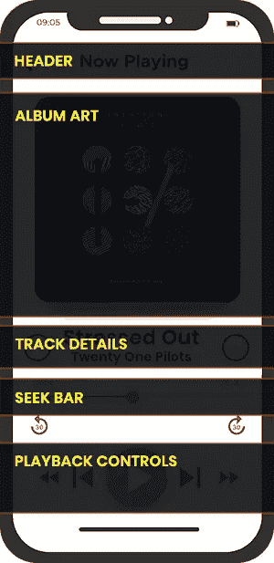

# 创建一个像 Spotify 这样的音乐流媒体应用程序需要多少成本

> 原文：<https://javascript.plainenglish.io/build-a-music-streaming-app-like-spotify-with-react-native-2ce2b4ff85be?source=collection_archive---------3----------------------->

## 建立一个像 Spotify 一样的音乐流媒体应用程序:成本，功能，商业模式，流程。


那是过去随身听、收音机、电唱机或 MP3 被用来听音乐的日子。随着音乐流媒体应用的快速发展，85%的用户正在寻求点播流媒体服务。像许多其他现代应用程序一样，音乐流媒体应用程序使人们无需下载即可轻松欣赏音乐和各种歌曲。

当我们谈论音乐流媒体应用时，Spotify 是世界上最大的音乐流媒体应用，在 2020 年第四季度利用了 3 . 45 亿用户和 1 . 55 亿订户。


[Image Source](https://www.businessofapps.com/data/spotify-statistics/#1)

> 印象深刻吧。

如果你也计划投资开发一个音乐流媒体应用程序，并希望跟进，那么你来对地方了。我们将为您提供如何构建像 Spotify 这样的音乐流媒体应用程序的全面指导。

## 现在你一定有这些问题在脑海中游过:

*   *为什么投资音乐流媒体应用对你的企业来说是一个有利可图的决定？*
*   *为什么我们选择 React Native 来创建像 Spotify 这样的音乐流媒体应用？*
*   *如何开发像 Spotify 这样的音乐流媒体 app？*
*   *如何从这款音乐流媒体应用中盈利？*

> 让我们来获得这些问题的详细答案:

# **1。**为什么投资音乐流媒体应用对您的企业来说是一项有利可图的决策？

要得到这个问题的答案，你需要深入挖掘音乐流媒体市场。你会发现，全球数百万人都在努力追求高质量的音乐，没有中断和与存储相关的问题。对无限的高质量音乐的需求逐年飙升。

在这种情况下，音乐流媒体应用程序正在向前发展，并提供最便捷的方式来随时访问或收听您最喜爱的音乐曲目。

[***据 Statista***](https://www.statista.com/statistics/758875/consumers-use-music-streaming-download-services/)***统计，2020 年美国最受欢迎的流媒体服务是 Spotify，49%的受访者表示他们从该网站流媒体播放或下载音乐。***

> 不要害怕，令人惊讶的数据还在后面呢！

***到 2020 年，音乐流媒体行业的平均收入已达到 166.32 亿美元，并预计在 2024 年以每年 5.8%的速度增长***[](https://www.statista.com/outlook/dmo/digital-media/digital-music/music-streaming/worldwide)****。****

*考虑到这种动态，开发像 Spotify 这样的音乐流媒体应用程序的想法看起来非常适合初创项目，因为它是音乐流媒体行业的巨头。Spotify 应用程序克隆使您能够立即启动您的音乐应用程序，因为它是一个现成的强大解决方案。也就是说，如果你计划开发一个移动流媒体应用，那么你需要一个技术团队。*

*由于技术正在快速发展，因此，雇佣一个跨平台的应用程序开发人员来帮助你 [**构建一个像 Spotify**](https://www.xicom.ae/services/mobile-app-development/) 这样的应用程序，帮助你发展业务，让你成为这个蓬勃发展的行业的一部分，是一个值得做的决定。*

**

****Image Source:*** [***Statista***](https://www.statista.com/chart/20826/music-streaming-services-with-most-subscribers-global-fipp/)*

**现在，进入下一个问题——我们为什么选择 React Native 开发音乐流媒体应用程序？**

# ***2。**为什么我们选择 React Native 来创建像 Spotify 这样的音乐流媒体应用？*

*在开始介绍这个框架以及了解它如何为您的应用程序开发过程增加优势之前，让我们直接进入决策背后的主要逻辑。*

***结论:** React Native 是广泛用于构建跨平台应用程序的首选框架。如果你用 React Native 构建一个像 Spotify 这样的音乐流媒体应用程序，同样的代码基础将在 iOS 和 Android 上工作，你的应用程序也将是 100%原生的。*

*因此，我们的目标是指导您如何构建像 Spotify 这样的音乐流媒体应用程序，确保您的应用程序在 iOS 和 Android 上都可用，并节省您的应用程序开发项目的时间和成本。*

> ***以下是 React Native 比其他框架更受欢迎的几个原因:***

*   ***使用 React Native 将应用开发速度提高 10 倍***

*作为脸书的产物，它已经存在了五年多，拥有一个与日俱增的庞大社区。简而言之，有大量的组件可供使用，并且消除了从头开始开发的麻烦。通过集成现成的组件，您可以轻松节省开发时间。*

*由于上市时间对你的应用很重要，雇佣一家 [**移动应用开发公司**](https://www.xicom.ae/services/mobile-app-development/) 来建立一个像 Spotify 这样的音乐流媒体应用将是一个明智的决定。*

*   ***无需去应用商店就能轻松更新应用***

*一旦应用程序在应用商店或 Play Store 中发布，修复错误就变得复杂了。在原生应用的情况下，如果你想添加新功能，那么你必须重新创建这个过程，并在应用商店或播放商店上传最新版本。同样，你必须处理批准过程。但这一切都是在代码推送之前！*

*由于 React Native 和 Apache Cordova 将代码推送与 App Center 云服务一起使用，因此应用会在运行时自动更新，用户无需重新启动应用即可注意到最新的变化。当开发像 Spotify 这样的音乐应用程序时，有更大的机会对应用程序进行快速更改，而不必经历冗长的过程。*

*   ***一次学会，随处写***

*React Native 具有跨平台兼容性，允许您通过编写单个代码库来开发多个应用程序。这让开发人员免去了大麻烦！通过编写一个单一的代码库，他们可以开发不同的应用程序，可以轻松地在 iOS 和 Android 平台上运行，没有任何麻烦。他们所需要的就是 [**雇佣一个应用开发者**](https://www.xicom.ae/solutions/hire-developers/) ，精通 JavaScript，有使用原生 UI 库、API 和混合应用开发的经验。*

*   ***易于在预算紧张的情况下工作***

*当你是一个刚刚起步的小公司时，你总是在寻找能帮助你最大化投资回报率的解决方案。你可以利用这些资源雇佣应用开发者，而不是雇佣一个独立的 iOS 和 Android 应用开发者团队，从而节省大量的应用开发成本。*

*   ***热重装使开发过程不那么复杂***

*应用程序开发项目通常有不同的预期结果，而 React Native 总是为各种问题提供清晰直观的解决方案。React Native 的一个突出特性——热重新加载——允许开发人员实时预览代码及其实际影响。此外，这确保了开发人员犯最少的错误，并且能够修复实时编码中的错误。这些更改将在应用程序中立即生效。*

*希望这些原因足以澄清我们为什么选择 React Native 来建立像 Spotify 这样的音乐流媒体应用程序。*现在让我们直接进入代码，了解我们如何在几周内* [***开发一个音乐流媒体应用***](https://www.xicom.ae/services/hire-cross-platform-app-developers/) *！**

# *如何开发像 Spotify 这样的音乐流媒体 app？*

*虽然曾想过开发像 Spotify 这样的点播音乐流媒体应用程序，但显然需要集成一系列功能，例如:*

*   **方便用户注册/登录**
*   **社交媒体整合**
*   **搜索和导航**
*   **音乐分类**
*   **音乐库**
*   **推荐和宋收藏**
*   **音乐播放器**
*   **推送通知**
*   **社交分享**
*   **新闻提要**
*   **歌词与歌曲**
*   **私人模式**
*   **保存、下载或收藏列表**
*   **语音命令**
*   **活动日历**

*但为了让本教程简短易懂，我们将只使用 React Native 构建一个看起来像 Spotify 的“正在播放屏幕”，而不是创建一个长长的功能列表。*

# ***项目简介***

*由于 Spotify 简洁的设计给我留下了深刻的印象，因此，我们将使用 Spotify 的用户界面。考虑到 Spotify 的基调，并添加了精确测量边距、字体大小等的标尺。打造和 Spotify 一样的设计。*

*既然现在我们已经抓住了 Spotify 的设计，因此，我们准备开始将其转化为编码。*

*因此，不要浪费太多时间，让我们直接进入创建一个新的 React 原生应用程序开发项目的过程。*

*打开终端窗口，开始运行建议的命令。*

## ***第一步:安装 NPM React 原生***

*虽然安装 NPM 开始这个项目很容易，但是你可以 [**雇佣移动应用开发者**](https://www.xicom.ae/services/mobile-app-developers/) 或者考虑使用下面的命令:*

```
*npm install react-native-cli@latestreact-native init ReactMusic*
```

*准备好需要一点时间。当您差不多准备好开始时，下面是一些需要运行的命令:*

```
**react-native run-ios
android avd &
react-native run-android
subl .**Launch an iOS emulator and run the app
Run the app on the Android emulator
Launch an Android emulator
Open up the project in Sublime Text**
```

> ***你的屏幕会是这样的:***

**

*一旦你得到上面的屏幕，接下来你需要打开 *index.ios.js* 和 *index.android.js* 。令人惊讶的是，你会注意到他们有相同的代码。但是我们将摆脱这一切，从头开始这个项目。*

*让我们在项目的根目录中创建一个名为 App 的目录。然后创建一个文件 **app/App.js** 。为了方便起见，我们提到了您可以直接使用的代码:*

**

*现在，如果你已经雇佣了一名移动应用程序开发人员，那么请你的技术团队删除 *index.ios.js* 和 *index.android.js* 的所有代码，并在这两个版本中呈现组件应用程序。*

****下面是一个简短快速的命令:****

**

*现在是时候通过在 iOS 上使用 Cmd+R 和在 Android 上使用 Fn + F2 来重新加载模拟器了。一旦你重新加载模拟器，你会注意到一个黑色的屏幕上有一些白色的文字。您还可以在模拟器中设置实时重载，以便在每次进行更改后保存文件时自动重载 Javascript。*

****但是，如果你回过头来再看一下 UI，你会注意到它是由 5 个主要元素组成的:****

**

*是的，它的标题、专辑封面、曲目详情、搜索栏和播放控件是创建一个“ ***正在播放屏幕*** ”的主要部分。*

*因此，我们将使用代码片段为每个部分详细创建一个组件。从标题开始，只有一点点和两个按钮。*

## ***第二步:创建标题***

*为了创建屏幕的标题，我们将使用 [TouchableOpacity](https://reactnative.dev/docs/touchableopacity) 来渲染屏幕上的按钮。*

*其次，在项目的根目录下创建一个目录“img”来存储图标和图片。此外，你可以从谷歌的材料图标收藏中获得标题图标。*

*下载图标包括' ***键盘向下箭头*** '和' ***队列音乐*** '并将文件从图标设置的' *iOS* '目录复制到项目的' img '目录。*

****以下是帮助您创建标题的代码:****

**

*我只是把进口和造型留到了后面。所以你可以按照下面的代码，把这些代码放到 *app/Header.js* 里面，然后在 ***app/App.js.*** 里面导入并使用 Header 组件*

**

## ***步骤 3:创建专辑封面***

*接下来，要显示专辑封面，需要遵循以下几个代码:*

**

## ***步骤 4:创建曲目和标题***

*接下来，您需要将曲目和标题添加到您的标题中。为此，以下是需要遵循的快速代码:*

**

## ***第五步:创建搜索栏***

*要创建一个搜索栏，你可以使用 *react-native-slider* ，这将确保更好的跨平台样式选项。*

*这是您在创建音乐流应用程序的搜索栏时可以要求 [**软件开发公司**](https://www.xicom.ae/) 运行的命令。*

****npm 安装—保存 react-native-slider****

**然后，您可以使用下面的代码实现搜索栏:**

**

*游戏还没结束！让我们添加组件来增强游戏屏幕的控制系统:*

**

*现在，最后将所有这些无状态组件放在一起，放在 *App.js* 中，以检查 UI 并对其进行测试:*

**

*因此，在这些代码的帮助下，我们刚刚创建了“现在播放”屏幕。*

**

*现在让我们在名为 Player 的组件中连接播放和暂停按钮。为了避免麻烦，我们提供了以下代码供您参考:*

**

*只需做一点点工作，并融合移动应用程序开发公司的技能，您就可以将播放列表与应用程序连接起来，并在一段时间内开始使用。*

**最后，你准备好了你的音乐流媒体应用程序，但一个主要问题仍然没有答案——你如何从中赚钱？**

# ***4。**如何从这款音乐流媒体应用中盈利？*

*无论你的应用程序创意多么惊人，多么容易获得，如果它没有用户，没有给你的业务增加任何利润，那么它就没有什么用处。要开始从你的音乐流媒体应用中赚钱，你需要建立一个收入流和商业模式来帮助你盈利。*

*就像任何其他商业创意一样，开发一个 app 也需要巨大的投入和努力。一个精心设计的商业模式会将风险货币化，确保长期可持续的结果，并确保你的业务获得最佳回报。*

> ***让我们从您计划开发的应用程序类型开始:***

*   ***音乐库:**通过 Spotify 这样基于服务器的音乐库提供点播互动流媒体服务。*
*   ***云存储:**一款让用户存储和播放自己录制的视频的应用。*
*   ***主题电台:**这是一种针对特定主题开发的非交互式音乐流媒体服务。*

> ***无论你在这些选项中选择构建哪种类型的应用，以下是最有效的应用货币化方式:***

*   *帮助你赚钱的应用内广告*
*   *付费订阅计划的高级功能*
*   *如果使用相同的帐户信息在多台设备上访问，则用户会进行收费。*
*   *播放特定艺术家歌曲的付费服务*
*   *单曲或专辑购买选项*
*   *票务服务关注点直播*

## *您可以将这些想法运用到以下商业模式中:*

*   ***免费增值:**用户可以免费使用该应用的基本功能，并可以通过高级订阅切换到现代功能。*
*   ***高级:**它在用户访问特定服务时效果最佳。*
*   ***基于订阅:**你可以按月、按季度或按年出售订阅，费用固定。*

> *但如果你在效仿 Spotify，那么你需要付费订阅，帮助你的应用程序获得更好的利润。*

# ***5。开发一个像 Spotify 这样的音乐流媒体 App 要多少钱？***

*说到企业最关心的问题，无论你是一家初创公司还是一名领先的企业家，应用程序开发成本始终是你面临的一个紧迫问题。*

*任何一家 [**应用开发公司**](https://www.xicom.ae/services/mobile-app-development/) 都可以为你提供 10 到 15k 美元的估算，用于创建一个像 Spotify 这样的音乐流媒体应用。但是在现实生活中，你需要考虑很多因素。*

**创建音乐流媒体应用程序需要一个漫长的过程。因此，在这里，我们为您提供每个开发阶段所需成本的粗略估计。其中包括:**

***1。计划和评估:**对市场的研究很重要，所以要调查主要的竞争对手，找出他们的特别之处，以及如何打败他们。你开发应用的目的是什么？使用功能和设计定制您的音乐应用程序，以满足目标受众的最终需求。 ***所以这个发育阶段要花 40 到 50 个小时*** 。*

***2。寻找移动应用程序开发者:**一旦你有了开发音乐流媒体应用程序的想法，现在你需要雇佣一家跨平台的应用程序开发公司，帮助你开发一款能为你的业务增添优势的应用程序。应用程序开发人员的时薪从 15 美元到 150 美元不等，取决于专家的位置、语言、技能和专业知识。*

***3。像 Spotify 一样设计应用程序:**现在是时候制作项目的线框了。为了让它运行顺畅，功能完美，你需要聘请一个 UI/UX 设计师，帮助你建立一个有吸引力的应用程序界面。通常需要 200 到 300 个小时。*

***4。** **决定平台:**由于我们使用 React Native framework，应用程序将以预算价格在 iOS 和 Android 上可用，因为相同的代码库将用于创建这两个应用程序。*

# ***结论***

*被高度搜索的音乐流媒体应用程序开发解决方案可以确保旨在扩展其服务的初创公司和企业取得成功。所以，你所需要的就是雇佣一家 [**移动应用开发公司**](https://www.xicom.ae/services/mobile-app-development/) ，它可以利用正确的技术，效仿行业领先的 Spotify 音乐流媒体应用的应用克隆，避免浪费时间从头开始创建应用。*

**希望这个博客已经包含了帮助你建立一个成功的音乐流媒体应用的所有重要参数。但是，如果你有任何疑问，你可以在下面留言。**

**更多内容请看*[*plain English . io*](http://plainenglish.io/)*