# 构建 MySQL Node.js CRUD 应用#2: MySQL 集成

> 原文：<https://javascript.plainenglish.io/build-a-mysql-node-js-crud-app-2-mysql-integration-7f3c337a21d1?source=collection_archive---------13----------------------->

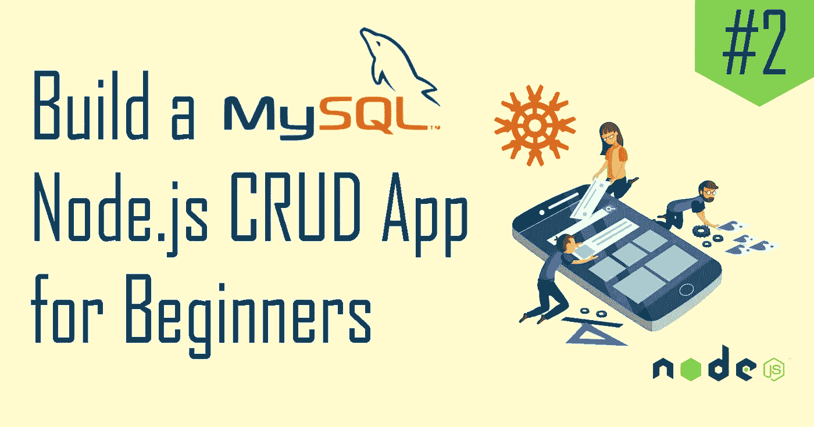

大家好，欢迎来到[让我们构建一个 MySQL Node.js CRUD 应用系列](https://hashnode.com/series/lets-build-a-mysql-nodejs-crud-app-ckhzrl98g022j99s11xymfqkn)的第二篇文章！在上一篇文章中，我们已经将书评应用程序初始化为一个 React 项目，并在 MySQL 上设置了一个简单的数据库。

> 如果你没看过上一篇文章，请在这里找到[。](https://lo-victoria.com/build-mysql-nodejs-crud-app-1-setting-up)

在这一部分，我们将把我们的数据库和路线整合到我们的应用程序中。

# 步骤 1:创建 Express 服务器

在我们项目的根目录下为后端创建一个`server.js`文件。我们可以创建一个包含以下内容的快速应用程序:

```
const express = require("express");
const mysql = require("mysql");
require("dotenv").config();const app = express();
app.use(express.json()); 
// parses incoming requests with JSON payloads
```

# 步骤 2:创建到数据库的连接

用形式为`NAME=VALUE`的变量创建一个`.env`文件，如下所示:

```
DB_HOST=localhost
DB_USER=root
DB_PASSWORD=password
DB=ravenbooks
```

然后，我们创建一个到数据库的池连接。我们可以使用环境变量来保护我们的配置不被看到。

```
//create connection to database
const db = mysql.createPool({
  host: process.env.DB_HOST, //localhost
  user: process.env.DB_USER, //root
  password: process.env.DB_PASSWORD, //password
  database: process.env.DB, //ravenbooks
});
```

# 步骤 3:创建监听器

然后，在它下面，我们请求我们的服务器监听一个请求。

```
const listener = app.listen(process.env.PORT || 3000, () => {
    console.log('App is listening on port ' + listener.address().port)
})
```

默认情况下，我们将应用程序设置为监听端口 3000。然而，在端口号由环境变量指定的情况下，应用程序将监听`process.env.PORT`。

现在运行命令`nodemon server.js`，控制台应该打印出应用程序正在监听端口 3000。

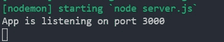

# 创建路线

现在我们已经设置好了一切，我们需要做的就是创建 GET、POST、PUT 和 DELETE 路径，以允许我们的应用程序在我们的数据库上创建 CRUD 函数。

现在，我们将使用 [POSTman](https://www.postman.com/downloads/) ，一个超级方便的工具来测试我们的后端路由，而不必构建前端。

在本系列的后面部分，我将为这个应用程序实现 React 前端。

# 1.得到

我们的应用程序应该能够获得并返回 MySQL 数据库中的所有书评。让我们创建一条 GET 路线`/reviews`来实现这一点。

```
app.get("/reviews", (req, res) => {
  db.query("SELECT * FROM book_reviews", (err, result) => {
    if (err) {
      console.log(err);
    } else {
      res.send(result);
    }
  });
});
```

# 测试路线

我们可以使用 MySQL 工作台直接插入一些虚拟数据，如下所示:

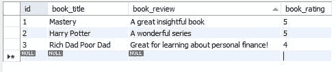

然后，在服务器还在运行并监听 3000 端口的同时，打开 POSTman 并键入:`http://localhost:3000/reviews`。确保 HTTP 方法设置为 GET，如下图所示。

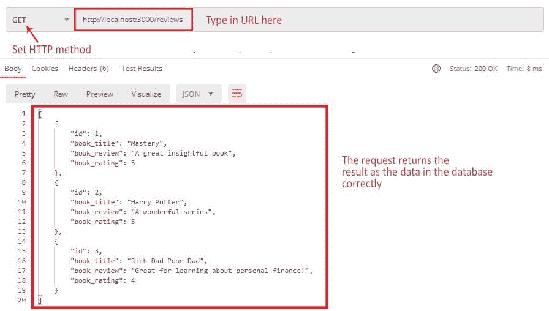

# 2.邮政

接下来，让我们创建我们的 POST route，这将允许应用程序向我们的数据库添加新数据。

```
app.post("/reviews", (req, res) => {
  const insertQuery = "INSERT INTO book_reviews SET ?";
  db.query(insertQuery, req.body, (err, result) => {
    if (err) {
      console.log(err);
    } else {
      res.send("Review Added to Database");
    }
  });
});
```

# 测试路线

在 POSTman 上，配置如下图所示的设置，将一个样本数据发布到我们的数据库。

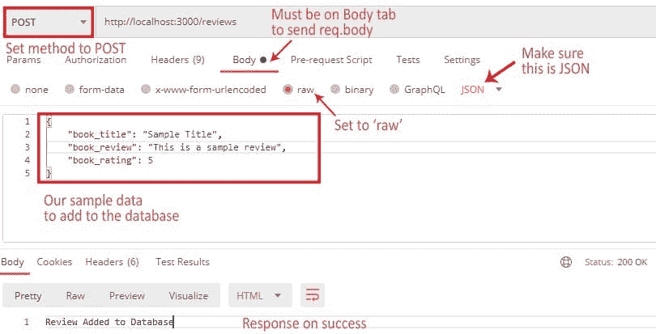

如果我们的请求成功，我们的样本数据将添加到我们的数据库中，如下所示:

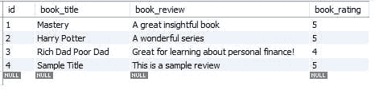

# 3.放

PUT route 将负责向我们的数据库更新任何数据。允许用户更新`book_rating`和`book_review`列。

```
app.put("/reviews", (req, res) => {
  const updateQuery =
    "UPDATE book_reviews SET book_review = ?, book_rating = ? WHERE id = ?";
  db.query(
    updateQuery,
    [req.body.book_review, req.body.book_rating, req.body.id],
    (err, result) => {
      if (err) {
        console.log(err);
      } else {
        res.send(result);
      }
    }
  );
});
```

# 测试路线

在 POSTman 上配置以下设置。

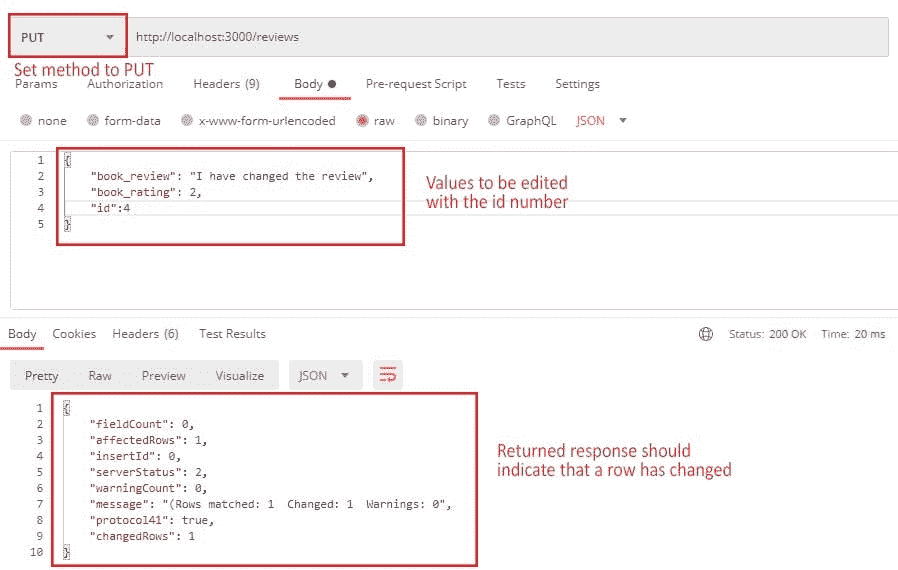

如果请求成功，我们的数据库应该显示新更新的数据，如下所示:

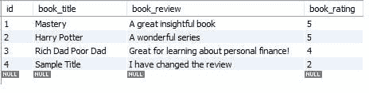

# 4.删除

最后但同样重要的是，我们有删除路径，它将根据参数中提供的`id`值从表中删除特定的行。

```
app.delete("/reviews/:id", (req, res) => {
  db.query(
    "DELETE FROM book_reviews WHERE id = ?",
    req.params.id,
    (err, result) => {
      if (err) {
        console.log(err);
      } else {
        res.send(result);
      }
    }
  );
});
```

# 测试路线

要在 POSTman 上测试我们的路线，请确保在 URL 中添加 id 参数。对于这个例子，我们想要删除我们之前使用 POST 路由添加的样本数据。

因此，让我们将想要删除的行的 id 设置为 4。

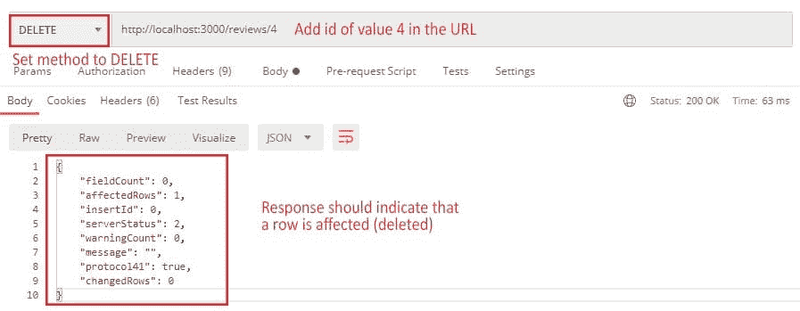

如果成功，我们将看到我们的样本数据已经从我们的数据库中删除。

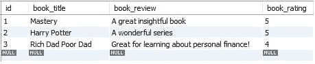

# 敬请期待

暂时就这些了！在这一部分，我们已经成功地创建了我们的 Express 服务器，我们需要的 GET POST PUT DELETE routes，甚至用 POSTman 测试了它们。

我们的后端已经完成，请继续关注[下一部分](/build-a-mysql-node-js-crud-app-3-the-client-side-with-react-ff6a7e0c2431)，我们将转移重点，用 React 实现前端。感谢阅读这篇文章。如果有帮助，一定要给个赞，分享一下。也可以在下面的评论中随意提问。干杯！

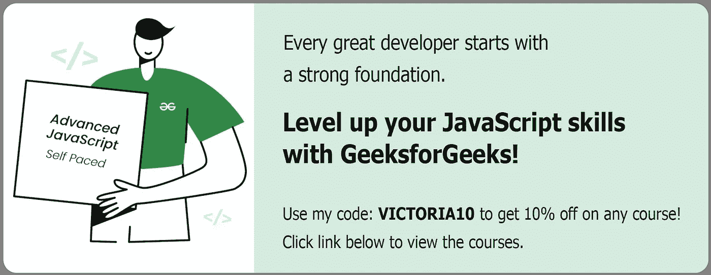

*   [高级 JavaScript](https://bit.ly/3Tw34nC) 课程
*   [通用编程](https://bit.ly/3AZ6NCM)课程
*   [数据结构&算法](https://bit.ly/3KziWkX)课程

*原载于*[*https://lo-victoria.com*](https://lo-victoria.com/build-a-mysql-nodejs-crud-app-2-mysql-integration)*。*