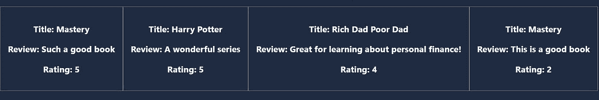
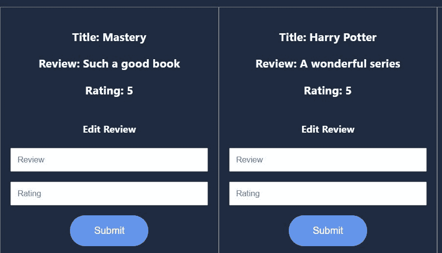

# 构建 MySQL Node.js CRUD 应用#3:使用 React 的客户端

> 原文：<https://javascript.plainenglish.io/build-a-mysql-node-js-crud-app-3-the-client-side-with-react-ff6a7e0c2431?source=collection_archive---------16----------------------->


大家好，欢迎来到[让我们构建一个 MySQL Node.js CRUD 应用程序系列](https://hashnode.com/series/lets-build-a-mysql-nodejs-crud-app-ckhzrl98g022j99s11xymfqkn)的第三部分！在前一篇文章中，我们已经在服务器中实现了所有的 GET、POST、PUT 和 DELETE 路由。

> 如果你没看过上一篇文章，请在这里找到[。](https://lo-victoria.com/build-a-mysql-nodejs-crud-app-2-mysql-integration)

在这一部分中，我们将使用 React 完成我们的 MySQL CRUD 应用程序的前端工作！

# 步骤 1:安装 npm 软件包

安装 axios 和 cors，以允许我们的应用程序向服务器发出请求。安装 react-hook-form，以便在 react 中轻松处理表单。

```
npm install axios cors react-hook-form
```

# 步骤 2:导入 cors

在`server.js`中，在顶部包含导入语句以使用 cors。

```
const cors = require("cors");
```

然后，要使用它，在`const app`行下面添加这一行。

```
app.use(cors());
```

这将允许我们在`localhost:3001`的客户端能够向端口`3000`的服务器发出请求。要了解更多关于 CORS 的信息，请随意阅读这篇关于[跨来源资源共享简介的文章。](https://lo-victoria.com/introduction-to-cross-origin-resource-sharing-cors)

# 第三步:阅读评论

在`App.js`中，我们希望从 MySQL 获取并显示评论，供用户阅读。为此，我们首先导入以下内容:

```
import { useState, useEffect } from "react";
import axios from "axios";
```

接下来，我们的代码将如下进行:

1.  初始化一个名为`reviews`的数组，它包含所有的回顾数据
2.  创建函数将所有评论从服务器存储中获取到`reviews`数组。
3.  创建一个`useEffect`钩子来更新`reviews`

```
// 1.
const [reviews, setReviews] = useState([]);
// 2.
const getReviews = () => {
    axios.get("http://localhost:3000/reviews").then((res) => {
      setReviews(res.data);
    });
};
// 3.
useEffect(() => {
    getReviews();
}, [reviews]);
```

最后，为了显示`reviews`中的数据，我们在返回函数中使用`map()`,并用`<div className="reviews">`封装它，如下所示:

```
<div className="reviews">
{reviews.map((item) => {
    return (
       <div className="review">
          <h3>Title: {item.book_title}</h3>
          <h3>Review: {item.book_review}</h3>
          <h3>Rating: {item.book_rating}</h3>
       </div>
    );
})}
</div>
```

然后用`nodemon server.js`运行服务器，用`npm start`启动 React app。

我们的应用程序应该在启动后立即显示我们的数据库中的数据。



# 步骤 3:创建评论

现在让我们为 React 应用程序创建组件，以便对数据库执行创建操作。

创建一个名为`Add.js`的文件，该文件将是一个组件，允许用户通过使用`react-hook-form`和`axios`提交表单来创建新的书评并将其添加到数据库中。

在该文件中，在顶部添加以下导入语句。

```
import { useForm } from "react-hook-form";
import axios from "axios";
```

然后，我们将编写以下代码:

1.  使用`useForm`初始化表单
2.  创建一个 onSubmit 处理函数，将提交的表单数据插入到数据库中。
3.  更新 App.js 中的评论数组

```
export default function Add(props) {
  // 1.
  const { register, handleSubmit } = useForm();
  // 2.
  const onSubmit = (data) => {
    console.log(data);
    addReview(data);
  }; // function to make a POST req to the server to insert data to MySQL db
  const addReview = (data) => {
    axios.post("http://localhost:3000/reviews", data).then(() => {
      // 4.
      props.setReviews([...props.reviews, {data}]);
    });
  };
}
```

然后，在返回函数中创建适当的 HTML 表单，如下例所示:


将该组件导入到`App.js`中，并像这样包含它:

```
<Add reviews={reviews} setReviews={setReviews} />
```

# 步骤 4:更新评论

我们现在能够创建和读取我们的 MySQL 数据库。接下来让我们继续更新。

创建一个`Edit.js`文件，该文件是一个返回表单的组件，用户可以提交该表单来更新特定评审数据的值。

为了允许用户更新现有评论，我们将:

1.  将必要的包导入`Edit.js`
2.  初始化我们的反应表单
3.  创建一个函数，在提交表单时更新我们的数据库
4.  更新我们的`reviews`阵

```
// 1.
import { useForm } from "react-hook-form";
import axios from "axios";export default function Edit(props) {
  // 2.
  const { register, handleSubmit } = useForm(); // 3.
  const onSubmit = (data) => {
    console.log(data); //{book_review: ..., book_rating: ...}
    data["id"] = props.id; //add the id from props
    updateReview(data);
  };// This will update existing data with new submitted values
const updateReview = (data) => {
    axios.put("http://localhost:3000/reviews", data).then((res) => {

      // 4.
      props.setReviews(
        props.reviews.map((item) => {
          return item.id === props.id? {
                id: item.id,
                book_title: item.book_title,
                book_review: item.book_review,
                book_rating: item.book_rating,
              }
            : item;
        })
      );
    });
  };
```

然后，在 return 函数中创建一个简单的表单，并在`App.js`中添加`Edit`组件。

将它添加到我们的`<div className="reviews">`中，并记住将`id`作为`item.id`从我们的编辑组件中传递到工作中。

```
<div className="reviews">
        {reviews.map((item) => {
          return (
            <div className="review">
              <h3>Title: {item.book_title}</h3>
              <h3>Review: {item.book_review}</h3>
              <h3>Rating: {item.book_rating}</h3>
              {/*Add Edit here*/}
              <Edit id={item.id} reviews={reviews} setReviews={setReviews} />
            </div>
          );
        })}
</div>
```

结果会是这样的。



# 第五步:删除评论

最后，我们的删除操作将是最简单的。我们的客户只需要提供从数据库中删除的评论的`id`。

请求 URL 将包含`id`作为参数，如:`[http://localhost:3000/:id](http://localhost:3000/:id)`

为此，创建一个`Delete.js`文件，并如下进行:

1.  导入 axios
2.  创建函数删除 URL 中`:id`为`props.id`的评论
3.  更新评论数组
4.  创建删除按钮作为回报

```
// 1.
import axios from "axios";
export default function Delete(props) {
  // 2.
  const deleteReview = () => {
    axios.delete(`http://localhost:3000/reviews/${props.id}`).then((res) => {
      // 3.
      props.setReviews(props.reviews.filter((item) => {
          return item.id !== props.id;
        })
      );
    });
  };// 4.
return (
    <button className="del-btn" onClick={deleteReview}>
      Delete Review
    </button>
  );
}
```

像往常一样，将这个组件导入到`App.js`并将其插入到我们的编辑组件下面。记住要包含相关的属性作为删除工作的道具。

```
<div className="review">
    <h3>Title: {item.book_title}</h3>
     <h3>Review: {item.book_review}</h3>
     <h3>Rating: {item.book_rating}</h3>
     <Edit id={item.id} reviews={reviews} setReviews={setReviews} />
      {/*Add Delete here*/}
     <Delete id={item.id} reviews={reviews} setReviews={setReviews} />
</div>
```

# 决赛成绩

现在，我们应该有一个简单的 React 应用程序来执行 MySQL 数据库的 CRUD 操作！

感谢阅读！我们终于完成了我们的应用程序，但下一步呢？它正在部署它！在本系列的下一部分[中，让我们学习如何将我们的全栈 React 应用部署到 Heroku。](/build-a-mysql-node-js-crud-app-4-deploying-to-heroku-finale-1f69a005812b)

如果这个系列到目前为止很有帮助，一定要喜欢或分享这篇文章，并继续关注下一篇。干杯！


*   [高级 JavaScript](https://bit.ly/3Tw34nC) 课程
*   [通用编程](https://bit.ly/3AZ6NCM)课程
*   [数据结构&算法](https://bit.ly/3KziWkX)课程

*原为发表于*[*https://lo-victoria.com*](https://lo-victoria.com/build-a-mysql-nodejs-crud-app-3-the-client-side-with-react)*。*