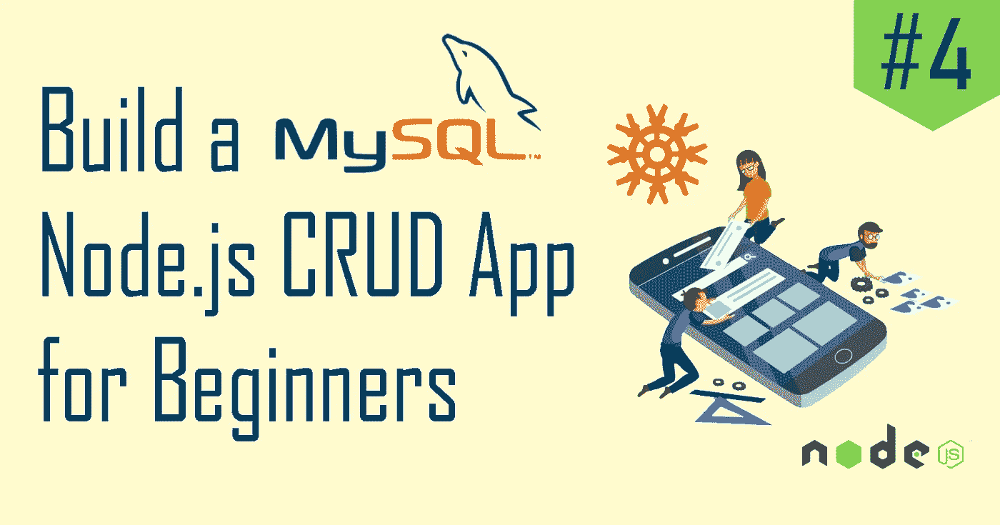
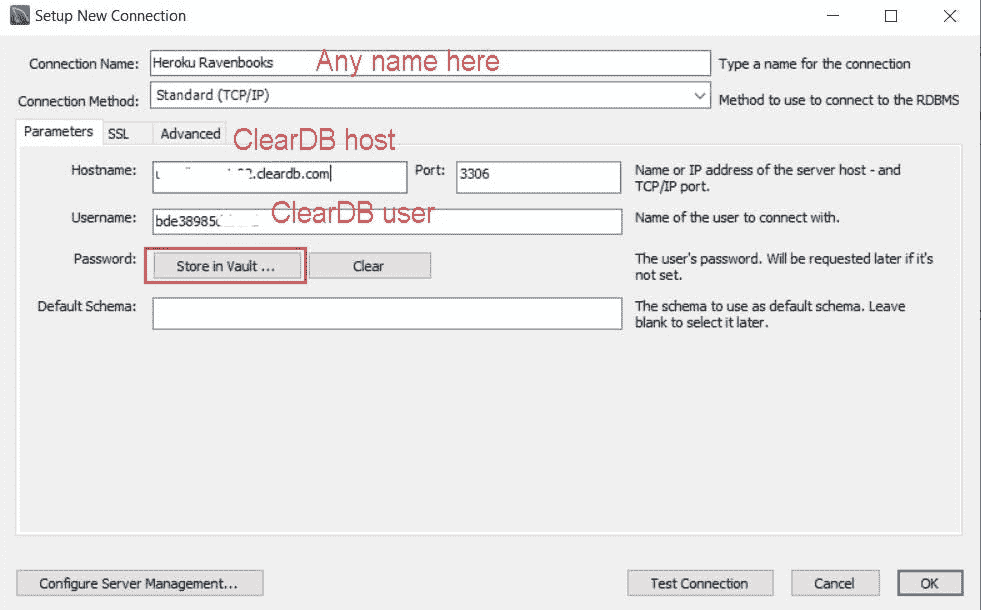
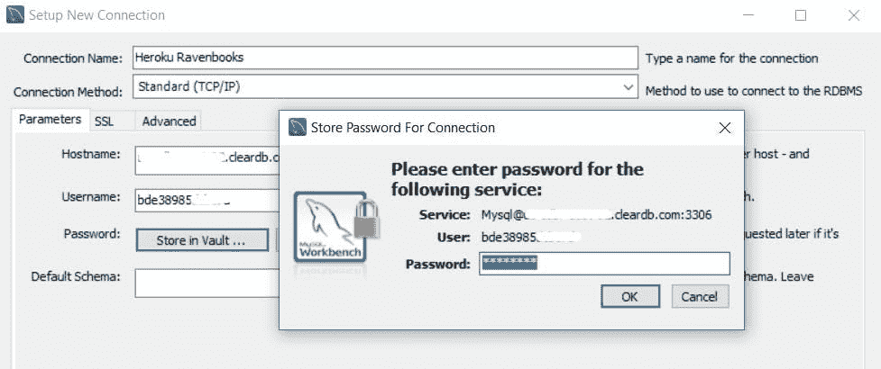
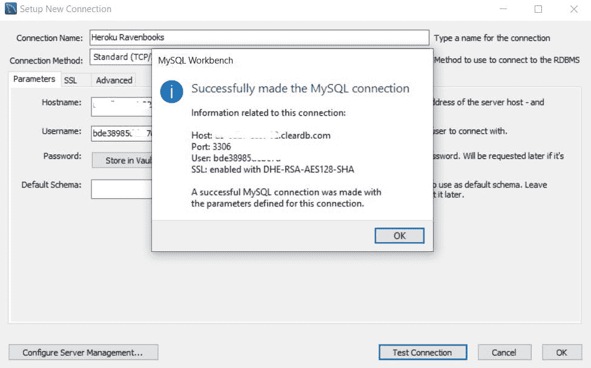
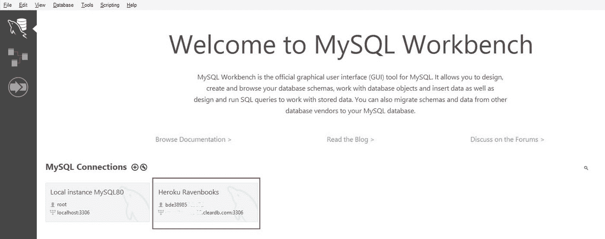
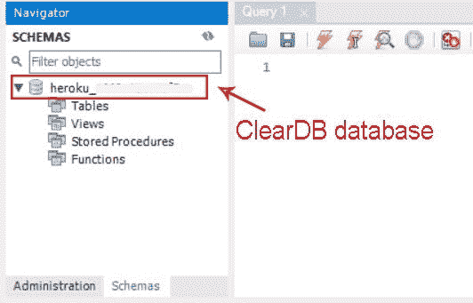
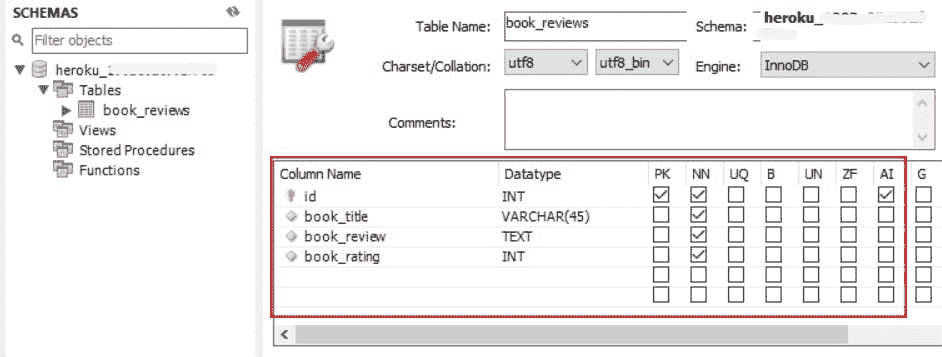

# 构建一个 MySQL Node.js CRUD 应用程序#4:部署到 Heroku

> 原文：<https://javascript.plainenglish.io/build-a-mysql-node-js-crud-app-4-deploying-to-heroku-finale-1f69a005812b?source=collection_archive---------12----------------------->



大家好，欢迎来到[的最后一集，让我们构建一个 MySQL Node.js CRUD 应用程序系列](https://hashnode.com/series/lets-build-a-mysql-nodejs-crud-app-ckhzrl98g022j99s11xymfqkn)！在前一篇文章中，我们已经用 React 实现了我们的前端，并完成了我们的完整堆栈应用程序。

> 如果您没有读过前面的文章，请在这里找到[。](https://lo-victoria.com/build-a-mysql-nodejs-crud-app-3-the-client-side-with-react)

让我们通过将反应 MySQL 应用程序部署到 Heroku 来结束本系列。Heroku 是一个云平台(PaaS)，我们可以用它来免费托管我们的应用程序。

# 第 1 步:安装 Heroku CLI

如果您还没有这样做，请将 Heroku CLI 下载并安装到您的设备中。点击此[链接](https://devcenter.heroku.com/articles/heroku-cli)并按照他们的下载说明进行操作。

接下来，在这里创建 Heroku 账户[。注册免费层(或任何层)即可开始。](https://signup.heroku.com/)

# 第二步:Package.json

现在，让我们对应用程序进行必要的更改，为 Heroku 部署做准备。

转至我们的`package.json`文件。在“脚本”属性下，将默认的开始脚本更改为:

```
"start": "node server.js",
```

然后将应用程序的节点版本添加为:

```
"engines": {
    "node": "12.14.1"
  },
```

# 第 3 步:Procfile

在项目的根目录中，创建一个名为 Procfile 的新文件，并在其中添加以下行:

```
web:node server.js
```

Procfile 指定了应用程序在启动时必须执行的命令。如需了解更多信息，请在此处阅读 Heroku 的官方文件[。](https://devcenter.heroku.com/articles/procfile)

# 第 4 步:Server.js

因为我们要部署一个完整的应用程序，所以我们必须让我们在`server.js`的快速服务器能够提供来自我们的反应应用程序的静态文件。

为此，首先在`server.js`顶部导入一个名为 path 的内置模块。

```
const path = require("path");
```

然后，添加以下行:

```
// declare react files in build as static
app.use(express.static(path.join(__dirname, "build")));// serve index.html from the build folder
app.get("/*", (req, res) => {
  res.sendFile(path.join(__dirname, "build", "index.html"));
});
```

现在，我们需要做的就是通过运行以下命令来创建构建文件夹:

```
npm run build
```

名为`build`的文件夹应该出现在根目录中。

# 第 5 步:创建 Heroku 应用程序

现在，我们准备创建一个英雄库应用程序。首先，为项目创建一个 git 存储库。

然后运行以下命令创建应用程序:

```
heroku create <app-name>
```

最后，使用以下工具将其部署到 Heroku:

```
git push heroku master
```

现在该应用程序应该在 Heroku 上，但它还不会工作，因为它没有连接到任何 MySQL 数据库。

我们一直用来测试的只是本地的。我们需要一个名为 ClearDB 的服务提供商来帮助我们连接到 MySQL 数据库。

# 第 6 步:ClearDB 设置

通过以下方式将 ClearDB 加载项安装到我们的 Heroku 应用程序中:

```
heroku addons:create cleardb:ignite
```

> 注意:ignite 是指 ClearDB 的免费版本。如果需要，请随意使用其他版本。

安装 ClearDB 后，一个名为`CLEARDB_DATABASE_URL`的配置变量会自动添加到我们的 Heroku app 中。要从我们的命令提示符中检索它，请运行:

```
heroku config | findstr CLEARDB_DATABASE_URL
```

我们的命令提示符将打印 URL，如下所示:

```
mysql://<user>:<password>@<host>/<database>?reconnect=true
```

请注意格式，因为我们必须将我们的环境变量设置为 Heroku 应用程序，如下所示:

```
heroku config:set DB_USER=<user>heroku config:set DB_PASSWORD=<password>heroku config:set DB_HOST=<host>heroku config:set DB=<database>
```

# 步骤 7: MySQL 工作台

我们已经用 ClearDB 建立了 MySQL 数据库连接，但是缺少一样东西——表。因此，让我们像创建`localhost`数据库一样创建它。

打开 MySQL Workbench 并添加一个新的数据库连接。您可以随意命名该连接。使用 CLEARDB_DATABASE_URL 中的`<host>`值作为主机。并使用`<user>`值作为用户名。



如果您忘记了它们的值，您可以随时在命令提示符下查看之前打印的 URL。它将采用以下格式:

```
mysql://<user>:<password>@<host>/<database>?reconnect=true
```

接下来，点击“存储在保险库中”输入密码，这是 ClearDB `<password>`。



之后，点击窗口底部的“测试连接”。您应该会看到一个弹出窗口，提示连接成功。



然后，您可以单击 OK 来完成新连接的设置，它应该会出现在我们的工作台主页上，如下所示。



单击 ClearDB 连接，您应该看到默认情况下，我们的模式名是 ClearDB `<database>`。



最后，让我们创建 book_reviews 表，就像我们为`localhost`数据库创建的表一样。



# 第八步:还有一件事…

万岁！我们已经将 React Express 应用程序部署到 Heroku，我们已经成功设置了 ClearDB 和 MySQL 数据库，还有什么？

嗯，如果你去 Heroku app 网站(在我的例子中是[ravenbooks.herokuapp.com](https://ravenbooks.herokuapp.com/))，你会注意到客户端不能向服务器请求任何东西。控制台发送 404 错误，因为如果你还记得上一篇文章，我们在 React 应用程序中使用的 URL 都是`localhost:3000`而不是`[https://ravenbooks.herokuapp.com/](https://ravenbooks.herokuapp.com/.)` [。](https://ravenbooks.herokuapp.com/.)

要修复此错误，请将`App.js`、`Add.js`和其他组件中的所有 URL 从`https:localhost:3000/reviews`更改为`[https://ravenbooks.herokuapp.com/reviews](https://ravenbooks.herokuapp.com/reviews.)`、[。](https://ravenbooks.herokuapp.com/reviews.)

现在我们的应用程序应该可以完美工作了！

# 感谢阅读！

[到此结束，让我们构建一个 MySQL Node.js CRUD 应用程序系列](https://hashnode.com/series/lets-build-a-mysql-nodejs-crud-app-ckhzrl98g022j99s11xymfqkn)！如果你一直在关注，感谢你阅读这个系列直到最后。我希望它能以任何方式帮助您开始在 React 项目中实现 MySQL。如果是，请喜欢并分享给周围的人。

要查看这个演示应用程序的完整代码，请随意访问 [repo](https://github.com/victoria-lo/raven-books) 并在这里查看应用程序[，但请不要发布任何奇怪的东西。感谢阅读！干杯！](https://ravenbooks.herokuapp.com/)


*   [高级 JavaScript](https://bit.ly/3Tw34nC) 课程
*   [通用编程](https://bit.ly/3AZ6NCM)课程
*   [数据结构&算法](https://bit.ly/3KziWkX)课程

*原载于 https://lo-victoria.com*[](https://lo-victoria.com/build-a-mysql-nodejs-crud-app-4-deploying-to-heroku-finale)**。**