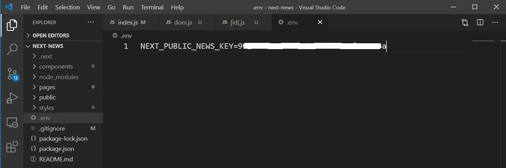
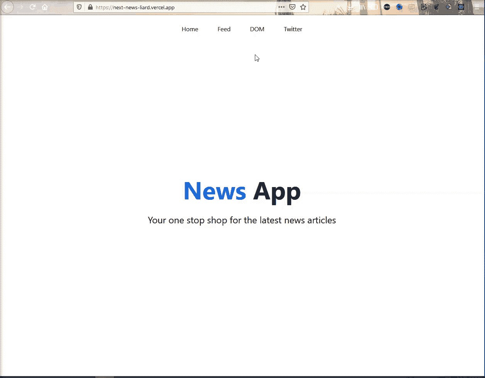

# 用 Next.js 构建新闻应用

> 原文：<https://javascript.plainenglish.io/build-a-news-app-with-next-js-182e6287aee5?source=collection_archive---------5----------------------->


Photo by [ThisisEngineering RAEng](https://unsplash.com/@thisisengineering?utm_source=unsplash&utm_medium=referral&utm_content=creditCopyText) on [Unsplash](https://unsplash.com/s/photos/coding-quotes?utm_source=unsplash&utm_medium=referral&utm_content=creditCopyText)

在完成前一篇博客中的速成课程后，是时候用 Next.js 创建一个应用程序了。因此，我们将使用 Next.js 创建一个新闻应用程序，它将从新闻 API 中获取数据。

现在，要创建一个 Next.js 应用程序，我们需要在任何文件夹中使用下面的命令。唯一的要求是，Node.js 和 npm 应该安装在机器上。

```
npx create-next-app next-news
```

现在，按照说明切换到新创建的文件夹。我也在 VSCode 中打开了这个项目。之后运行`npm run dev`来启动项目。


next app

现在，下一个应用程序将在 [http://localhost:3000/](http://localhost:3000/) 上启动，我们将使用这个默认页面。


localhost

该页面来自 pages 文件夹中的 **index.js** 文件。删除那里的所有内容，把下面的内容放进去。

```
import Head from 'next/head'
import styles from '../styles/Home.module.css'export default function Home() {
  return (
    <>
      <h1>Hello World</h1>
    </>
  )
}
```

现在，在 localhost 中只显示了我们的标题和 h1。


Hello World

现在，我们将开始新的一页。因此，在 **pages** 文件夹中创建一个文件 **dom.js** 。这里，我们有一个简单的组件，显示了本月最佳开发人员的 h1 标记。

之后，我们使用 **getServerSideProps** 来访问一个 API 端点，这是我使用 JSON 服务器创建的，用来获取数据。正如在早期的速成课程中一样，从 NextJS 应用程序获得道具并在同一个组件中获得访问权限是非常容易的。这里，我们从 API 中获取开发者，并在我们的组件中使用它。

```
const DOM = ({ developer }) => {
    console.log(developer)return (
        <div className='page-container'>
            <div>
                <h1>Developer of the month</h1>
            </div>
        </div>
    )
}export const getServerSideProps = async () => {
    const apiResponse = await fetch(
        'https://my-json-server.typicode.com/nabendu82/news-next/devOfMonth',
    );
    const developer = await apiResponse.json();return {
        props: {
            developer,
        },
    };
};export default DOM
```

现在，使用 **My JSON server** 创建 API 端点非常简单。我们需要创建一个 **db.json** 并放入我们的任何 GitHub repo。我已经把它放在新闻-下一个回购和下面是结构。


news-next

现在，转到[http://localhost:3000/DOM](http://localhost:3000/dom)并打开控制台，您将看到来自 API 端点的数据。


Developer

现在，我们将显示从 api 收到的信息。所以，在 **dom.js** 文件中，我们首先添加样式文件。在返回内容中，我们显示了名称、位置、图像和各种类的描述。


dom.js

现在，在 styles 文件夹中添加 **Dom.module.css** 并在其中添加以下内容。

```
.main {
    flex: 1;
    display: flex;
    align-items: center;
    flex-direction: column;
    margin-top: 50px;
}.developerOfTheMonth {
    text-align: center;
}.developerOfTheMonth img {
    width: 250px;
    border-radius: 100%;
}
```

另外，在**的底部添加下面的 css。**

```
.page-container {
  display: flex;
  height: 100vh;
  flex-direction: column;
}
```

现在，我们的 DOM 页面在 localhost 中如下所示。


localhost

现在，我们将为我们的应用程序创建一个导航栏。因此，在根目录下创建一个**组件**文件夹，并在其中创建一个 **Navbar.js** 文件。把下面的内容放进去。

这里，我们从下一个路由器使用 useRouter，然后使用它创建各种路由。点击不同的链接会进入不同的路径。最后一个 onw 是直接开我的 twitter 账号。

```
import { useRouter } from 'next/router';
import styles from '../styles/Navbar.module.css';const Navbar = () => {
    const router = useRouter();return (
        <div className={styles.main}>
            <div onClick={() => router.push('/')}>Home</div>
            <div onClick={() => router.push('/feed/1')}>Feed</div>
            <div onClick={() => router.push('/dom')}>DOM</div>
            <div onClick={() => (window.location.href = 'https://twitter.com/nabendu82')}>Twitter</div>
        </div>
    )
}export default Navbar
```

现在，在**样式**文件夹的 **Navbar.module.css** 中为它创建样式。

```
.main {
    width: 100%;
    height: 50px;
    display: flex;
    justify-content: center;
}.main div {
    margin: 25px;
    cursor: pointer;
}.main div:hover {
    color: rgb(168, 168, 168);
}
```

我们需要在所有页面中使用这个导航条组件。所以，最好创建一个布局组件。因此，在**组件**文件夹中创建一个文件 **Layout.js** ，并在其中添加以下内容。我们还采用了 page-container 的公共 div，它封装了我们所有的页面。

```
import Navbar from "./Navbar"const Layout = ({ children }) => {
    return (
        <div className='page-container'>
            <Navbar />
            {children}   
        </div>
    )
}export default Layout
```

现在，有一个文件 **_app.js** 包装了我们所有的页面。因此，如果我们想在所有页面中实现一个通用布局，我们将使用它。我们已经用布局组件包装了组件。

```
**import Layout from '../components/Layout'**
import '../styles/globals.css'function MyApp({ Component, pageProps }) {
  return (
    **<Layout>**
      <Component {...pageProps} />
    **</Layout>**
  )
}export default MyApp
```

现在，我们将设置我们的主页。所以，转到 **index.js** 文件，用下面的内容修改它。

```
import styles from '../styles/Home.module.css'export default function Home() {
  return (
      <div className={styles.main}>
        <h1 className={styles.title}><span>News</span> App</h1>
        <p className={styles.description}>Your one stop shop for the latest news articles</p>
      </div>
  )
}
```

现在，用下面的内容替换 **Home.module.css** 的内容。

```
.main {
  flex: 1;
  display: flex;
  align-items: center;
  flex-direction: column;
  justify-content: center;
}.title a,
.title span {
  color: #0070f3;
  text-decoration: none;
}.title {
  margin: 0;
  line-height: 1.15;
  font-size: 4rem;
}.title,
.description {
  text-align: center;
}.description {
  line-height: 1.5;
  font-size: 1.5rem;
}
```

现在，我们的主页也完成了，如下图所示，带有可工作的导航栏。


Home Page

另外，从 **dom.js** 文件中删除带有**页面容器**的 div，因为我们已经将逻辑移到了 **Layout.js** 文件中。


dom.js

现在，我们将在 feed 页面上工作，这是最重要的页面，因为它是一个新闻应用程序。

现在，这个页面不同于其他页面，因为它根据一个参数而改变。因此，我们将在**页面**文件夹中创建一个名为**提要**的文件夹，而不是创建一个文件。我们将在其中创建一个新文件 **[id]。因为这些方括号，这是一条动态路线。**

现在把下面的内容放进去。在这里，在我们的提要中，我们将从 api 调用中获得**文章**、**页码**。现在，在 **getServerSideProps** 中，我们可以通过 **pageContext.query.id** 获得 **pageNumber** ，它只不过是 url 末尾的数字，就像[http://localhost:3000/feed/1](http://localhost:3000/feed/1)

首先我们检查**页码**是否有效，将道具设为页码为 1 的空文章。

之后，我们用我们的**页码**对 newsapi 进行 API 调用。在新闻 api 中，我们还需要给出我们的私有 API 键，所以我们将通过一个环境变量来传递它。

与 fetch 一样，我们需要执行第二个 await 来获取数据，我们这样做，然后将数据赋给 articles 变量。之后我们归还道具。

```
export const Feed = ({ articles, pageNumber }) => {
  console.log({ articles, pageNumber })
  return (<>Hello World</>)
}export const getServerSideProps = async pageContext => {
    const pageNumber = pageContext.query.id;if (!pageNumber || pageNumber < 1 || pageNumber > 5) {
        return {
            props: {
                articles: [],
                pageNumber: 1,
            },
        };
    }const apiResponse = await fetch(
        `https://newsapi.org/v2/top-headlines?country=us&pageSize=5&page=${pageNumber}`,
        {
            headers: {
                Authorization: `Bearer ${process.env.NEXT_PUBLIC_NEWS_KEY}`,
            },
        },
    );

    const json = await apiResponse.json();
    const { articles } = json;return {
        props: {
            articles,
            pageNumber: Number.parseInt(pageNumber),
        },
    };
};export default Feed;
```

现在，首先去 newsapi.org 注册。之后你可以通过点击**获取 api 密匙**按钮来获取 API 密匙。


Api keys

接下来，转到**。gitignore** 文件并添加**。env** 文件，这样它就不会被添加到我们的 github 中。


.gitignore

现在，在根目录内创建**。env** 文件，并将您的 api 密钥放入其中。



.env

现在，重新启动您的服务器并刷新本地主机，我们将看到来自 newsapi 的数据。


feed

现在，我们将添加我们的 html 来显示文章。但在此之前，在**样式**文件夹中的 **Feed.module.css** 中添加相同的样式。

```
.main {
    display: flex;
    margin-top: 50px;
    align-items: center;
    flex-direction: column;
  }
  .post {
    width: 500px;
    margin-bottom: 25px;
    padding-bottom: 25px;
    border-bottom: 1px solid black;
  }
  .post img {
    width: 100%;
  }
  .post h1 {
    font-size: 16px;
    cursor: pointer;
    text-align: center;
  }
  .paginator {
    width: 100%;
    display: flex;
    justify-content: center;
  }
  .paginator div {
    margin: 25px;
  }
  .paginator .active {
    cursor: pointer;
  }
  .paginator .disabled {
    cursor: not-allowed;
    color: rgb(179, 179, 179);
  }
```

回到**【id】。js** 文件，我们导入样式，然后在返回语句中。这里，我们在一个 div 中显示了文章标题、描述和图片。


[id].js

现在，如果我们转到 localhost 中的 feed 页面，我们将会看到样式精美的新闻。点击健康热线，我们也将被带到原来网站上的新闻文章。


localhost

现在，我们还想显示一个分页器，这样我们就可以转到我们的 api 正在获取的五个页面。因此，我们将在文章下面添加一个带有**分页器**类的 div。

我们也使用路由器在点击相应的 div 时推进到下一页或上一页。我们还禁用了第 5 页的**下一页**和第 1 页的**上一页**。


[id].js

现在，我们的分页器也工作正常，这就完成了我们的应用程序。


App complete

现在，我们将通过 vercel 部署我们的应用程序，他们也是 NextJS 的创造者。但为此，我们需要将我们的项目推向 github。

在推送之前，我还在根目录下创建了一个 **db.json** ，并在其中添加了以下内容。

```
{
    "devOfMonth": {
        "name": "TheWebDev",
        "position": "Associate Architect",
        "image": "https://pbs.twimg.com/profile_images/1020939891457241088/fcbu814K_400x400.jpg",
        "description": "Front-end developer, Youtuber, Author, Tech Blogger"
    }
}
```

所以，推送到 github 后，我们还需要更新 **dom.js** 中的路径。


dom.js

现在，去[https://vercel.com](https://vercel.com)注册你的 github。在仪表板中，点击**新建项目**按钮。


vercel

在下一页中，点击下拉菜单，然后**添加 Github Org 或 Account** 链接。


Add Github

然后会出现一个弹出窗口，在这里选择您的个人 github 帐户。


Personal account

在下一个弹出窗口中，单击“Only select repositories”单选按钮，然后在“select repositories”中选择您放置该项目的存储库。

向下滚动并点击**安装**按钮。


Select repository

现在，您将被带回到原始页面。在这里，您将看到存储库并点击**导入**按钮。


Import

在下一页，选择个人帐户，因为它是免费的。


Personal account

在下一页中，单击环境变量并放置您的 API 键。之后点击**添加**按钮，然后点击**展开**按钮。


API keys

之后，如果部署成功，您将进入此页面。点击**访问**按钮。


Visit

我们的应用程序已成功部署，运行良好。



Working fine

你可以在这里找到这个项目的 github。

你也可以在我的 YouTube 频道上找到这个视频格式的帖子。相同的链接在下面。

*更多内容尽在*[***plain English . io***](https://plainenglish.io/)