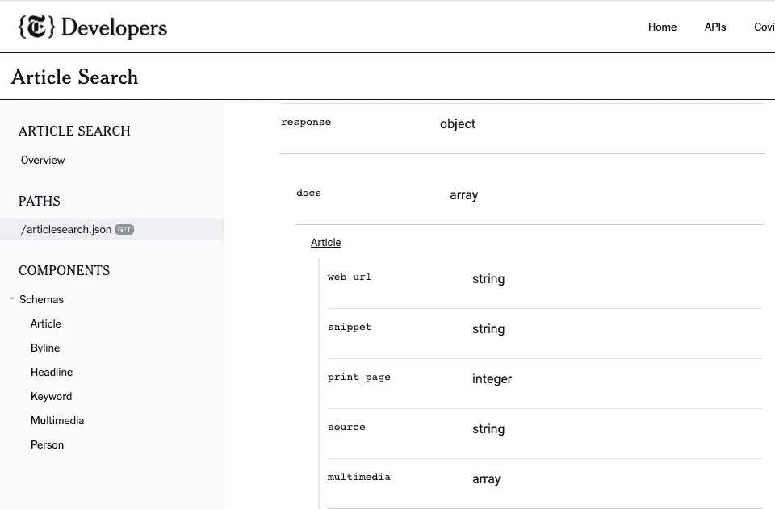
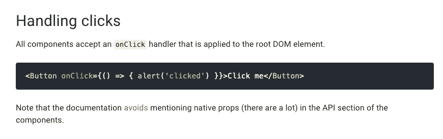

# 用纽约时报 API 和 React JS 构建一个新闻应用程序

> 原文：<https://javascript.plainenglish.io/build-a-news-app-with-the-nytimes-api-react-js-c3b4440ede7f?source=collection_archive---------2----------------------->

## 使用 React 挂钩和轴


Photo by [visuals](https://unsplash.com/@visuals?utm_source=medium&utm_medium=referral) on [Unsplash](https://unsplash.com?utm_source=medium&utm_medium=referral)

在用 React 构建新闻应用程序时，有几个新闻 API 可供选择，我决定看看纽约时报 API，因为 NYT 是我最喜欢的新闻来源之一，也因为文档非常详细。

我决定写这篇文章，因为我找不到太多关于这个特定 API 的实现的信息，希望这对其他开发人员有用。

我们将使用以下技术来构建这个应用程序，但本文将主要关注对纽约时报 API 的理解。

# 使用的技术

*   用于构建用户界面的 JavaScript 库
*   **Axios:** 基于承诺的 HTTP 客户端
*   **Material-UI:** 使用 Google 的 Material 设计的 React 的 UI 框架

# 使用纽约时报 API

首先，创建一个开发者帐户，这样您就可以为您的项目获得一个 api 密匙。

*   在 https://developer.nytimes.com/[创建你的开发者账户](https://developer.nytimes.com/)
*   创建一个应用程序，在[https://developer.nytimes.com/my-apps](https://developer.nytimes.com/my-apps)获取 api 密钥

开发者页面提供了 12 个 API，包括存档、文章搜索、地理、热门故事、书籍和电影评论 API。

在本文中，我们将探索两个 API:**文章搜索**和**热门故事。**

# 创建 React 应用程序

我将这个项目命名为 *react-nytimes* ，并使用 create-react-app 来搭建一个基本的 react 应用程序。有两种方法创建它 1)npx-create-react-app react-nytimes 或 2)使用点。在命令的最后，在我们 cd 到的文件夹中创建应用程序。让我们也安装 axios，这样我们就可以发出 API 请求。我们将使用 VS 代码作为我们的代码编辑器。

```
// Mac terminal commands mkdir react-nytimes
cd react-nytimesnpx create-react-app .
npm i react-router-dom
npm i axiosnpm i @material-ui/core
npm i @material-ui/iconscode .
npm start
```

# 关于 API 密钥的初始设置

React 是一个前端 UI 库，因此你应该总是将 API 键存储在后端服务器中，而不是 React 应用程序中。然而，为了这个项目的目的，我们将在前端存储我们的 NYTimes API 密钥，但请注意，该密钥将对检查您的项目文件的任何人公开。

在项目的根目录下创建一个. env 文件，并在那里添加 API 键。以 REACT_APP_ 为前缀命名环境变量非常重要。

```
// .env file REACT_APP_NYTIMES_API_KEY=typeapikeyfromdeveloper.nytimes.com/my-app
```

接下来添加。. gitignore 中的 env 文件。


# **使用文章搜索 API**

对于这个新闻应用程序，我们将创建一个搜索栏，用户可以输入关键字，相关的纽约时报文章将呈现在屏幕上。

关于[文章搜索 API](https://developer.nytimes.com/docs/articlesearch-product/1/overview) 的文档中有一个我们可以参考的调用示例。我们可以注意到，在查询参数之后，我们可以输入任何我们想要的搜索查询，比如 election 或

```
https://api.nytimes.com/svc/search/v2/articlesearch.json?q=election&api-key=yourkey
```

您还可以使用*新闻服务台值*过滤您的查询，例如艺术、环境、食品，或者使用*部分名称值* 进行查询，并根据其他过滤器进行排序，例如*最新的*。

```
https://api.nytimes.com/svc/search/v2/articlesearch.json?fq=section_name:("Arts")&sort=newest&api-key=yourkey
```

# 使用 Axios 获取 API 数据

我们之前安装了 axios，这样我们就可以通过 HTTP 请求从纽约时报 API 获取数据。

有了 axios，我们可以发出获取、发布、上传或删除等请求。在我们的例子中，我们将从服务器获得作为 res.data 的响应。

我们可以使用 React 的 useEffect 钩子在 App.js 文件中进行 API 调用。首先，我们使用 useState 钩子定义我们的状态变量对 *loading* 和 *articles* 。

在第 12 行，我们将 API 请求的响应设置为 *res (response)* 变量，在第 13 行*将 Articles* 设置为( *res.data.response.docs* )。但是我们怎么才能弄清楚呢？

## Axios 响应对象

第一部分***RES . data****对应于 Axios 响应对象。每当我们通过 Axios 发送一个 GET 请求时，我们得到的是返回的数据对象→ data: {}*

## *NYT API 响应对象*

*第二部分***response . docs***对应于我们返回的 Axios 数据对象中的 NYTimes API 模式。*

*每个 API 都是不同的，为了准确地知道在 Axios **"data"** 对象之后应该键入什么，我们需要仔细检查数据是如何在内部返回的。*

*找出答案的一个方法是阅读 NYT API 文档和模式，在路径菜单**下的[**GET/articlesearch . JSON**](https://developer.nytimes.com/docs/articlesearch-product/1/routes/articlesearch.json/get)**。**在这里可以看到，文章搜索 API 返回了一组文章: **response.docs.** 并且每篇文章都包括 web_url、snippet 和 multimedia 等属性。***

******

***source: [https://developer.nytimes.com/docs/articlesearch-product/1/routes/articlesearch.json/get](https://developer.nytimes.com/docs/articlesearch-product/1/routes/articlesearch.json/get)***

***查看数据对象的另一种方法是将 *get url* 粘贴到浏览器窗口上。***

```
***[https://api.nytimes.com/svc/search/v2/articlesearch.json?fq=section_name:("Arts")&sort=newest&api-key=y](https://api.nytimes.com/svc/search/v2/articlesearch.json?fq=section_name:(%22Arts%22)&sort=newest&api-key=ANbWf0Gyc18XxiPWyYbnrP4htpQFammZ)ourapikey***
```

***这是我们得到的截图。这里我们可以看到在 NYT **响应**对象中有一个**文档**数组，它由我们的文章对象组成，包含摘要、web_url、摘录、多媒体等。***

***为了呈现我们的每篇文章，我们将使用这些属性中的一些。***

******

# *****articles . js 中的映射*****

***为了动态呈现文章，我们可以创建一个 Articles.js 文件，在其中映射每个条目，并在单独的 Article.js 组件中呈现每篇文章。我们还可以在这里导入 Material-UI 组件来提供一些样式。***

# ***在 Article.js 中呈现每个文章卡片***

***在这个 Article.js 文件中，我们可以利用之前看到的 NYT 文章搜索 API 的一些属性。***

*   *****多媒体:**显示图像***
*   *****headline.main:** 显示标题***
*   *****web_url:** 链接到原文***
*   *****署名:**注明记者姓名***
*   *****片段:**提供一个摘要***

# *****显示属性*****

***因此，再次阅读 API 文档，我们可以看到 *web_url* 和*片段*位于文章模式下，并且是*字符串*。***

***然而，为了显示新闻文章的标题，我们需要查看单独的 [Headline](https://developer.nytimes.com/docs/articlesearch-product/1/types/Headline) 模式，其中有一个名为 *main* 的属性，也是一个字符串。因此我们使用属性 *headline.main* 而不仅仅是 headline。***

***署名也有自己的[署名](https://developer.nytimes.com/docs/articlesearch-product/1/types/Byline)模式，这就是我们使用*署名的原因****

# ***如何显示图像***

***最后，显示图像有点棘手，因为多媒体不同于其他属性，它是对象的一个*数组*而不是一个字符串。因此数组包含不同的对象，每个对象携带不同的图像文件。对于我们的项目，我们使用第一个图像 url，这就是为什么我们将属性设置为 *article.multimedia[0]。网址****

******

# ***没有形象怎么办？***

***另一个需要考虑的棘手问题是，有些文章没有附带图片，在这种情况下，您为 alt=编写的任何内容都会显示出来。所以我们需要有条件地渲染另一幅图像。***

# ***使用 Javascript 的可选链接(？。)***

******

***在这段代码中，我们使用 Javascript 的[可选链接](/https://developer.mozilla.org/en-US/docs/Web/JavaScript/Reference/Operators/Optional_chaining)操作符，这是 ECMAScript 2020 规范的特性之一。***

***我们正在检查:多媒体中是否存在[0]元素？如果有，显示网址。可选的链接操作符检查每个引用的有效性，并在控制台中返回 undefined，而不是抛出一个错误。***

***如果没有照片存在:我们提供显示 NYT 标志的股票图片的 url。***

***我们还为 article.multimedia[0]添加了前缀。url 与 URL[https://nytimes.com](https://nytimes.com)使用模板文字。***

> ***前缀 https://nytimes.com[可能看起来太明显而不值得一提，但值得注意的是，当使用其他*热门故事 API* 时，我花了一段时间才注意到 url 路径是另一个。(` https://nyt . com/$ { top story . multimedia[0]。url} `](https://nytimes.com)***

# ***这个应用程序看起来怎么样？***

***到目前为止，我们可以看到有 10 篇文章是根据我们的文章搜索 API 查询呈现的！***

***不过，每次我开发一个应用程序时，我都会感激那些技术背后的工作，那些技术是用来创建看起来如此简单的东西，以及添加更多功能所需的更多代码行。***

******

***(我们可以使用 Material-UI 添加加载微调器和导航条等功能，这可以很快完成，所以我不会在这里介绍。)***

# ***动态搜索文章***

***我们还可以添加一个搜索栏功能。因此，在我们的 App.js 文件中，我们可以包含一个 *searchArticles* 函数，使我们的用户能够搜索文章，而不是像我们在 *getArticles* 函数中那样对查询进行硬编码。***

# ***使用 Top Stories API 和 React 路由器***

***我们还可以添加一个函数 *getTopArticles* 链接到另一条显示其他新闻部分的路线，比如使用 Top Stories API 的世界、技术和美国。***

# ***使用材料搜索组件-用户界面***

# ***具有(导航栏)和搜索栏功能的应用程序***

***现在，用户可以直接在搜索栏中键入查询，页面将显示相关新闻。***

******

# ***使用 Top Stories API***

***现在，在最后一段，我们将包括两个组件:TopStories.js 和 TopStory.js。(类似于我们使用文章搜索 API 创建 Articles.js 和 Article.js 时所做的事情。)***

***这里我们会注意到这个 [Top Stories API](https://developer.nytimes.com/docs/top-stories-product/1/overview) 看起来有点不同，所以我们需要再次阅读文档。我们需要使用指定的路径参数，如“美国”、“世界”和“技术”。***

******

# ***顶层组件***

***在这个组件中需要注意的一点是使用常规按钮和材质 UI 按钮之间的区别。在常规按钮中，我们可以包含一个名称属性，我们可以将它与一个事件处理程序链接起来，如下所示:***

```
***const clickHandler = (e) => {    
  getTopArticles(e.target.name);  
};<button className="button" name="world" onClick={clickHandler}>                       
  World News           
</button>***
```

***然而 [Material-UI](https://material-ui.com/components/buttons/) 按钮没有我们可以使用的 name 属性，所以我们需要不同地处理点击。***

******

# ***顶层组件***

***最后，在我们的 TopStory 组件中，图片 url 的 url 前缀花了我很长时间才弄明白，这是我不愿意承认的。因此，如果我们查看来自 Top Stories API 的响应对象，我们可以看到多媒体的 url 路径是 nyt.com，而不是 nytimes.com。***

******

***TopStory.js 文件如下所示。***

# ***结论***

***总的来说，我确实发现纽约时报的 API 文档很友好，我期待着探索 web 提供的其他 API。这是按钮和/或上衣路线的外观。***

******