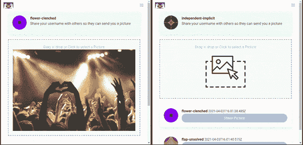

# 使用 WebRTC 和 React 构建一个点对点(P2P)图像共享应用程序

> 原文：<https://javascript.plainenglish.io/build-a-p2p-image-sharing-app-with-webrtc-and-react-fe6b3d1976d5?source=collection_archive---------4----------------------->


Photo by [Priscilla Du Preez](https://unsplash.com/@priscilladupreez?utm_source=medium&utm_medium=referral) on [Unsplash](https://unsplash.com?utm_source=medium&utm_medium=referral)

WebRTC 使得在两个浏览器之间传输文件成为可能，消除了在共享之前将文件上传到服务器的需要。数据不存储在中间服务器中，这使得传输快速而安全。在本文中，我们将构建一个简单的 React 应用程序，允许用户使用 WebRTC 彼此直接共享图像。

我们将构建的演示:



The final app

首先，我们需要一个信令服务器。这用于在对等体之间建立连接。信令服务器不处理媒体流量，它只负责使用户能够在网络中找到彼此，建立连接，重置和关闭连接。

让我们从创建一个带有 Express 服务器和套接字的新项目开始。IO，因为我们希望我们的信令服务器使用 WebSocket 连接。

```
$ yarn init$ yarn add express socket.io username-generator
```

现在创建一个`index.js`文件，作为我们应用程序的入口点。首先导入库并设置我们的服务器:

通常，我们的服务器需要监听来自客户端的事件，并发出另一个事件作为响应。我们在一个名为`SOCKET_EVENT`的变量中定义所有这些事件

我们还需要一个变量来存储所有连接的用户。我们在`users`对象上这样做。在`username-generator`库的帮助下，我们还为所有连接的用户分配随机的用户名。

我们还定义了两个助手函数，`usersList`将`users`对象转换成一个数组，而`logger`只用于登录控制台，因此我们可以看到里面发生了什么。

好了，现在是主要部分，在同伴之间建立联系。我们在这里基本上做的是中继来自两个用户的消息，以便他们可以建立对等连接。

服务器部分已经完成，我们可以继续前进到前端。我们首先创建一个新的 react 应用程序:

```
$ create-react-app pic-share 
```

我们还需要添加一些额外的包。`simple-peer`使得使用 WebRTC API 更加容易。我们也将使用布尔玛的造型。

```
$ yarn add simple-peer react-bulma-components react-dropzone socket.io-client
```

所有与 WebRTC 相关的逻辑都将放在`App.js`文件中。我们将在这里使用一些自定义组件，这些组件可以从[源代码](https://github.com/eyuelberga/pic-share)中获得。让我们定义我们需要开始的所有状态和引用。

我们需要监听从信令服务器发出的事件并处理它们。让我们在一个效果挂钩上这样做。注意，我们为第二个参数提供了一个空数组，因为我们不希望它在每次更新时都运行。

现在，让我们定义方法来处理应用程序的主要功能，即发送、接受和拒绝请求。

当用户发送请求时，会向用户发送一个信号。发送方一直等到建立连接，然后开始发送图像。当发送完所有卡盘时，用户发送`EOF`指示文件结束。在接收器端，用户接收所有的卡盘并将它们组合成一个斑点，形成完整的图像。

我们最终的`App.js`文件看起来会像这样:

## 结论

这篇文章到此为止，希望你喜欢阅读它。查看[源代码](https://github.com/eyuelberga/pic-share)和[演示](https://pic-p2p-share.herokuapp.com/)，请在评论区分享您的意见或建议。

*更多内容请看*[***plain English . io***](https://plainenglish.io/)