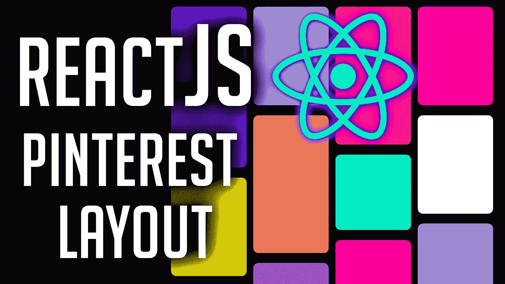

# 在 React 中构建 Pinterest 布局

> 原文：<https://javascript.plainenglish.io/build-a-pinterest-layout-in-reactjs-458b815126d8?source=collection_archive---------8----------------------->

## 获取 Pinterest 独特的网格布局



# 我们只需要两个组件

一个' **PinterestLayout.js** '组件，我们将用于 Pinterest 板。

一个' **Card.js** '组件，我们将使用它作为板上的实际管脚。

# 让我们编写 PinterestLayout 组件

这是一个非常简单的组件:

```
function PinterestLayout() {
 return (
 <div style={styles.pin_container}>
 </div>
 )
}
```

容器是我们整个布局的动力。

```
const styles = {
 pin_container: {
 margin: 0,
 padding: 0,
 width: ‘80vw’,
 display: ‘grid’,
 gridTemplateColumns: ‘repeat(auto-fill, 250px)’,
 gridAutoRows: ‘10px’,
 position: ‘absolute’,
 left: ‘50%’,
 transform: ‘translateX(-50%)’,
 justifyContent: ‘center’,
 backgroundColor: ‘black’
 }
}
```

**注:**

*   **margin**——简单地用于规范化我们的容器
*   **填充**——简单地用来规范我们的容器
*   **宽度** —这个边界将决定在卡片绕到下一行之前，水平显示多少张卡片；更高的宽度=更宽的布局
*   **显示** —使用 **CSS 网格**
*   **gridTemplateColumns** —每张卡片的列都有一个**宽度**并且这个**重复**到**自动填充**直到我们容器的宽度结束；如果下一张卡片与我们容器的宽度重叠，那么这张卡片从下一行开始
*   **gridAutoRows** —每个新行的高度为 **10px**
*   **位置**——简单用于我们整个布局的中心；你可以放在任何你想放的地方
*   **左**——简单用于我们整个布局的中心；你可以放在任何你想放的地方
*   **变换**——简单地用来使我们的整个布局居中；你可以放在任何你想放的地方
*   **justifyContent** —用于将所有卡片置于容器中心
*   **背景色**——简单用于颜色对比

# 让我们编写卡组件

## 同样，这是一个非常简单的组件。

```
function Card(props) {
 return (
 <div style={{
 …styles.card,
 …styles[props.size]
 }}>
 </div>
 )
}
```

## 我们的卡片有三种尺寸。

```
const styles = {
 card: {
 margin: ‘15px 10px’,
 padding: 0,
 borderRadius: ‘16px’,
 backgroundColor: ‘red’
 },
 small: {
 gridRowEnd: ‘span 26’
 },
 medium: {
 gridRowEnd: ‘span 33’
 },
 large: {
 gridRowEnd: ‘span 45’
 }
}
```

**注意:gridrowned**—我们用这个属性控制每张卡片的高度；由于每一行都是 **10px，**T42 26 的跨度将转化为 **260px** 的高度

## 您已经准备好了基本的布局。把你想要的东西放进那些卡片里。

你可以在这里得到源文件[。](https://github.com/an-object-is-a/reactjs-pinterest-layout)

如果你想要更深入的指导，请查看我在 YouTube 上的完整视频教程， [**一个对象是一个**](https://www.youtube.com/c/anobjectisa) 。

一定要在 [**Instagram**](https://www.instagram.com/an_object_is_a/) 和 [**Twitter**](https://twitter.com/anobjectisa1) 上关注我们，及时了解我们最新的 **Web 开发教程**。