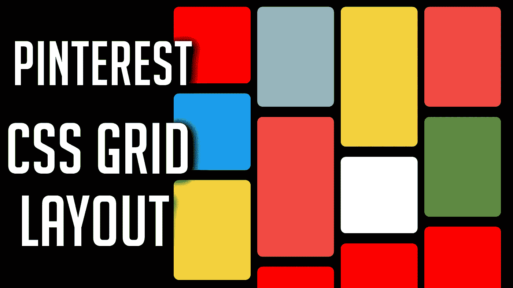

# 使用 HTML 和 CSS 构建 Pinterest 布局

> 原文：<https://javascript.plainenglish.io/build-a-pinterest-layout-using-html-css-a30ab59ce137?source=collection_archive---------3----------------------->

## 使用几行简单的 CSS，创建 Pinterest 的 Pin 布局



# 让我们从声明一些 CSS 变量开始。

## 在我们的 CSS 中

```
:root {
  --card_width: 250px;
  --row_increment: 10px;
  --card_border_radius: 16px;
  --card_small: 26;
  --card_med: 33;
  --card_large: 45;
}
```

**注:**

*   card_width: 250px —我们的卡/pin 的宽度
*   row_increment: 10px —我们使用 CSS **网格**来构建我们的布局；从技术上讲，每张牌由多行的多个 **10px** 增量**组成；非列**
*   card_border_radius: 16px —用于使卡片的边缘变圆
*   card_small: 26 —小卡片由 **10px** * **26 个增量组成(**包括边距:230 x 230)
*   card_medium: 33 —一张中型卡片由 **10px** * **33 个增量**组成(包括边距:230 x 300)
*   card_large: 45 —一张大卡由 **10px** * **45 的增量**组成(包括边距:230 x 420)

# 随着变量的设置

## 让我们写 HTML 树，然后回到我们的 CSS。

```
<div class=”pin_container”>
 <div class=”card card_small”></div>
 <div class=”card card_medium”></div>
 <div class=”card card_large”></div>
</div>
```

**注:**
每张牌都有类别**牌**和大小。

## 容器是我们整个布局的动力。

```
.pin_container {
 margin: 0;
 padding: 0;
 width: 80vw;
 position: absolute;
 left: 50%;
 transform: translateX(-50%);display: grid;
 grid-template-columns: repeat(auto-fill, var(--card_width));
 grid-auto-rows: var(--row_increment);
 justify-content: center;background-color: black;
}
```

**注:**

*   **边距**——简单地用于规范化我们的容器
*   填充符——简单地用来规范我们的容器
*   **宽度** —这个边界将决定在卡片绕到下一行之前，水平显示多少张卡片；更高的宽度=更宽的布局
*   **显示** —使用 **CSS 网格**
*   **网格-模板-列** —每个卡片的列都有一个**宽度**并且这个**重复**到**自动填充**直到我们容器的宽度结束；如果下一张卡片与我们容器的宽度重叠，那么这张卡片从下一行开始
*   **网格-自动-行**——每个新行的高度为 **10px**
*   **位置**——简单用于我们整个布局的中心；你可以放在任何你想放的地方
*   **左**——简单地用来居中我们的整个布局；你可以放在任何你想放的地方
*   **变换**——简单地用来使我们的整个布局居中；你可以放在任何你想放的地方
*   **justify-content**——用于将所有卡片置于容器中心
*   **背景色**——简单用于颜色对比

## 每张卡片都有一个空白和边界半径。

```
.card {
 padding: 0;
 margin: 15px 10px;
 border-radius: var(--card_border_radius);
 background-color: red;
}
```

## 您已经准备好了基本的布局。把你想要的东西放进那些卡片里。

你可以在这里得到源文件[。](https://github.com/an-object-is-a/html-css-js-pinterest-layout)

如果你想要更深入的指导，查看我在 YouTube 上的完整视频教程， [**一个物体是一个**](https://www.youtube.com/c/anobjectisa) 。

一定要在 [**Instagram**](https://www.instagram.com/an_object_is_a/) 和 [**Twitter**](https://twitter.com/anobjectisa1) 上关注我们，及时了解我们最新的 **Web 开发教程**。

## 使用 HTML 和 CSS 构建 Pinterest 布局