# 使用 HTML、CSS 和 JavaScript 创建一个番茄定时器

> 原文：<https://javascript.plainenglish.io/build-a-pomodoro-timer-using-html-css-and-javascript-7a7a8410052c?source=collection_archive---------0----------------------->

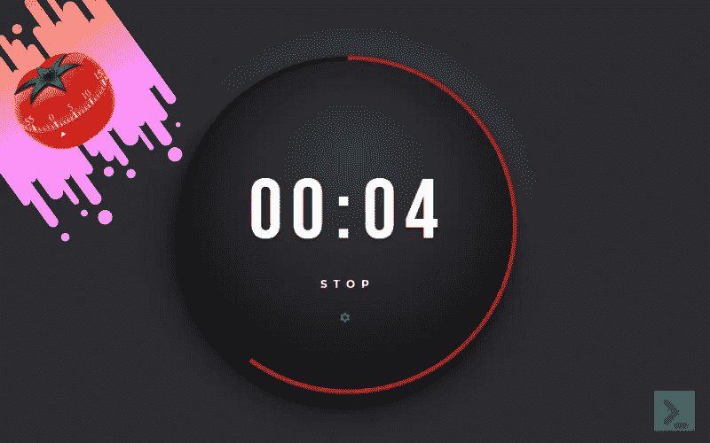

在本教程中，我们正在编写一个番茄定时器。⏲

我看到了 Amy Dutton 和 James Q Quick 为这个假期创作的《CSS 来临》和《JS 挑战来临》。我决定今年参加这个有趣的小挑战！

以下是我在第一天挑战中的收获和面临的挑战。😥

# 什么是番茄定时器？

> *番茄工作法(Pomodoro Technique)是弗朗西斯科·西里洛(Francesco Cirillo)在 20 世纪 80 年代后期开发的一种时间管理方法。它使用一个计时器将工作分成间隔，传统上长度为 25 分钟，由短暂的休息分开。每一个间隔都被称为 Pomodoro(番茄),这个词来自意大利语，意为番茄，源于大学生时期使用的番茄形状的厨房定时器 Cirillo。—维基百科*

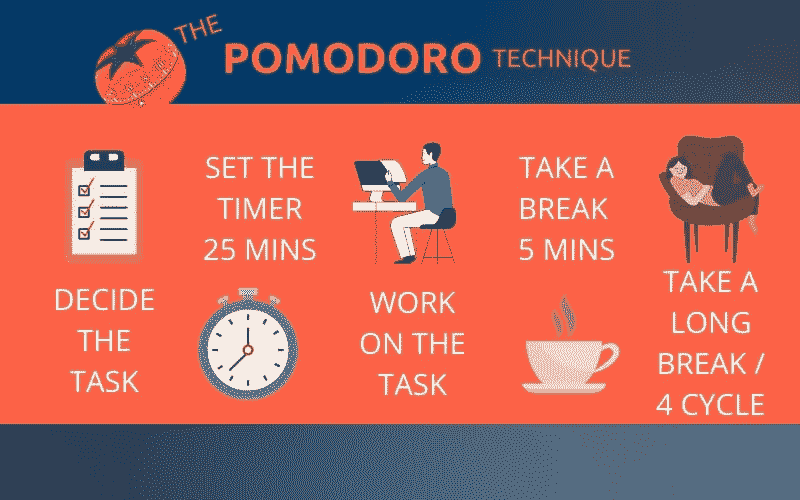

The Pomodoro Technique

简而言之，番茄定时器是一个简单的应用程序，可以帮助我们集中注意力，提高工作效率。它安排交替工作和休息时段。

# 挑战规格

用户应该能够:

*   点击“开始”链接/按钮启动计时器。
*   一旦用户单击开始，单词开始将变为停止。然后，用户可以点击“停止”按钮使计时器停止。
*   单击齿轮图标，更改计时器的长度(分钟和秒钟)。
*   一旦计时器结束，铃声将从红色变为绿色。
*   可以使用任何框架、库、工具，也可以使用老式 CSS 和普通 JS。

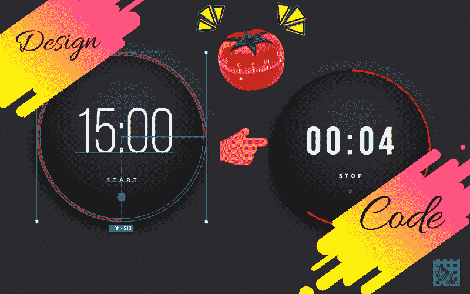

Design — -> Code

我决定和我的老朋友呆在一起，**普通 CSS 和香草 JS** 🤞🏻

*所以，是时候写点代码了！*

# 方法:HTML

我们将首先创建一个简单的 HTML 结构来显示一个计时器和开始/停止以及一个设置的按钮(来调整时间)

一个`container`包含定时器的所有内容。

在`container`里面，我们有两个`div`

一个用于`outerRing`显示进度条。

第二，`timer`显示*倒计时、启动/停止和设置按钮*。

`time`格显示倒计时，有`minutes`和`seconds` ``。

下面是完整的 HTML 代码。

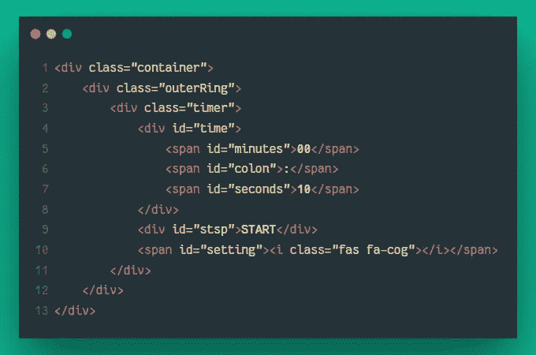

HTML Code

# 方法:添加 CSS

首先，设置`: root`变量。然后使用`display: grid`将`container`布局添加到页面中央。

将外环和计时器设置为在`outerRing`和`timer`容器之间相差`15px`的情况下循环。

`outerRing`是我们将使用`conic-gradient()`功能显示进度条的地方。

圆锥渐变如何使用动画工作👇🏻👇🏻

Conic Gradient Working

我们将在 Javascript 中使用`conic-gradient()`颜色制作进度条动画。

下面是完整的 CSS 代码。

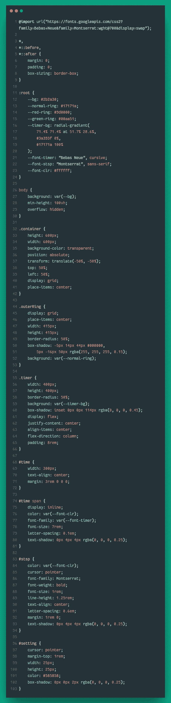

CSS Code

# 方法:添加 JavaScript

首先，让我们完成定时器组件，如定时器显示、启动/停止按钮和设置按钮。

**设置按钮**

获得`Setting`、`Minutes`和`Seconds`元素。同样，声明一个`toggleSettings`变量来跟踪`Settings`按钮的点击。

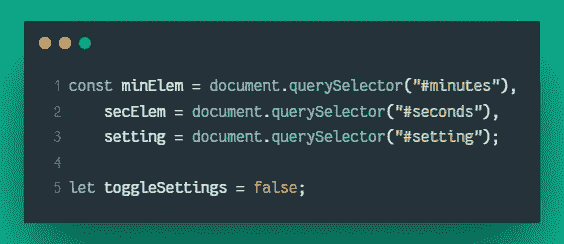

处理`Settings`按钮上的`click`事件。同样，处理`Minutes`和`Seconds`元素的`onblur`事件。

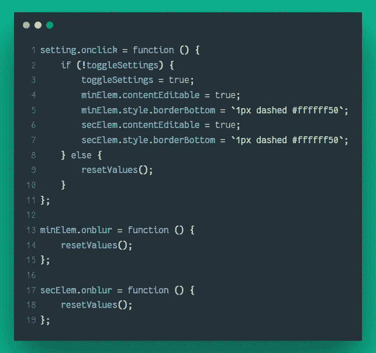

函数`resetValues`处理为`minutes`和`seconds`重新分配的值。

**启动/停止按钮**

将`minutes`和`seconds`声明为`let`变量，因为我们将为计时器显示操作这些变量。

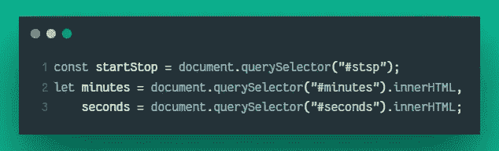

当我们点击`START`按钮时，首先会检查`minutes`和`seconds`是否不等于 0。然后文本将变为`STOP`并调用`startStopProgress`功能。

此功能将检查计时器进度，并更新进度条和计时器显示。

如果按下`STOP`按钮，使用相同的功能清除进度并将文本改回`START`。

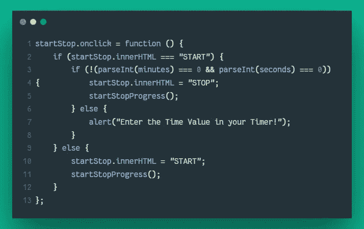

**进度条**

我们将使用`setInterval()`来运行帮助跟踪进度的代码。

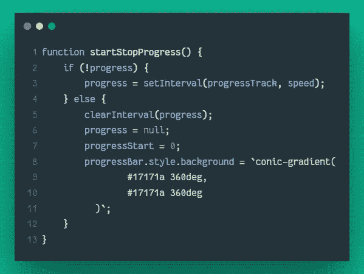

计算剩余分钟数和剩余秒数来更新计时器。

同样，根据计时器的总时间，计算计时器上的度/秒。

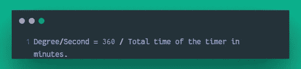

使用`conic-gradient()`和计算的角度/秒，更新 DOM。

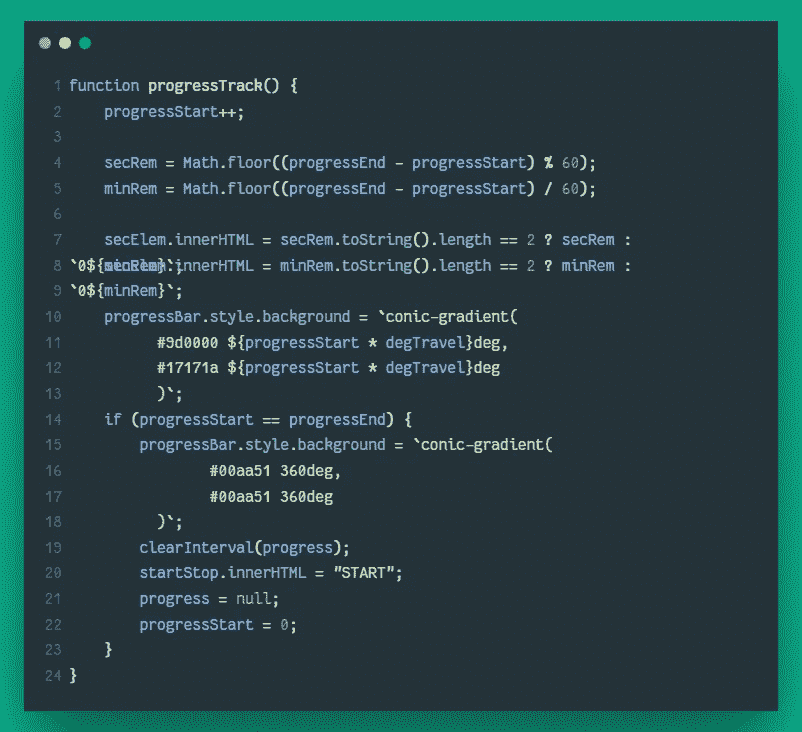

这是完整的 Javascript 代码，

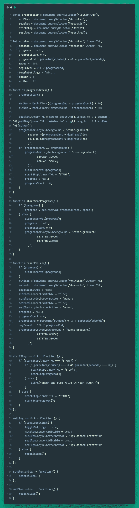

Javascript Code

哇，就是它！🤩🤩

# 结论！

我们已经成功地使用 HTML、CSS 和 JavaScript 创建了 Pomodoro 计时器。

我们可以扩展这个来添加更多的功能，如“暂停”按钮等。,

如果您有任何问题，请参考下面的完整代码，

更多类似的文章，请访问[内向的编码者](https://theintrovertcoder.hashnode.dev/)并在[推特](https://twitter.com/sangyk_dev)上关注我。

感谢您的阅读，祝您编码愉快！

*原发布于*[*https://theintrovertcoder . hashnode . dev*](https://theintrovertcoder.hashnode.dev/build-a-pomodoro-timer-using-html-css-and-javascript)*。*

*更多内容请看**[***说白了. io***](http://plainenglish.io/) ***。*** *报名参加我们的* [***免费每周简讯这里***](http://newsletter.plainenglish.io/) ***。****