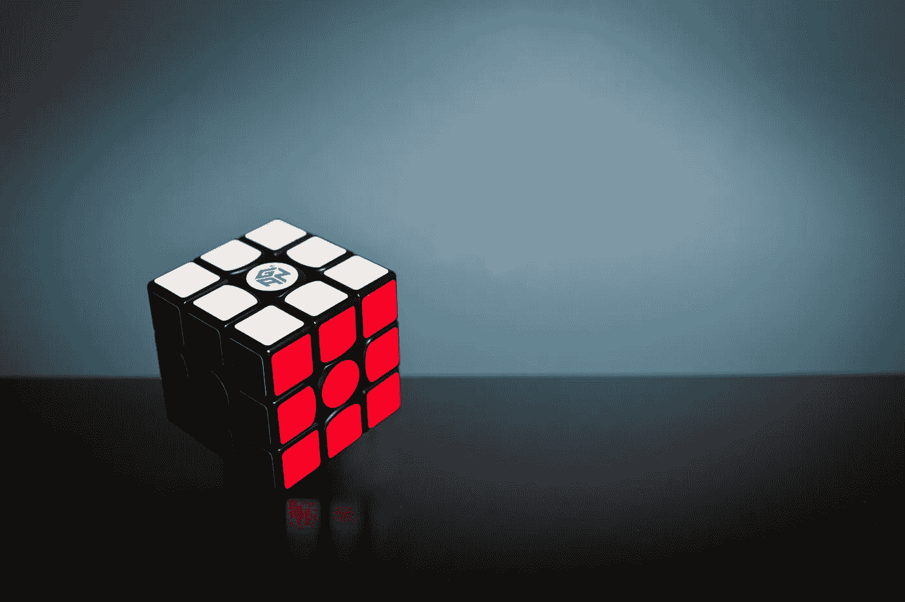

# 使用 React 构建 Power 3D 动画

> 原文：<https://javascript.plainenglish.io/build-a-power-3d-animation-on-react-c2b76daa0606?source=collection_archive---------4----------------------->

## 快速开始使用 react-three-fiber



Photo by [Olav Ahrens Røtne](https://unsplash.com/@olav_ahrens?utm_source=unsplash&utm_medium=referral&utm_content=creditCopyText) on [Unsplash](https://unsplash.com/s/photos/cube?utm_source=unsplash&utm_medium=referral&utm_content=creditCopyText)

今天我想谈谈 JavaScript 开发中的 3D 动画。在网络浏览器中可以使用 3D 图形吗？我们如何实现这一目标？有兴趣的话，我们一起来挖掘一下。

# 基本概念

## WebGL

`[WebGL](https://www.khronos.org/webgl/wiki/Main_Page)` (Web Graphics Library)是一个跨平台的免费 JavaScript API，用于在 Web 浏览器中创建 3D 图形，无需插件。当你使用 WebGL 时，我们必须描述每个点、线、面等等。它就像一个低级系统。

## 三. js

`[Three.js](https://threejs.org)`是一个跨浏览器的 JavaScript 库，用于使用 WebGL 在 web 浏览器中创建和显示动画 3D 计算机图形和组件。所以 Three.js 用图形加快开发进程。Three.js 的名字有三个主要内容:

*   场景——所有行动将要发生的地方；
*   相机—捕捉并显示场景中的所有对象；
*   渲染器—显示相机捕获的场景。

## 反应三纤维

`[react-three-fiber](https://github.com/pmndrs/react-three-fiber)`是 React 和 react-native 应用上 three.js 的 React [渲染器](https://reactjs.org/docs/codebase-overview.html#renderers)。您可以构建可重用的 react 组件，并为相应的 three.js 原语提供自己的状态、钩子和道具。three.js 中的所有对象都可以很好地工作，没有异常和额外的开销。

# 设置项目

现在，我将用`react-three-fiber`的基本组件创建一个关于太空的`react-space`项目。

首先，我将使用`[create-react-app](https://create-react-app.dev/)`创建一个快速的单页面 React 应用程序。我们可以通过运行一个简单的命令来设置一个现代化的 web 应用程序:

```
npx create-react-app react-space
```

之后，将其移动到`react-space`目录，并从终端运行:

```
cd react-space
npm start
```

太好了，我们已经成功创建了 React 应用程序。

# 制作魔法代码

首先你要安装`react-three-fiber`。这很简单，只需要一个命令:

```
npm install three react-three-fiber
```

接下来，我将创建`Stars`组件来模拟太空中的群星。

上面，我生成了恒星坐标，几何图形和材质。是我们放置在场景中的基本组件。`Geometry`允许我们给网格分配各种形状(立方体、金字塔等)。

```
const geometry = new THREE.SphereBufferGeometry(1, 10, 10)
```

`Material`允许我们使用不同的材料制作网格。例如，我们使用了`[SphereBufferGeometry](https://threejs.org/docs/#api/en/geometries/SphereGeometry)`和`[MeshBasicMaterial](https://threejs.org/docs/#api/en/materials/MeshBasicMaterial)`。

```
const material = new THREE.MeshBasicMaterial({ color: new THREE.Color('lightblue') })
```

另外，我使用了`[useFrame](https://github.com/pmndrs/react-three-fiber/blob/master/markdown/api.md#useFrame)`来更新每一帧渲染的星形旋转和缩放。允许我们在渲染的每一帧上执行代码，比如运行特效、更新控件等等。

现在，我将创建主要的`Box`组件。

我使用`[boxBufferGeometry](https://threejs.org/docs/#api/en/core/BufferGeometry)`组件来绘制线和点的几何图形。

```
<boxBufferGeometry args={[2, 2, 2]} attach="geometry" />
```

它是一个很棒的 Three.js 组件，具有顶点位置、面索引、法线、颜色、uv 和自定义属性。

```
<meshNormalMaterial attach="material" />
```

`[meshNormalMaterial](https://threejs.org/docs/#api/en/materials/MeshNormalMaterial)`是一种将法向量映射到 RGB 颜色的材质。

最后但同样重要的是，我将在我们的项目中实现`App`组件:

上面，我使用了`[requestAnimationFrame](https://developer.mozilla.org/en-US/docs/Web/API/window/requestAnimationFrame)`来制作`Box`组件的动画。此方法执行动画，并请求浏览器在下一次重画之前调用指定的函数来更新动画。

最后，我们用`Canvas`在浏览器上显示我们的 3D 场景。

# 让我们演示一下我们的 React Space 应用程序

react-space

如果你想检查所有的代码，这里有到 GitHub 的链接。

# 结论

感谢阅读——我希望这篇文章对你有用。编码快乐！

**资源:**

[](https://blog.logrocket.com/3d-rendering-in-the-browser-with-react-three-fiber/) [## 使用 react-three-fiber - LogRocket 博客在浏览器中进行 3D 渲染

### 根据他们的官方文档页面:react-three-fiber 是 three.js 在网络上的 react 渲染器，并且…

blog.logrocket.com](https://blog.logrocket.com/3d-rendering-in-the-browser-with-react-three-fiber/) [](https://www.smashingmagazine.com/2020/11/threejs-react-three-fiber/) [## 使用 react-three-fiber - Smashing 杂志深入了解 React 和 Three.js

### react-three-fiber 是一个功能强大的 Three.js 渲染器，可以帮助 react 及其本机渲染 3D 模型和动画

www.smashingmagazine.com](https://www.smashingmagazine.com/2020/11/threejs-react-three-fiber/)  [## gapur/反应空间

### 在 React 上构建强大的 3D 动画快速入门使用 react-three-fiber 今天我想谈谈 3D…

github.com](https://github.com/Gapur/react-space) 

*更多内容看*[***plain English . io***](https://plainenglish.io/)