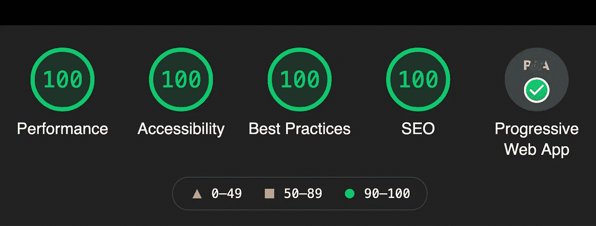
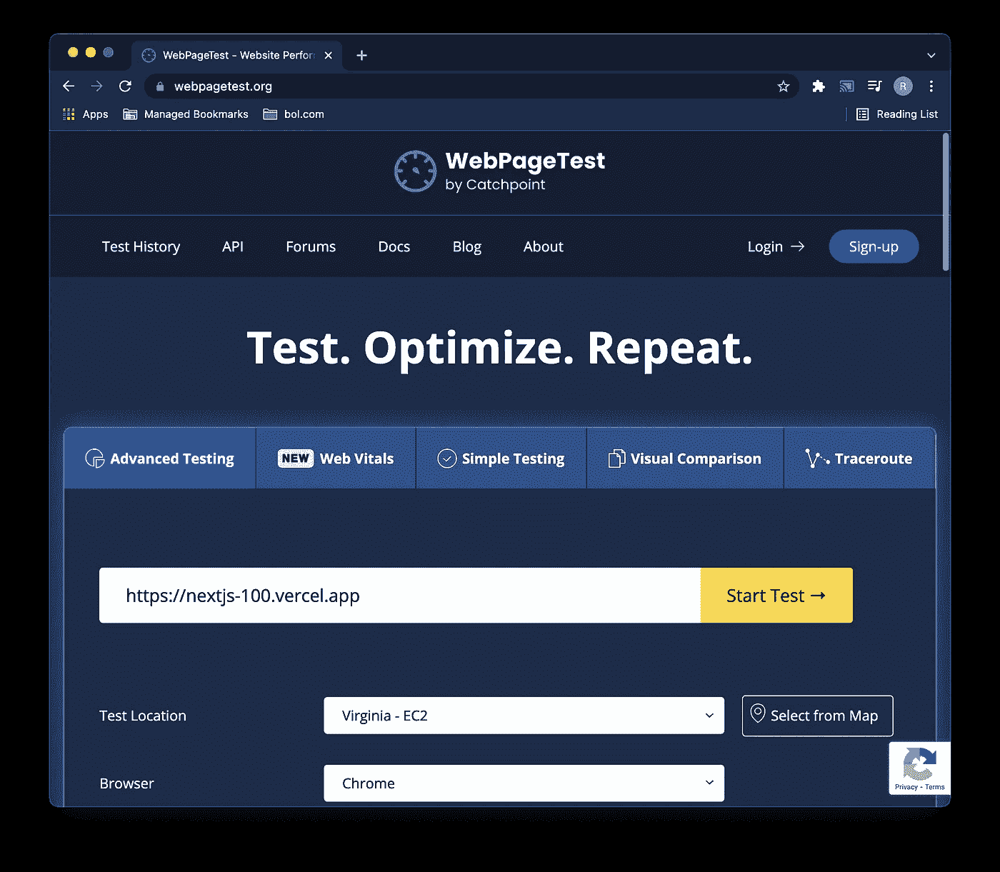
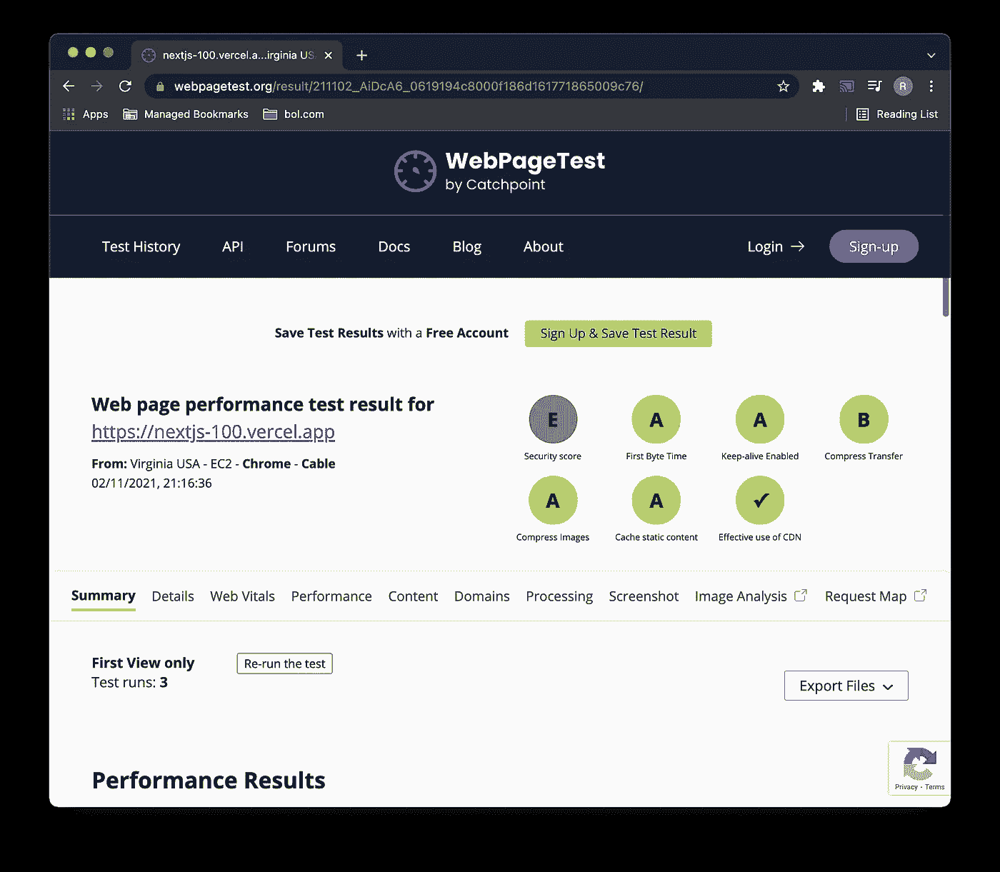
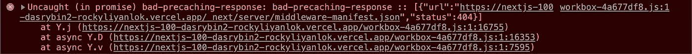
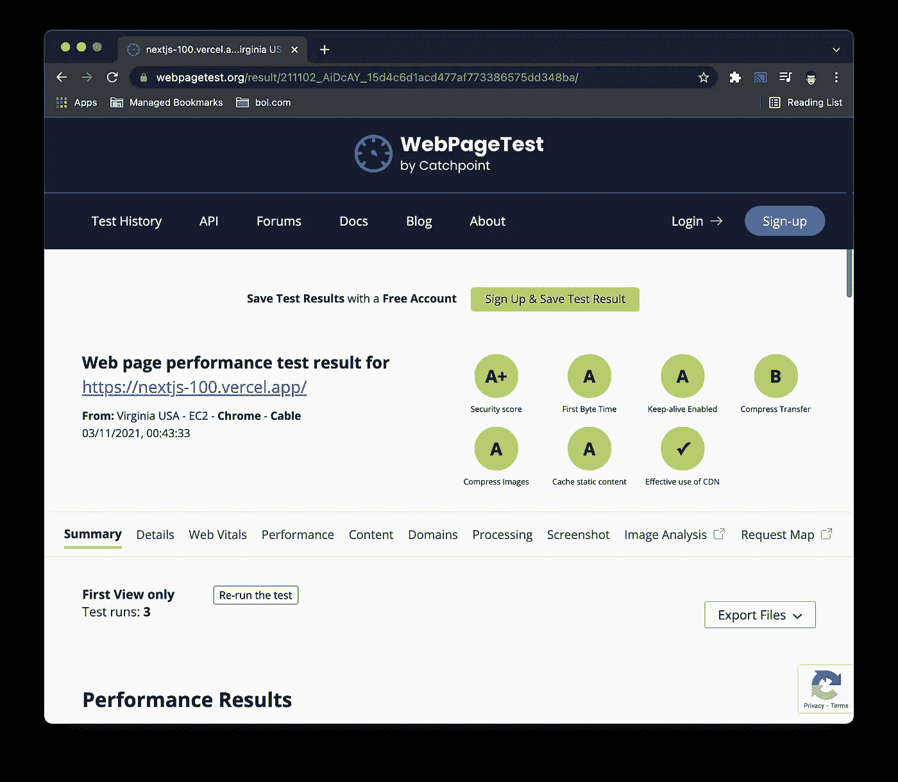
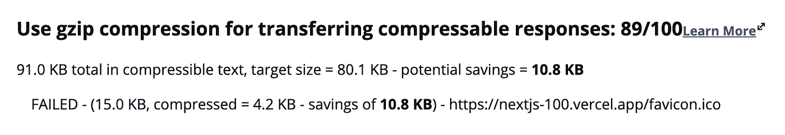
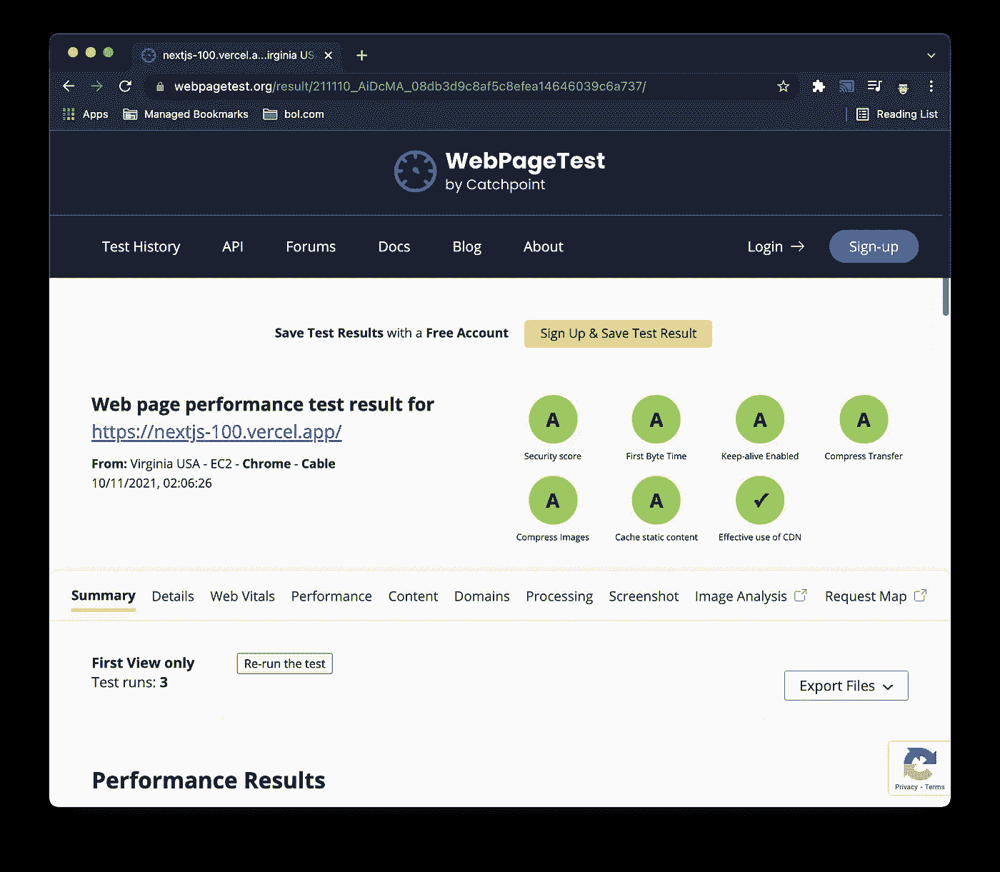
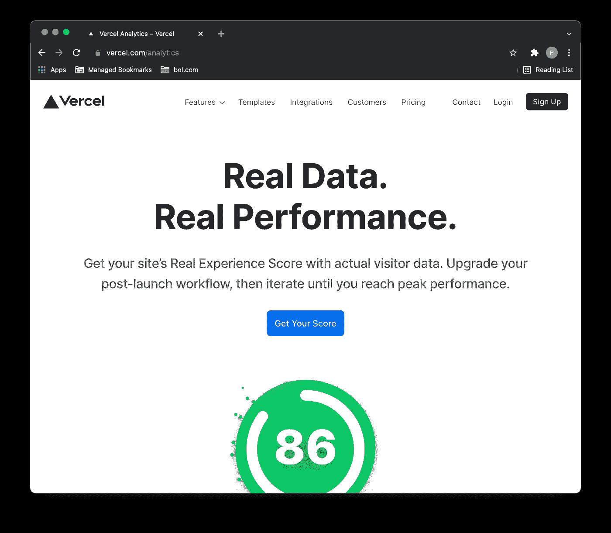
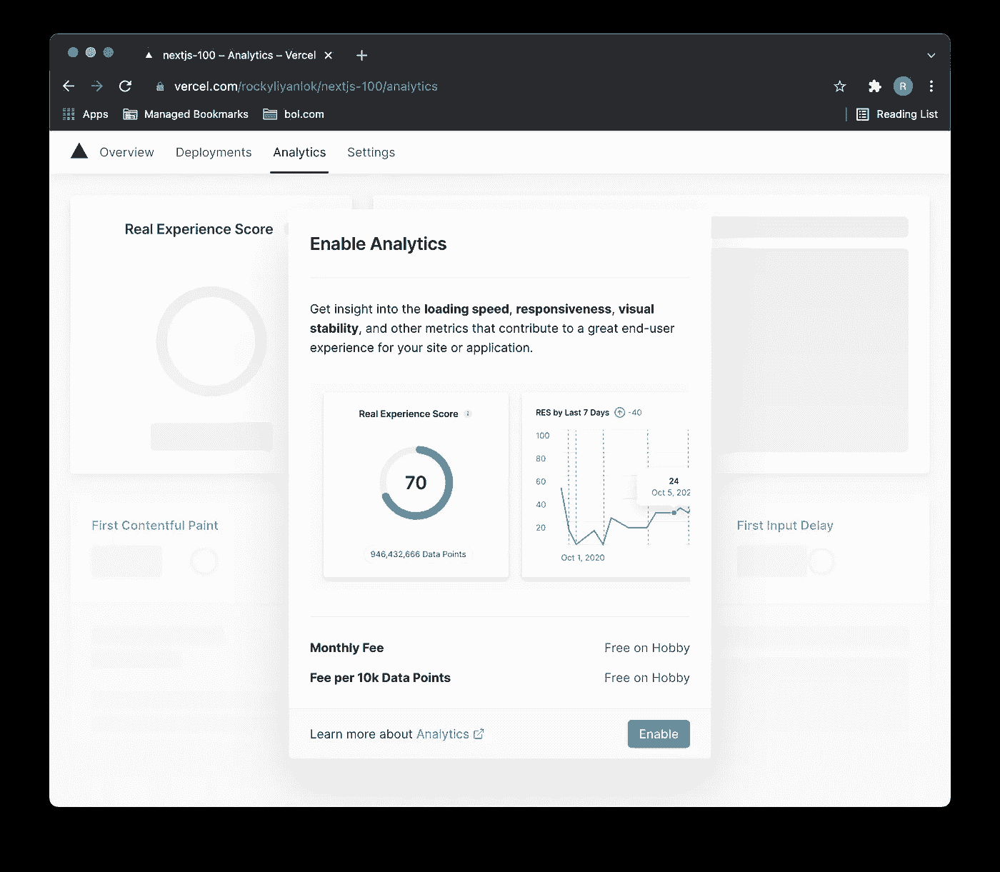
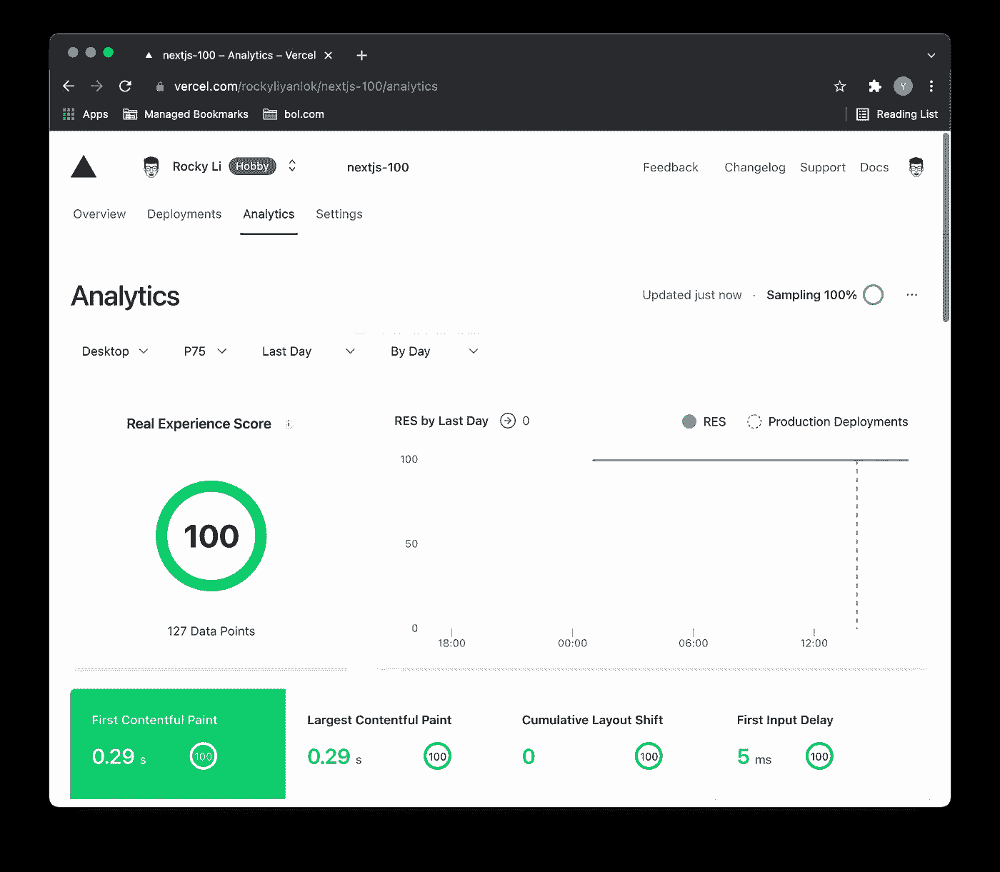

# 用 Next.js 建立一个 PWA，在 Google Lighthouse 和 Next.js Analytics 中实现 100%

> 原文：<https://javascript.plainenglish.io/build-a-pwa-with-next-js-to-achieve-100-in-google-lighthouse-and-next-js-analytics-ab695765c48?source=collection_archive---------2----------------------->



## 在 Google light house+next . js Analytics+Webpagetest.org 中获得最高排名

本文涵盖了我们如何将我们的 [*nextjs-100*](https://github.com/rockyliyanlok/nextjs-100) 应用程序升级到 Next.js 12 框架。我们还将优化 [*nextjs-100*](https://github.com/rockyliyanlok/nextjs-100) 在 Google Lighthouse 和 Next.js Analytics 中达到 100%，在 Next.js Analytics 中全部为 A 波段。

上周，2021 年 10 月 26 日，Vercel 在其年度会议上宣布推出 Next.js 12，这是有史以来最大的一次发布。有几个令人兴奋的新功能，如 Rust 编译器、中间件、React 18 支持、本机 es 模块支持和 React 服务器组件。

# 升级到 Next.js 12

这是我去年发布的一个故事，用 Next.js 框架创建了一个 PWA，实现了 100%的 Google Lighthouse 评分。

[](https://rockyli.medium.com/build-a-pwa-with-next-js-to-achieve-100-lighthouse-score-8bbb86598ed4) [## 用 Next.js 构建 PWA，实现 100% lighthouse 评分

### 这篇文章讲述了我们如何用 Next.js (React.js)构建一个渐进的 Web 应用程序，并获得 100%的分数…

rockyli.medium.com](https://rockyli.medium.com/build-a-pwa-with-next-js-to-achieve-100-lighthouse-score-8bbb86598ed4) 

让我们把 [*nextjs-100*](https://github.com/rockyliyanlok/nextjs-100) 应用升级到 Next.js 12。

```
# get clone [https://github.com/rockyliyanlok/nextjs-100.git](https://github.com/rockyliyanlok/nextjs-100.git)
# cd nextjs-100
# yarn add next@12.0.2 next-pwa@5.4.0 react@17.0.2 react-dom@17.0.2
```

# WebPageTest.org



**Figure 1** Test with WebPageTest.org

除了 Google Lighthouse，[Webpagetest.org](https://webpagetest.org/)也是一个非常有用的工具，它提供了优化你的 web 应用性能的重要信息。例如，用[Webpagetest.org](https://webpagetest.org/)分析 [*nextjs-100*](https://github.com/rockyliyanlok/nextjs-100) 。



**Figure 2** Performance result from WebPageTest.org

从性能测试结果来看， [*nextjs-100*](https://github.com/rockyliyanlok/nextjs-100) 在安全评分上得了一个 E。实在是太尴尬了，我们把这个 web 应用叫做 Next.js 100%。我们最好启用 HTTP 安全头来改进浏览器安全策略。这里的是来自 Next.js 的官方安全头指南。

## x-内容-类型-选项

将`X-Content-Type-Options`响应 HTTP 头设置为 **nosniff** 可防止浏览器在未显式设置 content type 头的情况下试图猜测内容类型。这可以防止允许用户上传和共享 XSS 文件的网站爆炸。

## x 框架选项

将`X-Frame-Options`响应 HTTP 头设置为 **SAMEORIGIN** 以防止点击劫持攻击。该标题指示是否允许该站点在 iframe 中显示。

## x-XSS-保护

将`X-XSS-Protection` HTTP 头设置为**1；模式=块**。当检测到反射的 XSS 攻击时，`X-XSS-Protection`标题会阻止页面加载。

./next.config.js

## 内容安全政策

设置`Content Security Policy`有两种方法。我们可以用 header **< meta >** 标签或者通过`Content-Security-Policy` HTTP header 来设置策略。该策略是一个检测和缓解特定类型攻击的层，包括跨站点脚本(XSS)和数据注入攻击。

从[内容安全策略参考指南](https://content-security-policy.com/)来看，`Content-Security-Policy`的起点应该是**default-src‘none’；script-src“self”；connect-src“self”；img-src“self”；style-src“self”；base-uri“self”；形式-行动'自我'**。

然而，它在部署到 vercel.com 的 Next.js 应用程序中并不完美。我们需要更多的定制。

在 Next.js 中，我们可以使用散列方法，简单地对内联脚本源进行散列，并将散列文本放入`script-src`策略中。

./utils/csp.js

./pages/_document.js

我们想改变的 CSP 的另一部分是用于 Vercel 分析。
从 Vercel Analytics 的[文档中，如果我们使用 Vercel Analytics，我们需要在`connect-src`策略中添加**vitals.vercel-insights.com**。](https://vercel.com/docs/concepts/analytics#content-security-policy)

## manifest.json 的预缓存问题

在 Vercel 上部署应用程序后，我们在 console.log 中发现了一个问题。未捕获的错误来自*不良预缓存响应*。



**Figure 3** Pre-caching problem with manifest.json

通过以下更改，使用 next-pwa 插件优化了预缓存和运行时缓存，并在 next-pwa 中排除了*middleware-manifest . JSON*，该问题得以解决。

./pages/_document.js

现在， [*nextjs-100*](https://github.com/rockyliyanlok/nextjs-100) 在[WebPageTest.org](https://webpagetest.org/)上获得 **A+** 波段安全分。



**Figure 4** Performance result after security headers optimization

## 为压缩传输优化 favicon.ico

webpagetest.org 测试报告中还有一个环节我们很感兴趣。 [*nextjs-100*](https://github.com/rockyliyanlok/nextjs-100) 在压缩传输中得到了一个波段 B。原因是 **favicon.ico** 压缩得不够，无法获得最佳性能。



**Figure 5** Hint from WebPageTest.org to compress favicon.ico

目前的 **favicon.ico** 大小为 64x64。让我们把它调整到 32x32，使它变小。我们可以从[*favicomatic.com*](https://favicomatic.com/)中生成。

现在，我们在[WebPageTest.org](https://webpagetest.org/)的业绩报告中有了全部 **A** 。



**Figure 6** All band A in the WebPageTest.org performance report

# 谷歌灯塔

是时候在谷歌灯塔里运行一个测试了。Lighthouse 一直是我们最喜欢的审计工具。


**Figure 7** 100% in the Google Lighthouse performance report

太好了！ [*nextjs-100*](https://github.com/rockyliyanlok/nextjs-100) 申请再次达到 100%，PWA 方面通过验证。

# 韦尔塞尔分析公司

Google Lighthouse 是一个本地性能测试，我们通常在浏览器扩展或节点 CLI 中执行。Webpagetest.org 是一个来自全球的网站速度测试，使用真正的浏览器。然而，Vercel Analytics 提供了另一个角度，通过实际用户数据的真实体验来生成性能分数。



**Figure 8** Next.js Analytics collect data from real traffic to generate performance report

## 在 Vercel 上启用分析

当 Next.js 应用程序部署在 Vercel 上时，启用分析非常容易。切换到 vercel 应用程序页面中的*分析*选项卡。启用分析功能后，将重新部署应用程序。



**Figure 9** Enable Next.js Analytics for particular application on Vercel

由于 Next.js Analytics 从实际流量中收集数据，因此在启用该功能后，没有足够的数据来生成报告。通常报告将在 30 分钟内准备好。如果应用程序没有启动，我们可能需要手动点击应用程序来创建一些流量。



**Figure 10** 100 score in the Next.js Analytics performance report

恭喜你！ [*nextjs-100*](https://github.com/rockyliyanlok/nextjs-100) 应用程序在 Next.js Analytics 中获得 100%。Next.js Analytics 中要评估的指标与 Google Lighthouse 中的指标非常相似，包括`First Content Paint`、`Largest Content Paint`、`Content Layout Shift`和`First Input Delay`。

## 定价

Vercel Analytics 是一项付费服务。然而，有一个业余爱好者的免费层。限制是每天 100 个免费数据点，这对于评估来说已经足够了。

# 摘要

在这篇文章中，我们将 Next.js 框架升级到了 Next.js 12，并对其进行了优化，使其在 Google Lighthouse 和 Next.js Vercel 中获得了 100%的分数，在[WebPageTest.org](https://webpagetest.org/)分析工具中均为 A 级。

你可以在这里随意克隆或派生库。

编码快乐！💻

*更多内容尽在*[***plain English . io***](http://plainenglish.io/)