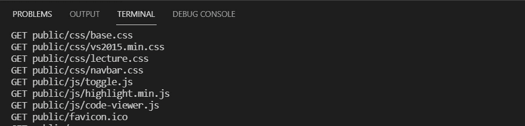

# 在 Windows 上构建快速、简单、安全的本地 Web 服务器

> 原文：<https://javascript.plainenglish.io/build-a-quick-simple-and-secure-local-web-server-on-windows-ab7cee4ce6f4?source=collection_archive---------18----------------------->

## 使用 Node.js、Chocolatey 和 mkcert 的简单指南


这篇文章是一个小练习，在不使用 [express](https://expressjs.com/en/guide/routing.html) 的情况下创建一个简单的本地服务器，并通过添加一个通过 [mkcert](https://github.com/FiloSottile/mkcert) (和 [chocolatey](https://chocolatey.org/) )创建的证书使其在 Windows 上安全。我最近尝试了这一点，但在尝试设置一切时发现了一些棘手的问题。所以我想从一个地方收集的信息中提取精华，并潜在地帮助新的和/或刚刚开始的人。

## 目录

1.  [项目设置](#293d)
2.  [构建服务器](#4f0c)
3.  [使用巧克力并设置 mkcert](#9d67)

# 项目设置

假设您已经安装了 node，创建一个项目文件夹(如果您还没有)并添加两个文件中的第一个，我们的`package.json`。

打开命令提示符并导航到该文件夹(或者如果您使用的是 [Visual Studio 代码](https://code.visualstudio.com/)，使用它的终端)，然后通过使用`npm init`命令并回答几个问题来创建`package.json`。如果不确定，[查看文档](https://docs.npmjs.com/creating-a-package-json-file#creating-a-default-packagejson-file)了解更多信息。

```
npm init
```

这应该会在项目文件夹中创建`package.json`文件。接下来，运行下面的命令来安装节点包`nodemon`。这个[有用的包](https://www.npmjs.com/package/nodemon)在检测到项目文件中的变化时会自动重启服务器。

```
npm install --save-dev nodemon
```

这将把它添加为开发依赖项，我们在 npm 脚本中使用它来启动/运行我们的服务器。在您的`package.json`中，在测试脚本下面添加一个名为`“start”`的脚本，带有以下选项:

```
// in package.json"scripts": {
    "test": "echo \"Error: no test specified\" && exit 1",
    "start": "nodemon -e js,html -- server.js"
},
```

这里我们告诉 nodemon，当它检测到扩展名为`.js`和`.html`的文件发生变化时，重新启动我们的`server.js`。所以你可以随意定制你认为合适的。

# 构建服务器

接下来，在与我们的`package.json`相同的文件夹中，我们将添加第二个文件，命名为`server.js`。首先从以下节点模块创建几个变量:

```
// in server.jsconst https = require(“https”);
const fs = require(“fs”);
const path = require(“path”);
```

我们将使用这些模块来执行传输和读取项目中可能包含的各种类型文件的数据的功能。

`[https](https://www.w3schools.com/nodejs/ref_https.asp)`用于通过 HTTP TLS/SSL 协议(https://)进行数据传输。

`[fs](https://www.w3schools.com/nodejs/nodejs_filesystem.asp)`用于与您计算机的文件系统进行交互。

`[path](https://www.w3schools.com/nodejs/ref_path.asp)`提供使用文件和目录路径的有用方法。

接下来，我们将在刚刚添加的变量下再添加几个变量:

```
// in server.jsconst https = require(“https”);
const fs = require(“fs”);
const path = require(“path”);const certPath = path.resolve("");
const hostname = "localhost";
const port = 5000;
const httpsConfig = {
     key: fs.readFileSync(path.resolve(certPath, "")),
     cert: fs.readFileSync(path.resolve(certPath, "")),
};
```

这几行代码只是设置让我们的 HTTPS 服务器获得正确的凭证和本地主机地址所需的内容。`certpath`将是我们的`key` 和`cert`(证书)文件的父文件夹，它们是我们的`httpsConfig`对象的一部分。这些空字符串`“”`将在稍后用文件名更新。

继续添加一个存储服务器逻辑的服务器变量。在 https 模块的`createServer`方法中，对于第一个参数，我们将传入`httpsConf`对象，对于第二个参数，我们添加了一个`requestListener`函数，其中有两个参数`req`用于请求，`res`用于响应。

```
// in server.jsconst https = require(“https”);
const fs = require(“fs”);
const path = require(“path”);const certPath = path.resolve("");
const hostname = "localhost";
const port = 5000;
const httpsConfig = {
     key: fs.readFileSync(path.resolve(certPath, "")),
     cert: fs.readFileSync(path.resolve(certPath, "")),
};
const server = https.createServer(httpsConfig, (req, res) => {

});
```

现在我们将添加几行。

```
// in server.jsconst https = require(“https”);
const fs = require(“fs”);
const path = require(“path”);const certPath = path.resolve("");
const hostname = "localhost";
const port = 5000;
const httpsConfig = {
     key: fs.readFileSync(path.resolve(certPath, "")),
     cert: fs.readFileSync(path.resolve(certPath, "")),
};
const server = https.createServer(httpsConfig, (req, res) => {
     let pathname = `/public/${req.url}`;
     const ext = path.parse(pathname).ext == "" ? ".html" :   
     path.parse(pathname).ext;
     console.log(`${req.method} ${pathname}`);
});
```

`pathname`是相对于我的客户端资产存储的位置，所以我想确保我的所有请求都指向我的项目中的那个位置。根据项目需要，随意更改或省略。

`ext`是将存储所请求的文件扩展名的变量(或默认为“.”。html”)用于稍后选择正确的 MIME 类型。

`console.log`只是在我们的命令窗口/终端中显示请求方法(`req.method`)和`pathname`，无论我们的服务器处理什么，如下所示。



What the `console.log` is for

接下来，我们为文件扩展名添加一个对象

```
// in server.jsconst https = require(“https”);
const fs = require(“fs”);
const path = require(“path”);const certPath = path.resolve("");
const hostname = "localhost";
const port = 5000;
const httpsConfig = {
     key: fs.readFileSync(path.resolve(certPath, "")),
     cert: fs.readFileSync(path.resolve(certPath, "")),
};
const server = https.createServer(httpsConfig, (req, res) => {
     let pathname = `/public/${req.url}`;
     const ext = path.parse(pathname).ext == "" ? ".html" :   
     path.parse(pathname).ext;
     console.log(`${req.method} ${pathname}`); const map = {
          ".ico": "image/x-icon",
          ".html": "text/html",
          ".js": "text/javascript",
          ".json": "application/json",
          ".css": "text/css",
          ".png": "image/png",
          ".jpg": "image/jpeg",
          ".wav": "audio/wav",
          ".mp3": "audio/mpeg",
          ".svg": "image/svg+xml",
          ".pdf": "application/pdf",
          ".doc": "application/msword",
     };
});
```

`map`用于根据文件扩展名确定 [MIME 类型](https://developer.mozilla.org/en-US/docs/Web/HTTP/Basics_of_HTTP/MIME_types)，它将被合并，让我们的服务器为每个响应动态设置`Content-Type`头。

接下来的代码是可选的，也是唯一的，但我相信它会派上用场。

```
// in server.jsconst https = require(“https”);
const fs = require(“fs”);
const path = require(“path”);const certPath = path.resolve("");
const hostname = "localhost";
const port = 5000;
const httpsConfig = {
     key: fs.readFileSync(path.resolve(certPath, "")),
     cert: fs.readFileSync(path.resolve(certPath, "")),
};
const server = https.createServer(httpsConfig, (req, res) => {
     let pathname = `/public/${req.url}`;
     const ext = path.parse(pathname).ext == "" ? ".html" :   
     path.parse(pathname).ext;
     console.log(`${req.method} ${pathname}`); const map = {
          ".ico": "image/x-icon",
          ".html": "text/html",
          ".js": "text/javascript",
          ".json": "application/json",
          ".css": "text/css",
          ".png": "image/png",
          ".jpg": "image/jpeg",
          ".wav": "audio/wav",
          ".mp3": "audio/mpeg",
          ".svg": "image/svg+xml",
          ".pdf": "application/pdf",
          ".doc": "application/msword",
     }; if (fs.statSync(pathname).isDirectory()) {
          pathname = pkgPaths.public + "/index.html";
     } else if (
          !pathname.match("^/images")
          && ext == ".html"
          && !pathname.match(".html$")
     ) {
       pathname = pathname + ext;
     }
});
```

一个`if/else`处理如果`pathname`是一个目录或者一个不是 HTML 文件的文件会发生什么。对于前者，我们寻找根文件夹的`index.html`文件。如果是后者，我们将文件扩展名添加到`pathname`。(虽然这可能可以处理得更好，但我发现它满足了我的需求，所以我认为分享它不会有什么坏处。)

```
// in server.jsconst https = require("https");
const fs = require("fs");
const path = require("path");
const certPath = path.resolve("");
const hostname = "localhost";
const port = 5000;
const httpsConfig = {
     key: fs.readFileSync(path.resolve(certPath, "")),
     cert: fs.readFileSync(path.resolve(certPath, "")),
};
const server = https.createServer(httpsConfig, (req, res) => {
     let pathname = `/public/${req.url}`;
     const ext = path.parse(pathname).ext == "" ? ".html" :   
     path.parse(pathname).ext;
     console.log(`${req.method} ${pathname}`);
     const map = {
          ".ico": "image/x-icon",
          ".html": "text/html",
          ".js": "text/javascript",
          ".json": "application/json",
          ".css": "text/css",
          ".png": "image/png",
          ".jpg": "image/jpeg",
          ".wav": "audio/wav",
          ".mp3": "audio/mpeg",
          ".svg": "image/svg+xml",
          ".pdf": "application/pdf",
          ".doc": "application/msword",
     };
     if (fs.statSync(pathname).isDirectory()) {
          pathname = pkgPaths.public + "/index.html";
     } else if (
          !pathname.match("^/images")
          && ext == ".html"
          && !pathname.match(".html$")
     ) {
       pathname = pathname + ext;
     } fs.stat(pathname, function (err, stats) {
          if (err) {
               res.statusCode = 404;
               res.end(`File ${pathname} not found!`);
               return;
          } fs.readFile(pathname, (err, data) => {
               if (err) {
                    console.log(err);
                    res.writeHead(500);
                    res.end(err);
                    return;
               }
               res.setHeader("Content-Type", map[ext]
               || "text/plain");
               res.writeHead(200);
               res.end(data);
          });
     });
});
```

我们的`requestListener`的最后一部分试图使用`[fs.stat](https://www.geeksforgeeks.org/node-js-fs-stat-method/https://www.geeksforgeeks.org/node-js-fs-stat-method/)`方法获得由`pathname`提供的文件的细节。我们通过返回一个 404`statusCode`和一个响应(找不到文件[路径名]！).如果没有错误发生，我们尝试使用`fs.readFile`打开文件并相应地处理它。要么是一个`500`错误，要么是使用`res.setHeader`、我们的`map`对象(或者默认为`text/plain`)和之前的`ext`应用正确的 *MIME 类型*，然后将文件提供给浏览器。

最后，我们添加了将在服务器启动(重启)时运行的`server.listen`方法。记录主机名和端口，所以可以随意定制。

```
// in server.jsconst https = require("https");
const fs = require("fs");
const path = require("path");
const certPath = path.resolve("");
const hostname = "localhost";
const port = 5000;
const httpsConfig = {
     key: fs.readFileSync(path.resolve(certPath, "")),
     cert: fs.readFileSync(path.resolve(certPath, "")),
};
const server = https.createServer(httpsConfig, (req, res) => {
     let pathname = `/public/${req.url}`;
     const ext = path.parse(pathname).ext == "" ? ".html" :   
     path.parse(pathname).ext;
     console.log(`${req.method} ${pathname}`);
     const map = {
          ".ico": "image/x-icon",
          ".html": "text/html",
          ".js": "text/javascript",
          ".json": "application/json",
          ".css": "text/css",
          ".png": "image/png",
          ".jpg": "image/jpeg",
          ".wav": "audio/wav",
          ".mp3": "audio/mpeg",
          ".svg": "image/svg+xml",
          ".pdf": "application/pdf",
          ".doc": "application/msword",
     };
     if (fs.statSync(pathname).isDirectory()) {
          pathname = pkgPaths.public + "/index.html";
     } else if (
          !pathname.match("^/images")
          && ext == ".html"
          && !pathname.match(".html$")
     ) {
       pathname = pathname + ext;
     }
     fs.stat(pathname, function (err, stats) {
          if (err) {
               res.statusCode = 404;
               res.end(`File ${pathname} not found!`);
               return;
          }
          fs.readFile(pathname, (err, data) => {
               if (err) {
                    console.log(err);
                    res.writeHead(500);
                    res.end(err);
                    return;
               }
               res.setHeader("Content-Type", map[ext]
               || "text/plain");
               res.writeHead(200);
               res.end(data);
          });
     });
});server.listen(port, hostname, () => {
  console.log(`Server is listening at      [https://${hostname}:${port}/`](https://${hostname}:${port}/`));
});
```

恭喜你走到这一步，并完成了我们的服务器。

# 使用 Chocolatey 并设置 mkcert

有几种方法可以把 mkcert 添加到你的 windows 机器上，但是我选择了 Chocolatey。[按照这些说明](https://chocolatey.org/install#install-step2)正确安装 Chocolatey，然后从提升的/管理 PowerShell 窗口运行以下命令。

```
> choco install mkcert
```

一旦安装了 mkcert，创建一个本地的[证书颁发机构](https://en.wikipedia.org/wiki/Certificate_authority)，它将对证书进行签名。现在运行下面的命令。

```
> mkcert -install
```

您应该会看到如下所示的内容

```
Created a new local CA 💥
The local CA is now installed in the system trust store! ⚡️
The local CA is now installed in the Firefox trust store (requires browser restart)! 🦊
```

接下来，运行此命令为您的 localhost 项目创建证书。您可以根据需要添加`localhost`、`127.0.0.1`、域名(`example.com`)或通配符子域(`*.example.com`)，等等。

```
> mkcert localhost example.com *.example.com
```

您应该会看到类似下面的内容

```
Created a new certificate valid for the following names 📜 
- "localhost"
- "example.com" 
- "*.example.com" The certificate is at "./localhost+2.pem" and the key at "./localhost+2-key.pem" ✅
```

最后，我们使用认证和认证文件的父文件夹来更新我们的`server.js`文件。如果您需要帮助找到您的证书的根文件夹，您可以使用命令`mkcert -CAROOT`。

父文件夹的路径将分别用于`certPath`和`httpsConfig`对象的密钥和证书属性的文件名。

```
const certPath = path.resolve("C:\\PathTo\\Certs");
const hostname = "localhost";
const port = 5000;
const httpsConfig = {
     key: fs.readFileSync(path.resolve(certPath, "localhost+2-key.pem")),
     cert: fs.readFileSync(path.resolve(certPath, "localhost+2.pem")),
};
```

## 最后看一下 server.js

```
// in server.jsconst https = require("https");
const fs = require("fs");
const path = require("path");
const certPath = path.resolve("C:\\PathTo\\Certs");
const hostname = "localhost";
const port = 5000;
const httpsConfig = {
     key: fs.readFileSync(path.resolve(certPath, "localhost+2-key.pem")),
     cert: fs.readFileSync(path.resolve(certPath, "localhost+2.pem")),
};
const server = https.createServer(httpsConfig, (req, res) => {
     let pathname = `/public/${req.url}`;
     const ext = path.parse(pathname).ext == "" ? ".html" :   
     path.parse(pathname).ext;
     console.log(`${req.method} ${pathname}`);
     const map = {
          ".ico": "image/x-icon",
          ".html": "text/html",
          ".js": "text/javascript",
          ".json": "application/json",
          ".css": "text/css",
          ".png": "image/png",
          ".jpg": "image/jpeg",
          ".wav": "audio/wav",
          ".mp3": "audio/mpeg",
          ".svg": "image/svg+xml",
          ".pdf": "application/pdf",
          ".doc": "application/msword",
     };
     if (fs.statSync(pathname).isDirectory()) {
          pathname = pkgPaths.public + "/index.html";
     } else if (
          !pathname.match("^/images")
          && ext == ".html"
          && !pathname.match(".html$")
     ) {
       pathname = pathname + ext;
     }
     fs.stat(pathname, function (err, stats) {
          if (err) {
               res.statusCode = 404;
               res.end(`File ${pathname} not found!`);
               return;
          }
          fs.readFile(pathname, (err, data) => {
               if (err) {
                    console.log(err);
                    res.writeHead(500);
                    res.end(err);
                    return;
               }
               res.setHeader("Content-Type", map[ext]
               || "text/plain");
               res.writeHead(200);
               res.end(data);
          });
     });
});server.listen(port, hostname, () => {
  console.log(`Server is listening at      [https://${hostname}:${port}/`](https://${hostname}:${port}/`));
});
```

## 大结局！

使用前面在`package.json`中创建的脚本命令，运行`start`命令，并在服务器监听的路径下访问您的项目。

柯克·克拉克

图片来源:[马库斯·温克勒](https://unsplash.com/@markuswinkler?utm_source=unsplash&utm_medium=referral&utm_content=creditCopyText)在 [Unsplash](https://unsplash.com/s/photos/windows-secure-certificate?utm_source=unsplash&utm_medium=referral&utm_content=creditCopyText)

*更多内容请看*[*plain English . io*](http://plainenglish.io/)