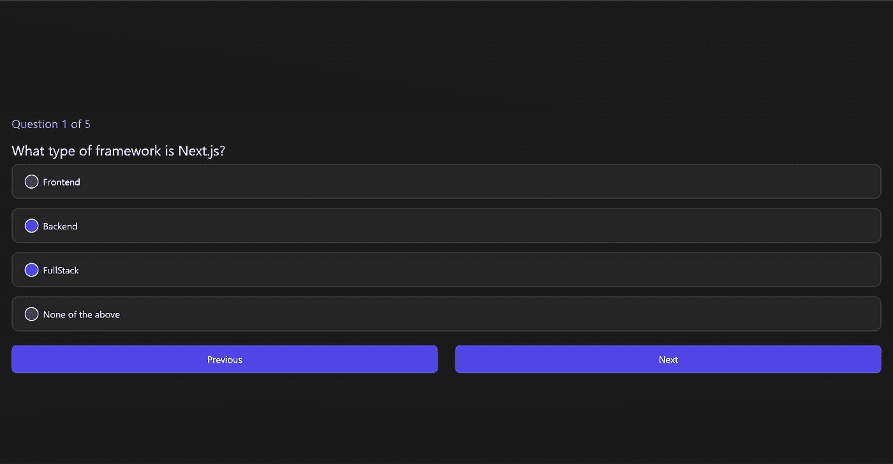

# 用 Next.js 和 Tailwind CSS 构建一个问答 App

> 原文：<https://javascript.plainenglish.io/build-a-quiz-app-with-next-js-and-tailwindcss-f61b14148661?source=collection_archive---------4----------------------->


嘿，大家好！这将是一次辅导和一次挑战。我也有一个赠品，所以请继续关注；)

# 演示

你可以在这里自己试试-[quiz-challenge . vercel . app](https://quiz-challenge.vercel.app/)

# 安装

## 使用 Tailwind CSS 创建 Next.js 应用程序

我将使用应用程序中所需的基本风格的顺风

```
npx create-next-app next-stripe-demo -e with-tailwindcss
```

## 清除

删除 ***页面/index.js*** 标题后的所有内容

## 启动应用程序

```
npm run dev # npm
yarn dev # yarn
```

# 创造几个问题

我们将使用来自 JSON 数组的问题，因此在根目录下创建一个`questions.json`文件。问题数组应该是这样的

# 为测验创建用户界面

我们的测验会是这样的-



**设计我们应用程序的容器。**

我将向包含应用程序的 div 添加以下样式-

```
<div className="flex flex-col w-screen px-5 h-screen bg-[#1A1A1A] justify-center items-center">
```

这将给我们一个背景色为#1A1A1A 的空白屏幕。

**问题部分**

我们现在将对这些值进行硬编码。

现在我们的应用程序看起来像这样


**创建答案**

我们将对第一个问题的答案进行映射，以显示选项。

我们还需要从 questions.json 文件中导入问题，所以添加以下导入行-

它会给我们所有的选项和一个单选按钮-


单选按钮不太适合我们的主题，所以我将在 globals.css 中为它添加一些自定义样式，所以请按照说明操作-

*   创建一个`styles`文件夹和里面的`globals.css`文件


*   在`globals.css`内添加以下内容-

```
@tailwind base;
@tailwind components;
@tailwind utilities;
```

*   导入`globals.css`而不是`_app.js`中的`tailwindcss/tailwind.css`

```
import "../styles/globals.css";
```

*   为自定义单选按钮添加样式

现在它给了我们一个更好的单选按钮来匹配这个主题，就像这样-


**添加按钮浏览问题**

这为我们提供了如下导航按钮。


至此，我们完成了 UI 的设置。

# 为我们的测验添加逻辑

**导航**

我们首先要构建导航功能

为当前问题创建一个状态-

```
const [currentQuestion, setCurrentQuestion] = useState(0);
```

创建两个函数来处理下一个和上一个-

将功能分配给相应的按钮

删除问题的硬编码值-

映射当前问题的答案，而不是第一个问题-

```
questions[currentQuestion].answerOptions.map
```

现在，我们可以轻松地浏览问题了🎉

**选择选项的能力**

创建一个状态来保存所有选择的答案-

```
const [selectedOptions, setSelectedOptions] = useState([]);
```

我们现在将创建一个函数来设置选中的选项-

现在，我们需要在选项的 onClick 中触发并检查单选按钮-

现在，如果您选择一个选项，它将作为一个对象存储在`selectedOptions`状态。要检查这一点，让我们在 handleAnswerOption-中 console.log selectedOptions

单击选项后，它会显示一系列选项，如下所示-


**计算并显示分数**

创建两个状态，一个存储分数，另一个查看我们是否需要显示分数-

```
const [score, setScore] = useState(0);
const [showScore, setShowScore] = useState(false);
```

现在我们需要创建一个新的函数来根据答案计算分数-

**在最后一个问题上显示提交按钮而不是下一步**

在最后一个问题中，我们需要显示 submit 而不是 next，并运行`handleSubmitButton`函数。

现在，如果我们提交，那么什么也不会发生，所以在我们提交之后，我们应该能够看到这样的屏幕-


为此，我们将基于 showScore 的值呈现页面，如下所示

现在我们的应用程序工作完全正常，🥳

# 泄漏

获胜者获得 [React 和无服务器课程](https://www.jamesqquick.com/courses/react-and-serverless-fullstack-developmnent)课程由[詹姆斯 Q Quick](https://www.jamesqquick.com/)

参与此次赠品活动

*   让这个测验应用程序更好
*   在你的社交媒体上用标签- `next-quiz-challenge`分享它，别忘了给我加标签:)

**重要日期**

*   2021 年 11 月 18 日:在 IST 时间 11 月 18 日中午 12 点之前提交你的项目。
*   2021 年 11 月 20 日:获胜者将在我的社交媒体上公布。

**您可以添加的功能很少-**

*   排行榜
*   显示正确和不正确的答案
*   计时器
*   改进用户界面

# 有用的链接

[GitHub 库](https://github.com/avneesh0612/quiz-app)

[演示](https://quiz-challenge.vercel.app/)

[所有社交](https://avneesh-links.vercel.app/)

*更多内容尽在* [***说白了***](http://plainenglish.io/)