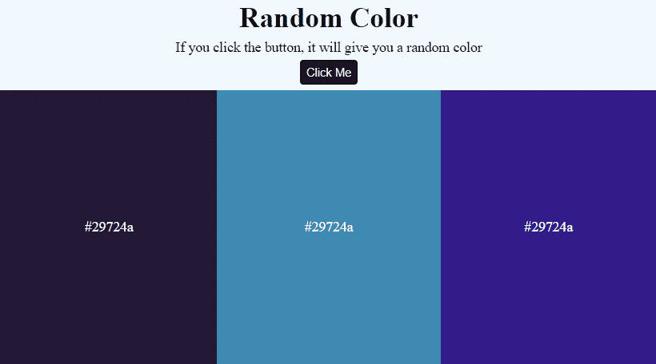

# 用 JavaScript 构建一个随机颜色生成器

> 原文：<https://javascript.plainenglish.io/build-a-random-color-generator-with-javascript-31061a6b99ae?source=collection_archive---------8----------------------->



颜色生成器在网页设计师中很受欢迎。有许多网站提供免费的颜色生成器，例如:

*   【https://coolors.co/ 
*   [https://mycolor.space/](https://mycolor.space/)
*   [https://colorhunt.co/](https://colorhunt.co/)
*   [https://colordrop.io/](https://colordrop.io/)
*   还有更多…

## 有没有想过自己造一个发电机？

在这篇文章中，我想分享如何使用普通的 JavaScript 制作你自己的随机颜色生成器。主要是找到如何使字符串包含十六进制颜色数字。

经过一些研究，我发现了一些有趣的文章，我们可以通过使用 JavaScript 的`Math.random()`和 `Math.floor()`特性的组合来构建十六进制颜色。十六进制颜色数字里面有六个数字，每个数字有 16 个数，在 0 到 f 之间。如果我们计算它，我们会得到这个。

```
hex Total = 16 ** 6 = 16777216
```

从总数来看，如果我们使用 toString(16)来翻译它，我们将得到值“1000000”，这不是十六进制代码。我们不能用它，因为它需要 7 位数的整数。所以，我们把它减 1，并使用`16777215`

# 样板文件

## index.html

## style.css

## 输出


是的，从样板文件中我们会得到最有可能是颜色生成器的东西，但是这里什么都没有。我们需要一些 JavaScript 魔法来让程序工作。

# 主算法

之前说的是使用 Math.random()、Math.floor()和 toString(16)。下面是代码的实现

每当你运行代码，它会打印不同的十六进制值，其中包含六位数字的字符串，随机。因为我们想要构建随机颜色生成器，所以我们需要确保每次单击按钮时，颜色都会改变，对吗？

# **构建程序**

为了改变每次点击“点击我”按钮的背景颜色，我们需要使用 JavaScript 的 DOM 特性，下面是我所做的

如你所见，我声明了四个变量。主体和所有三个调色板。我使用 CSS 线性渐变函数在身体上随机化三种不同的颜色。调色板用于在背景中给出十六进制颜色代码。如果你还记得上面的 HTML 样板文件。在第 13 行，我正在调用按钮中的`randomColor()`功能。所以每点击一下它，就会像这样改变身体的颜色。


从这里开始，我们构建随机颜色生成器的目标是完成。恭喜你！！！

# 奖金

如果你曾经使用随机颜色生成器，也许你会很容易地复制颜色十六进制代码，通过点击颜色。我们也可以让我们的程序这么做。如果你阅读 CSS，你会在第 58-61 行得到一些有趣的东西。我给你填料。调色板文本中的颜色类。如果我把透明变成另一种颜色，你会看到这个。


这个概念是每次你点击颜色区域的内部。十六进制颜色代码将被复制到您的剪贴板。在本教程中，每当您单击它时，我都会发出警告。为了实现它，我声明了两个新的函数，所以我的 JavaScript 程序将是这样的。

在第 18 行，我声明了一个新的 DOM，它从 HTML 中获取`.color`类。此外，通过使用我在每次点击`.color`类时创建的 forEach 函数，它将调用 copyHex()函数。

在`copyHex()`函数中，我调用`selectArea()`函数。`selectArea()`如上图所示，为绿色区域。最后，每当点击该区域时，我都会发出警告，并复制文本颜色十六进制代码。

最后，程序将如下所示:


## 结论

祝贺你的节目准备好了！

祝你有愉快的一天！✌